# Equipo [Team ValGrind]: WRO 2026


---

<a name="inicio"></a>

# Índice

- [1. Nuestro Equipo](#1-nuestro-equipo)
  - [1.1 Integrantes](#11-integrantes)
  - [1.2 Origenes](#12-origenes)
  - [1.3 Nuestro Objetivo](#13-nuestro-objetivo)
- [2. El Robot](#2-el-robot)
  - [2.1 Videos del Robot](#21-videos-del-robot)
  - [2.2 Apartado Mecanico](#22-apartado-mecanico)
  - [2.3 Impresion 3D](#23-Impresion-3d)
  - [2.4 Movilidad](#24-movilidad)
  - [2.5 Sistema de Movimiento y Traccion](#25-sistema-de-movimiento-y-traccion)
  - [2.6 Piezas de Mecanica](#26-piezas-de-mecanica)
    - [2.6.1 Diferencial y Eje de transmision](#261-diferencial-y-eje-de-transmisión-impreso-en-3d)
    - [2.6.2 Servomotor](#262-servomotor-injora-180)
    - [2.6.3 Motor](#263-motor-hytech-ga37-520)
    - [2.6.4 Tornillos, Tuercas y Arandelas](#264-tornillos-tuercas-de-seguridad-y-arandelas-m2-y-m3)
- [3. Apartado Electronico](#3-apartado-electronico)
  - [3.1 Piezas de Electronica](#31-piezas-de-electronica)
    - [3.1.1 Baterias](#311-baterias)
    - [3.1.2 Step Down](#312-step-down)
    - [3.1.3 Motor Driver](#313-motor-driver)
    - [3.1.4 Ultrasonico](#314-sensor-de-ultrasonido)
    - [3.1.5 Giroscopio](#315-giroscopio)
    - [3.1.6 Huskylens](#316-huskylens-2)
  - [3.2 Microcontrolador](#32-microcontrolador)
    - [3.2.1 ESP32](#321-esp32-wroom-32)
  - [3.3 Diagrama de Conexiones](#33-diagrama-de-conexiones)
    - [3.3.1 Consumo de Energia](#331-consumo-de-energia)
- [4. Apartado de Programacion](#4-apartado-de-programacion)
  - [4.1 Desafio Abierto](#41-desafio-abierto)
    - [4.1.1 Flowchart Abierta](#411-flowchart-abierta)
    - [4.1.2 Explicación del Codigo](#412-explicacion-del-codigo)
  - [4.2 Desafio Cerrado](#42-desafio-cerrado)
    - [4.2.1 Flowchart Cerrada](#421-flowchart-cerrada)
    - [4.2.2 Explicación del Codigo](#422-explicacion-del-codigo)
- [5. Randomizador](#5-Randomizador)
- [6. Recursos para armar nuestro robot](#6-recursos-para-hacer-el-robot)

---

## Estructura del Repositorio
- [T-photos/](https://github.com/yosoycrix/Valrepo-WRO-2026/tree/main/t-photos) - Fotos del Team
- [V-photos/](https://github.com/yosoycrix/Valrepo-WRO-2026/tree/main/v-photos) - Fotos del Robot
- [Schemes/](https://github.com/yosoycrix/Valrepo-WRO-2026/tree/main/schemes) - Eschematic diagrams
- [Src/](https://github.com/yosoycrix/Valrepo-WRO-2026/tree/main/src) - Codigo
- [Models/](https://github.com/yosoycrix/Valrepo-WRO-2026/tree/main/models) - Diseños 3D
- [Others/](https://github.com/yosoycrix/Valrepo-WRO-2026/tree/main/others) - Otros archivos
- [Videos/](https://github.com/yosoycrix/Valrepo-WRO-2026/tree/main/videos) - Videos
- [Images/](https://github.com/yosoycrix/Valrepo-WRO-2026/tree/main/images) - Imagenes
      
---

## 1. Nuestro Equipo

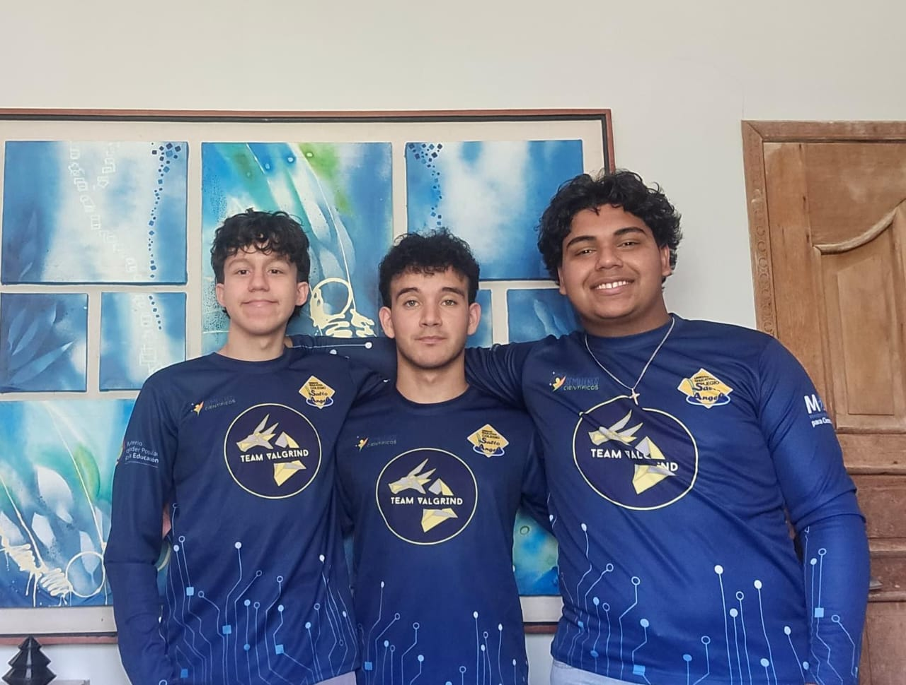

Somos **[Team ValGrind]**, entusiastas de la robótica y la innovación. Representamos a nuestra institución en las fases Regionales de la **WRO 2026**.

---

### 1.1 Integrantes

<table>
  <tr>
    <!-- Foto de Perfil -->
    <td width="280px" align="center" style="border: none;">
      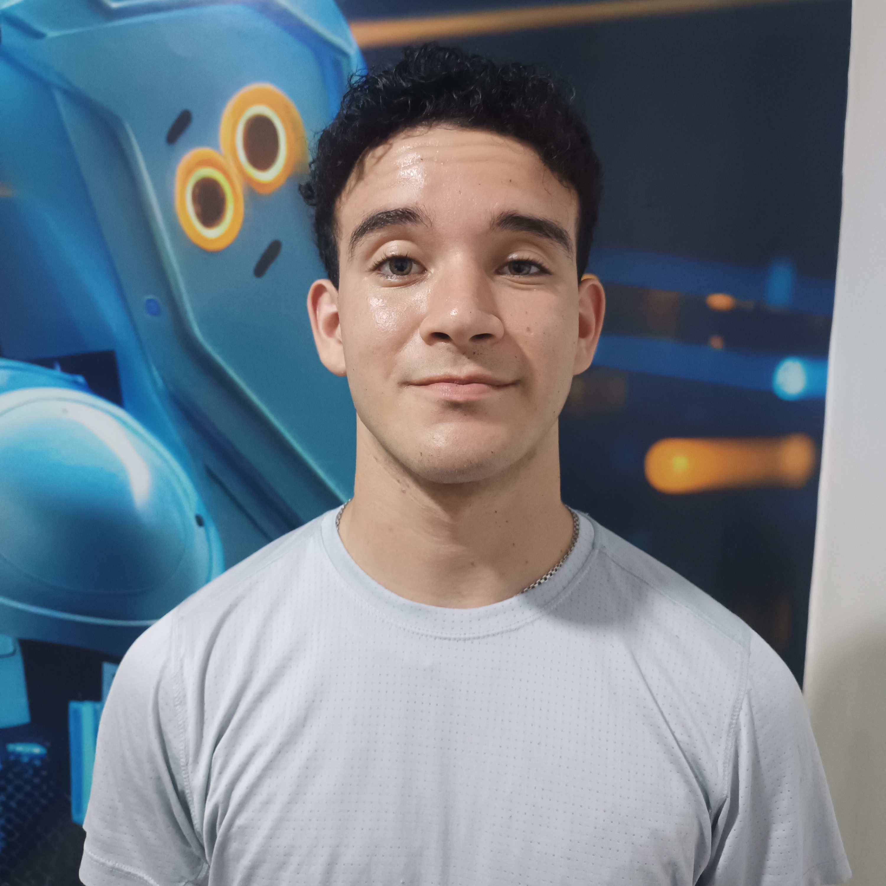
    </td>
    <!-- Información del Integrante -->
    <td style="border: none; padding-left: 20px; vertical-align: top;">
      <h2>Sebastián Salina</h2>
      <p><b>🎂 Edad:</b> 18 años (22/08/2008)</p>
      <p><b>🎖️ Rol:</b> Capitán / Mecánico del equipo</p>
      <hr>
      <p><b>🛠️ Habilidades:</b></p>
      <ul>
        <li>Estudiante de ing Mecatronica.</li>
        <li>Diseño de piezas en 3D (CAD).</li>
        <li>Tecnico en impresión 3D.</li>
        <li>Mantenimiento y ensamblaje mecánico.</li>
      </ul>
      <p><b>✨ Fun Fact:</b> <i>Una vez imprimió un Pokémon gigante de filamento para Cristóbal.</i></p>
    </td>
  </tr>
</table>

<table>
  <tr>
    <!-- Foto de Perfil -->
    <td width="280px" align="center" style="border: none;">
      
    </td>
    <!-- Información del Integrante -->
    <td style="border: none; padding-left: 20px; vertical-align: top;">
      <h2>Cristobal Mogollón</h2>
      <p><b>🎂 Edad:</b> 16 años (14/07/2010)</p>
      <p><b>🎖️ Rol:</b> Programador / Documentador</p>
      <hr>
      <p><b>💻 Habilidades:</b></p>
      <ul>
        <li>Programación en C++ y Arduino IDE.</li>
        <li>Manejo de la electrónica y sensores.</li>
        <li>Dominio con Git y GitHub.</li>
      </ul>
      <p><b>✨ Fun Fact:</b> <i>Una vez le pidió a Sebastián imprimir un Pokémon gigante de filamento.</i></p>
    </td>
  </tr>
</table>

<table>
  <tr>
    <!-- Foto de Perfil -->
    <td width="280px" align="center" style="border: none;">
      
    </td>
    <!-- Información del Integrante -->
    <td style="border: none; padding-left: 20px; vertical-align: top;">
      <h2>Diego Malaver</h2>
      <p><b>🎂 Edad:</b> 15 años (09/09/2010)</p>
      <p><b>🎖️ Rol:</b> Mecanico / Electronico</p>
      <hr>
      <p><b>⚙️ Habilidades:</b></p>
      <ul>
        <li>Manejo de la Mecanica.</li>
        <li>Manejo de la electrónica.</li>
        <li>Dominio con Github.</li>
      </ul>
      <p><b>✨ Fun Fact:</b> <i>Le prestaron la camisa de Cristobal del equipo y le quedo apretada.</i></p>
    </td>
  </tr>
</table>

- **Institución:** [Colegio Salto Ángel](https://www.instagram.com/colegiosaltoangel)
- **Instagram Oficial:** [@team_valgrind](https://instagram.com/team_valgrind)
- **Contáctanos:** [valgrind2026@gmail.com](mailto:valgrind2026@gmail.com)
- **Youtube:**
[Team ValGrind](https://youtube.com/@teamvalgrind?si=ZJbz7CX9eOX75H2U)

---

### 1.2 Origenes

El nombre de nuestro equipo fue decidido por los tres integrantes a partir de un clásico compilador de C++ llamado de la misma forma, el cual es representado por un logotipo de un dragón hecho con origami. El nombre "ValGrind" también hace referencia a la mitología nórdica debido a las legendarias Valquirias que habitan en este.

 [](https://postimg.cc/gryddns4)


> ### ¿Por qué nuestro robot se llama Heimdall?

Este nombre no solo es un guiño a la mitología mencionada, sino que además corresponde al dios conocido como el guardián de las puertas de Asgard y del puente Bifröst, que conecta los Nueve Mundos. Al ser un personaje imponente, consideramos que es un nombre apropiado para representar a nuestro robot en la WRO.

---  

### 1.3 Nuestro Objetivo

[](https://postimg.cc/t1LyR68v)

#### "Diseñar, Construir y Programar"
 Un robot autónomo capaz de superar los desafíos de la WRO 2026, utilizando innovación y trabajo en equipo para lograr un desempeño sobresaliente en la etapa regional y avanzar a la nacional. Para llegar a esto, hemos pasado los últimos meses diseñando, construyendo, armando y programando nuestro más nuevo proyecto "Heimdall"

 
> [!NOTE]
> La World Robot Olympiad (WRO) es una competencia internacional de robótica educativa que se desarrolla en varias fases, y nuestro equipo lógicamente tiene que comenzar por la fase regional, mediante la cual al ganarla se accede a la Fase Nacional. Cada país organiza su propio torneo clasificatorio, donde equipos de jóvenes compiten en distintas categorías, aplicando conocimientos de robótica y STEAM. Por último, la fase a la cual nuestro equipo quiere llegar es la Final Internacional. Los equipos ganadores de cada país participan en la competencia global, donde enfrentan desafíos más complejos y compiten con representantes de más de 95 países 

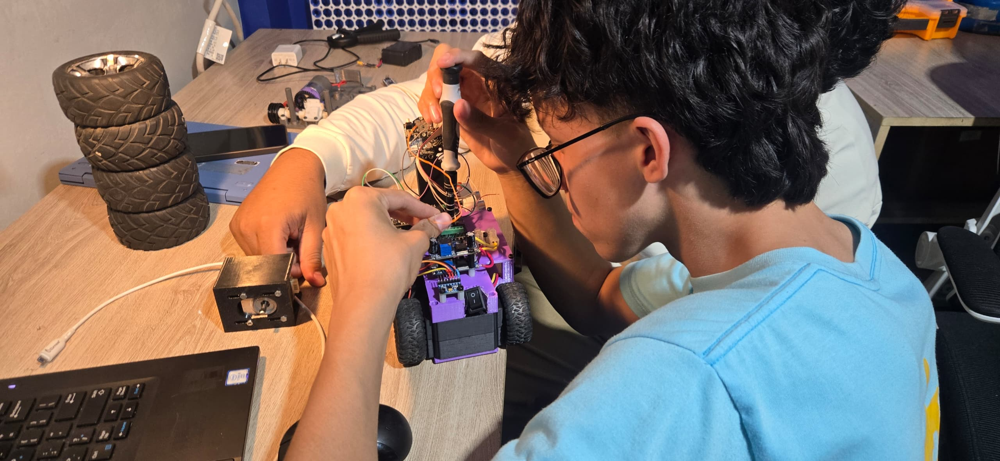

Aún así, nuestro único objetivo no es solamente ganar, como un equipo unido también tenemos la convicción de poder crear un robot no solo funcional, sino que llene nuestras expectativas; A pesar de ser intangible nuestro deseo de poder culminar nuestro proyecto como un equipo unido y verlo brillar, también es una meta importante para nosotros.

<p align="right">
  <a href="#inicio">Volver Al Inicio</a>
</p>

---

## 2. El Robot

<table>
  <tr>
    <td align="center">
      <b>Frontal</b><br>
      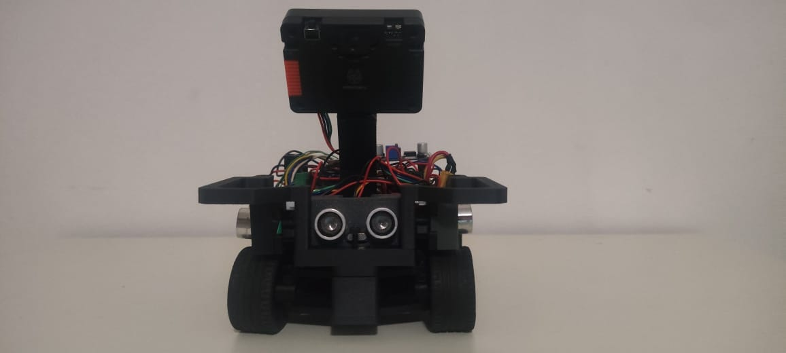
    </td>
    <td align="center">
      <b>Posterior</b><br>
      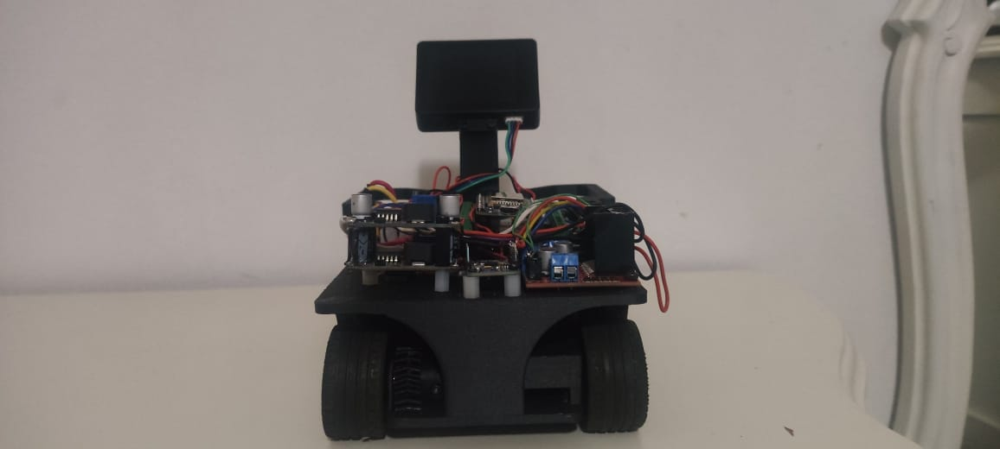
    </td>
    <td align="center">
      <b>Lado Izquierdo</b><br>
      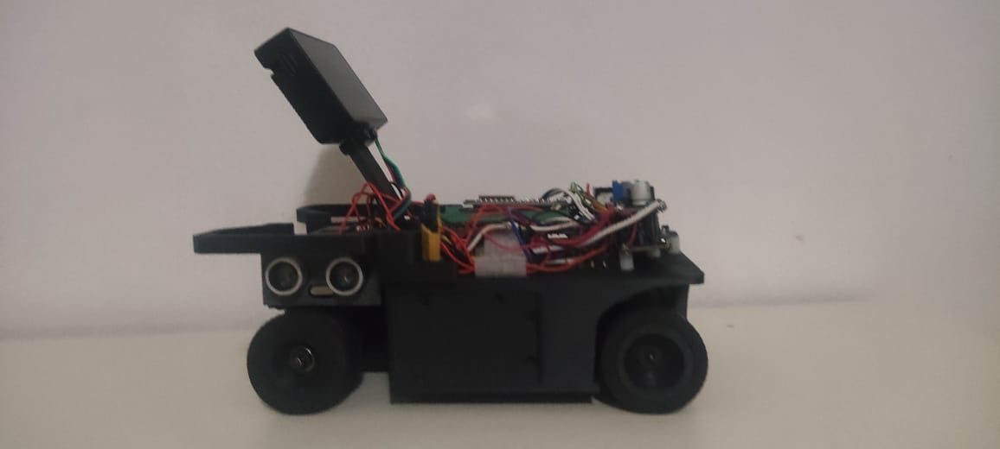
    </td>
  </tr>
  <tr>
    <td align="center">
      <b>Lado Derecho</b><br>
      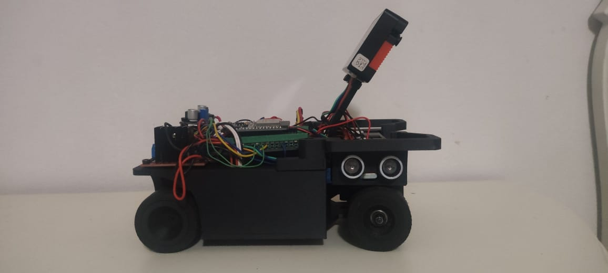
    </td>
  <td align="center">
  <b>Superior</b><br>
  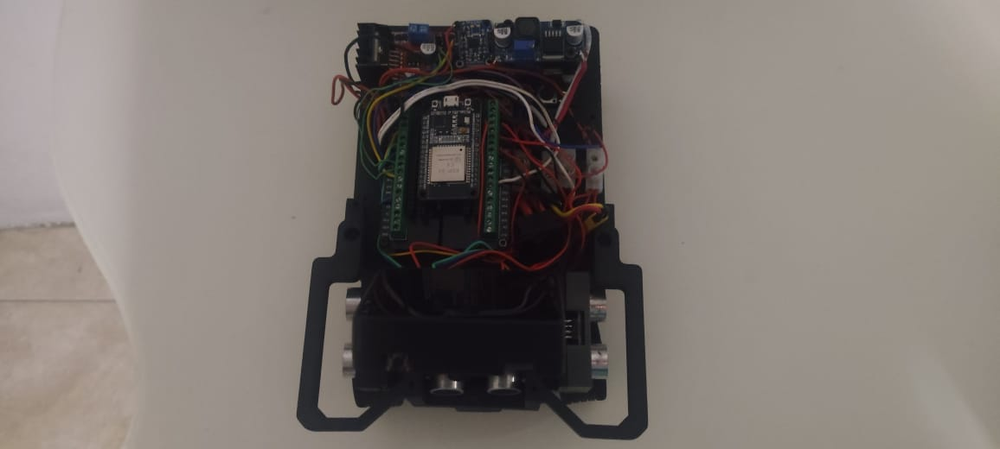
</td>
    <td align="center">
      <b>Inferior</b><br>
      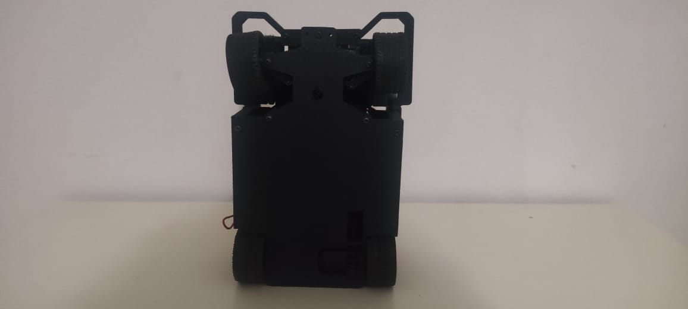
    </td>
  </tr>
</table>

---

## 2.1 Videos Del Robot

<h3 align="left" style="font-size: 1.4em; font-weight: 800; color: #1f2328; margin-bottom: 12px; text-transform: uppercase; letter-spacing: 0.5px;"><strong>Open Challenge</strong></h3>

<section style="display: block; width: 100%;">
  <table align="left" style="border-collapse: collapse; border: none; margin-top: 0px; width: 100%;">
    <tr style="border: none;">
      <td align="center" style="padding: 10px; border: none; width: 50%; vertical-align: top;">
        <a href="https://www.youtube.com/watch?v=DzKUt2QOpJs" target="_blank" style="text-decoration: none; display: inline-block;">
          
          <br />
          <span style="color: #0366d6; font-size: 0.9em; font-weight: 500; display: inline-block; margin-top: 8px;">▶ Video Open Challenge #3</span>
        </a>
      </td>
      <td align="center" style="padding: 10px; border: none; width: 50%; vertical-align: top;">
        <a href="https://www.youtube.com/watch?v=JyEaFMhT2mY" target="_blank" style="text-decoration: none; display: inline-block;">
          
          <br />
          <span style="color: #0366d6; font-size: 0.9em; font-weight: 500; display: inline-block; margin-top: 8px;">▶ Video Open Challenge #4</span>
        </a>
      </td>
    </tr>
  </table>
</section>

<br clear="all" />
<div style="height: 20px;"></div>

<h3 align="left" style="font-size: 1.4em; font-weight: 800; color: #1f2328; margin-bottom: 12px; text-transform: uppercase; letter-spacing: 0.5px;"><strong>Obstacle Challenge</strong></h3>

<section style="display: block; width: 100%;">
  <table align="left" style="border-collapse: collapse; border: none; margin-top: 0px; width: 50%;">
    <tr style="border: none;">
      <td align="center" style="padding: 10px; border: none; width: 100%; vertical-align: top;">
        <a href="https://www.youtube.com/watch?v=xPg1Bdj31Bs" target="_blank" style="text-decoration: none; display: inline-block;">
          
          <br />
          <span style="color: #0366d6; font-size: 0.9em; font-weight: 500; display: inline-block; margin-top: 8px;">▶ Video Obstacle Challenge #1</span>
        </a>
      </td>
    </tr>
  </table>
</section>

<br clear="all" />
<div style="height: 25px;"></div>

---

## 2.2 Apartado Mecanico

### 2.3 Impresion 3D

Antes de hablar de la movilidad o funcionalidad de nuestro robot, primero hay que explicar nuestros métodos de Diseño e Impresión 3D, los cuales se llevaron a cabo mediante Fusion 360


> [!NOTE]
> Fusion 360 es una plataforma de software de modelado 3D, CAD, CAM, CAE y PCB basada en la nube, destinada al diseño y la fabricación de productos. Nos permite diseñar y crear productos de acuerdo a sus especificaciones particulares, garantizando que cada pieza cumpla con los más exigentes criterios de estética, forma, ajuste y funcionalidad. Además, incorpora un conjunto integral de herramientas avanzadas para el diseño de placas de circuito impreso y componentes electrónicos, lo que facilita la conceptualización y materialización de cualquier idea, incluso las más complejas. Al implementar estas funciones, la plataforma optimiza significativamente tanto el tiempo como los costos asociados, asegurando que el proceso de producción se realice de manera eficiente y que las piezas obtenidas sean de la más alta calidad. Nosotros usamos esta herramienta gráfica y de diseño para realizar los diseños del chasis y las piezas personalizadas de nuestro robot.

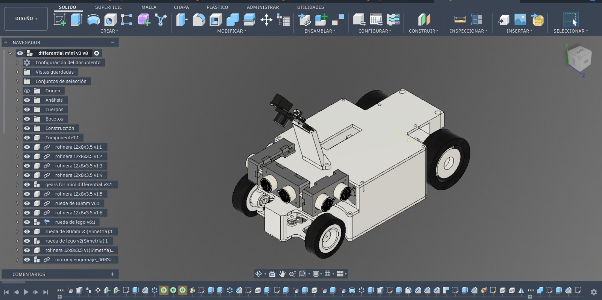

<h2>2.4 Movilidad</h2>

<p>Ahora bien, ya habiendo dilucidado cómo podemos elegir, diseñar e imprimir las piezas de nuestro robot, hay que asegurarnos de que este cuente con las herramientas necesarias para moverse y evadir los obstáculos de la pista.</p>

<p>Nuestro robot emplea un <strong>sistema de tracción diferencial</strong>, ofreciendo maniobrabilidad precisa para enfrentar los retos del campo de competencia. El sistema de cruces se realiza mediante un servo que ajusta la dirección del robot en intersecciones de forma eficaz. También cabe destacar el hecho de que utilizamos una técnica llamada <strong>Ackermann Positivo</strong> para emplear el sistema de movilidad de nuestro vehículo.</p>

  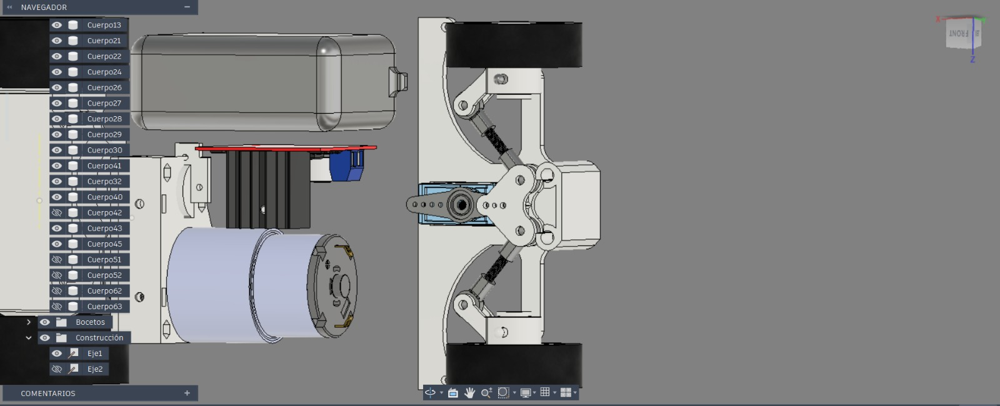

> [!NOTE]
 El diferencial de los vehículos, como su nombre lo indica, permite que exista una diferencia en la velocidad de giro entre la rueda interna y la rueda externa del vehículo cuando se da una vuelta o se está girando la dirección. No importa si el vehículo es tracción trasera o delantera, la función es la misma.

  <a href="https://postimg.cc/G4sWpg3Z">
    
  </a>

<hr>

<h2>2.5 Sistema de Movimiento y Traccion</h2>

<p>Ahondando en lo mencionado anteriormente, <em>Heimdall</em> utiliza lo que normalmente es denominado <strong>sistema Ackermann positivo</strong>, el cual es un sistema derivado del principio de Ackermann, cuyo objetivo es lograr que en curvas la <strong>rueda interior (&theta;<sub>i</sub>) gire más que la exterior (&theta;<sub>o</sub>)</strong> para minimizar el deslizamiento lateral (<em>scrub</em>).</p>

<h3>Ecuación Fundamental</h3>
<p align="center">
  <strong>cot(&theta;<sub>o</sub>) - cot(&theta;<sub>i</sub>) = W / L</strong>
</p>

<ul>
  <li><strong>W</strong>: Distancia entre pivotes de dirección (batalla)</li>
  <li><strong>L</strong>: Distancia entre ejes</li>
</ul>

<h3>Implementación Física</h3>

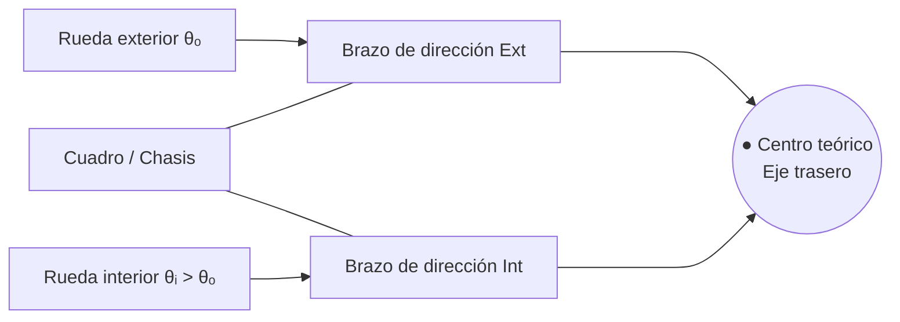
```mermaid
flowchart LR
    %% Definición de Nodos
    R_ext[Rueda exterior θₒ]
    R_int[Rueda interior θᵢ > θₒ]
    Cuadro[Cuadro / Chasis]
    B_ext[Brazo de dirección Ext]
    B_int[Brazo de dirección Int]
    Centro((● Centro teórico<br>Eje trasero))

    %% Conexiones y Flujo
    Cuadro --- B_ext
    Cuadro --- B_int
    
    R_ext --> B_ext
    R_int --> B_int
    
    B_ext ----> Centro
    B_int ----> Centro
```

<h3>Relación de Velocidades en Curva</h3>
<p align="center">
  <strong>&omega;<sub>o</sub> / &omega;<sub>i</sub> = (R + W/2) / (R - W/2)</strong>
</p>

<ul>
  <li><strong>&omega;<sub>o</sub></strong>: Velocidad angular de la rueda exterior.</li>
  <li><strong>&omega;<sub>i</sub></strong>: Velocidad angular de la rueda interior.</li>
  <li><strong>R</strong>: Radio de giro del centro del eje.</li>
</ul>

<hr>

<h3>Fuerzas en Conflicto</h3>

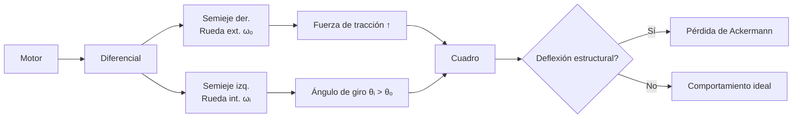
```mermaid
flowchart LR
    A[Motor] --> B[Diferencial]
    B --> C[Semieje der.\nRueda ext. ωₒ]
    B --> D[Semieje izq.\nRueda int. ωᵢ]
    C --> E[Fuerza de tracción ↑]
    D --> F[Ángulo de giro θᵢ > θₒ]
    E & F --> G[Cuadro]
    G --> H{Deflexión estructural?}
    H -->|Sí| I[Pérdida de Ackermann]
    H -->|No| J[Comportamiento ideal]
```

> [!WARNING]
> De utilizar estos sistemas, recomendamos tener cuidado con los siguientes inconvenientes los cuales aparecieron dentro de nuestras prácticas con la implementación del mencionado sistema:
>
> ---
>
> ### 1. Paradox Steering
> * **Causa:** La tracción en la rueda interior (baja adherencia) contrarresta el ángulo de giro.  
> * **Solución:** Control electrónico (freno vectorial).  
>
> ---
>
> ### 2. Fatiga en semiejes
> * **Causa:** Torsión excesiva en juntas homocinéticas debido a θᵢ máximo + par motor.  
> * **Solución:** Semiejes asimétricos con ángulos de trabajo optimizados.  
>

<hr>

### Soluciones de Ingeniería
<h4>Estrategias Recomendadas</h4>

| Componente | Innovación | Beneficio |
| :--- | :--- | :--- |
| **Cuadro** | Subchasis desmontable con rigidez variable. | Permite ajustes finos en competición. |
| **Diferencial** | Electrónico con mapas por ángulo de giro. | Regula par según &theta;<sub>i</sub> / &theta;<sub>o</sub> (ej: Honda SH-AWD). |
| **Dirección** | Brazo de Ackermann ajustable (rótulas roscadas). | Compensa desgaste o cambios de neumáticos. |

<p align="center">
  <a href="https://postimg.cc/8syssXPz">
    
  </a>
</p>
<hr>

## 2.6 Piezas de Mecanica
El núcleo de la movilidad de nuestro robot reside en un subsistema mecánico de transmisión y tracción meticulosamente diseñado. Cada componente ha sido fabricado y seleccionado de forma personalizada para optimizar el espacio, la transferencia de potencia y la eficiencia dinámica del prototipo. 

A continuación, se desglosa cómo cada pieza clave se integra en la arquitectura de ingeniería del robot **Heimdall**:

## 2.6.1 Diferencial y Eje de Transmisión Impreso en 3D

<table style="border: 1px solid #30363d; border-collapse: collapse; width: 100%; background-color: #161b22; border-radius: 8px; overflow: hidden; margin-bottom: 25px;">
  <tr>
    <td width="38%" align="center" style="border: none; padding: 15px; vertical-align: middle; background-color: #0d1117;">
      <div style="margin-bottom: 15px;">
        <b style="font-size: 12px; display: block; margin-bottom: 6px; color: #58a6ff;">⚙️ Componentes del Diferencial</b>
        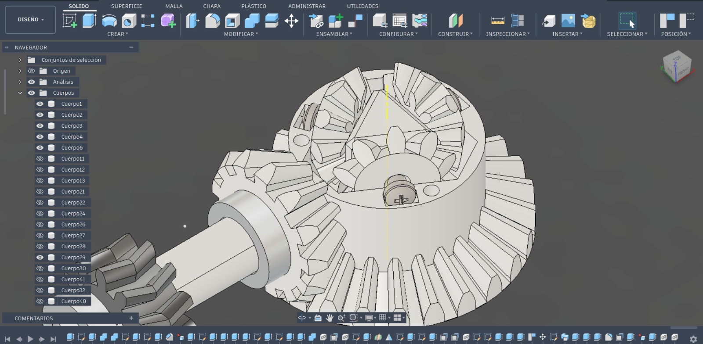
      </div>
      <div>
        <b style="font-size: 12px; display: block; margin-bottom: 6px; color: #58a6ff;">⚙️ Ensamble Final</b>
        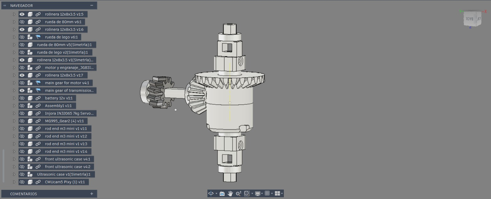
      </div>
    </td>
    <td width="62%" style="border: none; padding: 25px; vertical-align: top; font-family: -apple-system, BlinkMacSystemFont, 'Segoe UI', Helvetica, Arial, sans-serif; text-align: left;">
      <h4 style="margin-top: 0; color: #58a6ff; font-size: 18px; border-bottom: 1px solid #30363d; padding-bottom: 8px; margin-bottom: 15px;">Análisis de la Transmisión y Estabilidad</h4>
      <p style="color: #c9d1d9; font-size: 14px; line-height: 1.6; margin-bottom: 12px;">
        El diferencial se ubica en el eje motriz y permite que las ruedas izquierda y derecha giren a velocidades diferentes al tomar curvas. Esta característica es fundamental para evitar que el robot patine o experimente esfuerzos innecesarios en giros cerrados, manteniendo así la estabilidad incluso durante maniobras agresivas. Su diseño personalizado para el tamaño del robot <b>Heimdall</b> asegura que sea compacto, ligero y proporcional al resto del chasis y ruedas del robot.
      </p>
      <p style="color: #c9d1d9; font-size: 14px; line-height: 1.6; margin-bottom: 12px;">
        Por otro lado, el eje de transmisión conecta directamente la salida del diferencial personalizado a las ruedas motrices. Son responsables de transferir el par del motor generado hacia las ruedas, permitiendo el giro de los neumáticos. Su diseño personalizado garantiza la longitud y resistencia necesarias para soportar las fuerzas de torsión y tracción, sin añadir peso excesivo ni desbalancear el robot.
      </p>
      <p style="color: #c9d1d9; font-size: 14px; line-height: 1.6; margin-bottom: 0;">
        En el caso particular del robot <b>Heimdall</b>, originalmente se consideró una transmisión 4x4. Sin embargo, tras observar las limitaciones en los ángulos de cruce y la maniobrabilidad, se optó por priorizar la movilidad. Por ello, se decidió retirar el eje de transmisión y el diferencial delantero, transformando el robot en un sistema de tracción 4x2.
      </p>
    </td>
  </tr>
</table>

---

## Diferencias mas importantes entre transmisión 4x4 y 4x2 

| Característica                  | 4x4 (Tracción en las 4 ruedas)            | 4x2 (Tracción en 2 ruedas)                  |
|----------------------------------|-------------------------------------------|---------------------------------------------|
| **Motricidad** | Alta, ideal para terrenos irregulares o cruces complejos. | Moderada, suficiente para la mayoría de maniobras en pista controlada. |
| **Ángulo de cruce** | Limitado por la presencia de ejes delanteros. | Mayor libertad de giro y mejor ángulo de cruce. |
| **Estabilidad en curvas** | Más estable en condiciones extremas.       | Buena estabilidad, pero depende más del diseño del chasis y el diferencial. |
| **Peso total** | Mayor, por la cantidad extra de componentes (ejes y diferenciales delanteros). | Menor, lo que contribuye a una mejor relación peso-potencia.              |
| **Complejidad mecánica** | Más alta; requiere mayor mantenimiento y ajuste. | Más sencilla, facilita el mantenimiento y reduce fallos mecánicos.         |
| **Consumo energético** | Más elevado por la transmisión a cuatro ruedas. | Menor, lo que puede aumento de la autonomía.                                |
| **Aplicación recomendada** | Terrenos difíciles, obstáculos, máxima tracción. | Pistas controladas, mayor maniobrabilidad y agilidad.                     |

<p align="right">
  <a href="#inicio">Volver Al Inicio</a>
</p>

---
### 2.6.2 **Servomotor INJORA 180°**

<table style="border: 1px solid #444; border-collapse: collapse; width: 100%;">
  <tr style="background-color: rgba(255, 255, 255, 0.05);">
    <td width="350px" align="center" style="padding: 20px; border: 1px solid #444;">
      
    </td>
    <td style="padding: 20px; border: 1px solid #444; vertical-align: top;">
      <h4 style="margin-top: 0;">⚡ Especificaciones</h4>
      <ul>
        <li><b>Tipo:</b> Servo digital de alta precisión.</li>
        <li><b>Banda muerta:</b> 2 µs.</li>
        <li><b>Señal de control:</b> PWM (500-2500 µs, 330 Hz).</li>
        <li><b>Torque de retención (8.4V):</b> 7.0 kg-cm / 97.2 oz-in.</li>
        <li><b>Velocidad (8.4V):</b> 0.06 s/60° (aprox. 150 rpm).</li>
        <li><b>Rodamientos:</b> 1BB (Bolas de acero).</li>
        <li><b>Engranajes:</b> Metálicos para alta durabilidad.</li>
      </ul>
    </td>
  </tr>
</table>

<p style="margin-top: 15px;">
  El servo <b>Injora 2065</b> es un micro servo digital de alto par, diseñado para aplicaciones que demandan movimientos precisos y una respuesta rápida. En <b>Heimdall</b>, este componente es el encargado de ejecutar el sistema de dirección delantera, permitiendo que el robot realice maniobras de esquiva milimétricas gracias a su excelente relación peso-potencia.
</p>

<p><b>Configuración de Software en Heimdall:</b></p>
<p>
  Utilizamos la librería <code>ESP32Servo.h</code> para gestionar la señal PWM en el <b>GPIO 2</b>. Hemos calibrado los límites físicos del mecanismo de dirección para evitar bloqueos mecánicos y optimizar el radio de giro:
</p>

<ul>
  <li><b>Ángulo Central:</b> 98° (Alineación neutra para línea recta).</li>
  <li><b>Rango Máximo (Derecha):</b> 128°.</li>
  <li><b>Rango Mínimo (Izquierda):</b> 68°.</li>
  <li><b>Ángulo de Esquiva:</b> 25° (Giro primario) y 20° (Giro secundario) para maniobras rápidas.</li>
</ul>

<p><b>Ventajas en Competencia:</b></p>
<ul>
  <li><b>Respuesta Dinámica:</b> Su motor de núcleo permite cambios de dirección instantáneos, esenciales cuando la cámara Pixy2 detecta un bloque a alta velocidad.</li>
  <li><b>Soporte de Voltaje:</b> Al soportar hasta 8.4V, podemos alimentarlo directamente desde el sistema de potencia para maximizar su torque y velocidad.</li>
  <li><b>Maniobras Preventivas:</b> Gracias a su precisión, implementamos ángulos de 20° para las esquivas preventivas, logrando trayectorias más fluidas y evitando colisiones accidentales.</li>
</ul>

<table style="border: 1px solid #444; border-collapse: collapse;">
  <thead style="background-color: rgba(255, 255, 255, 0.1);">
    <tr>
      <th style="padding: 10px; border: 1px solid #444;">🛠️ Herramientas Requeridas</th>
    </tr>
  </thead>
  <tbody>
    <tr>
      <td style="padding: 10px; border: 1px solid #444;">1 × Destornillador hexagonal 1.5 mm</td>
    </tr>
    <tr>
      <td style="padding: 10px; border: 1px solid #444;">1 × Destornillador hexagonal 2.0 mm</td>
    </tr>
  </tbody>
</table>

<br>

<p align="right">
  <a href="#inicio">Volver Al Inicio</a>
</p>

<hr>

### 2.6.3 **Motor Hytech GA37-520**

<table style="border: 1px solid #444; border-collapse: collapse; width: 100%;">
  <tr style="background-color: rgba(255, 255, 255, 0.05);">
    <td width="350px" align="center" style="padding: 20px; border: 1px solid #444;">
      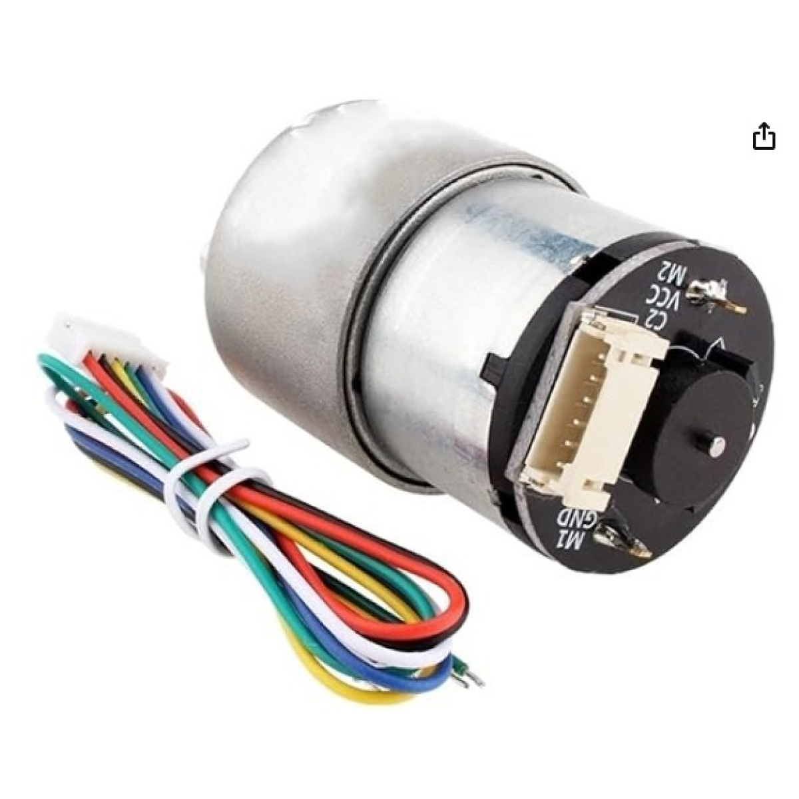
    </td>
    <td style="padding: 20px; border: 1px solid #444; vertical-align: top;">
      <h4 style="margin-top: 0;">⚡ Especificaciones</h4>
      <ul>
        <li><b>Voltaje nominal:</b> 12V DC</li>
        <li><b>Velocidad nominal:</b> 360 RPM</li>
        <li><b>Torque nominal:</b> 4.5 kg.cm</li>
        <li><b>Corriente (Sin carga):</b> ≤ 100mA</li>
        <li><b>Encoder:</b> Magnético de fase dual (Fases A y B)</li>
        <li><b>PPR del Encoder:</b> 11 pulsos por vuelta (330 PPR en eje de salida)</li>
        <li><b>Material:</b> Caja de cambios totalmente metálica</li>
        <li><b>Relación de reducción:</b> 1:30</li>
      </ul>
    </td>
  </tr>
</table>

<p style="margin-top: 15px;">
  El <b>GA37-520</b> es el motor principal de tracción para nuestro robot. A diferencia de otros motores de corriente continua convencionales, este modelo fue elegido específicamente por integrar un <b>encoder magnético</b> de efecto Hall. Esta pieza es fundamental para transformar a <b>Heimdall</b> de un sistema de bucle abierto a uno de <b>lazo cerrado (Closed-Loop)</b>, permitiendo un monitoreo constante del movimiento real del chasis y garantizando que los giros de 90° sean siempre precisos e idénticos.
</p>

> [!TIP]
> **Ventaja del Encoder:** Al tener retroalimentación de las fases A y B, el código puede detectar no solo la velocidad, sino también la dirección del giro y la posición exacta de las ruedas. Esto es vital para corregir desviaciones en tiempo real y asegurar que los giros de 90° sean siempre idénticos, independientemente de la carga o el estado de la batería.

<p><b>¿Por qué decidimos usar este motor?:</b></p>

<ul>
  <li><b>Precisión en Odometría:</b> El encoder permite al ESP32 contar cada pulso del motor, lo que nos otorga la capacidad de medir distancias recorridas en centímetros. Esto es crítico para las fases del desafío donde el robot debe avanzar distancias fijas con error mínimo.</li>
  <li><b>Control de Velocidad PID:</b> Gracias a la lectura constante del encoder, implementamos un algoritmo PID para mantener una velocidad crucero estable, evitando que el robot se acelere o frene bruscamente por irregularidades en la pista.</li>
  <li><b>Robustez Mecánica:</b> Su construcción con engranajes de acero garantiza que el par motor se mantenga constante durante toda la competencia, soportando el estrés de las maniobras de esquiva agresivas.</li>
</ul>

<p><b>Configuración de Pines del Encoder y Motor:</b></p>

<table width="100%" style="border: 1px solid #444; border-collapse: collapse;">
  <thead style="background-color: rgba(255, 255, 255, 0.1);">
    <tr>
      <th style="padding: 10px; border: 1px solid #444;">Pines</th>
      <th style="padding: 10px; border: 1px solid #444;">Función</th>
      <th style="padding: 10px; border: 1px solid #444;">Conexión ESP32</th>
    </tr>
  </thead>
  <tbody>
    <tr>
      <td style="padding: 10px; border: 1px solid #444; text-align: center;">IN1</td>
      <td style="padding: 10px; border: 1px solid #444; text-align: center;">Dirección / PWM</td>
      <td style="padding: 10px; border: 1px solid #444; text-align: center;"><b>GPIO 16</b></td>
    </tr>
    <tr>
      <td style="padding: 10px; border: 1px solid #444; text-align: center;">IN2</td>
      <td style="padding: 10px; border: 1px solid #444; text-align: center;">Dirección / PWM</td>
      <td style="padding: 10px; border: 1px solid #444; text-align: center;"><b>GPIO 17</b></td>
    </tr>
    <tr>
      <td style="padding: 10px; border: 1px solid #444; text-align: center;">VCC Encoder</td>
      <td style="padding: 10px; border: 1px solid #444; text-align: center;">Alimentación Lógica</td>
      <td style="padding: 10px; border: 1px solid #444; text-align: center;">5V DC</td>
    </tr>
    <tr>
      <td style="padding: 10px; border: 1px solid #444; text-align: center;">GND Encoder</td>
      <td style="padding: 10px; border: 1px solid #444; text-align: center;">Tierra</td>
      <td style="padding: 10px; border: 1px solid #444; text-align: center;">GND Negativo</td>
    </tr>
    <tr>
      <td style="padding: 10px; border: 1px solid #444; text-align: center;">Fase A (Blanco)</td>
      <td style="padding: 10px; border: 1px solid #444; text-align: center;">Señal de Pulso</td>
      <td style="padding: 10px; border: 1px solid #444; text-align: center;"><b>GPIO 35</b></td>
    </tr>
    <tr>
      <td style="padding: 10px; border: 1px solid #444; text-align: center;">Fase B (Blanco)</td>
      <td style="padding: 10px; border: 1px solid #444; text-align: center;">Señal de Giro</td>
      <td style="padding: 10px; border: 1px solid #444; text-align: center;"><b>GPIO 34</b></td>
    </tr>
  </tbody>
</table>
<br>

### Calculo de la Reduccion total

Para adaptar la salida del motor a las necesidades del robot, realizamos un cálculo de la reducción total combinando la reducción interna del motor con la de un sistema de engranajes externo. Utilizamos un piñón de ataque estándar (acoplado al eje del motor) y engranajes de 17 y 28 dientes.

La relación de reducción adicional por engranajes se calcula así:
- Si el piñón tiene, por ejemplo, 10 dientes, y el engranaje acoplado tiene 28 dientes, la reducción es 28/10 = 2.8.
- Si se agregan más etapas de engranajes (por ejemplo, usando un engranaje intermedio de 17 dientes), la reducción se multiplica por cada etapa.

La reducción total del sistema es:

```
Reducción total = Reducción interna del motor × (dientes engranaje grande / dientes piñón)
```

Con el Piñón de lego de 36 dientes acomplado a nuestro motor, transmitiendo su fuerza de rotación al Piñon de 16 dientes obtenemos un aumento de 2.11 veces la velocidad original del motor (550 rpm) obteniendo así 1164.7 rpm, siendo reducidos por el Piñón de ataque a una reducción de 1:2.24 
Dando un total de 521 rpm las cuales se transmiten directamente a los ejes de transmisión conectados a las ruedas

#### ¿Por qué es importante la reducción?

Dos palabras clave: `Velocidad` y `Torque`. Al aumentar la reducción, la velocidad de salida disminuye, permitiendo un control más preciso del robot, y paralelamente  La reducción aumenta el torque disponible en las ruedas, lo que mejora la capacidad de mover el robot o superar obstáculos.

### Razones para elegir este motor y sistema de reducción

- **Versatilidad y control:** El motor de 12V es estándar y confiable. La reducción interna más la reducción por engranajes externos se adapta perfectamente a las necesidades del robot.
- **Adaptabilidad:** Cambiando los engranajes externos se puede ajustar fácilmente la velocidad y el torque final.
- **Eficiencia y disponibilidad:** Los componentes son fáciles de conseguir y económicos.

<p align="right">
  <a href="#inicio">Volver Al Inicio</a>
</p>

---

### 2.6.4 **Tornillos, Tuercas de Seguridad y Arandelas (M2 y M3)**

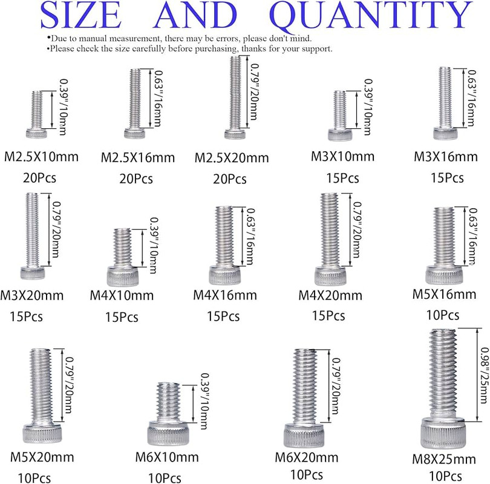

Ya sean M2 o M3, son piezas imprescindibles para la mecanica de nuestro robot, debido a la fijacion de piezas pequeñas, estabilización de componentes, y la garantía de seguridad que otorgan con respecto al uso prolongado del robot ya sea en practicas o en la competición.

Se decidió tomar la decisión de tener tornillos M2 y M3 de forma simultánea para velar por la eficiencia del espacio, para permitir compatibilidad con los componentes más pequeños, y al mismo tiempo para garantizar que los tornillos resistan y permitan estabilidad en el robot.

<p align="right">
  <a href="#inicio">Volver Al Inicio</a>
</p>
     
---

## 3. Apartado Electronico

<p align="justify">
  El apartado electrónico de nuestro robot <b>Heimdall</b> ha sido diseñado bajo una arquitectura modular que prioriza la estabilidad de voltaje y la velocidad de procesamiento. La integración de estos componentes permite que el robot procese datos sensoriales en tiempo real, garantizando una respuesta inmediata ante los desafíos del entorno de la <b>WRO 2026</b>.
</p>

<p><b>La arquitectura se divide en cuatro pilares fundamentales:</b></p>

<ul>
  <li><b>Gestión de Energía:</b> Sistemas de regulación para estabilizar la potencia de las baterías.</li>
  <li><b>Unidad de Procesamiento:</b> Cerebro central encargado de la lógica y visión.</li>
  <li><b>Control de Actuadores:</b> Drivers para el manejo de motores y dirección.</li>
  <li><b>Percepción Sensorial:</b> Sensores ultrasónicos, inerciales y de visión artificial.</li>
</ul>

---

### 3.1 Piezas de Electronica

Por lo tanto hemos decidido usar:

### 3.1.1 **Baterias**

<table>
  <tr>
    <td align="center" width="450" >
      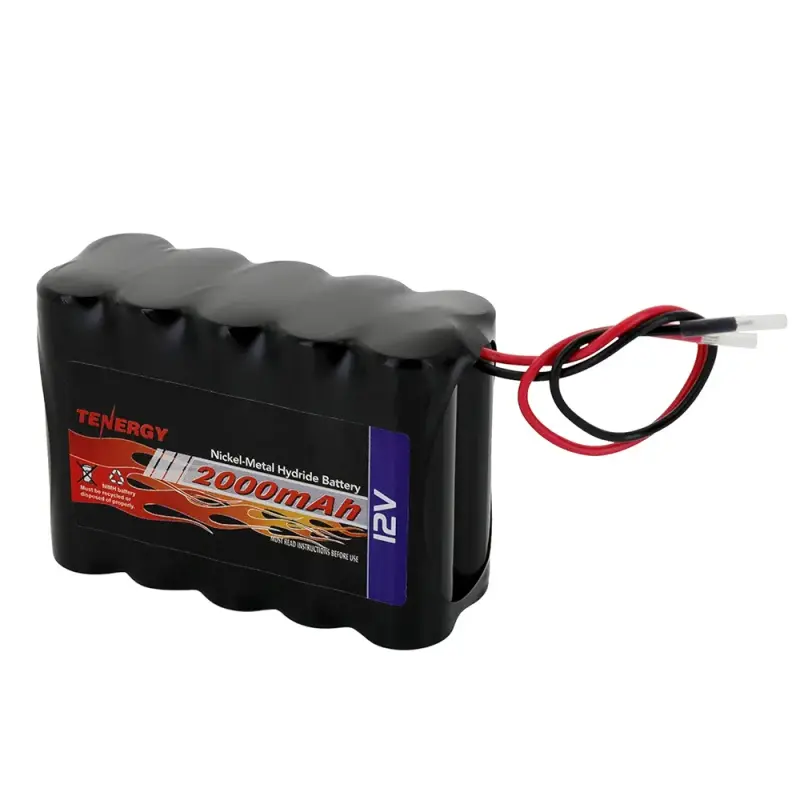
    </td>
    <td>
      <h3>:battery: Especificaciones</h3>
      <ul>
      <li>Voltaje: 12 Voltios</li>
      <li>Amperaje: 2 Amperios</li>
      <li>Reutilización: Recargable</li>
      <li>Peso de la batería: 225 Gramos</li>
      <li>Dimensiones del producto: 2,13 x 2,91 x 1,22 pulgadas</li>
      <li>Fabricante: Tenergy</li>
      <li>Opinión media de los clientes: 4.5 de 5 estrellas (748 opiniones)</li>
      <li>Producto en amazon.com desde: marzo 10, 2018</li>
      <li>Descatalogado por el fabricante: No </li> 
      <li>UPC: 844949030014</li>
      <li>Número de modelo del producto: 19676</li>
      </ul>
    </td>
  </tr>
</table>

Diseñadas para potenciar el rendimiento en competiciones de robótica como la WRO, las baterías Tenergy NiMH de 12 V y 2000 mAh ofrecen dos ventajas críticas: su ausencia de efecto memoria garantiza máxima capacidad en cada uso tras recargas frecuentes (ideal para sesiones de prueba extensas), y su formato compacto (1.969x1.142x2.835 pulgadas) con cables desnudos facilita la integración en espacios reducidos de robots. Con carga rápida ≤1A y larga vida útil, son una solución fiable para  cuando necesitemos usarlas por un tiempo prolongado, ya sea en la propia competición o en pruebas.

> [!TIP]
> Para maximizar rendimiento y seguridad en robots**, cargue siempre estas baterías con un cargador compatible NiMH (como el Tenergy 6V-12V) a ≤1A para evitar sobrecalentamiento y prolongar su vida útil (~500 ciclos). Durante competiciones WRO, monitoree la temperatura (detenga si supera 45°C) y verifique el voltaje post-uso (>10.8V ideal); evite descargas profundas (<0.9V/celda) recargando tras 3-4 sesiones. Almacénelas con 40-60% de carga en ambiente fresco (15-25°C), realice mantenimiento cada 4 semanas si no se usan, y en robots proteja el pack contra golpes con aislante anti-vibración.

<p align="right">
  <a href="#inicio">Volver Al Inicio</a>
</p>

---

### 3.1.2 **Step Down**

<table style="border: 1px solid #30363d; border-collapse: collapse; width: 100%; background-color: #0d1117;">
  <tr>
    <td width="30%" align="center" style="border: 1px solid #30363d; background-color: #f0f6fc; padding: 10px;">
      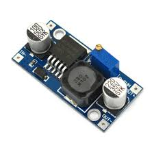
    </td>
    <td width="70%" style="border: 1px solid #30363d; vertical-align: top; padding: 0;">
      <table style="width: 100%; border-collapse: collapse; color: #c9d1d9; font-size: 14px;">
        <thead style="background-color: #161b22; color: #f0f6fc;">
          <tr>
            <th style="padding: 10px; border-bottom: 1px solid #30363d; text-align: left;">Parámetro</th>
            <th style="padding: 10px; border-bottom: 1px solid #30363d; text-align: left;">Valor</th>
            <th style="padding: 10px; border-bottom: 1px solid #30363d; text-align: left;">Puntos Relevantes</th>
          </tr>
        </thead>
        <tbody>
          <tr>
            <td style="padding: 8px 10px; border-bottom: 1px solid #21262d;"><b>Rango Entrada</b></td>
            <td style="padding: 8px 10px; border-bottom: 1px solid #21262d;">3.2–40 V DC</td>
            <td style="padding: 8px 10px; border-bottom: 1px solid #21262d;">Compatible con LiPo, Pb y solares.</td>
          </tr>
          <tr>
            <td style="padding: 8px 10px; border-bottom: 1px solid #21262d;"><b>Rango Salida</b></td>
            <td style="padding: 8px 10px; border-bottom: 1px solid #21262d;">1.25–37 V DC</td>
            <td style="padding: 8px 10px; border-bottom: 1px solid #21262d;">microcontroladores, sensores o motores.</td>
          </tr>
          <tr>
            <td style="padding: 8px 10px; border-bottom: 1px solid #21262d;"><b>Corriente</b></td>
            <td style="padding: 8px 10px; border-bottom: 1px solid #21262d;">2A (3A Pico)</td>
            <td style="padding: 8px 10px; border-bottom: 1px solid #21262d;">Suficiente para servos y sensores.</td>
          </tr>
          <tr>
            <td style="padding: 8px 10px; border-bottom: 1px solid #21262d;"><b>Eficiencia</b></td>
            <td style="padding: 8px 10px; border-bottom: 1px solid #21262d;">Hasta 92%</td>
            <td style="padding: 8px 10px; border-bottom: 1px solid #21262d;">Reduce pérdidas térmicas.</td>
          </tr>
          <tr>
            <td style="padding: 8px 10px; border-bottom: 1px solid #21262d;"><b>Frecuencia</b></td>
            <td style="padding: 8px 10px; border-bottom: 1px solid #21262d;">150 kHz</td>
            <td style="padding: 8px 10px; border-bottom: 1px solid #21262d;">Diseño compacto y eficiente.</td>
          </tr>
          <tr>
            <td style="padding: 8px 10px;"><b>Protecciones</b></td>
            <td style="padding: 8px 10px;">Limitación de corriente.</td>
            <td style="padding: 8px 10px;">Evita daños por cortocircuitos.</td>
          </tr>
        </tbody>
      </table>
    </td>
  </tr>
</table>

<br>

El LM2596 es un regulador step down DC-DC diseñado para transformar tensiones elevadas en niveles adecuados para circuitos electrónicos.  Acepta un rango de entrada entre 3.2 y 40V, Lo cual evidentemente demuestra que es un componente electrónico bastante versátil en lo que al manejo de voltaje respecta, por lo tanto nuestro equipo decidió utilizarlo para poder manejar el voltaje en el circuito del robot de forma idónea.

<div style="margin-top: 15px; background-color: #161b22; border: 1px solid #30363d; border-radius: 6px; padding: 15px; font-size: 14px; color: #c9d1d9;">
  <p style="margin-bottom: 10px;"><b>Es extremadamente útil para nuestro proyecto debido a su:</b></p>
  <ul style="margin: 0; padding-left: 20px; line-height: 1.6;">
    <li><b>Regulación eficiente:</b> Convierte los 12V de la batería a los 5V estables que requiere la lógica, minimizando el calor generado.</li>
    <li><b>Protección de componentes:</b> Aísla al ESP32 y sensores de los ruidos eléctricos y picos de tensión de los motores.</li>
    <li><b>Alta potencia:</b> Soporta hasta 3A, suficiente para alimentar la PixyCam, el servo y el microcontrolador al mismo tiempo.</li>
    <li><b>Versatilidad:</b> Su amplio rango de entrada permite adaptar diferentes tipos de baterías sin cambiar el hardware.</li>
  </ul>
</div>

<p align="right">
  <a href="#inicio">Volver Al Inicio</a>
</p>

---

### 3.1.3 **Motor Driver**

<table>
  <tr>
    <td width="350px" align="center" style="vertical-align: middle;">
      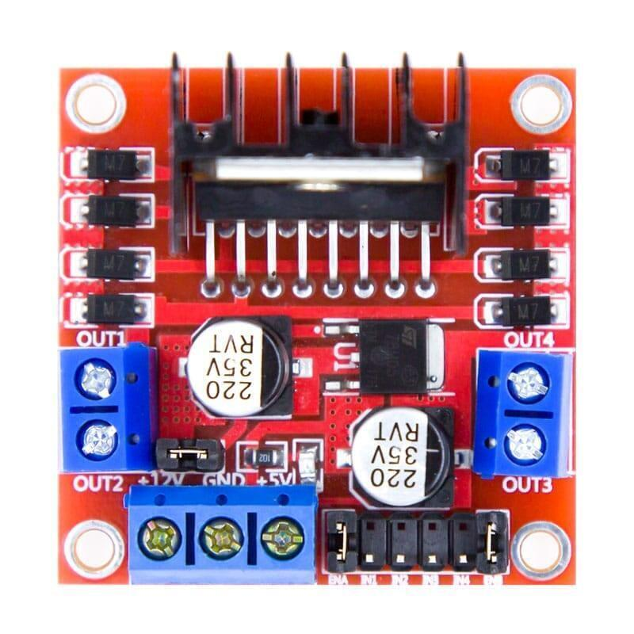
    </td>
    <td style="vertical-align: top; padding-left: 20px;">
      <h3>⚡ Especificaciones</h3>
      <ul>
        <li>Chip de control: L298N (Doble Puente H)</li>
        <li>Voltaje de operación (Motores): 5V a 35V DC</li>
        <li>Corriente máxima (Pico): 2 Amperios por canal</li>
        <li>Corriente continua: 1.2 Amperios por canal</li>
        <li>Voltaje lógico: 5V DC</li>
        <li>Corriente lógica: 0mA - 36mA</li>
        <li>Potencia máxima: 25 Watts</li>
        <li>Modo de control: PWM (Modulación por ancho de pulsos)</li>
        <li>Temperatura operativa: -20°C a +135°C</li>
        <li>Dimensiones: 43 x 43 x 27 mm</li>
        <li>Peso: 30 Gramos aprox.</li>
        <li>Extras: Regulador 78M05 integrado y diodos de protección</li>
      </ul>
    </td>
  </tr>
</table>

Es un **controlador de motores de doble puente H (dual H-bridge)** encapsulado en un circuito integrado. Su función principal es actuar como un "intermediario de potencia" entre dispositivos de control de baja potencia (como Arduino) y motores de alta potencia (como tu motor DC 12V).

**Es extremadamente útil para nuestro proyecto debido a su:**

1. **Amplificación de corriente:**  
   - Los microcontroladores solo pueden entregar ~20-40mA por pin.  
   - El L298N soporta hasta **2A por canal** (suficiente para motores medianos).  
2. **Control direccional:**  
   - Permite invertir la polaridad del voltaje aplicado al motor para cambiar su giro (adelante/atrás).  
3. **Protección eléctrica:**  
   - Aísla el circuito de control de los picos de voltaje generados por el motor.  
4. **Manejo de alta tensión:**  
   - Soporta motores de 5V a 35V (ideal para tu motor 12V).  

---

#### **Partes clave del módulo L298N:**  
| **Componente**      | **Función**                                                                 |
|---------------------|-----------------------------------------------------------------------------|
| **Puertos de salida** (OUT1, OUT2, OUT3, OUT4) | Conectan los motores (2 motores DC o 1 motor paso a paso).                  |
| **Entradas lógicas** (IN1, IN2, IN3, IN4) | Reciben señales de control desde Arduino (determinan dirección).          |
| **Pines de habilitación** (ENA, ENB) | Activan/desactivan los canales (con/sin PWM).                             |
| **Regulador de 5V** | Provee energía a la lógica (puede alimentar al Arduino si se usa el jumper).|
| **Disipador de calor** | Metálico, previene sobrecalentamiento durante uso prolongado.             |
| **Jumpers**         | Configuran el modo de operación (ej: habilitación permanente de canales). |

---

#### **¿Cómo controla un motor DC?**  
Usa un circuito **puente H (H-bridge)** interno:  
``` 
   [IN1] --[SW1]---- Motor ----[SW3]-- [IN2]  
               |                   |  
              [SW2]               [SW4]  
```  
- **Giro adelante:**  
  `IN1 = HIGH` (SW1 cerrado) + `IN2 = LOW` (SW4 cerrado) → Corriente fluye: SW1 → Motor → SW4  
- **Giro atrás:**  
  `IN1 = LOW` (SW2 cerrado) + `IN2 = HIGH` (SW3 cerrado) → Corriente fluye: SW3 → Motor → SW2  
- **Frenado:**  
  `IN1 = HIGH` + `IN2 = HIGH` → Cortocircuito en bornes del motor (frena rápidamente).  

<p align="right">
  <a href="#inicio">Volver Al Inicio</a>
</p>

---

### 3.1.4 **Sensor de Ultrasonido**

<table style="border: 1px solid #444; border-collapse: collapse; width: 100%;">
  <tr style="background-color: rgba(255, 255, 255, 0.05);">
    <!-- Imagen del Sensor -->
    <td width="350px" align="center" style="padding: 20px; border: 1px solid #444;">
      
    </td>
    <!-- Cuadro de Especificaciones -->
    <td style="padding: 20px; border: 1px solid #444; vertical-align: top;">
      <h4 style="margin-top: 0;">⚡ Especificaciones</h4>
      <ul>
        <li><b>Voltaje de operación:</b> 5V DC</li>
        <li><b>Frecuencia acústica:</b> 40 kHz</li>
        <li><b>Unidades en Heimdall:</b> 3 (Ecosistema de detección periférica)</li>
        <li><b>Librería de control:</b> NewPing (Gestión de triggers no bloqueantes)</li>
        <li><b>Rango de medición:</b> 1cm 357cm</li>
        <li><b>Precisión de resolución:</b> 0.3 cm</li>
        <li><b>Ángulo de detección:</b> < 15°</li>
        <li><b>Protocolo:</b> Pulso TTL de activación (10µs) y respuesta proporcional</li>
      </ul>
    </td>
  </tr>
</table>

<p style="margin-top: 15px;">
  El <b>HC-SR04</b> es un sensor de telemetría acústica diseñado para medir distancias mediante la emisión de ondas ultrasónicas. A diferencia de los sensores ópticos que pueden fallar ante cambios de iluminación, el HC-SR04 procesa el "tiempo de vuelo" (Time of Flight) de una ráfaga sonora, permitiendo que <b>Heimdall</b> conozca su posición exacta respecto a los muros de la pista de forma fiable y constante.
</p>

> [!TIP]
>  - En el codigo recomiendo usar un promedio de las 5 lecturas y que agarre las mas similares para evitar fallos.
>  - Recomiendo el ignorar distancias como 357 por que puede dar falsos picos de lectura.   

<p><b>Ventajas competitivas en la navegación del robot:</b></p>

<ul>
  <li><b>Detección de Obstáculos por Eco:</b> El sensor emite 8 ráfagas de 40 kHz que rebotan en los muros. Al calcular el tiempo que tarda el sonido en regresar, el robot puede "ver" a qué distancia se encuentra de las colisiones sin contacto físico.</li>
  <li><b>Optimización con la libreria NewPing:</b> Implementamos esta librería para gestionar el ecosistema de 3 sensores de forma paralela. NewPing optimiza el ciclo de trabajo del ESP32, descartando ecos residuales y permitiendo una frecuencia de muestreo más alta..</li>
  <li><b>Sustitución en Caliente:</b> Su arquitectura estandarizada permite un reemplazo modular inmediato. En una competencia de alto nivel, la capacidad de reparar el sistema de navegación en segundos ante un fallo eléctrico es una ventaja estratégica clave.</li>
</ul>

<p><b>Principio de Operación Técnica:</b></p>

<p>Para obtener la distancia, el sistema realiza un proceso de cuatro etapas sincronizado por hardware y software:</p>

<ul>
  <li><b>Disparo (Trigger):</b> Se envía un pulso de 10 microsegundos para activar el transductor emisor.</li>
  <li><b>Emisión:</b> El sensor genera automáticamente una ráfaga de ultrasonido inaudible.</li>
  <li><b>Captura (Echo):</b> El receptor detecta la onda reflejada y pone el pin de Echo en nivel alto.</li>
  <li><b>Cálculo Cinemático:</b> Basándonos en la velocidad del sonido (~340m/s), el código transforma el tiempo medido en una magnitud lineal (cm).</li>
</ul>

<p><b>Distribución de Pines en Heimdall:</b></p>

<table width="100%" style="border: 1px solid #444; border-collapse: collapse;">
  <thead style="background-color: rgba(255, 255, 255, 0.1);">
    <tr>
      <th style="padding: 10px; border: 1px solid #444;">Eje de Detección</th>
      <th style="padding: 10px; border: 1px solid #444;">Pin Trigger</th>
      <th style="padding: 10px; border: 1px solid #444;">Pin Echo</th>
    </tr>
  </thead>
  <tbody>
    <tr>
      <td style="padding: 10px; border: 1px solid #444; text-align: center;"><b>Frontal:</b></td>
      <td style="padding: 10px; border: 1px solid #444; text-align: center;">13</td>
      <td style="padding: 10px; border: 1px solid #444; text-align: center;">12</td>
    </tr>
    <tr>
      <td style="padding: 10px; border: 1px solid #444; text-align: center;"><b>Izquierdo:</b></td>
      <td style="padding: 10px; border: 1px solid #444; text-align: center;">14</td>
      <td style="padding: 10px; border: 1px solid #444; text-align: center;">27</td>
    </tr>
    <tr>
      <td style="padding: 10px; border: 1px solid #444; text-align: center;"><b>Derecho:</b></td>
      <td style="padding: 10px; border: 1px solid #444; text-align: center;">26</td>
      <td style="padding: 10px; border: 1px solid #444; text-align: center;">25</td>
    </tr>
  </tbody>
</table>
<br>

<p align="right">
  <a href="#inicio">Volver Al Inicio</a>
</p>

<hr>

### 3.1.5 **Giroscopio**

<table style="border: 1px solid #444; border-collapse: collapse; width: 100%;"> 
  <tr style="background-color: rgba(255, 255, 255, 0.05);"> 
    <td width="350px" align="center" style="padding: 20px; border: 1px solid #444;"> 
      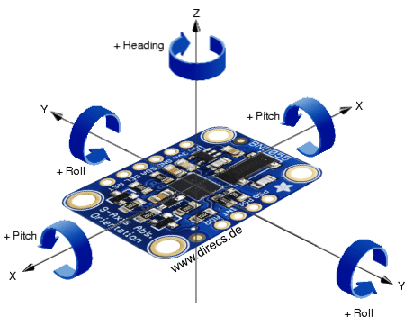 
    </td> 
    <td style="padding: 20px; border: 1px solid #444; vertical-align: top;"> 
      <h4 style="margin-top: 0;">⚡ Especificaciones</h4> 
      <ul> 
        <li><b>Sensor:</b> IMU de 9 grados de libertad (Acelerómetro + Giroscopio + Magnetómetro)</li> 
        <li><b>Procesador interno:</b> ARM Cortex-M0 (Fusión de datos por hardware)</li> 
        <li><b>Librerías de control:</b> Adafruit_BNO055.h, Adafruit_Sensor.h, utility/imumaths.h</li> 
        <li><b>Rango del Giroscopio:</b> ±125 a ±2000 °/s</li> 
        <li><b>Modos de Operación:</b> NDF, IMU, COMPASS, M4G, NDF_FMC_OFF, NDOF</li> 
        <li><b>Protocolo de comunicación:</b> I2C (Wire.h) / UART</li> 
        <li><b>Voltaje de operación:</b> 3.3V - 5V (mediante regulador integrado en Vin)</li> 
      </ul> 
    </td> 
  </tr> 
</table> 

<p style="margin-top: 15px;"> 
  El <b>BNO055</b> es el sistema de orientación absoluta inercial de nuestro robot. A diferencia de un giroscopio tradicional, integra un microcontrolador de 32 bits que ejecuta algoritmos de fusión de sensores en tiempo real. Esto permite obtener ángulos de Euler directos y cuaterniones para medir el eje Z (yaw) sin sobrecargar el procesador principal, garantizando trayectorias completamente rectas y giros de alta precisión.
</p> 

<p><b>¿Por qué decidimos usar este sensor y las librerías de Adafruit?</b></p> 

<ul> 

  <li><b>Fusión de Datos Inteligente (Sensor Fusion):</b> Al combinar acelerómetro, giroscopio y magnetómetro de forma interna, calcula la orientación absoluta eliminando prácticamente todo el "drift" (deriva) de forma automática.</li> 

  <li><b>Ahorro de Carga de Procesamiento:</b> Las librerías <b>Adafruit_BNO055.h</b> y <b>utility/imumaths.h</b> entregan vectores matemáticos listos (grados o radianes) mediante estructuras directas de tipo vector o cuaternión, sin requerir cálculos complejos de filtros complementarios o de Kalman en el ESP32.</li> 

  <li><b>Integración Directa con PID:</b> Los datos limpios de orientación alimentan nuestro algoritmo PID, permitiendo correcciones instantáneas frente a desvío de trayectoria, deslizamientos en pista o perturbaciones mecánicas.</li> 

</ul> 

> [!TIP] 
> - El BNO055 cuenta con un sistema de autocalibración constante para sus tres sensores (System, Gyro, Accel, Mag) clasificado del 0 al 3. 
> - Puedes guardar los datos de offsets de calibración directamente en la memoria Flash o EEPROM del ESP32 tras la ronda de práctica. Al iniciar en competencia, el código recupera los offsets al instante, logrando una preparación inmediata sin esperar tiempos prolongados de calibración en la línea de salida.

> [!WARNING] 
> - Asegúrate de que el sensor no esté expuesto a interferencias magnéticas fuertes (motores de alta potencia muy cercanos sin blindaje), ya que el magnetómetro integrado podría afectar temporalmente la precisión del yaw si se opera en modo NDOF. 
> - En caso de requerir máxima estabilidad en entornos con ruido magnético, se recomienda configurar el sensor en modo **IMU** (utilizando solo Acelerómetro + Giroscopio para la fusión).

<p><b>Gestión Avanzada en el Desafío Cerrado:</b></p> 

<p>Dada la exigencia de navegación en la WRO, implementamos una gestión optimizada de datos inerciales con el BNO055:</p> 

<ul> 

  <li><b>Persistencia de Offsets en Memoria:</b> La librería nos permite extraer la estructura de datos `adafruit_bno055_offsets_t` e inyectarla al reiniciar. El robot inicia operativo en milisegundos sin requerir rutinas de movimiento previas.</li> 

  <li><b>Compensación Dinámica:</b> Validamos la integridad de las lecturas mediante la verificación de estado (`getSystemStatus`), asegurando que si ocurre una desconexión o caída de voltaje, el código ejecute un restablecimiento controlado del bus I2C.</li> 

  <li><b>Dead-Band Control:</b> Mantenemos una "banda muerta" de sensibilidad para evitar que ligeras vibraciones del chasis transmitidas al sensor generen oscilaciones o correcciones innecesarias en el servo de dirección.</li> 

</ul> 

<p><b>Pines y Conexiones (I2C):</b></p> 

<table width="100%" style="border: 1px solid #444; border-collapse: collapse;"> 
  <thead style="background-color: rgba(255, 255, 255, 0.1);"> 
    <tr> 
      <th style="padding: 10px; border: 1px solid #444;">Pin BNO055</th> 
      <th style="padding: 10px; border: 1px solid #444;">Pin ESP32</th> 
      <th style="padding: 10px; border: 1px solid #444;">Descripción</th> 
    </tr> 
  </thead> 
  <tbody> 
    <tr> 
      <td style="padding: 10px; border: 1px solid #444; text-align: center;"><b>Vin / VCC</b></td> 
      <td style="padding: 10px; border: 1px solid #444; text-align: center;">3.3V / 5V</td> 
      <td style="padding: 10px; border: 1px solid #444;">Alimentación del módulo (regulada internamente).</td> 
    </tr> 
    <tr> 
      <td style="padding: 10px; border: 1px solid #444; text-align: center;"><b>GND</b></td> 
      <td style="padding: 10px; border: 1px solid #444; text-align: center;">GND</td> 
      <td style="padding: 10px; border: 1px solid #444;">Tierra común del sistema.</td> 
    </tr> 
    <tr> 
      <td style="padding: 10px; border: 1px solid #444; text-align: center;"><b>SCL</b></td> 
      <td style="padding: 10px; border: 1px solid #444; text-align: center;">GPIO 22</td> 
      <td style="padding: 10px; border: 1px solid #444;">Línea de reloj del bus I2C.</td> 
    </tr> 
    <tr> 
      <td style="padding: 10px; border: 1px solid #444; text-align: center;"><b>SDA</b></td> 
      <td style="padding: 10px; border: 1px solid #444; text-align: center;">GPIO 21</td> 
      <td style="padding: 10px; border: 1px solid #444;">Línea de datos del bus I2C.</td> 
    </tr> 
  </tbody> 
</table> 

<p align="right">
  <a href="#inicio">Volver Al Inicio</a>
</p>

<br>
<hr>

### 3.1.6 **HuskyLens 2**

<table style="border: 1px solid #444; border-collapse: collapse; width: 100%;">
  <tr style="background-color: rgba(255, 255, 255, 0.05);">
    <td width="350px" align="center" style="padding: 20px; border: 1px solid #444;">
      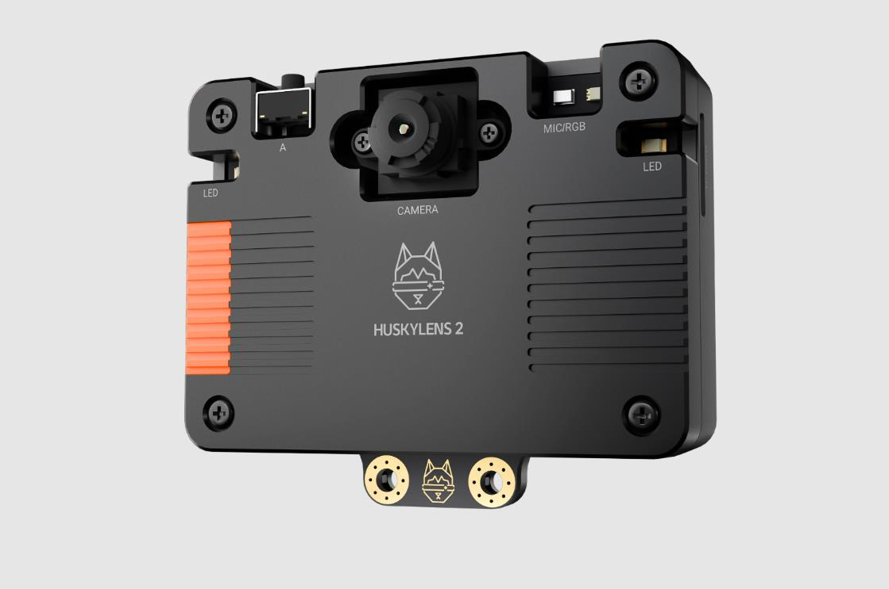
    </td>
    <td style="padding: 20px; border: 1px solid #444; vertical-align: top;">
      <h4 style="margin-top: 0;">⚡ Especificaciones</h4>
      <ul>
        <li><b>Librería utilizada:</b> DFRobot_HuskylensV2.h</li>
        <li><b>Procesador AI:</b> Kendryte K210 (Dual-Core RISC-V 64-bit).</li>
        <li><b>Sensor y Pantalla:</b> OV2640 (2.0 Megapíxeles) con pantalla IPS de 2.0" (320x240).</li>
        <li><b>Consumo de corriente:</b> ~230 mA @ 5V (máximo con pantalla encendida).</li>
        <li><b>Interfaces:</b> UART, I2C.</li>
        <li><b>Algoritmos integrados:</b> Reconocimiento de color, seguimiento de objetos, AprilTags, reconocimiento facial.</li>
        <li><b>Tasa de baudios (UART):</b> 115200 bps (configurable).</li>
      </ul>
    </td>
  </tr>
</table>

<p style="margin-top: 15px;">
  La <b>HuskyLens 2</b> es el "ojo" inteligente de nuestro robot y constituye una cámara de visión artificial con inteligencia artificial integrada. Resulta ideal para la detección rápida y fiable de los bloques del desafío cerrado. A diferencia de las soluciones basadas en cámaras genéricas, la HuskyLens 2 procesa imágenes <b>onboard</b> gracias a su coprocesador K210, liberando al procesador principal (ESP32) de tareas intensivas y permitiendo que <b>Heimdall</b> tome decisiones en milisegundos. Además, cuenta con una pantalla integrada y un enfoque de "aprender por demostración" mediante botones físicos, lo que simplifica enormemente el entrenamiento en la pista sin necesidad de conectarla a una computadora.
</p>

> [!TIP]
> - Aprovecha la pantalla integrada en las rondas de práctica para verificar visualmente que la cámara está enmarcando correctamente los bloques antes de iniciar la carrera.
> - Si cambian de lado en la pista, utiliza el botón de aprendizaje rápido de la cámara para registrar los colores nuevamente bajo la nueva iluminación.

> [!WARNING]
> - A veces, por más de que hayas configurado bien la cámara, si no vuelves a calibrar los colores en la ronda de práctica, los reflejos o cambios drásticos en la luz del recinto pueden causar falsos negativos.

<p><b>¿Por qué decidimos usar esta cámara?:</b></p>

<ul>
  <li><b>Gestión de IDs con DFRobot_HuskylensV2.h:</b> Mediante la librería oficial para esta versión, accedemos a los datos de visión estructurados. En nuestro código, el <b>ID 1</b> detecta bloques verdes y el <b>ID 2</b> bloques rojos, permitiendo diferenciar la dirección de esquiva necesaria al instante.</li>
  <li><b>Filtrado por Tamaño (Umbrales):</b> Implementamos umbrales específicos evaluando las variables de ancho y alto del objeto detectado (<code>result.width</code> y <code>result.height</code>). Solo cuando el bloque ocupa el tamaño suficiente en pantalla, el robot lo considera un obstáculo cercano y no ruido de fondo, iniciando la maniobra de evasión.</li>
  <li><b>Depuración Visual Directa:</b> La pantalla IPS nos permite ver en tiempo real qué está detectando el algoritmo (con cuadros delimitadores), lo que resulta invaluable en un entorno competitivo donde el tiempo de ajuste es limitado.</li>
  <li><b>Independencia de Procesamiento:</b> El ESP32 solo recibe paquetes de datos por UART con las coordenadas (X, Y) y el ID, dedicando su potencia íntegramente al control PID de los motores y la lectura del giroscopio.</li>
</ul>

<p><b>¿Por qué UART en lugar de I2C?:</b></p>

<p>
  La decisión entre usar el protocolo <b>UART</b> o <b>I2C</b> para la HuskyLens 2 fue un paso clave en la arquitectura de hardware. Decidimos utilizar UART para mantener la cámara en un canal de comunicación punto a punto dedicado (Hardware Serial), asegurando una transferencia constante de <i>frames</i> de datos y dejando el bus I2C del ESP32 completamente libre y exclusivo para la lectura de alta velocidad del giroscopio BNO055.
</p>

<table width="100%" style="border: 1px solid #444; border-collapse: collapse; margin: 20px 0;">
  <thead>
    <tr style="background-color: rgba(88, 166, 255, 0.1);">
      <th style="padding: 10px; border: 1px solid #444; text-align: left;">Parámetro</th>
      <th style="padding: 10px; border: 1px solid #444; text-align: left;">Protocolo UART</th>
      <th style="padding: 10px; border: 1px solid #444; text-align: left;">Protocolo I2C</th>
    </tr>
  </thead>
  <tbody>
    <tr>
      <td style="padding: 10px; border: 1px solid #444;"><b>Topología</b></td>
      <td style="padding: 10px; border: 1px solid #444;"><b>Punto a punto</b> (Dedicado)</td>
      <td style="padding: 10px; border: 1px solid #444;">Bus compartido (Múltiples esclavos)</td>
    </tr>
    <tr>
      <td style="padding: 10px; border: 1px solid #444;"><b>Tipo de Enlace</b></td>
      <td style="padding: 10px; border: 1px solid #444;">Full-Duplex (RX y TX simultáneos)</td>
      <td style="padding: 10px; border: 1px solid #444;">Half-Duplex</td>
    </tr>
    <tr>
      <td style="padding: 10px; border: 1px solid #444;"><b>Gestión de Hardware</b></td>
      <td style="padding: 10px; border: 1px solid #444;">Previene cuellos de botella con otros sensores</td>
      <td style="padding: 10px; border: 1px solid #444;">Puede retrasar lecturas del giroscopio</td>
    </tr>
  </tbody>
</table>

> [!WARNING]
> ☑️ **Elige UART si:** Necesitas un canal dedicado que no interfiera con otros sensores críticos de la pista (como el BNO055).
> 
> ☑️ **Elige UART si:** Quieres aprovechar los puertos Hardware Serial adicionales (Serial2) del ESP32 para una lectura ininterrumpida.

<p><b>Otras razones por las cuales el protocolo UART nos resultó favorable en Heimdall:</b></p>
<ul>
  <li><b>Independencia de Buses:</b> Si un sensor en el bus I2C falla o se desconecta por vibraciones, la cámara seguirá transmitiendo por UART sin colgar el sistema.</li>
  <li><b>Buffer de Hardware:</b> El ESP32 maneja el buffer UART eficientemente en segundo plano, evitando la pérdida de paquetes de datos de la cámara.</li>
  <li><b>Simplicidad de Cableado:</b> Solo requiere cruzar TX y RX, sin necesidad de calcular resistencias <i>pull-up</i> adicionales en placas perforadas.</li>
</ul>

<p><b>Lógica de Posicionamiento:</b></p>
<p>
  Dividimos el campo visual (resolución de 320x240) en tres sectores (Izquierda, Centro, Derecha) comparando la coordenada <code>result.xCenter</code> del bloque con un umbral central (aprox. <code>160</code>). Esto permite que el robot sepa no solo qué color ve (ID), sino exactamente dónde está el obstáculo en su campo visual para decidir si debe realizar una <b>esquiva preventiva suave</b> o una <b>maniobra de evasión completa</b>.
</p>

<p><b>Conexión de Pines (Hardware Serial 2):</b></p>

<table width="100%" style="border: 1px solid #444; border-collapse: collapse;">
  <thead style="background-color: rgba(255, 255, 255, 0.1);">
    <tr>
      <th style="padding: 10px; border: 1px solid #444;">Pin HuskyLens 2</th>
      <th style="padding: 10px; border: 1px solid #444;">Pin ESP32 (UART2)</th>
      <th style="padding: 10px; border: 1px solid #444;">Función</th>
    </tr>
  </thead>
  <tbody>
    <tr>
      <td style="padding: 10px; border: 1px solid #444; text-align: center;"><b>TX (Transmisión)</b></td>
      <td style="padding: 10px; border: 1px solid #444; text-align: center;">GPIO 16 (RX2)</td>
      <td style="padding: 10px; border: 1px solid #444;">Envía los datos de los bloques detectados al ESP32.</td>
    </tr>
    <tr>
      <td style="padding: 10px; border: 1px solid #444; text-align: center;"><b>RX (Recepción)</b></td>
      <td style="padding: 10px; border: 1px solid #444; text-align: center;">GPIO 17 (TX2)</td>
      <td style="padding: 10px; border: 1px solid #444;">Recibe peticiones de lectura desde el ESP32.</td>
    </tr>
    <tr>
      <td style="padding: 10px; border: 1px solid #444; text-align: center;"><b>5V / VCC</b></td>
      <td style="padding: 10px; border: 1px solid #444; text-align: center;">VIN / 5V</td>
      <td style="padding: 10px; border: 1px solid #444;">Alimentación principal de la cámara.</td>
    </tr>
    <tr>
      <td style="padding: 10px; border: 1px solid #444; text-align: center;"><b>GND</b></td>
      <td style="padding: 10px; border: 1px solid #444; text-align: center;">GND</td>
      <td style="padding: 10px; border: 1px solid #444;">Referencia común de tierra.</td>
    </tr>
  </tbody>
</table>

<p align="right">
  <a href="#inicio">Volver Al Inicio</a>
</p>

<br>
<hr>

###  Configuración para Entrenamiento de Detección de Colores
  
  <tr style="background-color: rgba(255, 255, 255, 0.05);">
    <td align="left" style="padding: 20px; border: 1px solid #444;">
    <p><i>Interfaz de la Huskylens durante el entrenamiento de deteccion de color.</i></p>
      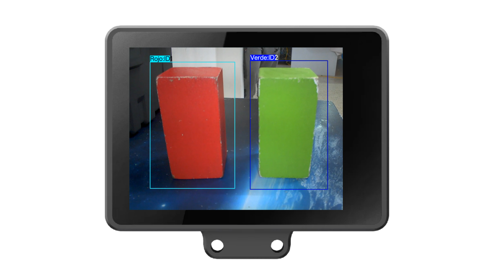
    </td>
  </tr>

<br>
<table style="width: 100%; border-collapse: collapse; border: 1px solid #30363d;">
  <!-- FILA SUPERIOR: SECCIONES 1 Y 3 -->
  <tr>
    <td valign="top" style="width: 50%; padding: 15px; border-bottom: 1px solid #30363d; border-right: 1px solid #30363d;">
      <h4 style="margin-top: 0; color: #58a6ff;">1. Inicio y Encuadre Inicial</h4>
      <ul>
        <li><b>Selección de Algoritmo:</b> Deslizar en la pantalla táctil de la HuskyLens 2 hasta posicionar la interfaz en la función <b>Color Recognition</b>.</li>
        <li><b>Enfoque por Marcador Central:</b> Apuntar la cámara de modo que la cruz blanca central (<b>+</b>) coincida exactamente sobre la superficie o bloque a reconocer.</li>
        <li><b>Pre-detección Dinámica:</b> Observar el recuadro blanco que la cámara genera automáticamente alrededor del tono delimitado por la cruz central.</li>
      </ul>
    </td>
    <td valign="top" style="width: 50%; padding: 15px; border-bottom: 1px solid #30363d;">
      <h4 style="margin-top: 0; color: #58a6ff;">3. Calibración y Filtrado de Pista</h4>
      <ul>
        <li><b>Tolerancia de Color (Detection Threshold):</b> Ajustar la barra deslizante según las condiciones de iluminación. Un valor más alto incrementa la exigencia de pureza de color, reduciendo falsos positivos causados por sombras o reflejos.</li>
        <li><b>Filtrado de Área (Color Block Area Threshold):</b> Aumentar el umbral de superficie mínima en píxeles para ignorar destellos lejanos, sombras de la pista o ruido visual de menor tamaño que el objeto objetivo.</li>
      </ul>
    </td>
  </tr>
  <!-- FILA INFERIOR: SECCIONES 2 Y 4 -->
  <tr>
    <td valign="top" style="width: 50%; padding: 15px; border-right: 1px solid #30363d;">
      <h4 style="margin-top: 0; color: #58a6ff;">2. Captura y Clasificación de Firmas</h4>
      <ul>
        <li><b>Aprendizaje de Primera Firma (ID1):</b> Posicionar el marcador sobre el objetivo y presionar el <b>Botón A</b> (esquina superior derecha). El recuadro cambiará a un color sólido con la etiqueta <code>Color: ID1</code>.</li>
        <li><b>Entrenamiento Multicolor (ID2, ID3...):</b> Apuntar la cruz hacia un nuevo bloque de color y presionar nuevamente el <b>Botón A</b> para registrar identificadores adicionales de forma secuencial.</li>
        <li><b>Asignación de Nombres (Set Name):</b> Acceder al parámetro <i>Set Name</i>, elegir el ID correspondiente y utilizar el teclado en pantalla para guardar nombres personalizados (ej: <i>VERDE</i>, <i>ROJO</i>, <i>MAGENTA</i>).</li>
      </ul>
    </td>
    <td valign="top" style="width: 50%; padding: 15px;">
      <h4 style="margin-top: 0; color: #58a6ff;">4. Mantenimiento y Memoria No Volátil</h4>
      <ul>
        <li><b>Resguardo de Modelos (Export Model):</b> Seleccionar la opción <i>Export Model</i> para almacenar el entrenamiento en un slot de memoria interna (Slot 0 al 4). Esto genera los archivos <code>.json</code> y <code>.bin</code> para no perder las firmas al reiniciar el dispositivo.</li>
        <li><b>Depuración de Firmas (Forget ID / Reset):</b> Utilizar <i>Forget ID</i> y apuntar hacia un objeto para eliminar una firma específica, o seleccionar <i>Restore Defaults</i> si se requiere reiniciar la configuración general a valores de fábrica.</li>
      </ul>
    </td>
  </tr>
</table>

<p align="right">
  <a href="#inicio">Volver Al Inicio</a>
</p>

<br>
<hr>

## 3.2 Microcontrolador

### 3.2.1 **ESP32-WROOM-32**

<table style="border: 1px solid #444; border-collapse: collapse; width: 100%;">
  <tr style="background-color: rgba(255, 255, 255, 0.05);">
    <td width="350px" align="center" style="padding: 20px; border: 1px solid #444;">
      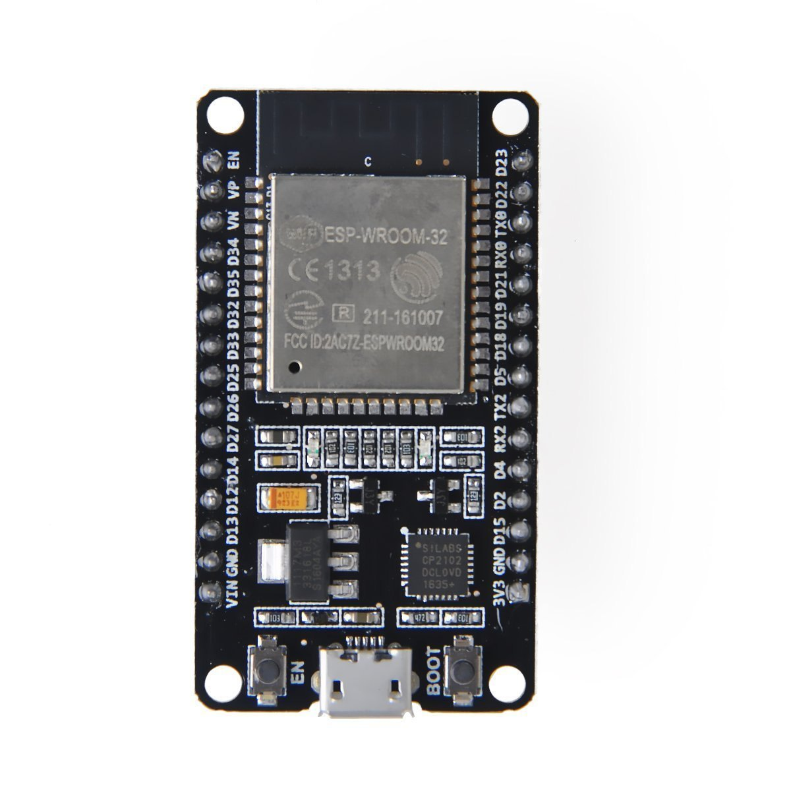
    </td>
    <td style="padding: 20px; border: 1px solid #444; vertical-align: top;">
      <h4 style="margin-top: 0;">⚡ Especificaciones del Módulo</h4>
      <ul>
        <li><b>Módulo:</b> ESP32-WROOM-32 (Integrado con chip ESP32-D0WDQ6).</li>
        <li><b>CPU:</b> Dual-core Xtensa® 32-bit LX6 (hasta 240 MHz).</li>
        <li><b>ROM/SRAM:</b> 448 KB ROM / 520 KB SRAM.</li>
        <li><b>Flash Externa:</b> 4 MB integrados en el módulo.</li>
        <li><b>Cristal Oscilador:</b> 40 MHz integrado.</li>
        <li><b>Seguridad:</b> Aceleradores de hardware para AES, SHA-2, RSA y ECC.</li>
        <li><b>Temperatura de operación:</b> -40°C a +85°C (Ideal para competencia).</li>
      </ul>
    </td>
  </tr>
</table>

<p style="margin-top: 15px;">
  El <b>ESP32-WROOM-32</b> es un potente módulo MCU todo-en-uno que actúa como el cerebro central de <b>Heimdall</b>. Elegimos esta plataforma por su arquitectura de doble núcleo, que permite gestionar procesos multihilo: mientras un núcleo se encarga de la lógica de visión artificial, el otro procesa la lectura de sensores ultrasónicos y el control PID en tiempo real. Su versatilidad lo hace ideal para robótica móvil, permitiendo una programación eficiente mediante Arduino IDE.
</p>

<p><b>Ventajas para nuestro robot Heimdall:</b></p>

<ul>
  <li><b>Arquitectura Dual-Core:</b> Aprovechamos el procesamiento en paralelo para que el control PID del <code>BNO055</code> no se vea interrumpido por la lectura y el procesamiento de visión de la <code>HuskyLens 2</code>.</li>
  <li><b>Gestión de Comunicaciones (UART/I2C):</b> El WROOM-32 expone eficientemente sus periféricos de hardware, permitiendo que la cámara <b>HuskyLens 2</b> y el giroscopio <b>BNO055</b> se comuniquen con el microcontrolador mediante transferencias de datos totalmente independientes y sin cuellos de botella.</li>
  <li><b>Versatilidad PWM (LEDC):</b> La precisión del hardware nos permite controlar el servomotor en el <code>GPIO 2</code> con una resolución de 13 bits, garantizando giros suaves en las curvas del desafío.</li>
</ul>

<p><b>Librerías Esenciales:</b></p>
<p>
  Para que el hardware opere a su máximo potencial, hemos establecido un ecosistema de software basado en librerías específicas que optimizan la comunicación y el control:
</p>

<ul>
  <li><b>Wire.h (Comunicación I²C):</b> Fundamental para establecer el bus de datos con el giroscopio MPU6050. Permite configurar los pines SDA/SCL y gestionar el intercambio de datos mediante el protocolo I²C.</li>
  <li><b>NewPing:</b> Optimiza el uso de los 3 sensores ultrasónicos HC-SR04. Maneja automáticamente los pulsos y reduce errores de eco, permitiendo que el robot evite obstáculos y mantenga la distancia con las paredes de forma precisa.</li>
  <li><b>ESP32Servo.h:</b> Crucial para el manejo del servomotor de dirección. Esta librería adapta los timers PWM específicos del ESP32 para lograr un movimiento angular exacto (0°-180°) en el eje delantero.</li>
  <li><b>DFRobot_HuskylensV2.h:</b> Esencial para la comunicación con la cámara de visión artificial HuskyLens. Permite recibir rápidamente los datos visuales ya procesados por su IA, facilitando la detección de bloques y zonas de estacionamiento sin sobrecargar al ESP32.</li>
  <li><b>Adafruit_BNO055.h / imumaths.h:</b> Fundamentales para el sensor BNO055. Procesan la orientación absoluta y cálculos complejos internamente, entregando un rumbo exacto para asegurar una navegación estable sin requerir filtros manuales.</li>
</ul>

> [!WARNING]
> ☑️ **Niveles Lógicos:** El módulo opera estrictamente a 3.3V. Todos los periféricos de 5V integrados en Heimdall pasan por una etapa de acondicionamiento de señal para proteger las entradas del WROOM-32.

<p><b>Distribución de Pines en Heimdall (Pinout):</b></p>

<table width="100%" style="border: 1px solid #444; border-collapse: collapse;">
  <thead style="background-color: rgba(255, 255, 255, 0.1);">
    <tr>
      <th style="padding: 10px; border: 1px solid #444;">Categoría</th>
      <th style="padding: 10px; border: 1px solid #444;">Componente</th>
      <th style="padding: 10px; border: 1px solid #444;">Pines GPIO</th>
    </tr>
  </thead>
  <tbody>
    <tr>
      <td rowspan="3" style="padding: 10px; border: 1px solid #444; text-align: center;"><b>Control</b></td>
      <td style="padding: 10px; border: 1px solid #444;">Motor Tracción (IN1/IN2)</td>
      <td style="padding: 10px; border: 1px solid #444; text-align: center;">19, 18</td
    </tr>
    <tr>
      <td style="padding: 10px; border: 1px solid #444;">Encoder</td>
      <td style="padding: 10px; border: 1px solid #444; text-align: center;">34, 35</td>
    </tr>
    <tr>
      <td style="padding: 10px; border: 1px solid #444;">Servomotor Dirección</td>
      <td style="padding: 10px; border: 1px solid #444; text-align: center;">2</td>
    </tr>
    <tr>
      <td rowspan="3" style="padding: 10px; border: 1px solid #444; text-align: center;"><b>Ultrasónicos</b></td>
      <td style="padding: 10px; border: 1px solid #444;">Sensor Frontal (Trig: 12 / Echo: 13)</td>
      <td style="padding: 10px; border: 1px solid #444; text-align: center;">12, 13</td>
    </tr>
    <tr>
      <td style="padding: 10px; border: 1px solid #444;">Sensor Izquierdo (Trig: 14 / Echo: 27)</td>
      <td style="padding: 10px; border: 1px solid #444; text-align: center;">14, 27</td>
    </tr>
    <tr>
      <td style="padding: 10px; border: 1px solid #444;">Sensor Derecho (Trig: 25 / Echo: 26)</td>
      <td style="padding: 10px; border: 1px solid #444; text-align: center;">25, 26</td>
    </tr>
    <tr>
      <td rowspan="1" style="padding: 10px; border: 1px solid #444; text-align: center;"><b>UART</b></td>
      <td style="padding: 10px; border: 1px solid #444;">Huskylens2 (RX2: 16, TX2:17)</td>
      <td style="padding: 10px; border: 1px solid #444; text-align: center;">16, 17</td>
    </tr>
    <tr>
      <td rowspan="2" style="padding: 10px; border: 1px solid #444; text-align: center;"><b>I2C  & Sistema</b></td>
      <td style="padding: 10px; border: 1px solid #444;">Giroscopio BNO055 (SDA: 21 / SCL: 22)</td>
      <td style="padding: 10px; border: 1px solid #444; text-align: center;">21, 22</td>
    </tr>
    <tr>
      <td style="padding: 10px; border: 1px solid #444;">Botón de Inicio</td>
      <td style="padding: 10px; border: 1px solid #444; text-align: center;">15</td>
    </tr>
  </tbody>
</table>

<p align="right">
  <a href="#inicio">Volver Al Inicio</a>
</p>

<br>
<hr>

## 3.3 Diagrama de Conexiones

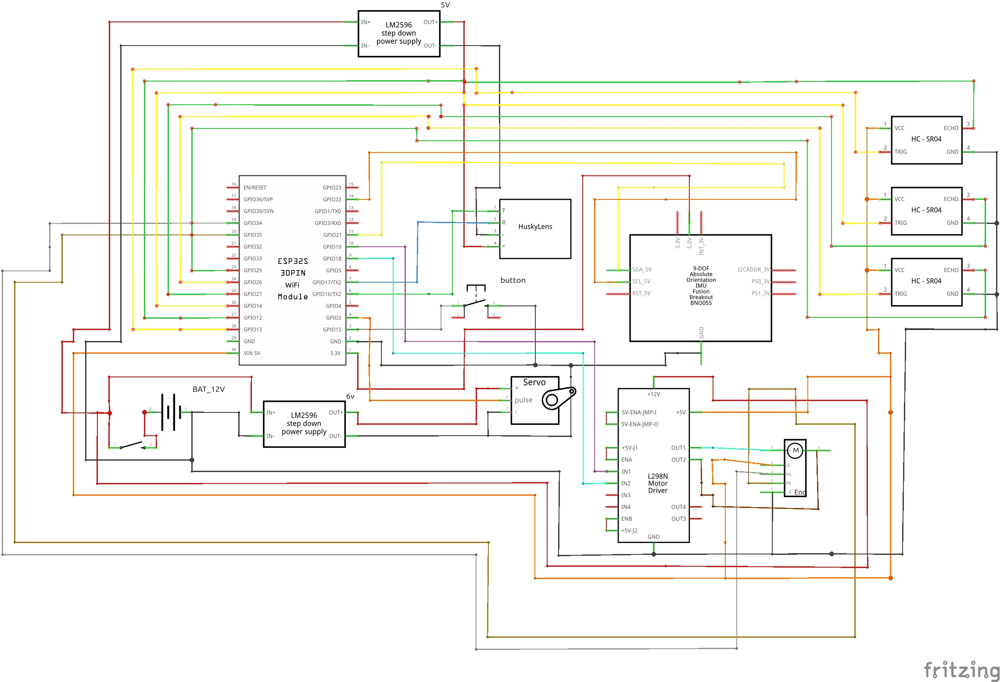

<p align="right">
  <a href="#inicio">Volver Al Inicio</a>
</p>

---

## 3.3.1 Consumo de Energia

<table style="border: 1px solid #444; border-collapse: collapse; width: 100%;">
  <thead>
    <tr style="background-color: rgba(255, 255, 255, 0.08); border-bottom: 2px solid #444;">
      <th style="padding: 12px; border: 1px solid #444; text-align: left;">Componente</th>
      <th style="padding: 12px; border: 1px solid #444; text-align: center;">Cantidad</th>
      <th style="padding: 12px; border: 1px solid #444; text-align: center;">Voltaje</th>
      <th style="padding: 12px; border: 1px solid #444; text-align: center;">Corriente sin Carga</th>
      <th style="padding: 12px; border: 1px solid #444; text-align: center;">Corriente Nominal</th>
      <th style="padding: 12px; border: 1px solid #444; text-align: center;">Corriente Pico</th>
    </tr>
  </thead>
  <tbody>
    <tr>
      <td style="padding: 10px; border: 1px solid #444;"><b>ESP32-WROOM-32</b></td>
      <td style="padding: 10px; border: 1px solid #444; text-align: center;">1</td>
      <td style="padding: 10px; border: 1px solid #444; text-align: center;">5V</td>
      <td style="padding: 10px; border: 1px solid #444; text-align: center;">20 mA</td>
      <td style="padding: 10px; border: 1px solid #444; text-align: center;">100 mA</td>
      <td style="padding: 10px; border: 1px solid #444; text-align: center;">260 mA</td>
    </tr>
    <tr style="background-color: rgba(255, 255, 255, 0.02);">
      <td style="padding: 10px; border: 1px solid #444;"><b>Motor Hytech GA37-520</b></td>
      <td style="padding: 10px; border: 1px solid #444; text-align: center;">1</td>
      <td style="padding: 10px; border: 1px solid #444; text-align: center;">12V</td>
      <td style="padding: 10px; border: 1px solid #444; text-align: center;">10 mA</td>
      <td style="padding: 10px; border: 1px solid #444; text-align: center;">1 A</td>
      <td style="padding: 10px; border: 1px solid #444; text-align: center;">2 A</td>
    </tr>
    <tr>
      <td style="padding: 10px; border: 1px solid #444;"><b>Servo INJORA 180°</b></td>
      <td style="padding: 10px; border: 1px solid #444; text-align: center;">1</td>
      <td style="padding: 10px; border: 1px solid #444; text-align: center;">6V</td>
      <td style="padding: 10px; border: 1px solid #444; text-align: center;">150 mA</td>
      <td style="padding: 10px; border: 1px solid #444; text-align: center;">500 mA</td>
      <td style="padding: 10px; border: 1px solid #444; text-align: center;">1.5 A</td>
    </tr>
    <tr style="background-color: rgba(255, 255, 255, 0.02);">
      <td style="padding: 10px; border: 1px solid #444;"><b>Huskylens2 Cam</b></td>
      <td style="padding: 10px; border: 1px solid #444; text-align: center;">1</td>
      <td style="padding: 10px; border: 1px solid #444; text-align: center;">5V</td>
      <td style="padding: 10px; border: 1px solid #444; text-align: center;">350 mA</td>
      <td style="padding: 10px; border: 1px solid #444; text-align: center;">500 mA</td>
      <td style="padding: 10px; border: 1px solid #444; text-align: center;">600 mA</td>
    </tr>
    <tr>
      <td style="padding: 10px; border: 1px solid #444;"><b>Driver L298N (Lógica)</b></td>
      <td style="padding: 10px; border: 1px solid #444; text-align: center;">1</td>
      <td style="padding: 10px; border: 1px solid #444; text-align: center;">12V</td>
      <td style="padding: 10px; border: 1px solid #444; text-align: center;">30 mA</td>
      <td style="padding: 10px; border: 1px solid #444; text-align: center;">70 mA</td>
      <td style="padding: 10px; border: 1px solid #444; text-align: center;">100 mA</td>
    </tr>
    <tr style="background-color: rgba(255, 255, 255, 0.02);">
      <td style="padding: 10px; border: 1px solid #444;"><b>Ultrasonicos HC-SR04</b></td>
      <td style="padding: 10px; border: 1px solid #444; text-align: center;">3</td>
      <td style="padding: 10px; border: 1px solid #444; text-align: center;">5V</td>
      <td style="padding: 10px; border: 1px solid #444; text-align: center;">5 mA</td>
      <td style="padding: 10px; border: 1px solid #444; text-align: center;">20 mA</td>
      <td style="padding: 10px; border: 1px solid #444; text-align: center;">40 mA</td>
    </tr>
    <tr>
      <td style="padding: 10px; border: 1px solid #444;"><b>Giroscopio BNO055</b></td>
      <td style="padding: 10px; border: 1px solid #444; text-align: center;">1</td>
      <td style="padding: 10px; border: 1px solid #444; text-align: center;">3.3V</td>
      <td style="padding: 10px; border: 1px solid #444; text-align: center;">40 μA</td>
      <td style="padding: 10px; border: 1px solid #444; text-align: center;">12.5 mA</td>
      <td style="padding: 10px; border: 1px solid #444; text-align: center;">15 mA</td>
    </tr>
  </tbody>
</table>

<p align="right">
  <a href="#inicio">Volver Al Inicio</a>
</p>

---

## 4. Apartado de Programacion

## 4.1 Desafio Abierto

* **Objetivo:** El robot autónomo debe completar con éxito **3 vueltas consecutivas** al circuito en el menor tiempo posible, manteniendo un control absoluto de su trayectoria y deteniéndose de forma controlada al finalizar el recorrido.
* **Restricciónes:** Está estrictamente prohibido que el chasis o cualquier componente del robot toque las paredes o los muros internos de la pista. Cualquier impacto o roce continuo puede penalizar la puntuación de la ronda o invalidar el intento.
* **Factores Aleatorios:** Para garantizar que el vehículo no dependa de una ruta preprogramada o fija, se introducen dos variables aleatorias justo antes de iniciar la competencia:
  * **Sentido de la Marcha:** La dirección en la que el carro debe circular (sentido horario o antihorario) se determina al azar.
  * **Dimensiones de la Pista:** Las dimensiones y la geometría de las paredes del circuito se modifican de forma aleatoria, obligando a los sensores (como ultrasonidos, LiDAR o cámaras) a recalcular las distancias y ajustar el centro del carril en tiempo real.

<p align="right">
  <a href="#inicio">Volver Al Inicio</a>
</p>

## 4.1.1 Flowchart Abierta

En este diagrama de flujo se halla una representación gráfica del funcionamiento lógico de nuestra programación, así como de lo que se espera sea el desempeño del robot al inicializar el programa.

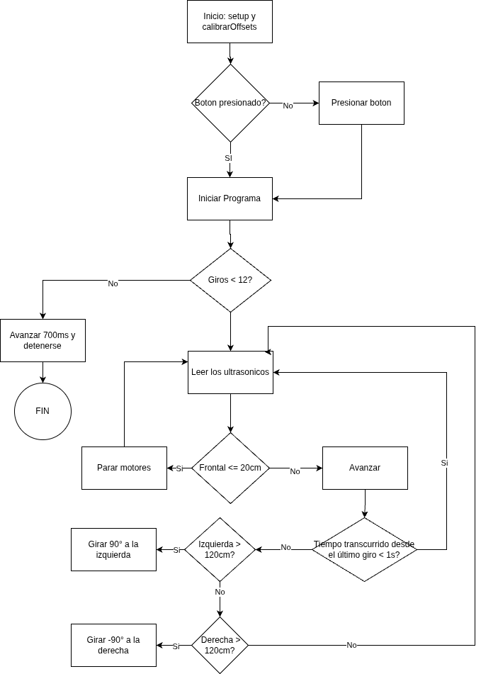

<p align="right">
  <a href="#inicio">Volver Al Inicio</a>
</p>

## 4.1.2 Explicacion del Codigo

<p>Nuestro código implementa una <b>Máquina de Estados Finitos (FSM)</b> que opera en tiempo real de forma asíncrona. La toma de decisiones está diseñada para ejecutarse de manera lineal y estrecha, eliminando los <code>delay()</code> bloqueantes durante el recorrido mediante el uso de <code>millis()</code> y <code>micros()</code> para garantizar una respuesta ultrarrápida del IMU (<b>BNO055</b>) y de los sensores ultrasónicos.</p>

<p>A continuación, se explica detalladamente cómo funciona cada bloque del código, abarcando las variables de control, los estados de navegación, las lecturas sensoriales y las rutinas de evasión del robot:</p>

<hr/>

<details style="border: 1px solid #ddd; padding: 15px; border-radius: 6px; margin-bottom: 15px; background-color: #fafafa;">
  <summary style="font-weight: bold; cursor: pointer; font-size: 1.1em;">1. Librerías, Definición de Pines y Parámetros</summary>
  <div style="margin-top: 10px;">
    <p>Se declaran las librerías necesarias, la asignación física de pines en el ESP32, las instancias para los sensores ultrasónicos y la IMU, así como las constantes de calibración de dirección y banderas de estado.</p>

```cpp
#include <Wire.h>
#include <NewPing.h>
#include <ESP32Servo.h>
#include <Adafruit_Sensor.h>
#include <Adafruit_BNO055.h>
#include <utility/imumaths.h>

// Pins sensores ultrasónicos
#define USTFRONT 13
#define USEFRONT 12
#define USTLEFT 14
#define USELEFT 27
#define USTRIGHT 26
#define USERIGHT 25
#define MAX_DISTANCE 357

// Pins motor, servo y botón
#define IN2 19
#define IN1 18
#define PIN_SERVO 2
#define PIN_BOTON 15

// Objetos
NewPing USFRONT(USTFRONT, USEFRONT, MAX_DISTANCE);
NewPing USLEFT(USTLEFT, USELEFT, MAX_DISTANCE);
NewPing USRIGHT(USTRIGHT, USERIGHT, MAX_DISTANCE);

Servo myservo;
Adafruit_BNO055 bno = Adafruit_BNO055(55, 0x28, &Wire);

// Variables de medición BNO055
float anguloZ = 0;
float anguloFiltrado = 0;
float anguloMagnetometro = 0;
float anguloGiroscopio = 0;
unsigned long lastTimeBNO = 0;
bool bnoListo = false;

// Variables de giro acumulado
float anguloAcumulado = 0;
float anguloObjetivoRelativo = 0;
float anguloInicioGiroRelativo = 0;

// Configuración de ángulos de giro asimétricos
const float ANGULO_GIRO_IZQUIERDA = 86.0;
const float ANGULO_GIRO_DERECHA = 71.3;

// Constantes de distancia y tiempos
const int DISTANCIA_OBSTACULO_FRONTAL = 40;
const int DISTANCIA_OBSTACULO_LATERAL = 120;
const unsigned long TIEMPO_ESPERA_GIRO = 700;
const int MAX_GIROS = 12;
const float AJUSTE_GIRO_RETROCESO = 0.2;
const int GRADOS_MAX_RETROCESO = 80;

// Compensación y ángulos de servo
const int COMPENSACION_CENTRO_IZQUIERDA = 0;
const int CENTRO_BASE = 94;
const int ANGULO_SERVO_IZQ = 120;
const int ANGULO_SERVO_DER = 60;
int centroServoActual = CENTRO_BASE;

// Variables de estado (FSM)
bool programaIniciado = false;
bool finalizado = false;
bool girando = false;
bool enAvanceFinal = false;
bool giroIzquierda = false;
bool retrocediendo = false;
bool retrocesoRealizado = false;
bool recalculandoGiro = false;
bool obstaculoFrontalConfirmado = false;

unsigned long tiempoUltimoGiro = 0;
unsigned long tiempoInicioFinal = 0;
unsigned long tiempoInicioRetroceso = 0;
unsigned long tiempoInicioFrontal = 0;
int contadorGiros = 0;
int lecturasFrontales = 0;

float anguloObjetivo = 0;
float gyro = 0;
float anguloInicioGiro = 0;
float anguloOriginal = 0;
float anguloNecesario = 0;
float errorAcumulado = 0;
```

  <p><b>Explicación:</b> Asigna los recursos de hardware e inicializa los parámetros clave. Se configuran ángulos de viraje asimétricos (86.0° a la izquierda y 71.3° a la derecha) para absorber desviaciones o holguras mecánicas de la dirección, junto con los límites de distancia ultrasónica (40 cm frontal, 120 cm lateral).</p>
  </div>
</details>

<details style="border: 1px solid #ddd; padding: 15px; border-radius: 6px; margin-bottom: 15px; background-color: #fafafa;">
  <summary style="font-weight: bold; cursor: pointer; font-size: 1.1em;">2. Control e Integración del Sensor BNO055</summary>
  <div style="margin-top: 10px;">
   <p>Funciones encargadas del arranque, lectura vectorial, filtrado complementario e integración del ángulo acumulado a partir de la velocidad angular del giroscopio.</p>

```cpp
bool iniciarBNO055() {
  Serial.println("Inicializando BNO055...");
  
  Wire.begin(21, 22);
  Wire.setClock(400000);
  
  delay(2000);
  
  for (int intento = 0; intento < 10; intento++) {
    Serial.print("Intento ");
    Serial.print(intento + 1);
    Serial.print("/10... ");
    
    if (bno.begin()) {
      Serial.println("OK");
      bno.setExtCrystalUse(true);
      bno.setMode(OPERATION_MODE_COMPASS);
      
      uint8_t system, gyro, accel, mag;
      bno.getCalibration(&system, &gyro, &accel, &mag);
      Serial.print("Estado: S:");
      Serial.print(system);
      Serial.print(" G:");
      Serial.print(gyro);
      Serial.print(" A:");
      Serial.print(accel);
      Serial.print(" M:");
      Serial.println(mag);
      
      sensors_event_t event;
      bno.getEvent(&event);
      anguloMagnetometro = event.orientation.x;
      if (anguloMagnetometro > 180) anguloMagnetometro -= 360;
      
      anguloZ = -anguloMagnetometro;
      anguloFiltrado = anguloZ;
      anguloGiroscopio = anguloZ;
      lastTimeBNO = micros();
      
      anguloAcumulado = 0;
      
      return true;
    }
    
    Serial.println("FALLÓ");
    delay(500);
  }
  
  return false;
}

void actualizarBNO() {
  if (!bnoListo) return;
  
  imu::Vector<3> gyro = bno.getVector(Adafruit_BNO055::VECTOR_GYROSCOPE);
  
  sensors_event_t event;
  bno.getEvent(&event);
  anguloMagnetometro = event.orientation.x;
  if (anguloMagnetometro > 180) anguloMagnetometro -= 360;
  
  unsigned long ahora = micros();
  float dt = (ahora - lastTimeBNO) / 1000000.0;
  lastTimeBNO = ahora;
  
  if (dt > 0 && dt < 0.1) {
    anguloGiroscopio += gyro.z() * dt;
    
    anguloFiltrado = 0.95 * (anguloFiltrado + gyro.z() * dt) + 0.05 * (-anguloMagnetometro);
    if (anguloFiltrado > 180) anguloFiltrado -= 360;
    if (anguloFiltrado < -180) anguloFiltrado += 360;
    
    anguloZ = anguloFiltrado;
  }
}

float getGyro() {
  actualizarBNO();
  return anguloZ;
}

float getAnguloRelativo() {
  imu::Vector<3> gyro = bno.getVector(Adafruit_BNO055::VECTOR_GYROSCOPE);
  
  unsigned long ahora = micros();
  float dt = (ahora - lastTimeBNO) / 1000000.0;
  lastTimeBNO = ahora;
  
  if (dt > 0 && dt < 0.1) {
    anguloAcumulado += gyro.z() * dt;
  }
  
  return anguloAcumulado;
}

void resetearAnguloAcumulado() {
  anguloAcumulado = 0;
  Serial.println("Ángulo acumulado resetado a 0");
}

float normalizarError(float error) {
  if (error > 180) error -= 360;
  if (error < -180) error += 360;
  return error;
}
```

 <p><b>Explicación:</b> El IMU se configura en <code>OPERATION_MODE_COMPASS</code> sobre I2C a 400 kHz. Para evitar discontinuidades al cruzar los 180° o 360° durante los giros, <code>getAnguloRelativo()</code> realiza la integración continua diferencial del eje Z mediante lecturas precisas en microsegundos (<code>micros()</code>).</p>
  </div>
</details>

<details style="border: 1px solid #ddd; padding: 15px; border-radius: 6px; margin-bottom: 15px; background-color: #fafafa;">
  <summary style="font-weight: bold; cursor: pointer; font-size: 1.1em;">3. Drivers de Tracción, Dirección y Ultrasonidos</summary>
  <div style="margin-top: 10px;">
    <p>Funciones básicas que abstraen el control físico del motor DC (mediante puente H), posición del servomotor de dirección y lecturas procesadas por la librería NewPing.</p>

```cpp
void motorAdelante() {
  digitalWrite(IN1, HIGH);
  digitalWrite(IN2, LOW);
}

void motorRetroceder() {
  digitalWrite(IN1, LOW);
  digitalWrite(IN2, HIGH);
}

void motorParar() {
  digitalWrite(IN1, LOW);
  digitalWrite(IN2, LOW);
}

void servoCentro() {
  if (girando || retrocediendo || enAvanceFinal) {
    myservo.write(CENTRO_BASE);
  } else {
    myservo.write(centroServoActual);
  }
}

void actualizarCentroServo(bool giroFueIzquierda) {
  if (giroFueIzquierda) {
    centroServoActual = CENTRO_BASE + COMPENSACION_CENTRO_IZQUIERDA;
    Serial.printf("Centro para RECTA ajustado a %d\n", centroServoActual);
  } else {
    centroServoActual = CENTRO_BASE;
    Serial.printf("Centro para RECTA restaurado a %d\n", centroServoActual);
  }
}

int leerUltrasonico(NewPing &sensor) {
  int d = sensor.ping_cm();
  if (d == 0) return -1;
  return d;
}

int correccionServo(float error) {
  float ae = abs(error);
  
  if (ae > 35) return 25;
  if (ae > 20) return 15;
  if (ae > 10) return 8;
  return 4;
}

void Adelante() {
  motorAdelante();
  servoCentro();
}

void Parar() {
  motorParar();
}
```

  <p><b>Explicación:</b> La función <code>correccionServo()</code> aplica un algoritmo de escalonamiento proporcional por tramos según la magnitud del error angular acumulado. Permite correcciones suaves cuando el robot está cerca del ángulo meta y giros pronunciados ante desvíos grandes.</p>
  </div>
</details>

<details style="border: 1px solid #ddd; padding: 15px; border-radius: 6px; margin-bottom: 15px; background-color: #fafafa;">
  <summary style="font-weight: bold; cursor: pointer; font-size: 1.1em;">4. Inicialización de Giros (iniciarGiroIzquierda / Derecha)</summary>
  <div style="margin-top: 10px;">
    <p>Rutinas que capturan la referencia angular inicial antes de entrar al estado de rotación y asignan el servomotor a su valor límite máximo.</p>
    
```cpp
void iniciarGiroIzquierda() {
  float anguloActual = getAnguloRelativo();
  anguloInicioGiroRelativo = anguloActual;
  anguloOriginal = ANGULO_GIRO_IZQUIERDA;
  anguloObjetivoRelativo = anguloActual + ANGULO_GIRO_IZQUIERDA;
  
  giroIzquierda = true;
  girando = true;
  retrocediendo = false;
  retrocesoRealizado = false;
  recalculandoGiro = false;
  obstaculoFrontalConfirmado = false;
  lecturasFrontales = 0;
  
  myservo.write(ANGULO_SERVO_IZQ);
  motorAdelante();
  
  Serial.printf("Inicio giro IZQUIERDA: Actual: %.1f° | Objetivo: %.1f°\n", 
                anguloActual, anguloObjetivoRelativo);
}

void iniciarGiroDerecha() {
  float anguloActual = getAnguloRelativo();
  anguloInicioGiroRelativo = anguloActual;
  anguloOriginal = ANGULO_GIRO_DERECHA;
  anguloObjetivoRelativo = anguloActual - ANGULO_GIRO_DERECHA;
  
  giroIzquierda = false;
  girando = true;
  retrocediendo = false;
  retrocesoRealizado = false;
  recalculandoGiro = false;
  obstaculoFrontalConfirmado = false;
  lecturasFrontales = 0;
  
  myservo.write(ANGULO_SERVO_DER);
  motorAdelante();
  
  Serial.printf("Inicio giro DERECHA: Actual: %.1f° | Objetivo: %.1f°\n", 
                anguloActual, anguloObjetivoRelativo);
}
```

  <p><b>Explicación:</b> Guarda el <code>anguloInicioGiroRelativo</code>, resetea banderas de obstáculo e inmediatamente inclina la dirección (120° izquierda o 60° derecha) para iniciar la curva en la FSM sin pausar los motores de tracción.</p>
  </div>
</details>

<details style="border: 1px solid #ddd; padding: 15px; border-radius: 6px; margin-bottom: 15px; background-color: #fafafa;">
  <summary style="font-weight: bold; cursor: pointer; font-size: 1.1em;">5. Control Angular y Retroceso Defensivo (actualizarGiro)</summary>
  <div style="margin-top: 10px;">
    <p>Controlador no bloqueante de rotación que supervisa el ángulo alcanzado, realiza filtros de confirmación frontal y ejecuta retrocesos defensivos si hay colisión inminente.</p>

```cpp
void actualizarGiro() {
  float anguloActual = getAnguloRelativo();

  float error = anguloObjetivoRelativo - anguloActual;
  int corr = correccionServo(error);
  
  float gradosGirados = abs(anguloActual - anguloInicioGiroRelativo);

  int frontal = leerUltrasonico(USFRONT);
  
  if (frontal != -1 && frontal <= DISTANCIA_OBSTACULO_FRONTAL) {
    lecturasFrontales++;
    
    if (lecturasFrontales >= 3 || (millis() - tiempoInicioFrontal > 200 && lecturasFrontales > 0)) {
      obstaculoFrontalConfirmado = true;
    }
    
    if (lecturasFrontales == 1) {
      tiempoInicioFrontal = millis();
    }
  } else {
    if (lecturasFrontales > 0) {
      lecturasFrontales--;
    }
    if (lecturasFrontales == 0) {
      obstaculoFrontalConfirmado = false;
      tiempoInicioFrontal = 0;
    }
  }

  static unsigned long lastPrint = 0;
  if (millis() - lastPrint > 200) {
    Serial.printf("Angulo: %.1f° | Objetivo: %.1f° | Error: %.1f° | Girados: %.1f° | Servo: %d°\n",
                  anguloActual, anguloObjetivoRelativo, error, gradosGirados, myservo.read());
    lastPrint = millis();
  }

  // ========== LÓGICA DE RETROCESO ==========
  if (!retrocesoRealizado && !recalculandoGiro && 
      obstaculoFrontalConfirmado && 
      gradosGirados < GRADOS_MAX_RETROCESO && 
      !retrocediendo) {
    
    Serial.printf("OBSTACULO FRONTAL A %dcm - Retrocediendo\n", frontal);
    
    float anguloFaltante = anguloOriginal - gradosGirados;
    float anguloConAjuste = anguloFaltante - AJUSTE_GIRO_RETROCESO;
    
    if (giroIzquierda) {
      anguloNecesario = anguloActual + anguloConAjuste;
    } else {
      anguloNecesario = anguloActual - anguloConAjuste;
    }
    
    retrocediendo = true;
    retrocesoRealizado = true;
    recalculandoGiro = true;
    tiempoInicioRetroceso = millis();
    motorParar();
    myservo.write(CENTRO_BASE);
    delay(50);
    motorRetroceder();
    
    Serial.printf("Ángulo faltante: %.1f° | Nuevo objetivo: %.1f°\n", anguloFaltante, anguloNecesario);
    return;
  }
  
  if (retrocediendo) {
    myservo.write(CENTRO_BASE);
    
    if (millis() - tiempoInicioRetroceso < 800) {
      motorRetroceder();
      return;
    } else {
      retrocediendo = false;
      Serial.println("Retroceso completado");
      
      anguloObjetivoRelativo = anguloNecesario;
      
      Serial.printf("Reanudando giro con nuevo objetivo: %.1f°\n", anguloObjetivoRelativo);
      
      if (giroIzquierda) {
        myservo.write(ANGULO_SERVO_IZQ);
      } else {
        myservo.write(ANGULO_SERVO_DER);
      }
      motorAdelante();
      return;
    }
  }

  // ========== DURANTE EL GIRO ==========
  if (abs(error) <= 4) {
    motorParar();
    myservo.write(CENTRO_BASE);
    girando = false;
    retrocesoRealizado = false;
    recalculandoGiro = false;
    obstaculoFrontalConfirmado = false;
    lecturasFrontales = 0;
    contadorGiros++;
    tiempoUltimoGiro = millis();

    actualizarCentroServo(giroIzquierda);

    Serial.printf("Giro completado. Conteo: %d/%d\n", contadorGiros, MAX_GIROS);

    if (contadorGiros >= MAX_GIROS) {
      enAvanceFinal = true;
      tiempoInicioFinal = millis();
    }
    return;
  }

  if (error > 0) {
    myservo.write(CENTRO_BASE + corr);
  } else {
    myservo.write(CENTRO_BASE - corr);
  }

  motorAdelante();
}
```

  <p><b>Explicación:</b> Si durante una curva el sensor frontal detecta una pared antes de superar los 80° de giro, confirma la presencia (3 lecturas o 200 ms) y conmuta a la maniobra defensiva: centra la dirección, marcha atrás durante 800 ms, recalcula el ángulo restante descontando <code>AJUSTE_GIRO_RETROCESO</code> y reanuda el giro dinámicamente hasta alcanzar una tolerancia final de $|Error| \le 4^\circ$.</p>
  </div>
</details>

<details style="border: 1px solid #ddd; padding: 15px; border-radius: 6px; margin-bottom: 15px; background-color: #fafafa;">
  <summary style="font-weight: bold; cursor: pointer; font-size: 1.1em;">6. Setup, Loop Principal y Estacionamiento (setup / loop / actualizarFinal)</summary>
  <div style="margin-top: 10px;">
    <p>Punto de entrada del sistema, bucle asíncrono FSM y secuencia de finalización tras completar el recorrido del circuito.</p>

```cpp
void actualizarFinal() {
  motorAdelante();
  if (millis() - tiempoInicioFinal >= 100) {
    Parar();
    myservo.write(CENTRO_BASE);
    enAvanceFinal = false;
    finalizado = true;
    Serial.println("Giros completados - Robot detenido");
  }
}

// ===== SETUP =====
void setup() {
  Serial.begin(115200);
  Serial.println("\n");
  Serial.println("=========================================");
  Serial.println("ROBOT CON BNO055 - ÁNGULO RELATIVO");
  Serial.println("=========================================");
  Serial.printf("Giro IZQUIERDA: %.1f°\n", ANGULO_GIRO_IZQUIERDA);
  Serial.printf("Giro DERECHA: %.1f°\n", ANGULO_GIRO_DERECHA);
  Serial.println("=========================================");
  Serial.println();

  pinMode(PIN_BOTON, INPUT_PULLUP);
  pinMode(IN1, OUTPUT);
  pinMode(IN2, OUTPUT);

  myservo.attach(PIN_SERVO);
  centroServoActual = CENTRO_BASE;
  myservo.write(CENTRO_BASE);

  bnoListo = iniciarBNO055();
  if (!bnoListo) {
    Serial.println("ERROR: BNO055 no detectado");
    while (1) delay(10);
  }
  Serial.println("BNO055 listo");

  resetearAnguloAcumulado();

  Parar();
  delay(3000);
  Serial.println("Esperando pulsar boton para iniciar...");
}

// ===== LOOP =====
void loop() {
  if (!programaIniciado) {
    if (digitalRead(PIN_BOTON) == LOW) {
      programaIniciado = true;
      Serial.println("Boton presionado, iniciando programa...");
      delay(300);
    }
    return;
  }

  if (finalizado) {
    Parar();
    return;
  }

  if (enAvanceFinal) {
    actualizarFinal();
    return;
  }

  if (girando) {
    actualizarGiro();
    return;
  }

  int frontal = leerUltrasonico(USFRONT);
  int izquierda = leerUltrasonico(USLEFT);
  int derecha = leerUltrasonico(USRIGHT);

  static unsigned long lastPrint = 0;
  if (millis() - lastPrint > 500) {
    Serial.printf("Frontal: %d | Izquierda: %d | Derecha: %d\n", frontal, izquierda, derecha);
    lastPrint = millis();
  }

  if (frontal != -1 && frontal <= DISTANCIA_OBSTACULO_FRONTAL) {
    Parar();
    return;
  }

  Adelante();

  if (millis() - tiempoUltimoGiro < TIEMPO_ESPERA_GIRO) {
    return;
  }

  if (izquierda != -1 && izquierda > DISTANCIA_OBSTACULO_LATERAL) {
    Serial.println("Girando a la izquierda por espacio libre");
    iniciarGiroIzquierda();
    return;
  }

  if (derecha != -1 && derecha > DISTANCIA_OBSTACULO_LATERAL) {
    Serial.println("Girando a la derecha por espacio libre");
    iniciarGiroDerecha();
    return;
  }
}
```

  <p><b>Explicación:</b> El <code>loop()</code> actúa como orquestador de prioridades. Una vez iniciado por el botón, evalúa de mayor a menor jerarquía: finalización del programa, parqueo final, estado de giro inercial, frenado de emergencia por pared frontal y, por último, detección de huecos libres laterales (>120 cm) para desencadenar giros tras superar el tiempo de inmunidad posterior al viraje (700 ms).</p>
  </div>
</details>

<p align="right">
  <a href="#inicio">Volver Al Inicio</a>
</p>

---

## 4.2 Desafio Cerrado

* **Objetivo:** El robot autónomo debe completar **3 vueltas al circuito** esquivando señales de tráfico representadas por pilares de colores. El robot debe procesar la información visual e interactuar con los obstáculos bajo las siguientes reglas de tránsito:
  * **Pilares Rojos:** Indican una restricción de paso por la izquierda. El robot debe esquivarlos obligatoriamente manteniéndose por el **lado derecho** del carril.
  * **Pilares Verdes:** Indican una restricción de paso por la derecha. El robot debe esquivarlos obligatoriamente manteniéndose por el **lado izquierdo** del carril.
* **Maniobra de Estacionamiento Autónomo:** Una vez completada la tercera vuelta, el vehículo debe salir del bucle de carrera, localizar de manera autónoma la zona de aparcamiento (parking area) asignada y ejecutar una maniobra para estacionarse por completo. 
* **Restricciones de Parqueo:** El carro debe quedar estático dentro del espacio delimitado sin tocar ninguna de las barreras o líneas que rodean el área de estacionamiento.
* **Factores Aleatorios:** Al igual que en el reto abierto, tanto la dirección de la marcha como la ubicación exacta y el orden de los pilares de colores en la pista se configuran de manera completamente aleatoria antes de cada intento, poniendo a prueba la robustez del algoritmo de detección.

## 4.2.1 Flowchart Cerrada

En este diagrama de flujo se halla una representación gráfica del funcionamiento lógico de nuestra programación, así como de lo que se espera sea el desempeño del robot al inicializar el programa.

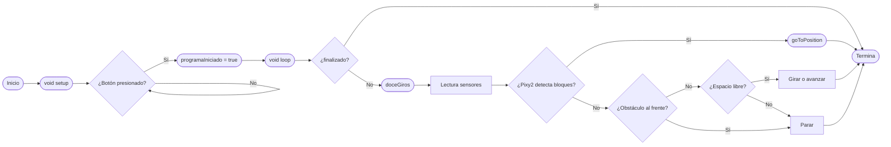
```mermaid
flowchart LR
    A([Inicio]) --> B([void setup])
    B --> C{¿Botón presionado?}
    C -- No --> C
    C -- Sí --> D([programaIniciado = true])
    D --> E([void loop])
    E --> F{¿finalizado?}
    F -- Sí --> G([Termina])
    F -- No --> H([doceGiros])
    H --> I[Lectura sensores]
    I --> J{¿Pixy2 detecta bloques?}
    J -- Sí --> K([goToPosition])
    J -- No --> L{¿Obstáculo al frente?}
    L -- No --> M{¿Espacio libre?}
    M -- Sí --> N[Girar o avanzar]
    M -- No --> O[Parar]
    L -- Sí --> O
    K --> G
    N --> G
    O --> G
```

## 4.2.2 Explicacion del Codigo
Desafío Cerrado - Análisis de Componentes Clave
1. Sistema de Comunicación Dual SPI
cpp

// VSPI para Pixy2 (alto rendimiento)
#define VSPI_MISO 19
#define VSPI_MOSI 23  
#define VSPI_SCK  18

// HSPI para SD (compatibilidad)
#define HSPI_MISO 39
#define HSPI_MOSI 32  
#define HSPI_SCK  33

SPIClass hspi(HSPI);  // Segundo bus SPI independiente

Arquitectura:

    VSPI: Bus rápido para Pixy2 (necesita alta velocidad)

    HSPI: Bus separado para SD (evita interferencias)

    Los buses trabajan independientemente

2. Máquina de Estados
cpp

enum Estado {
  DETENIDO,                   // 0 - Inactivo
  AVANZAR,                    // 1 - Navegación normal
  ESQUIVAR_VERDE_IZQ,         // 2 - Esquiva bloque verde izquierda
  ESQUIVAR_ROJO_DER,          // 3 - Esquiva bloque rojo derecha
  ESQUIVA_PREVENTIVA_VERDE_DER, // 4 - Esquiva preventiva
  ESQUIVA_PREVENTIVA_ROJO_IZQ, // 5 - Esquiva preventiva
  // ... más estados
};

Transiciones de estado:

    Cada estado representa un comportamiento específico

    Las transiciones dependen de sensores y temporizadores

    Permite comportamiento complejo mediante estados simples

3. Control PID con Giroscopio
cpp

const float kP = 1.3;   // Ganancia proporcional
const float kI = 0.01;  // Ganancia integral  
const float kD = 0.11;  // Ganancia derivativa

void aplicarCorreccionGiroscopio() {
  mpu.update();
  float anguloRaw = mpu.getAngleZ();
  float anguloZ = anguloRaw - offsetAngleZ;  // Aplica calibración
  float error = -anguloZ;  // Error es la desviación del cero
  
  // Cálculo PID
  float deltaTime = (currentTime - prevTime) / 1000.0;
  integralError += error * deltaTime;
  float derivative = (error - prevError) / deltaTime;
  float output = kP * error + kI * integralError + kD * derivative;
  
  // Aplicar corrección al servo
  int correccion = ANGULO_CENTRO + (int)output;
  correccion = constrain(correccion, ANGULO_MIN, ANGULO_MAX);
  myservo.write(correccion);
}

Componentes PID:

    Proporcional (kP): Corrección proporcional al error actual

    Integral (kI): Corrige error acumulado (deriva gradual)

    Derivativo (kD): Amortigua oscilaciones (cambios bruscos)

4. Detección de Colores con Pixy2
cpp

void leerPixy() {
  digitalWrite(SD_CS, HIGH);  // Desactiva SD
  delay(2);
  digitalWrite(PIXY_CS, LOW); // Activa Pixy2
  delay(2);
  
  pixy.ccc.getBlocks();  // Obtiene bloques detectados
  
  digitalWrite(PIXY_CS, HIGH); // Desactiva Pixy2
  delay(2);
  
  if (pixy.ccc.numBlocks) {
    for (int i = 0; i < pixy.ccc.numBlocks; i++) {
      int centroX = pixy.ccc.blocks[i].m_x;
      int area = pixy.ccc.blocks[i].m_width * pixy.ccc.blocks[i].m_height;
      
      // Determina posición relativa
      if (centroX < mitadPantalla - UMBRAL_CENTRO_PIXY) {
        posicionBloqueX = -1; // Izquierda
      } else if (centroX > mitadPantalla + UMBRAL_CENTRO_PIXY) {
        posicionBloqueX = 1;  // Derecha
      } else {
        posicionBloqueX = 0;  // Centro
      }
      
      // Clasifica por color
      if (pixy.ccc.blocks[i].m_signature == 1) { // Verde
        bloqueVerdeDetectado = true;
        bloqueVerdeCercano = (area > UMBRAL_TAMANO_BLOQUE_VERDE);
      }
    }
  }
}

Procesamiento de visión:

    m_x: Posición horizontal del objeto (0-315)

    m_width/m_height: Dimensiones del objeto detectado

    m_signature: Código de color (1=verde, 2=rojo)

    El área determina si el objeto está cerca

5. Sistema de Esquivas
cpp

case ESQUIVAR_VERDE_IZQ:
  tiempoFaseActual = millis() - tiempoInicioManiobra;
  
  if (tiempoFaseActual < TIEMPO_ESQUIVA_PRIMARIA_VERDE) {
    // Fase 1: Giro inicial
    myservo.write(ANGULO_CENTRO + ANGULO_ESQUIVA_PRIMARIO);
    avanzar();
  } else if (tiempoFaseActual < TIEMPO_ESQUIVA_PRIMARIA_VERDE + TIEMPO_RECTA_ENTRE_GIROS) {
    // Fase 2: Avance recto
    myservo.write(ANGULO_CENTRO);
    avanzar();
  } else if (tiempoFaseActual < TIEMPO_ESQUIVA_VERDE) {
    // Fase 3: Corrección
    myservo.write(ANGULO_CENTRO - ANGULO_ESQUIVA_SECUNDARIO);
    avanzar();
  } else {
    // Finaliza esquiva
    estadoActual = POST_ESQUIVA_VERDE;
    tiempoInicioManiobra = millis();
  }
  break;

Secuencia de esquiva:

    Giro evasivo: Aleja del obstáculo

    Avance recto: Distancia de seguridad

    Recuperación: Vuelve a la trayectoria

    Post-esquiva: Ajustes finales

6. Gestión de Memoria y Calibración
cpp

bool guardarCalibracion(float offset) {
  File archivo = SD.open("/calibracion.txt", FILE_WRITE);
  archivo.printf("offset: %.8f\n", offset);
  archivo.printf("angulo_inicial: %.8f\n", anguloInicial);
  archivo.close();
}

bool cargarCalibracion(float &offset) {
  File archivo = SD.open("/calibracion.txt");
  String contenido = archivo.readString();
  // Parsea offset y ángulo inicial
  archivo.close();
  
  // Verifica validez
  float diferencia = abs(anguloActual - anguloInicial);
  if (diferencia > 15.0) return false; // Calibración inválida
}

Persistencia de calibración:

    Guarda offset del giroscopio en SD

    Verifica integridad al cargar

    Ajusta automáticamente si hay pequeñas desviaciones

7. Control de Tiempos y Sincronización
cpp

unsigned long tiempoInicioManiobra = 0;
unsigned long tiempoFaseActual = 0;

// En cada estado:
tiempoFaseActual = millis() - tiempoInicioManiobra;

if (tiempoFaseActual < TIEMPO_ESQUIVA_PRIMARIA_VERDE) {
  // Fase 1 activa
} else if (tiempoFaseActual < TIEMPO_ESQUIVA_PRIMARIA_VERDE + TIEMPO_RECTA_ENTRE_GIROS) {
  // Fase 2 activa
}

Sistema temporal:

    millis(): Tiempo desde inicio (no se resetea)

    tiempoInicioManiobra: Marca cuando comenzó el estado actual

    tiempoFaseActual: Duración en el estado actual

    Permite transiciones temporizadas precisas

Esta arquitectura permite un control robusto y adaptable para el desafío cerrado, combinando percepción visual, control de movimiento preciso y gestión de estados complejos.


#### Comunicacion

- **Lenguaje principal:** C+
- **Comunicación:** Dual SPI, Serial Communication, UART
---

## 5. Randomizador

Para optimizar nuestro rendimiento en la pista y asegurar la adaptabilidad del robot, el Team Valgrind ha desarrollado un randomizador de la pista de la categoria Futuros Ingenieros de la WRO 2026. En el Desafío Abierto, genera de forma totalmente aleatoria el cuadrado central y el sentido de orientacion y en el Desafío Cerrado genera los bloques de tráfico y el estacionamiento de una forma aleatoria, permitiendo un mejor desempeño en la pista al darnos diferentes ejemplos para poder practicar. Puedes encontrar mas informacion del Randomizador aca:

- [Randomizador](https://github.com/yosoycrix/Valrepo-WRO-2026/blob/main/others/randomizador/README.md)

---

## 6. Recursos para Hacer el Robot

| Componente | Cantidad | Link |
|------------|-----------|----------------|
| ESP32 WROOM 32 Microcontroller | 1 | [Amazon](https://www.amazon.com/-/es/DIYables-ESP-WROOM-32-desarrollo-microcontrolador-compatible/dp/B0DRBKM49W?th=1) |
| Huskylens2 (Huskylens2) | 1 | [DFROBOT](https://www.dfrobot.com/product-2995.html) |
| Servomotor INJORA 180° (Injora 2065) | 1 | [Amazon](https://www.amazon.com/-/es/INJORA-digital-impermeable-voltaje-Sub-Micro/dp/B0BLBMVYCW?th=1) |
| Motor Hytech GA37-520 12V con Encoder | 1 | [Amazon](https://www.amazon.com.mx/velocidad-inteligente-GA37-520-3V6V12V24V-engranado/dp/B0CWTW8NGN) |
| Tenergy 12V 2000mAh NiMH Battery Pack | 1 | [Amazon](https://www.amazon.com/-/es/Tenergy-bater%C3%ADas-capacidad-recargable-bricolaje/dp/B077Y9HNTF?th=1) |
| Sensor de Ultrasonido | 3 | [Amazon](https://www.amazon.com/-/es/HC-SR04-ultras%C3%B3nico-distancia-transmisor-compatible/dp/B07PFCVM9D) |
| Giroscopio (BNO055 / IMU) | 1 | [Adafruit](https://www.adafruit.com/product/2472) |
| Step Down Voltage Regulator | 2 | [Amazon](https://www.amazon.com/-/es/Seloky-convertidores-estabilizador-electr%C3%B3nico-alimentaci%C3%B3n/dp/B0DBVYP91F?th=1) |
| Motor Driver Module | 1 | [Amazon](https://www.amazon.com/-/es/BOJACK-H-puente-controlador-Inteligente-Potencia/dp/B0C5JCF5RS) |
| Tornillos, Tuercas de Seguridad y Arandelas M2 | Various | [Amazon](https://www.amazon.com/-/es/Fgruh-tornillos-hexagonal-arandelas-niquelado/dp/B0FGV5K8BT?th=1) |
| Tornillos, Tuercas de Seguridad y Arandelas M3 | Various | [Amazon](https://www.amazon.com/-/es/Fgruh-tornillos-M3-hexagonal-arandelas/dp/B0FGX859K8?th=1) |
| Filamento para Impresión 3D (Chasis/Diferencial) | 1–3 | [Amazon](https://www.amazon.com/-/es/SUNLU-PLA-filamento-3D-dimensional/dp/B07XG3RM58?th=1) |

**Impresora Usada:**

- [Qidi Tech Q2](https://www.amazon.com/QIDI-Enclosed-Filtration-Leveling-270x270x256mm/dp/B0G399G3WB?th=1)
---

> _¿Quieres contribuir o seguir nuestro avance? Síguenos en nuestras redes oficiales y revisa este repositorio para novedades y recursos_
