# Equipo [Team ValGrind]: WRO 2026


---

<a name="inicio"></a>

# Índice

- [1. Nuestro Equipo](#1-nuestro-equipo)
  - [1.1 Integrantes](#11-integrantes)
  - [1.2 Origenes](#12-origenes)
  - [1.3 Nuestro Objetivo](#13-nuestro-objetivo)
- [2. El Robot](#2-el-robot)
  - [2.1 Videos del Robot](#21-videos-del-robot)
  - [2.2 Apartado Mecanico](#22-apartado-mecanico)
  - [2.3 Impresion 3D](#23-Impresion-3d)
  - [2.4 Movilidad](#24-movilidad)
  - [2.5 Sistema de Movimiento y Traccion](#25-sistema-de-movimiento-y-traccion)
  - [2.6 Piezas de Mecanica](#26-piezas-de-mecanica)
    - [2.6.1 Diferencial y Eje de transmision](#261-diferencial-y-eje-de-transmisión-impreso-en-3d)
    - [2.6.2 Servomotor](#262-servomotor-injora-180)
    - [2.6.3 Motor](#263-motor-hytech-ga37-520)
    - [2.6.4 Tornillos, Tuercas y Arandelas](#264-tornillos-tuercas-de-seguridad-y-arandelas-m2-y-m3)
- [3. Apartado Electronico](#3-apartado-electronico)
  - [3.1 Piezas de Electronica](#31-piezas-de-electronica)
    - [3.1.1 Baterias](#311-baterias)
    - [3.1.2 Step Down](#312-step-down)
    - [3.1.3 Motor Driver](#313-motor-driver)
    - [3.1.4 Ultrasonico](#314-sensor-de-ultrasonido)
    - [3.1.5 Giroscopio](#315-giroscopio)
    - [3.1.6 Huskylens](#316-huskylens-2)
  - [3.2 Microcontrolador](#32-microcontrolador)
    - [3.2.2 ESP32](#322-esp32-wroom-32)
  - [3.3 Diagrama de Conexiones](#33-diagrama-de-conexiones)
    - [3.3.1 Distribucion de Pines](#331-distribucion-de-pines)
    - [3.3.2 Gestion de Energia](#332-gestion-de-energia)
    - [3.3.3 Sistema de Alimetacion](#333-sistema-de-alimentacion)
- [4. Apartado de Programacion](#4-apartado-de-programacion)
  - [4.1 Desafio Abierto](#41-desafio-abierto)
    - [4.1.1 Flowchart Abierta](#411-flowchart-abierta)
    - [4.1.2 Explicación del Codigo](#412-explicacion-del-codigo)
    - [4.1.3 Pruebas en Pista](#413-pruebas-en-pista)
  - [4.2 Desafio Cerrado](#42-desafio-cerrado)
    - [4.2.1 Flowchart Cerrada](#421-flowchart-cerrada)
    - [4.2.2 Explicación del Codigo](#422-explicacion-del-codigo)
    - [4.2.3 Pruebas de Esquivamiento](#423-pruebas-de-esquivamiento)
- [5. Randomizador](#5-Randomizador)
- [6. Recursos para armar nuestro robot](#6-recursos-para-hacer-el-robot)


---

## Estructura del Repositorio
- [T-photos/](https://github.com/yosoycrix/Valrepo-WRO-2026/tree/main/t-photos) - Fotos del Team
- [V-photos/](https://github.com/yosoycrix/Valrepo-WRO-2026/tree/main/v-photos) - Fotos del Robot
- [Schemes/](https://github.com/yosoycrix/Valrepo-WRO-2026/tree/main/schemes) - Eschematic diagrams
- [Src/](https://github.com/yosoycrix/Valrepo-WRO-2026/tree/main/src) - Codigo
- [Models/](https://github.com/yosoycrix/Valrepo-WRO-2026/tree/main/models) - Diseños 3D
- [Others/](https://github.com/yosoycrix/Valrepo-WRO-2026/tree/main/others) - Otros archivos
- [Videos/](https://github.com/yosoycrix/Valrepo-WRO-2026/tree/main/videos) - Videos
- [Images/](https://github.com/yosoycrix/Valrepo-WRO-2026/tree/main/images) - Imagenes
      
---

## 1. Nuestro Equipo


Somos **[Team ValGrind]**, entusiastas de la robótica y la innovación. Representamos a nuestra institución en las fases Regionales de la **WRO 2026**.

---

### 1.1 Integrantes

<table>
  <tr>
    <!-- Foto de Perfil -->
    <td width="280px" align="center" style="border: none;">
      
    </td>
    <!-- Información del Integrante -->
    <td style="border: none; padding-left: 20px; vertical-align: top;">
      <h2>Sebastián Salina</h2>
      <p><b>🎂 Edad:</b> 18 años (22/08/2008)</p>
      <p><b>🎖️ Rol:</b> Capitán / Mecánico del equipo</p>
      <hr>
      <p><b>🛠️ Habilidades:</b></p>
      <ul>
        <li>Estudiante de ing Mecatronica.</li>
        <li>Diseño de piezas en 3D (CAD).</li>
        <li>Tecnico en impresión 3D.</li>
        <li>Mantenimiento y ensamblaje mecánico.</li>
      </ul>
      <p><b>✨ Fun Fact:</b> <i>Una vez imprimió un Pokémon gigante de filamento para Cristóbal.</i></p>
    </td>
  </tr>
</table>

<table>
  <tr>
    <!-- Foto de Perfil -->
    <td width="280px" align="center" style="border: none;">
      
    </td>
    <!-- Información del Integrante -->
    <td style="border: none; padding-left: 20px; vertical-align: top;">
      <h2>Cristobal Mogollón</h2>
      <p><b>🎂 Edad:</b> 16 años (14/07/2010)</p>
      <p><b>🎖️ Rol:</b> Programador / Documentador</p>
      <hr>
      <p><b>💻 Habilidades:</b></p>
      <ul>
        <li>Programación en C++ y Arduino IDE.</li>
        <li>Manejo de la electrónica y sensores.</li>
        <li>Dominio con Git y GitHub.</li>
      </ul>
      <p><b>✨ Fun Fact:</b> <i>Una vez le pidió a Sebastián imprimir un Pokémon gigante de filamento.</i></p>
    </td>
  </tr>
</table>

<table>
  <tr>
    <!-- Foto de Perfil -->
    <td width="280px" align="center" style="border: none;">
      
    </td>
    <!-- Información del Integrante -->
    <td style="border: none; padding-left: 20px; vertical-align: top;">
      <h2>Diego Malaver</h2>
      <p><b>🎂 Edad:</b> 15 años (09/09/2010)</p>
      <p><b>🎖️ Rol:</b> Mecanico / Electronico</p>
      <hr>
      <p><b>⚙️ Habilidades:</b></p>
      <ul>
        <li>Manejo de la Mecanica.</li>
        <li>Manejo de la electrónica.</li>
        <li>Dominio con Github.</li>
      </ul>
      <p><b>✨ Fun Fact:</b> <i>Le prestaron la camisa de Cristobal del equipo y le quedo apretada.</i></p>
    </td>
  </tr>
</table>

- **Institución:** [Colegio Salto Ángel](https://www.instagram.com/colegiosaltoangel)
- **Instagram Oficial:** [@team_valgrind](https://instagram.com/team_valgrind)
- **Contáctanos:** [valgrind2026@gmail.com](mailto:valgrind2026@gmail.com)
- **Youtube:**
[Team ValGrind](https://youtube.com/@teamvalgrind?si=ZJbz7CX9eOX75H2U)

---

### 1.2 Origenes

El nombre de nuestro equipo fue decidido por los tres integrantes a partir de un clásico compilador de C++ llamado de la misma forma, el cual es representado por un logotipo de un dragón hecho con origami. El nombre "ValGrind" también hace referencia a la mitología nórdica debido a las legendarias Valquirias que habitan en este.

 [](https://postimg.cc/gryddns4)


> ### ¿Por qué nuestro robot se llama Heimdall?

Este nombre no solo es un guiño a la mitología mencionada, sino que además corresponde al dios conocido como el guardián de las puertas de Asgard y del puente Bifröst, que conecta los Nueve Mundos. Al ser un personaje imponente, consideramos que es un nombre apropiado para representar a nuestro robot en la WRO.

---  

### 1.3 Nuestro Objetivo

[](https://postimg.cc/t1LyR68v)

#### "Diseñar, Construir y Programar"
 Un robot autónomo capaz de superar los desafíos de la WRO 2026, utilizando innovación y trabajo en equipo para lograr un desempeño sobresaliente en la etapa regional y avanzar a la nacional. Para llegar a esto, hemos pasado los últimos meses diseñando, construyendo, armando y programando nuestro más nuevo proyecto "Heimdall"

 
> [!NOTE]
> La World Robot Olympiad (WRO) es una competencia internacional de robótica educativa que se desarrolla en varias fases, y nuestro equipo lógicamente tiene que comenzar por la fase regional, mediante la cual al ganarla se accede a la Fase Nacional. Cada país organiza su propio torneo clasificatorio, donde equipos de jóvenes compiten en distintas categorías, aplicando conocimientos de robótica y STEAM. Por último, la fase a la cual nuestro equipo quiere llegar es la Final Internacional. Los equipos ganadores de cada país participan en la competencia global, donde enfrentan desafíos más complejos y compiten con representantes de más de 95 países 


Aún así, nuestro único objetivo no es solamente ganar, como un equipo unido también tenemos la convicción de poder crear un robot no solo funcional, sino que llene nuestras expectativas; A pesar de ser intangible nuestro deseo de poder culminar nuestro proyecto como un equipo unido y verlo brillar, también es una meta importante para nosotros.

<p align="right">
  <a href="#inicio">Volver Al Inicio</a>
</p>

---

## 2. El Robot

<table>
  <tr>
    <td align="center">
      <b>Frontal</b><br>
      
    </td>
    <td align="center">
      <b>Posterior</b><br>
      
    </td>
    <td align="center">
      <b>Lado Izquierdo</b><br>
      
    </td>
  </tr>
  <tr>
    <td align="center">
      <b>Lado Derecho</b><br>
      
    </td>
  <td align="center">
  <b>Superior</b><br>
  
</td>
    <td align="center">
      <b>Inferior</b><br>
      
    </td>
  </tr>
</table>

---

## 2.1 Videos Del Robot

<h3 align="left" style="font-size: 1.4em; font-weight: 800; color: #1f2328; margin-bottom: 12px; text-transform: uppercase; letter-spacing: 0.5px;"><strong>Open Challenge</strong></h3>

<section style="display: block; width: 100%;">
  <table align="left" style="border-collapse: collapse; border: none; margin-top: 0px; width: 100%;">
    <tr style="border: none;">
      <td align="center" style="padding: 10px; border: none; width: 50%; vertical-align: top;">
        <a href="https://www.youtube.com/watch?v=DzKUt2QOpJs" target="_blank" style="text-decoration: none; display: inline-block;">
          
          <br />
          <span style="color: #0366d6; font-size: 0.9em; font-weight: 500; display: inline-block; margin-top: 8px;">▶ Video Open Challenge #3</span>
        </a>
      </td>
      <td align="center" style="padding: 10px; border: none; width: 50%; vertical-align: top;">
        <a href="https://www.youtube.com/watch?v=JyEaFMhT2mY" target="_blank" style="text-decoration: none; display: inline-block;">
          
          <br />
          <span style="color: #0366d6; font-size: 0.9em; font-weight: 500; display: inline-block; margin-top: 8px;">▶ Video Open Challenge #4</span>
        </a>
      </td>
    </tr>
  </table>
</section>

<br clear="all" />
<div style="height: 20px;"></div>

<h3 align="left" style="font-size: 1.4em; font-weight: 800; color: #1f2328; margin-bottom: 12px; text-transform: uppercase; letter-spacing: 0.5px;"><strong>Obstacle Challenge</strong></h3>

<section style="display: block; width: 100%;">
  <table align="left" style="border-collapse: collapse; border: none; margin-top: 0px; width: 50%;">
    <tr style="border: none;">
      <td align="center" style="padding: 10px; border: none; width: 100%; vertical-align: top;">
        <a href="https://www.youtube.com/watch?v=xPg1Bdj31Bs" target="_blank" style="text-decoration: none; display: inline-block;">
          
          <br />
          <span style="color: #0366d6; font-size: 0.9em; font-weight: 500; display: inline-block; margin-top: 8px;">▶ Video Obstacle Challenge #1</span>
        </a>
      </td>
    </tr>
  </table>
</section>

<br clear="all" />
<div style="height: 25px;"></div>

---

## 2.2 Apartado Mecanico

### 2.3 Impresion 3D

Antes de hablar de la movilidad o funcionalidad de nuestro robot, primero hay que explicar nuestros métodos de Diseño e Impresión 3D, los cuales se llevaron a cabo mediante Fusion 360


> [!NOTE]
> Fusion 360 es una plataforma de software de modelado 3D, CAD, CAM, CAE y PCB basada en la nube, destinada al diseño y la fabricación de productos. Nos permite diseñar y crear productos de acuerdo a sus especificaciones particulares, garantizando que cada pieza cumpla con los más exigentes criterios de estética, forma, ajuste y funcionalidad. Además, incorpora un conjunto integral de herramientas avanzadas para el diseño de placas de circuito impreso y componentes electrónicos, lo que facilita la conceptualización y materialización de cualquier idea, incluso las más complejas. Al implementar estas funciones, la plataforma optimiza significativamente tanto el tiempo como los costos asociados, asegurando que el proceso de producción se realice de manera eficiente y que las piezas obtenidas sean de la más alta calidad. Nosotros usamos esta herramienta gráfica y de diseño para realizar los diseños del chasis y las piezas personalizadas de nuestro robot.


<h2>2.4 Movilidad</h2>

<p>Ahora bien, ya habiendo dilucidado cómo podemos elegir, diseñar e imprimir las piezas de nuestro robot, hay que asegurarnos de que este cuente con las herramientas necesarias para moverse y evadir los obstáculos de la pista.</p>

<p>Nuestro robot emplea un <strong>sistema de tracción diferencial</strong>, ofreciendo maniobrabilidad precisa para enfrentar los retos del campo de competencia. El sistema de cruces se realiza mediante un servo que ajusta la dirección del robot en intersecciones de forma eficaz. También cabe destacar el hecho de que utilizamos una técnica llamada <strong>Ackermann Positivo</strong> para emplear el sistema de movilidad de nuestro vehículo.</p>

  

> [!NOTE]
 El diferencial de los vehículos, como su nombre lo indica, permite que exista una diferencia en la velocidad de giro entre la rueda interna y la rueda externa del vehículo cuando se da una vuelta o se está girando la dirección. No importa si el vehículo es tracción trasera o delantera, la función es la misma.

  <a href="https://postimg.cc/G4sWpg3Z">
    
  </a>

<hr>

### 2.5 Sistema de Movimiento y Tracción

<p>Ahondando en lo mencionado anteriormente, <em>Heimdall</em> utiliza un <strong>sistema Ackermann positivo</strong>, cuyo objetivo es lograr que en curvas la <strong>rueda interior (&theta;<sub>i</sub>) gire más que la exterior (&theta;<sub>o</sub>)</strong> para minimizar el deslizamiento lateral (<em>scrub</em>) y garantizar un trazo limpio a alta velocidad.</p>

<p align="center">
  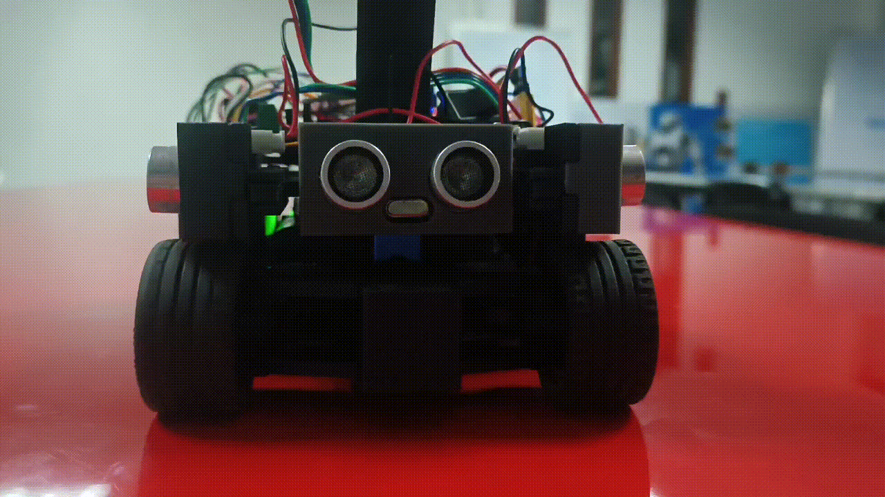
  <br>
  <em><sub style="font-size: 0.85em; color: #8b949e;">Comportamiento dinámico del sistema Ackermann en curva</sub></em>
</p>

<h3>Ecuaciones Fundamentales</h3>

<div style="display: flex; gap: 15px; margin: 15px 0;">
  <div style="flex: 1; background-color: #161b22; border: 1px solid #30363d; border-radius: 6px; padding: 15px;">
    <h4 style="margin-top: 0; color: #58a6ff;">1. Geometría de Giro</h4>
    <p align="center" style="font-size: 1.1em; color: #f0f6fc;">
      $$\cot(\theta_o) - \cot(\theta_i) = \frac{W}{L}$$
    </p>
    <ul style="margin-bottom: 0; padding-left: 20px; font-size: 0.9em; color: #c9d1d9;">
      <li><strong>W:</strong> Ancho de vía (distancia entre pivotes de dirección).</li>
      <li><strong>L:</strong> Batalla (distancia entre ejes).</li>
    </ul>
  </div>

  <div style="flex: 1; background-color: #161b22; border: 1px solid #30363d; border-radius: 6px; padding: 15px;">
    <h4 style="margin-top: 0; color: #58a6ff;">2. Relación de Velocidades</h4>
    <p align="center" style="font-size: 1.1em; color: #f0f6fc;">
      $$\frac{\omega_o}{\omega_i} = \frac{R + W/2}{R - W/2}$$
    </p>
    <ul style="margin-bottom: 0; padding-left: 20px; font-size: 0.9em; color: #c9d1d9;">
      <li><strong>&omega;<sub>o</sub> / &omega;<sub>i</sub>:</strong> Vel. angular rueda exterior / interior.</li>
      <li><strong>R:</strong> Radio de giro al centro del eje posterior.</li>
    </ul>
  </div>
</div>

<div style="display: flex; gap: 15px; margin: 15px 0;">
  <div style="flex: 1; background-color: #161b22; border: 1px solid #30363d; border-radius: 6px; padding: 15px;">
    <h4 style="margin-top: 0; color: #58a6ff;">3. Radio Efectivo de Giro (R)</h4>
    <p align="center" style="font-size: 1.1em; color: #f0f6fc;">
      $$R = \frac{L}{\tan(\delta)} \quad \text{ó} \quad R = \frac{L}{\sin(\delta_i)} - \frac{W}{2}$$
    </p>
    <ul style="margin-bottom: 0; padding-left: 20px; font-size: 0.9em; color: #c9d1d9;">
      <li><strong>R:</strong> Distancia desde el ICR (Centro Instantáneo de Rotación) al centro del eje trasero.</li>
      <li><strong>&delta;:</strong> Ángulo equivalente de rueda equivalente central.</li>
    </ul>
  </div>

  <div style="flex: 1; background-color: #161b22; border: 1px solid #30363d; border-radius: 6px; padding: 15px;">
    <h4 style="margin-top: 0; color: #58a6ff;">4. Ángulo Medio de Dirección (&delta;)</h4>
    <p align="center" style="font-size: 1.1em; color: #f0f6fc;">
      $$\delta = \arctan\left(\frac{2 \cdot L \cdot \sin(\theta_i) \cdot \sin(\theta_o)}{L (\sin(\theta_i) + \sin(\theta_o))}\right)$$
    </p>
    <ul style="margin-bottom: 0; padding-left: 20px; font-size: 0.9em; color: #c9d1d9;">
      <li><strong>&delta;:</strong> Ángulo global de orientación de la trayectoria utilizado por la IMU / Navegación.</li>
    </ul>
  </div>
</div>

<hr style="border-color: #30363d; margin: 25px 0;">

<h3>Rediseño Evolutivo de los Nudillos de Dirección</h3>

<p>
  El diseño mecánico de los nudillos de dirección de <em>Heimdall</em> atravesó una reingeniería clave para corregir fallos estructurales severos detectados durante las pruebas dinámicas.
</p>

<!-- Galería Dinámica - Sistema Anterior -->
<div style="background-color: #161b22; border: 1px solid #f85149; border-radius: 8px; padding: 15px; margin-bottom: 20px;">
  <h4 style="margin-top: 0; color: #f85149; display: flex; align-items: center; gap: 8px;">
    Sistema Anterior: Pivotes Independientes Simulados
  </h4>
  <p style="font-size: 0.95em; color: #c9d1d9; margin-bottom: 12px;">
    Inicialmente, los nudillos se fijaban con dos tornillos de cabeza redondeada independientes para simular el comportamiento de una rótula <i>Rod End</i> y permitir el pivoteo libre. No obstante, las vibraciones y el par del motor desfasaban continuamente estos tornillos de sus alojamientos, provocando que la rueda se saliera por completo del chasis e incapacitara al robot.
  </p>
  <div style="display: flex; gap: 10px; justify-content: center; flex-wrap: wrap;">
    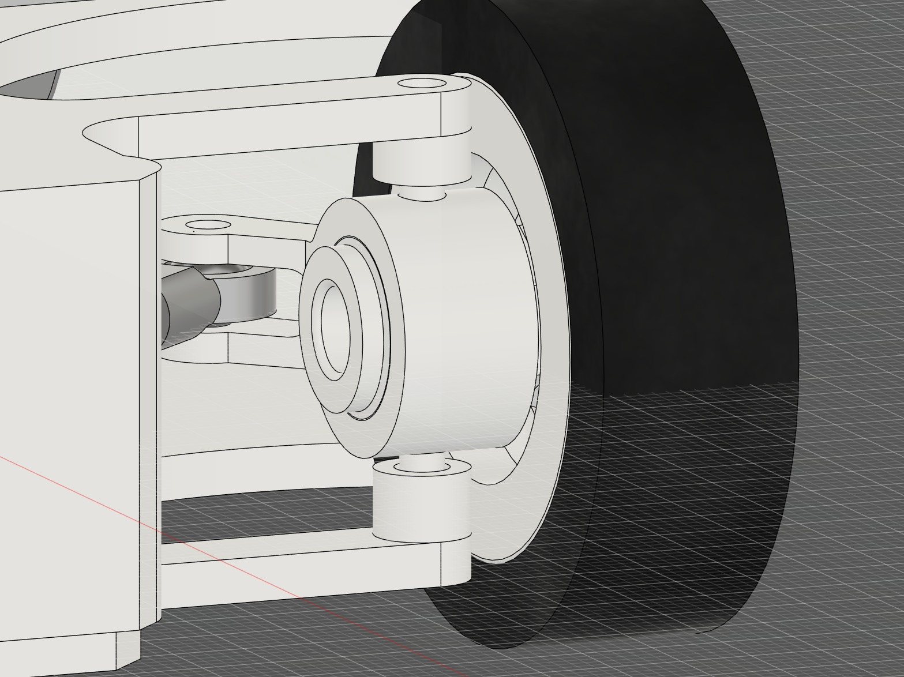
    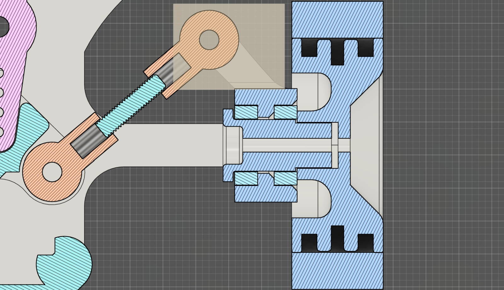
  </div>
</div>

<!-- Galería Dinámica - Sistema Nuevo -->
<div style="background-color: #161b22; border: 1px solid #3fb950; border-radius: 8px; padding: 15px; margin-bottom: 20px;">
  <h4 style="margin-top: 0; color: #3fb950; display: flex; align-items: center; gap: 8px;">
    Sistema Optimizado: Tornillo Pasante Continuo
  </h4>
  <p style="font-size: 0.95em; color: #c9d1d9; margin-bottom: 12px;">
    Se reemplazaron ambos tornillos redondeados por un <b>único tornillo pasante central</b> que atraviesa completamente ambas caras del chasis y el nudillo. Para lograrlo, los rodamientos de la rueda se trasladaron directamente hacia el propio <b>rin/rim</b> (dejando una abertura con perno de sujeción). Esta solución eliminó por completo el juego mecánico, reforzó la rigidez estructural y conservó la fluidez de viraje.
  </p>
  <div style="display: flex; gap: 10px; justify-content: center; flex-wrap: wrap;">
    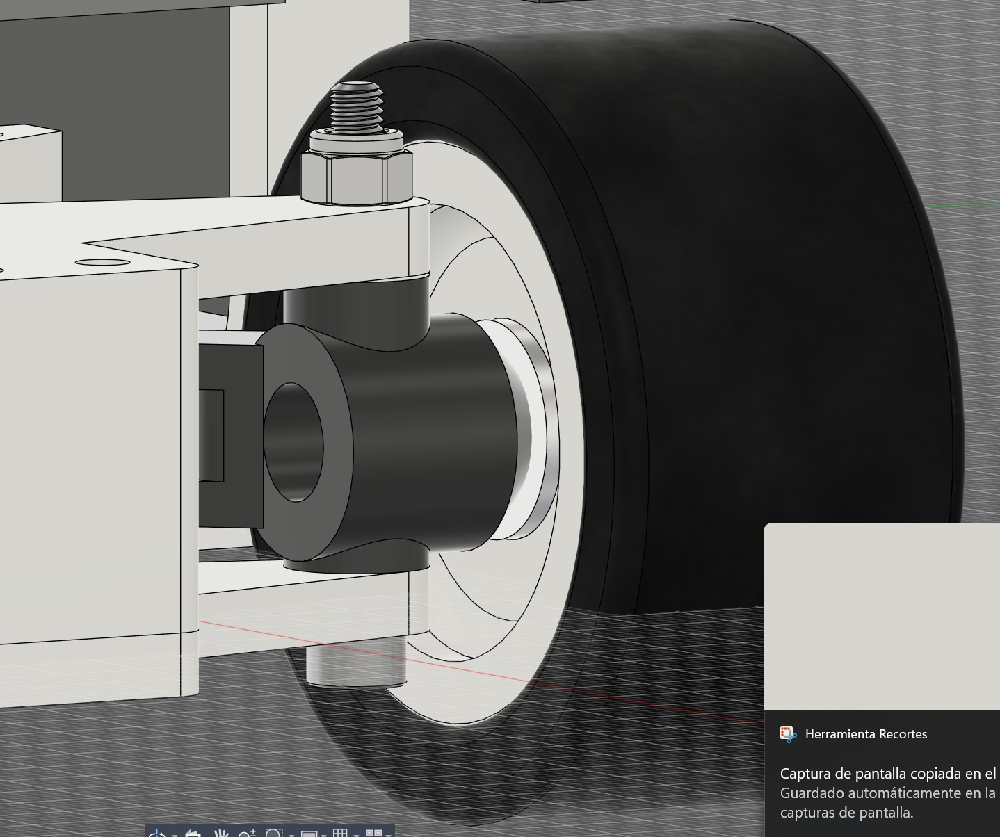
    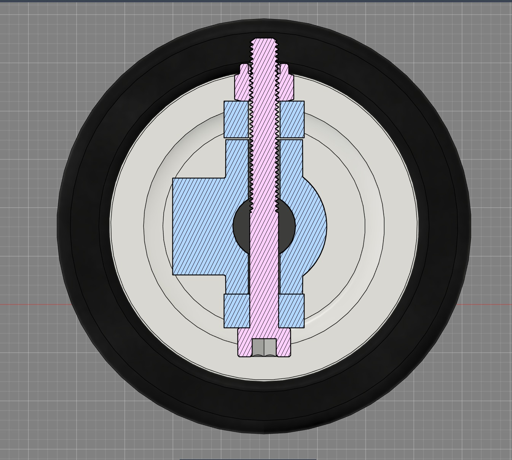
    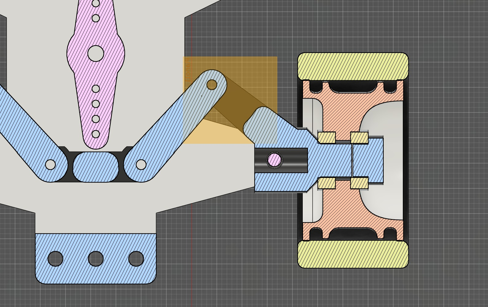
  </div>
</div>

<hr style="border-color: #30363d; margin: 25px 0;">

<!-- Comparativo Resumido -->
<table width="100%" style="border-collapse: collapse; margin: 15px 0; border: 1px solid #30363d; font-size: 14px;">
  <thead style="background-color: #161b22; color: #f0f6fc;">
    <tr>
      <th style="padding: 10px; border: 1px solid #30363d; text-align: left;">Parámetro</th>
      <th style="padding: 10px; border: 1px solid #30363d; text-align: left; color: #f85149;">Diseño Anterior</th>
      <th style="padding: 10px; border: 1px solid #30363d; text-align: left; color: #3fb950;">Diseño Actual (Reforzado)</th>
    </tr>
  </thead>
  <tbody>
    <tr>
      <td style="padding: 10px; border: 1px solid #30363d;"><b>Pivote Principal</b></td>
      <td style="padding: 10px; border: 1px solid #30363d;">2 tornillos cortos independientes.</td>
      <td style="padding: 10px; border: 1px solid #30363d;"><b>Tornillo pasante continuo</b> de lado a lado.</td>
    </tr>
    <tr>
      <td style="padding: 10px; border: 1px solid #30363d;"><b>Rodamientos</b></td>
      <td style="padding: 10px; border: 1px solid #30363d;">Alojados dentro del nudillo.</td>
      <td style="padding: 10px; border: 1px solid #30363d;">Reubicados directamente en el <b>Rin/Rim</b>.</td>
    </tr>
    <tr>
      <td style="padding: 10px; border: 1px solid #30363d;"><b>Estabilidad</b></td>
      <td style="padding: 10px; border: 1px solid #30363d;">Holgura constante y riesgo de desprendimiento.</td>
      <td style="padding: 10px; border: 1px solid #30363d;">Alineación perfecta y rigidez estructural extra.</td>
    </tr>
  </tbody>
</table>

<hr style="border-color: #30363d; margin: 25px 0;">

<h3>Análisis de Fuerzas y Fenómenos Dinámicos</h3>

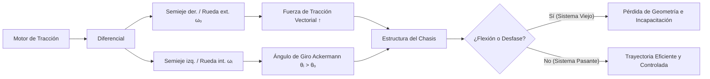
```mermaid
flowchart LR
    A["Motor de Tracción"] --> B["Diferencial"]
    B --> C["Semieje der. / Rueda ext. ωₒ"]
    B --> D["Semieje izq. / Rueda int. ωᵢ"]
    C --> E["Fuerza de Tracción Vectorial ↑"]
    D --> F["Ángulo de Giro Ackermann θᵢ > θₒ"]
    E & F --> G["Estructura del Chasis"]
    G --> H{"¿Flexión o Desfase?"}
    H -->|"Sí (Sistema Viejo)"| I["Pérdida de Geometría e Incapacitación"]
    H -->|"No (Sistema Pasante)"| J["Trayectoria Eficiente y Controlada"]
```

> [!WARNING]
> ### Inconvenientes Críticos y Riesgos Detectados en Pruebas Prácticas
>
> 1. **Paradox Steering (Dirección Paradójica):**
>    * **Causa:** Cuando la rueda interior pierde adherencia, el par de tracción vence al ángulo de giro e intenta rectificar la dirección del robot en sentido opuesto al trazo requerido.
>    * **Solución:** Control electrónico de torque diferencial (freno vectorial) y ajuste de geometría en los brazos de dirección.
>
> 2. **Fatiga Mecánica y Desfase en Nudillos:**
>    * **Causa:** La combinación de par motor + ángulo $\theta_i$ máximo ejercía un brazo de palanca crítico sobre los pivotes independientes, desarticulando los tornillos de fijación.
>    * **Solución:** Implementación de tornillo pasante continuo de extremo a extremo y relocalización de los rodamientos directamente en el hub/rin de la rueda.
>
> 3. **Holgura por Desgaste Abración en Puntos de Pivote:**
>    * **Causa:** El uso de **PETG-CF (PETG reforzado con fibra de carbono)** aporta una rigidez estructural y resistencia térmica excepcionales, pero las microfibras expuestas generan una superficie abrasiva que degrada las zonas de fricción directa en los ejes si no existe un buje metálico intermediario.
>    * **Solución:** Inserción de casquillos/bujes metálicos (bronce/latón) en los orificios del nudillo de PETG-CF y calibración mediante rótulas roscadas ajustables.
>
> 4. **Pérdida de Adherencia en Eje Delantero (Understeer/Subviraje):**
>    * **Causa:** Transferencia de masa desfavorable hacia el eje posterior durante aceleraciones bruscas, restando carga normal sobre la dirección.
>    * **Solución:** Redistribución de masa pesada (batería) hacia la sección central-delantera y optimización del perfil de aceleración mediante rampas en el software.

<hr style="border-color: #30363d; margin: 25px 0;">

> [!TIP]
> ### Recomendaciones Técnicas para Ajustes y Uso de PETG-CF
>
> * **Optimización de Impresión en PETG-CF:** Imprimir con boquilla de acero endurecido o rubí ($\ge 0.4\text{ mm}$), orientar las capas de las solapas de dirección de forma paralela a los esfuerzos torsionales para maximizar la adhesión entre capas y evitar fracturas frágiles por fricción.
> * **Inspección de Convergencia (Toe-in/Toe-out):** Verificar con galga o plantilla láser que las ruedas delanteras mantengan un ángulo neutro en recta para evitar desgaste prematuro y resistencia al avance.
> * **Verificación de Par de Apriete:** Utilizar tuercas de seguridad con inserto de nylon (*Nyloc*) en el tornillo pasante de los nudillos para evitar el aflojamiento provocado por las vibraciones continuas.
> * **Lubricación en Uniones PETG-CF / Metal:** Usar grasa de litio sintética o lubricante seco de PTFE en las zonas donde la fibra de carbono del PETG-CF esté en contacto con elementos mecánicos móviles.

<hr style="border-color: #30363d; margin: 25px 0;">

<h3>Soluciones de Ingeniería y Matriz de Optimización</h3>

| Componente | Innovación Mecánica / Electrónica | Riqueza Técnica / Modificación | Beneficio Directo |
| :--- | :--- | :--- | :--- |
| **Cuadro / Chasis** | Subchasis desmontable de rigidez variable. | Puntos de anclaje integrados para eje pasante vertical y distribución modular de peso. | Permite ajustes rápidos en boxes y absorbe las cargas horizontales sin deformar la estructura central. |
| **Diferencial / Tracción** | Control electrónico vectorial con mapeo de giro. | Regulación de PWM diferencial basada en la lectura en tiempo real del ángulo de dirección ($\theta_i$, $\theta_o$). | Maximiza la tracción en curva, elimina el *Paradox Steering* y desestabilizaciones de trayectoria. |
| **Brazos de Dirección** | Linkage Ackermann de alta precisión con rótulas roscadas. | Tirantes ajustables en longitud mediante rosca fina pasante (macho/hembra). | Compensa tolerancias de manufactura en PETG-CF y permite calibrar milimétricamente el valor de $W/L$. |
| **Nudillos de Dirección** | Eje pasante continuo en **PETG-CF** y rodamientos desplazados al Rin. | Pasador M3/M4 de alta tenacidad en solapas rígidas de composite con bearings directamente alojados en el rim. | Elimina por completo el juego mecánico, soporta elevadas cargas de par torsional y previene el desprendimiento de las ruedas. |
| **Puntos de Pivote** | Casquillos metálicos anticorrosivos (*Bushing/Bearings*). | Casquillos de latón/bronce insertados a presión en las caras de fricción para aislar la abrasión del composite. | Elimina el desgaste abrasivo inter-capa de la fibra de carbono, reduce la fricción y prolonga la vida útil del sistema. |

<p align="center">
  <a href="https://postimg.cc/8syssXPz">
    
  </a>
</p>

## 2.6 Piezas de Mecanica

El núcleo de la movilidad de nuestro robot reside en un subsistema mecánico de transmisión y tracción meticulosamente diseñado. Cada componente ha sido fabricado y seleccionado de forma personalizada para optimizar el espacio, la transferencia de potencia y la eficiencia dinámica del prototipo. 

A continuación, se desglosa cómo cada pieza clave se integra en la arquitectura de ingeniería del robot **Heimdall**:

## 2.6.1 Diferencial y Eje de Transmisión Impreso en 3D

<table style="border: 1px solid #30363d; border-collapse: collapse; width: 100%; background-color: #161b22; border-radius: 8px; overflow: hidden; margin-bottom: 25px;">
  <tr>
    <td width="38%" align="center" style="border: none; padding: 15px; vertical-align: middle; background-color: #0d1117;">
      <div style="margin-bottom: 15px;">
        <b style="font-size: 12px; display: block; margin-bottom: 6px; color: #58a6ff;">⚙️ Componentes del Diferencial</b>
        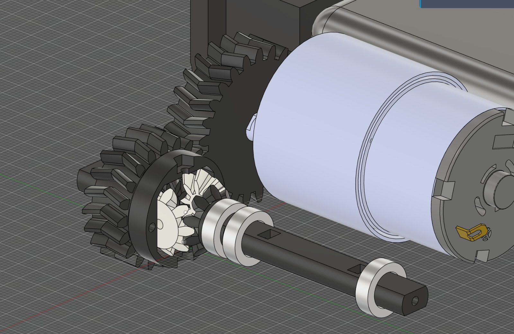
      </div>
      <div>
        <b style="font-size: 12px; display: block; margin-bottom: 6px; color: #58a6ff;">⚙️ Ensamble Final</b>
        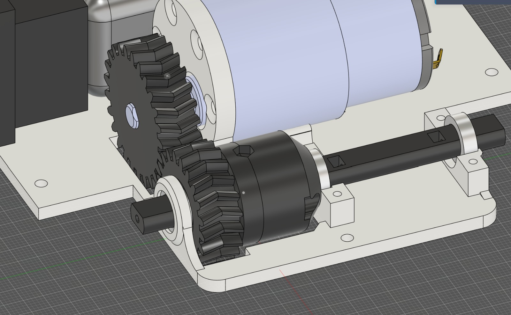
      </div>
    </td>
    <td width="62%" style="border: none; padding: 25px; vertical-align: top; font-family: -apple-system, BlinkMacSystemFont, 'Segoe UI', Helvetica, Arial, sans-serif; text-align: left;">
      <h4 style="margin-top: 0; color: #58a6ff; font-size: 18px; border-bottom: 1px solid #30363d; padding-bottom: 8px; margin-bottom: 15px;">Análisis de la Transmisión y Estabilidad</h4>
      <p style="color: #c9d1d9; font-size: 14px; line-height: 1.6; margin-bottom: 12px;">
        El diferencial se ubica en el eje motriz y permite que las ruedas izquierda y derecha giren a velocidades diferentes al tomar curvas. Esta característica es fundamental para evitar que el robot patine o experimente esfuerzos innecesarios en giros cerrados, manteniendo así la estabilidad incluso durante maniobras agresivas. Su diseño personalizado para el tamaño del robot <b>Heimdall</b> asegura que sea compacto, ligero y proporcional al resto del chasis y ruedas del robot.
      </p>
      <p style="color: #c9d1d9; font-size: 14px; line-height: 1.6; margin-bottom: 12px;">
        Por otro lado, el eje de transmisión conecta directamente la salida del diferencial personalizado a las ruedas motrices. Son responsables de transferir el par del motor generado hacia las ruedas, permitiendo el giro de los neumáticos. Su diseño personalizado garantiza la longitud y resistencia necesarias para soportar las fuerzas de torsión y tracción, sin añadir peso excesivo ni desbalancear el robot.
      </p>
      <p style="color: #c9d1d9; font-size: 14px; line-height: 1.6; margin-bottom: 0;">
        En el caso particular del robot <b>Heimdall</b>, originalmente se consideró una transmisión 4x4. Sin embargo, tras observar las limitaciones en los ángulos de cruce y la maniobrabilidad, se optó por priorizar la movilidad. Por ello, se decidió retirar el eje de transmisión y el diferencial delantero, transformando el robot en un sistema de tracción 4x2.
      </p>
    </td>
  </tr>
</table>

---

## Evolucion del sistema de trasmision 4x2

<p>
  A diferencia de la arquitectura empleada en el diseño anterior del chasis, en esta nueva iteración se logró eliminar por completo el complejo arreglo de ejes y engranajes adicionales que anteriormente se utilizaban para retransmitir la potencia rotacional del motor desde la sección lateral del vehículo. Para conseguir esto, se modificó estratégicamente la posición y orientación del motor dentro de la estructura general, permitiendo acoplar de forma directa su piñón de salida a la caja de la transmisión diferencial. Este cambio geométrico no solo optimizó el uso del espacio interno del robot para la distribución del hardware electrónico, sino que también erradicó puntos de fallas mecánicas recurrentes y redujo la necesidad de mantenimiento preventivo, liberando al sistema de componentes propensos al desgaste como el piñón de ataque intermedio.
</p>

<p>
  Al haber ganado este valioso espacio estructural y haber eliminado una etapa entera de reducción, se aprovechó la oportunidad para rediseñar la cinemática de transmisión, estableciendo una relación de engranajes overdrive de 4:5 (<i>i</i> = 1.25). Esta nueva relación fue seleccionada intencionalmente con el fin de entregar un comportamiento dinámico mucho más estable y lineal durante la navegación autónoma. Al mantener el motor trabajando en una zona eficiente de su curva de torque, el vehículo adquiere una mejor respuesta motriz y una aceleración más firme para responder de manera ágil y controlada ante maniobras bruscas, cambios rápidos de trayectoria en curvas o correcciones repentinas impulsadas por el sistema de control.
</p>

<hr />

<h4>Comparativa Visual de la Transmisión</h4>

<table width="100%">
  <thead>
    <tr>
      <th width="50%" align="center">Prototipo Anterior (Transmisión Lateral)</th>
      <th width="50%" align="center">Prototipo Actual (Acoplamiento Directo)</th>
    </tr>
  </thead>
  <tbody>
    <tr valign="top">
      <td align="center">
        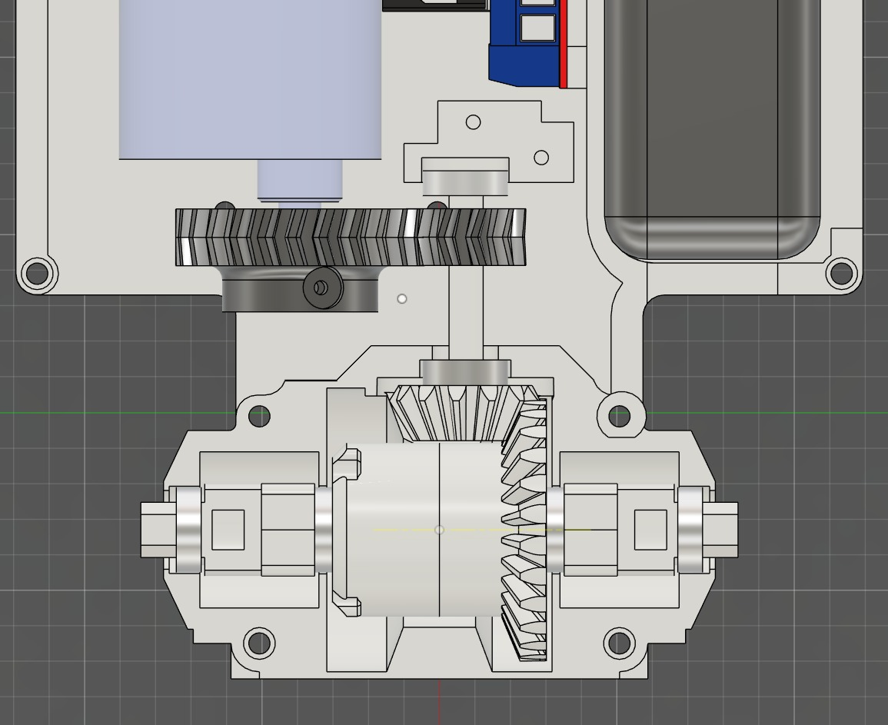
        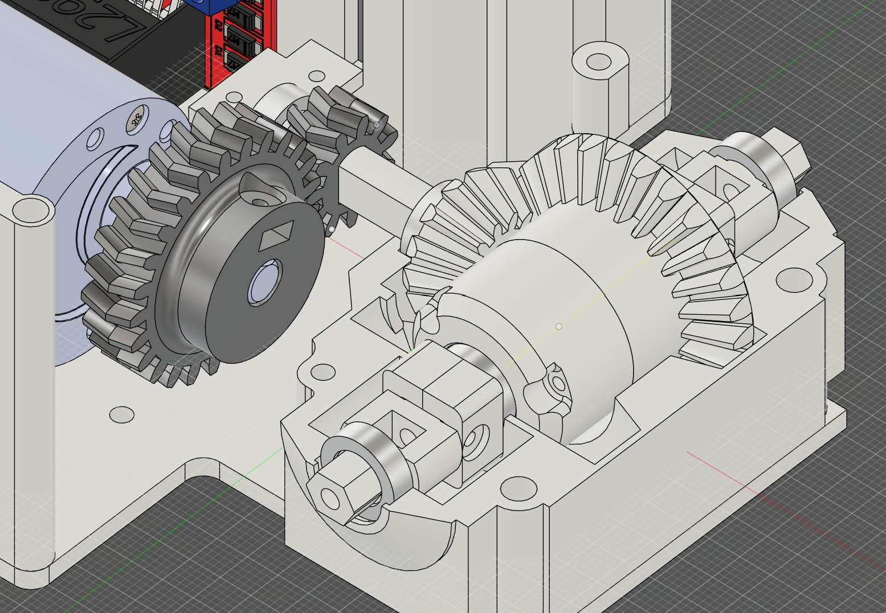
        <br />
        <small><i>Configuración previa con motor desplazado, eje secundario de transferencia y piñón cónico de ataque.</i></small>
      </td>
      <td align="center">
        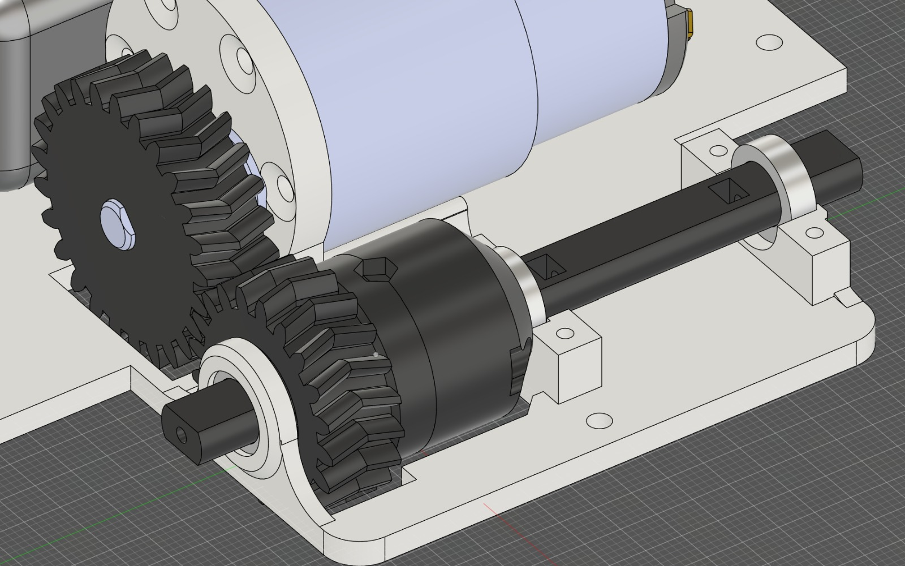
        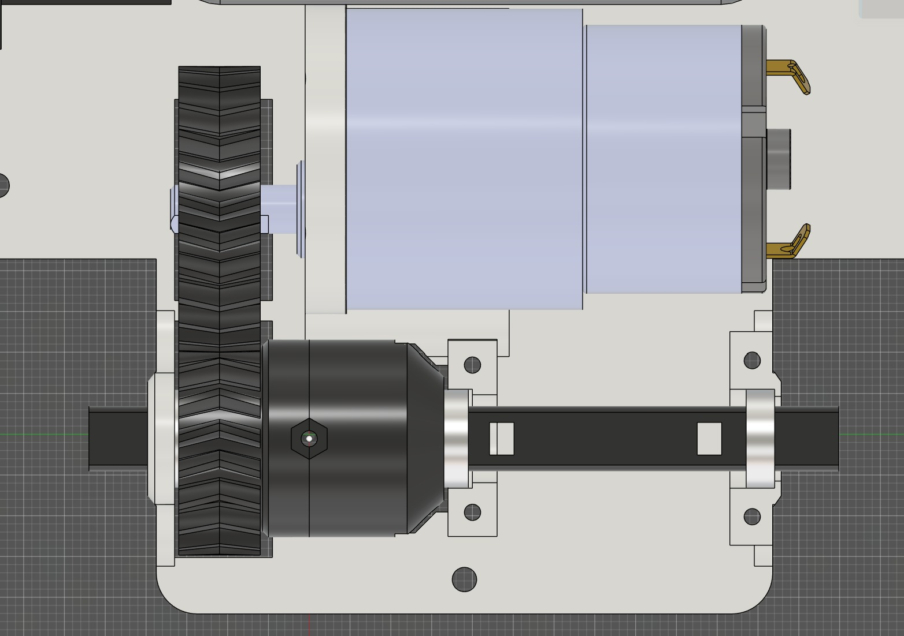
        <br />
        <small><i>Configuración optimizada con motor alineado, acoplamiento directo engranaje-diferencial (4:5) y chasis compacto.</i></small>
      </td>
    </tr>
  </tbody>
</table>

<hr />

## Ventajas y Desventajas de nuestro sistema de transmision 4x2

<table width="100%">
  <tr>
    <th width="50%">Ventajas de la Nueva Arquitectura</th>
    <th width="50%">Desventajas</th>
  </tr>
  <tr valign="top">
    <td>
      <ul>
        <li><b>Ahorro de espacio y peso:</b> Optimización del volumen interno y masa total.</li>
        <li><b>Reducción de piezas móviles:</b> Menor desgaste y puntos de falla.</li>
        <li><b>Mejora de fuerza:</b> Mayor torque para maniobras bruscas.</li>
        <li><b>Reducción de costos:</b> Menor uso de material y piezas.</li>
        <li><b>Mantenimiento simplificado:</b> Acceso rápido a reemplazos.</li>
      </ul>
    </td>
    <td>
      <ul>
        <li><b>Reducción de velocidad final:</b> Menor velocidad máxima teórica.</li>
        <li><b>Menor protección:</b> Mayor exposición a impactos o polvo.</li>
      </ul>
    </td>
  </tr>
</table>

---

## Diferencias mas importantes entre transmisión 4x4 y 4x2 

| Característica                  | 4x4 (Tracción en las 4 ruedas)            | 4x2 (Tracción en 2 ruedas)                  |
|----------------------------------|-------------------------------------------|---------------------------------------------|
| **Motricidad** | Alta, ideal para terrenos irregulares o cruces complejos. | Moderada, suficiente para la mayoría de maniobras en pista controlada. |
| **Ángulo de cruce** | Limitado por la presencia de ejes delanteros. | Mayor libertad de giro y mejor ángulo de cruce. |
| **Estabilidad en curvas** | Más estable en condiciones extremas.       | Buena estabilidad, pero depende más del diseño del chasis y el diferencial. |
| **Peso total** | Mayor, por la cantidad extra de componentes (ejes y diferenciales delanteros). | Menor, lo que contribuye a una mejor relación peso-potencia.              |
| **Complejidad mecánica** | Más alta; requiere mayor mantenimiento y ajuste. | Más sencilla, facilita el mantenimiento y reduce fallos mecánicos.         |
| **Consumo energético** | Más elevado por la transmisión a cuatro ruedas. | Menor, lo que puede aumento de la autonomía.                                |
| **Aplicación recomendada** | Terrenos difíciles, obstáculos, máxima tracción. | Pistas controladas, mayor maniobrabilidad y agilidad.                     |


<p align="right">
  <a href="#inicio">Volver Al Inicio</a>
</p>

---

### 2.6.2 **Servomotor INJORA 180°**

<table style="border: 1px solid #444; border-collapse: collapse; width: 100%;">
  <tr style="background-color: rgba(255, 255, 255, 0.05);">
    <td width="350px" align="center" style="padding: 20px; border: 1px solid #444;">
      
    </td>
    <td style="padding: 20px; border: 1px solid #444; vertical-align: top;">
      <h4 style="margin-top: 0;">⚡ Especificaciones</h4>
      <ul>
        <li><b>Tipo:</b> Servo digital de alta precisión.</li>
        <li><b>Banda muerta:</b> 2 µs.</li>
        <li><b>Señal de control:</b> PWM (500-2500 µs, 330 Hz).</li>
        <li><b>Torque de retención (8.4V):</b> 7.0 kg-cm / 97.2 oz-in.</li>
        <li><b>Velocidad (8.4V):</b> 0.06 s/60° (aprox. 150 rpm).</li>
        <li><b>Rodamientos:</b> 1BB (Bolas de acero).</li>
        <li><b>Engranajes:</b> Metálicos para alta durabilidad.</li>
      </ul>
    </td>
  </tr>
</table>

<p style="margin-top: 15px;">
  El servo <b>Injora 2065</b> es un micro servo digital de alto par, diseñado para aplicaciones que demandan movimientos precisos y una respuesta rápida. En <b>Heimdall</b>, este componente es el encargado de ejecutar el sistema de dirección delantera, permitiendo que el robot realice maniobras de esquiva milimétricas gracias a su excelente relación peso-potencia.
</p>

<p><b>Configuración de Software en Heimdall:</b></p>
<p>
  Utilizamos la librería <code>ESP32Servo.h</code> para gestionar la señal PWM en el <b>GPIO 2</b>. Hemos calibrado los límites físicos del mecanismo de dirección para evitar bloqueos mecánicos y optimizar el radio de giro:
</p>

<ul>
  <li><b>Ángulo Central:</b> 96° (Alineación neutra para línea recta).</li>
  <li><b>Rango Máximo (Derecha):</b> 140°.</li>
  <li><b>Rango Mínimo (Izquierda):</b> 50°.</li>
  <li><b>Ángulo de Esquiva:</b> 45° (Giro primario) y 45° (Giro secundario) para maniobras rápidas.</li>
</ul>

<p><b>Ventajas en Competencia:</b></p>
<ul>
  <li><b>Respuesta Dinámica:</b> Su motor de núcleo permite cambios de dirección instantáneos, esenciales cuando la cámara Huskylens2 detecta un bloque a alta velocidad.</li>
  <li><b>Soporte de Voltaje:</b> Al soportar hasta 8.4V, podemos alimentarlo directamente desde el sistema de potencia para maximizar su torque y velocidad.</li>
  <li><b>Maniobras Preventivas:</b> Gracias a su precisión, implementamos ángulos de 20° para las esquivas preventivas, logrando trayectorias más fluidas y evitando colisiones accidentales.</li>
</ul>

<table style="border: 1px solid #444; border-collapse: collapse;">
  <thead style="background-color: rgba(255, 255, 255, 0.1);">
    <tr>
      <th style="padding: 10px; border: 1px solid #444;">🛠️ Herramientas Requeridas</th>
    </tr>
  </thead>
  <tbody>
    <tr>
      <td style="padding: 10px; border: 1px solid #444;">1 × Destornillador hexagonal 1.5 mm</td>
    </tr>
    <tr>
      <td style="padding: 10px; border: 1px solid #444;">1 × Destornillador hexagonal 2.0 mm</td>
    </tr>
  </tbody>
</table>

<br>

<p align="right">
  <a href="#inicio">Volver Al Inicio</a>
</p>

<hr>

### 2.6.3 **Motor Hytech GA37-520**

<table style="border: 1px solid #444; border-collapse: collapse; width: 100%;">
  <tr style="background-color: rgba(255, 255, 255, 0.05);">
    <td width="350px" align="center" style="padding: 20px; border: 1px solid #444;">
      
    </td>
    <td style="padding: 20px; border: 1px solid #444; vertical-align: top;">
      <h4 style="margin-top: 0;">⚡ Especificaciones</h4>
      <ul>
        <li><b>Voltaje nominal:</b> 12V DC</li>
        <li><b>Velocidad nominal:</b> 360 RPM</li>
        <li><b>Torque nominal:</b> 4.5 kg.cm</li>
        <li><b>Corriente (Sin carga):</b> ≤ 100mA</li>
        <li><b>Encoder:</b> Magnético de fase dual (Fases A y B)</li>
        <li><b>PPR del Encoder:</b> 11 pulsos por vuelta (330 PPR en eje de salida)</li>
        <li><b>Material:</b> Caja de cambios totalmente metálica</li>
        <li><b>Relación de reducción:</b> 1:30</li>
      </ul>
    </td>
  </tr>
</table>

<p style="margin-top: 15px;">
  El <b>GA37-520</b> es el motor principal de tracción para nuestro robot. A diferencia de otros motores de corriente continua convencionales, este modelo fue elegido específicamente por integrar un <b>encoder magnético</b> de efecto Hall. Esta pieza es fundamental para transformar a <b>Heimdall</b> de un sistema de bucle abierto a uno de <b>lazo cerrado (Closed-Loop)</b>, permitiendo un monitoreo constante del movimiento real del chasis y garantizando que los giros de 90° sean siempre precisos e idénticos.
</p>

> [!TIP]
> **Ventaja del Encoder:** Al tener retroalimentación de las fases A y B, el código puede detectar no solo la velocidad, sino también la dirección del giro y la posición exacta de las ruedas. Esto es vital para corregir desviaciones en tiempo real y asegurar que los giros de 90° sean siempre idénticos, independientemente de la carga o el estado de la batería.

<p><b>¿Por qué decidimos usar este motor?:</b></p>

<ul>
  <li><b>Precisión en Odometría:</b> El encoder permite al ESP32 contar cada pulso del motor, lo que nos otorga la capacidad de medir distancias recorridas en centímetros. Esto es crítico para las fases del desafío donde el robot debe avanzar distancias fijas con error mínimo.</li>
  <li><b>Control de Velocidad PID:</b> Gracias a la lectura constante del encoder, implementamos un algoritmo PID para mantener una velocidad crucero estable, evitando que el robot se acelere o frene bruscamente por irregularidades en la pista.</li>
  <li><b>Robustez Mecánica:</b> Su construcción con engranajes de acero garantiza que el par motor se mantenga constante durante toda la competencia, soportando el estrés de las maniobras de esquiva agresivas.</li>
</ul>

<p><b>Configuración de Pines del Encoder y Motor:</b></p>

<table width="100%" style="border: 1px solid #444; border-collapse: collapse;">
  <thead style="background-color: rgba(255, 255, 255, 0.1);">
    <tr>
      <th style="padding: 10px; border: 1px solid #444;">Pines</th>
      <th style="padding: 10px; border: 1px solid #444;">Función</th>
      <th style="padding: 10px; border: 1px solid #444;">Conexión ESP32</th>
    </tr>
  </thead>
  <tbody>
    <tr>
      <td style="padding: 10px; border: 1px solid #444; text-align: center;">IN1</td>
      <td style="padding: 10px; border: 1px solid #444; text-align: center;">Dirección / PWM</td>
      <td style="padding: 10px; border: 1px solid #444; text-align: center;"><b>GPIO 16</b></td>
    </tr>
    <tr>
      <td style="padding: 10px; border: 1px solid #444; text-align: center;">IN2</td>
      <td style="padding: 10px; border: 1px solid #444; text-align: center;">Dirección / PWM</td>
      <td style="padding: 10px; border: 1px solid #444; text-align: center;"><b>GPIO 17</b></td>
    </tr>
    <tr>
      <td style="padding: 10px; border: 1px solid #444; text-align: center;">VCC Encoder</td>
      <td style="padding: 10px; border: 1px solid #444; text-align: center;">Alimentación Lógica</td>
      <td style="padding: 10px; border: 1px solid #444; text-align: center;">5V DC</td>
    </tr>
    <tr>
      <td style="padding: 10px; border: 1px solid #444; text-align: center;">GND Encoder</td>
      <td style="padding: 10px; border: 1px solid #444; text-align: center;">Tierra</td>
      <td style="padding: 10px; border: 1px solid #444; text-align: center;">GND Negativo</td>
    </tr>
    <tr>
      <td style="padding: 10px; border: 1px solid #444; text-align: center;">Fase A (Blanco)</td>
      <td style="padding: 10px; border: 1px solid #444; text-align: center;">Señal de Pulso</td>
      <td style="padding: 10px; border: 1px solid #444; text-align: center;"><b>GPIO 35</b></td>
    </tr>
    <tr>
      <td style="padding: 10px; border: 1px solid #444; text-align: center;">Fase B (Blanco)</td>
      <td style="padding: 10px; border: 1px solid #444; text-align: center;">Señal de Giro</td>
      <td style="padding: 10px; border: 1px solid #444; text-align: center;"><b>GPIO 34</b></td>
    </tr>
  </tbody>
</table>
<br>

### Calculo de la Reduccion total

Para adaptar la salida del motor a las necesidades del robot, realizamos un cálculo de la reducción total combinando la reducción interna del motor con la de un sistema de engranajes externo. Utilizamos un piñón de ataque estándar (acoplado al eje del motor) y engranajes de 17 y 28 dientes.

La relación de reducción adicional por engranajes se calcula así:
- Si el piñón tiene, por ejemplo, 10 dientes, y el engranaje acoplado tiene 28 dientes, la reducción es 28/10 = 2.8.
- Si se agregan más etapas de engranajes (por ejemplo, usando un engranaje intermedio de 17 dientes), la reducción se multiplica por cada etapa.

La reducción total del sistema es:

```
Reducción total = Reducción interna del motor × (dientes engranaje grande / dientes piñón)
```

En el diseño anterior del tren motriz, la potencia del motor se transmitía a través de un sistema compuesto por dos etapas mecánicas con componentes tipo LEGO:

1. **Primera Etapa (Amplificación Cinemática):**  
   Un piñón conductor de $Z_1 = 36\text{ dientes}$ acoplado a la salida del motor ($n_{\text{motor, ant}} = 550\text{ RPM}$) transmitía su fuerza de rotación a un piñón secundario de $Z_2 = 16\text{ dientes}$. La relación de transmisión teórica de esta etapa ($i_1$) se expresa como:

   $$i_1 = \frac{Z_1}{Z_2} = \frac{36}{16} = 2.25$$

   Considerando las holguras mecánicas y la fricción interdentado, se obtenía un incremento real de $2.11\times$ respecto a la velocidad original del motor, alcanzando una velocidad intermedia ($n_{\text{int}}$) de:

   $$n_{\text{int}} = n_{\text{motor, ant}} \times 2.11 = 550\text{ RPM} \times 2.11 = 1164.7\text{ RPM}$$

2. **Segunda Etapa (Reducción Final):**  
   Posteriormente, esta velocidad intermedia pasaba a través de un piñón de ataque configurado con una relación de reducción de $1 : 2.24$ ($i_2 = \frac{1}{2.24} \approx 0.4464$). La velocidad angular entregada directamente a los ejes de transmisión de las ruedas ($n_{\text{ruedas, ant}}$) se determinaba mediante:

   $$n_{\text{ruedas, ant}} = \frac{n_{\text{int}}}{2.24} = \frac{1164.7\text{ RPM}}{2.24} \approx 521\text{ RPM}$$

   Para las ruedas instaladas de diámetro $D = 33\text{ mm}$ (radio $r = 0.0165\text{ m}$), esta velocidad angular de $521\text{ RPM}$ equivalía a una velocidad lineal teórica de avance ($v_{\text{ant}}$) calculada como:

   $$\omega_{\text{ant}} = 521 \times \frac{2\pi}{60} \approx 54.56\text{ rad/s}$$

   $$v_{\text{ant}} = \omega_{\text{ant}} \cdot r = 54.56\text{ rad/s} \times 0.0165\text{ m} \approx 0.90\text{ m/s}$$

Sin embargo, debido al elevado juego mecánico (*backlash*) y a las pérdidas de torque asociadas al engrane de dos etapas plásticas, este diseño fue sustituido por la configuración actual de transmisión directa al diferencial.

En el sistema actual, un piñón de $Z_{\text{motor}} = 25\text{ dientes}$ acoplado al motor ($n_{\text{motor, act}} = 360\text{ RPM}$) impulsa directamente la caja del diferencial de $Z_{\text{dif}} = 20\text{ dientes}$, estableciendo una relación *overdrive* de $4:5$ ($i_{\text{act}} = 1.25$):

$$i_{\text{act}} = \frac{Z_{\text{motor}}}{Z_{\text{dif}}} = \frac{25}{20} = 1.25$$

$$n_{\text{ruedas, act}} = n_{\text{motor, act}} \times i_{\text{act}} = 360\text{ RPM} \times 1.25 = 450\text{ RPM}$$

Con el mismo diámetro de rueda ($D = 33\text{ mm}$), la velocidad angular final de $450\text{ RPM}$ produce una velocidad lineal estable ($v_{\text{act}}$) de:

$$\omega_{\text{act}} = 450 \times \frac{2\pi}{60} = 15\pi \approx 47.12\text{ rad/s}$$

$$v_{\text{act}} = \omega_{\text{act}} \cdot r = 47.12\text{ rad/s} \times 0.0165\text{ m} \approx 0.778\text{ m/s}$$

Esta transición de $521\text{ RPM}$ ($0.90\text{ m/s}$ con fricción y deslices) a $450\text{ RPM}$ ($0.78\text{ m/s}$ constantes) optimiza la eficiencia del tren de rodaje, elimina la holgura cinemática y garantiza una respuesta rígida para el control de odometría sobre la pista.

#### ¿Por qué es importante la reducción?

Dos palabras clave: `Velocidad` y `Torque`. Al aumentar la reducción, la velocidad de salida disminuye, permitiendo un control más preciso del robot, y paralelamente  La reducción aumenta el torque disponible en las ruedas, lo que mejora la capacidad de mover el robot o superar obstáculos.

### Razones para elegir este motor y sistema de reducción

- **Versatilidad y control:** El motor de 12V es estándar y confiable. La reducción interna más la reducción por engranajes externos se adapta perfectamente a las necesidades del robot.
- **Adaptabilidad:** Cambiando los engranajes externos se puede ajustar fácilmente la velocidad y el torque final.
- **Eficiencia y disponibilidad:** Los componentes son fáciles de conseguir y económicos.

<p align="right">
  <a href="#inicio">Volver Al Inicio</a>
</p>

---

### 2.6.4 **Tornillos, Tuercas de Seguridad y Arandelas (M2 y M3)**


Ya sean M2 o M3, son piezas imprescindibles para la mecanica de nuestro robot, debido a la fijacion de piezas pequeñas, estabilización de componentes, y la garantía de seguridad que otorgan con respecto al uso prolongado del robot ya sea en practicas o en la competición.

Se decidió tomar la decisión de tener tornillos M2 y M3 de forma simultánea para velar por la eficiencia del espacio, para permitir compatibilidad con los componentes más pequeños, y al mismo tiempo para garantizar que los tornillos resistan y permitan estabilidad en el robot.

<p align="right">
  <a href="#inicio">Volver Al Inicio</a>
</p>
     
---

## 3. Apartado Electronico

<p align="justify">
  El apartado electrónico de nuestro robot <b>Heimdall</b> ha sido diseñado bajo una arquitectura modular que prioriza la estabilidad de voltaje y la velocidad de procesamiento. La integración de estos componentes permite que el robot procese datos sensoriales en tiempo real, garantizando una respuesta inmediata ante los desafíos del entorno de la <b>WRO 2026</b>.
</p>

<p><b>La arquitectura se divide en cuatro pilares fundamentales:</b></p>

<ul>
  <li><b>Gestión de Energía:</b> Sistemas de regulación para estabilizar la potencia de las baterías.</li>
  <li><b>Unidad de Procesamiento:</b> Cerebro central encargado de la lógica y visión.</li>
  <li><b>Control de Actuadores:</b> Drivers para el manejo de motores y dirección.</li>
  <li><b>Percepción Sensorial:</b> Sensores ultrasónicos, inerciales y de visión artificial.</li>
</ul>

---

### 3.1 Piezas de Electronica

Por lo tanto hemos decidido usar:

### 3.1.1 **Baterías**

<table>
  <tr>
    <td align="center" width="450">
      
    </td>
    <td>
      <h3>🔋 Especificaciones Técnicas</h3>
      <ul>
        <li><b>Tipo de Química:</b> Níquel-Metal Hidruro (NiMH)</li>
        <li><b>Voltaje Nominal:</b> 12 V DC (10 Celdas AA)</li>
        <li><b>Capacidad / Amperaje:</b> 2000 mAh (2 Ah)</li>
        <li><b>Conector / Salida:</b> Cables desnudos (Adaptable a Molex / XT60)</li>
        <li><b>Tasa de Carga Máxima:</b> 1A - 2A (Recomendada ≤ 1A)</li>
        <li><b>Peso:</b> 225 g</li>
        <li><b>Dimensiones:</b> 2.13 x 2.91 x 1.22 in (54 x 74 x 31 mm)</li>
        <li><b>Fabricante / Modelo:</b> Tenergy / 19676</li>
        <li><b>Vida Útil Promedio:</b> ~500 ciclos completos de carga/descarga</li>
      </ul>
    </td>
  </tr>
</table>

### Justificación de Selección e Integración Mecánica

La elección de la batería **Tenergy NiMH de 12V y 2000 mAh** responde directamente a los requerimientos de consumo dinámico y autonomía extendida que exige la arquitectura electrónica de *Heimdall* en la WRO.

* **Autonomía Prolongada y Eficiencia Energética:** La capacidad de 2000 mAh garantiza una entrega constante de corriente a la etapa de potencia (drivers y motores) y al sistema de control sin caídas de tensión bruscas. La batería mantiene su curva de descarga estable durante sesiones intensas de pruebas continuas en pista, evitando variaciones en la velocidad de avance o en la velocidad del servo de dirección.
* **Resistencia a Recargas Frecuentes (Cero Efecto Memoria):** Su química de Níquel-Metal Hidruro no padece del fenómeno de memorización de carga. Esto nos permite efectuar ciclos de recarga parciales en boxes entre rondas de competencia sin reducir la capacidad útil del pack.
* **Seguridad Química en Entornos de Pruebas:** A diferencia de las baterías LiPo (que presentan riesgos de perforación, inflamación o sobrecarga crítica), las baterías NiMH ofrecen una química robusta ante impactos mecánicos leves e imprecisiones de carga, factor fundamental durante la fase de prototipado del chasis.
* **Factor de Forma y Densidad Energética:** Con un peso optimizado de solo 225 g y un formato sumamente compacto, se integra en la sección media del vehículo sin comprometer el centro de gravedad ni sobrecargar la masa suspendida del eje delantero.

<hr style="border-color: #30363d; margin: 25px 0;">

> [!TIP]
> ### Protocolo de Mantenimiento y Rendimiento en Competición
>
> * **Carga Recomendada:** Emplear un cargador inteligente específico parapacks NiMH de 6V–12V ajustado a **≤ 1A** (0.5C). Esto previene el estrés térmico en las celdas y maximiza su vida útil.
> * **Monitoreo Térmico en Pista:** Supervisar la temperatura del pack tras cada carrera. Si la batería supera los **45 °C**, debe dejar enfriar a temperatura ambiente antes de iniciar un nuevo ciclo de recarga.
> * **Umbral de Descarga Segura:** Detener el uso si el voltaje total del pack cae por debajo de **10.8 V** (~1.08 V por celda). Evitar descargas profundas inferiores a 9.0 V para no polarizar irreversiblemente las celdas internas.
> * **Almacenamiento Prolongado:** Guardar en un lugar fresco y seco (15–25 °C) con una carga del **40% al 60%**. En periodos sin uso, realizar un ciclo completo de carga/descarga de mantenimiento cada 4 semanas.
> * **Aislamiento Antivibración:** Integrar una almohadilla de espuma o goma eva de alta densidad dentro del chasis impreso en PETG-CF para absorber los impactos mecánicos y proteger el wrap térmico del pack.

<p align="right">
  <a href="#inicio">Volver Al Inicio</a>
</p>

---

### 3.1.2 **Step Down**
  
<table>
  <tr>
    <td align="center" width="450">
      
    </td>
    <td>
      <h3>⚡ Especificaciones</h3>
      <ul>
        <li>Rango de Entrada: 3.2 – 40 V DC</li>
        <li>Rango de Salida: 1.25 – 37 V DC (Ajustable)</li>
        <li>Corriente de Salida: 2A continuos (hasta 3A Pico con disipador)</li>
        <li>Eficiencia de Conversión: Hasta 92%</li>
        <li>Frecuencia de Conmutación: 150 kHz</li>
        <li>Rizo de Salida: &lt; 30 mV</li>
        <li>Regulación de Carga: ±0.5%</li>
        <li>Regulación de Voltaje: ±2.5%</li>
        <li>Temperatura de Trabajo: -40 °C a +85 °C</li>
        <li>Protecciones: Limitación de corriente y desconexión térmica integrada</li>
        <li>Tipo de Módulo: Regulador de voltaje Step-Down (Buck) no aislado</li>
      </ul>
    </td>
  </tr>
</table>

<p style="margin-top: 15px;">
  El <b>LM2596</b> es un regulador conmutado de tipo <i>Step Down</i> (Buck Converter) DC-DC diseñado para transformar tensiones elevadas en niveles de voltaje inferiores de forma altamente eficiente. Acepta un amplio rango de entrada entre 3.2V y 40V DC, lo cual demuestra una gran versatilidad operativa en la gestión de potencia del robot. Por esta razón, nuestro equipo decidió integrarlo como una etapa de regulación clave para acondicionar la alimentación del circuito lógico.
</p>

<div style="margin-top: 15px; background-color: #161b22; border: 1px solid #30363d; border-radius: 6px; padding: 15px; font-size: 14px; color: #c9d1d9;">
  <p style="margin-bottom: 10px;"><b>Es extremadamente útil para nuestro proyecto debido a su:</b></p>
  <ul style="margin: 0; padding-left: 20px; line-height: 1.6;">
    <li><b>Regulación eficiente de alta conversión:</b> Convierte los ~11.1V / 12V entregados por la fuente principal a los 5V nominales que exige la lógica del sistema. A diferencia de un regulador lineal (como el 7805), el LM2596 no disipa el exceso de voltaje como puro calor, logrando eficiencias de hasta el 92%.</li>
    <li><b>Protección e inmunidad al ruido de motores:</b> Actúa como una barrera entre el sistema lógico y el sistema de potencia, previniendo que las caídas de tensión bruscas causadas por el consumo del motor de tracción reinicien el ESP32 o distorsionen la señal de la HuskyLens 2.</li>
    <li><b>Alta capacidad de corriente activa:</b> Proporciona 2A continuos (con picos tolerados de 3A), suficiente para abastecer en paralelo la demanda simultánea del microcontrolador, los tres sensores ultrasónicos, el servo de dirección y la HuskyLens 2.</li>
    <li><b>Ajuste Fino por Potenciómetro Trimmer:</b> Permite calibrar la salida mediante un potenciómetro multivuelta de precisión para compensar caídas por longitud de cableado y fijar exactamente los voltajes lógicos deseados ($5.0\text{V}$ o $6.0\text{V}$ según los servos requeridos).</li>
    <li><b>Versatilidad de Fuente Alimentadora:</b> Su amplio rango de tolerancia permite probar con diversas químicas de batería (LiPo 2S/3S, baterías selladas o fuentes de taller) sin necesidad de rediseñar el hardware del robot.</li>
  </ul>
</div>

<p><b>Principio de Funcionamiento y Ecuaciones Básicas:</b></p>
<p>
  A diferencia de los reguladores lineales, el LM2596 conmuta un transistor interno a una frecuencia de <b>150 kHz</b>. Al alternar rápidamente entre estado conduciendo y corte, junto con el trabajo de un inductor y un diodo Schottky de alta velocidad, se logra adaptar la energía almacenada reduciendo el voltaje sin perder potencia útil.
</p>

<p>
  La relación ideal de conversión en un regulador <i>Buck</i> se define por el ciclo de trabajo ($D$):
</p>

<p align="center">
  $$V_{\text{salida}} = V_{\text{entrada}} \times D \quad \text{donde} \quad D = \frac{T_{\text{ON}}}{T_{\text{ON}} + T_{\text{OFF}}}$$
</p>

<p>
  Esto garantiza que el calor generado durante la conversión sea mínimo, manteniendo estable el ecosistema de sensores de <b>Heimdall</b> incluso durante carreras prolongadas.
</p>

> [!WARNING]
> - Antes de conectar por primera vez componentes sensibles como el ESP32 o la HuskyLens 2 al regulador, se debe medir con un multímetro la salida de los pines **OUT+** y **OUT-** y girar el potenciómetro fino hasta asegurar un voltaje de $5.0\text{V}$ exactos. Un voltaje descalibrado por encima de $5.5\text{V}$ puede dañar de forma permanente el módulo de visión y los procesadores.

<p><b>Esquema de Distribución de Potencia:</b></p>

<table width="100%" style="border: 1px solid #444; border-collapse: collapse; margin-top: 10px;">
  <thead style="background-color: rgba(255, 255, 255, 0.1);">
    <tr>
      <th style="padding: 10px; border: 1px solid #444;">Terminal LM2596</th>
      <th style="padding: 10px; border: 1px solid #444;">Origen / Destino en el Robot</th>
      <th style="padding: 10px; border: 1px solid #444;">Función en el Sistema</th>
    </tr>
  </thead>
  <tbody>
    <tr>
      <td style="padding: 10px; border: 1px solid #444; text-align: center;"><b>IN+</b></td>
      <td style="padding: 10px; border: 1px solid #444; text-align: center;">Positivo Batería / Interruptor Principal</td>
      <td style="padding: 10px; border: 1px solid #444;">Recibe el voltaje bruto (+7.4V a +12V).</td>
    </tr>
    <tr>
      <td style="padding: 10px; border: 1px solid #444; text-align: center;"><b>IN-</b></td>
      <td style="padding: 10px; border: 1px solid #444; text-align: center;">Negativo Batería (GND General)</td>
      <td style="padding: 10px; border: 1px solid #444;">Tierra común de entrada.</td>
    </tr>
    <tr>
      <td style="padding: 10px; border: 1px solid #444; text-align: center;"><b>OUT+</b></td>
      <td style="padding: 10px; border: 1px solid #444; text-align: center;">Bus Lógico 5V (ESP32, Sensors, HuskyLens 2)</td>
      <td style="padding: 10px; border: 1px solid #444;">Suministra voltaje regulado y filtrado a 5.0V.</td>
    </tr>
    <tr>
      <td style="padding: 10px; border: 1px solid #444; text-align: center;"><b>OUT-</b></td>
      <td style="padding: 10px; border: 1px solid #444; text-align: center;">GND Lógico / Tierra General del Chasis</td>
      <td style="padding: 10px; border: 1px solid #444;">Referencia cero común para todos los módulos.</td>
    </tr>
  </tbody>
</table>

<p align="right">
  <a href="#inicio">Volver Al Inicio</a>
</p>

---

### 3.1.3 **Motor Driver**

<table style="border: 1px solid #444; border-collapse: collapse; width: 100%;">
  <tr style="background-color: rgba(255, 255, 255, 0.05);">
    <td width="350px" align="center" style="padding: 20px; border: 1px solid #444;">
      
    </td>
    <td style="padding: 20px; border: 1px solid #444; vertical-align: top;">
      <h4 style="margin-top: 0;">⚡ Especificaciones</h4>
      <ul>
        <li><b>Chip de control:</b> L298N (Doble Puente H de alta potencia).</li>
        <li><b>Voltaje de operación (Motores):</b> 5V a 35V DC.</li>
        <li><b>Corriente máxima (Pico):</b> 2 Amperios por canal.</li>
        <li><b>Corriente continua:</b> 1.2 Amperios por canal.</li>
        <li><b>Voltaje lógico:</b> 5V DC (mediante regulador integrado).</li>
        <li><b>Corriente lógica:</b> 0mA - 36mA.</li>
        <li><b>Potencia máxima:</b> 25 Watts.</li>
        <li><b>Modo de control:</b> PWM (Modulación por ancho de pulsos) y niveles lógicos GPIO.</li>
        <li><b>Temperatura operativa:</b> -20°C a +135°C.</li>
        <li><b>Dimensiones y Peso:</b> 43 x 43 x 27 mm | 30 g aprox.</li>
        <li><b>Extras:</b> Regulador 78M05 integrado de 5V y diodos de protección anti-retorno.</li>
      </ul>
    </td>
  </tr>
</table>

<p style="margin-top: 15px;">
  El driver <b>L298N</b> actúa como el "intermediario de potencia" esencial en la arquitectura de <b>Heimdall</b>. Su función clave es aislar los pines de control del microcontrolador (ESP32) de las altas corrientes que exigen los motores de tracción, transformando las señales de control de baja potencia en corrientes de hasta 2A para permitir cambios de marcha, aceleración progresiva por PWM y frenado activo.
</p>

<p><b>¿Por qué decidimos elegir el L298N sobre otros Motor Drivers?</b></p>
<p>
  Durante la fase de diseño evaluamos distintas alternativas del mercado (como el TB6612FNG o módulos basados en MOSFETs aislados). Seleccionamos el <b>L298N</b> por su alta robustez mecánica, su disipador de calor integrado y, fundamentalmente, por contar con un <b>regulador lineal 78M05 de 5V a bordo</b>.
</p>

| Criterio de Selección | L298N (Elegido) | TB6612FNG | L293D (Shield) |
| :--- | :--- | :--- | :--- |
| **Suministro de 5V Onboard** | **Sí (Regulador 78M05 dedicado)** | No (Requiere regulador externo) | Algunas versiones no integran regulador |
| **Corriente Continua** | **1.2A por canal (Picos de 2A)** | 1.2A por canal (Picos de 3.2A) | 600mA por canal |
| **Disipación Térmica** | **Disipador de aluminio masivo** | Sin disipador (requiere cobre en PCB) | Disipación limitada por encapsulado DIP |
| **Robustez ante Picos** | **Alta (Diodos de protección integrados)** | Media (Sensible a sobrevoltajes de retorno) | Baja |

> [!TIP]
> - El regulador **78M05** integrado en el controlador genera una **salida de 5V DC completamente estable**. Esta línea de alimentación es un punto neurálgico en nuestro robot, ya que alimenta de forma limpia y constante al ESP32 (mediante su pin VIN/5V), a la HuskyLens 2 y a los sensores de ultrasonido, evitando la necesidad de añadir un convertidor Buck externo adicional.

<p><b>Partes Clave del Módulo L298N:</b></p>

<table width="100%" style="border: 1px solid #444; border-collapse: collapse; margin: 15px 0;">
  <thead style="background-color: rgba(255, 255, 255, 0.1);">
    <tr>
      <th style="padding: 10px; border: 1px solid #444; text-align: left;">Componente</th>
      <th style="padding: 10px; border: 1px solid #444; text-align: left;">Función en el Sistema</th>
    </tr>
  </thead>
  <tbody>
    <tr>
      <td style="padding: 10px; border: 1px solid #444;"><b>Puertos de salida (OUT1, OUT2)</b></td>
      <td style="padding: 10px; border: 1px solid #444;">Conexión directa a los bornes del motor principal de tracción de Heimdall.</td>
    </tr>
    <tr>
      <td style="padding: 10px; border: 1px solid #444;"><b>Entradas lógicas (IN1, IN2)</b></td>
      <td style="padding: 10px; border: 1px solid #444;">Reciben los estados lógicos desde el ESP32 para determinar el sentido de giro (Avance / Reversa / Freno).</td>
    </tr>
    <tr>
      <td style="padding: 10px; border: 1px solid #444;"><b>Pin de Habilitación (ENA)</b></td>
      <td style="padding: 10px; border: 1px solid #444;">Recibe la señal **PWM** desde el ESP32 para controlar la velocidad lineal de tracción.</td>
    </tr>
    <tr>
      <td style="padding: 10px; border: 1px solid #444;"><b>Salida Regulada de 5V</b></td>
      <td style="padding: 10px; border: 1px solid #444;">Entrega voltaje regulado a la lógica del sistema (ESP32, HuskyLens 2 y Sensores).</td>
    </tr>
    <tr>
      <td style="padding: 10px; border: 1px solid #444;"><b>Jumper 5V-EN</b></td>
      <td style="padding: 10px; border: 1px solid #444;">Mantiene activo el regulador interno cuando el voltaje de batería principal es de $7.4\text{V} - 12\text{V}$.</td>
    </tr>
  </tbody>
</table>

<p><b>¿Cómo controla el sentido de giro y la velocidad? (Diagrama de Conmutación):</b></p>
<p>
  El chip L298N utiliza cuatro transistores/MOSFETs internos organizados en una topología en H. Dependiendo de las señales enviadas a las entradas <code>IN1</code> e <code>IN2</code>, el flujo de corriente atraviesa el motor en una dirección u otra:
</p>

```text
    [VCC Motor +12V]
           |
   +-------+-------+
   |               |
 [SW1]           [SW3]   <-- Controlados por IN1 e IN2
   |               |
   +---[ MOTOR ]---+
   |               |
 [SW2]           [SW4]
   |               |
   +-------+-------+
           |
         [GND]
```

<p align="right">
  <a href="#inicio">Volver Al Inicio</a>
</p>

---

### 3.1.4 **Sensor de Ultrasonido**

<table style="border: 1px solid #444; border-collapse: collapse; width: 100%;">
  <tr style="background-color: rgba(255, 255, 255, 0.05);">
    <!-- Imagen del Sensor -->
    <td width="350px" align="center" style="padding: 20px; border: 1px solid #444;">
      
    </td>
    <!-- Cuadro de Especificaciones -->
    <td style="padding: 20px; border: 1px solid #444; vertical-align: top;">
      <h4 style="margin-top: 0;">⚡ Especificaciones</h4>
      <ul>
        <li><b>Voltaje de operación:</b> 5V DC</li>
        <li><b>Frecuencia acústica:</b> 40 kHz</li>
        <li><b>Unidades en Heimdall:</b> 3 (Ecosistema de detección periférica)</li>
        <li><b>Librería de control:</b> NewPing (Gestión de triggers no bloqueantes)</li>
        <li><b>Rango de medición:</b> 1cm 357cm</li>
        <li><b>Precisión de resolución:</b> 0.3 cm</li>
        <li><b>Ángulo de detección:</b> < 15°</li>
        <li><b>Protocolo:</b> Pulso TTL de activación (10µs) y respuesta proporcional</li>
      </ul>
    </td>
  </tr>
</table>

<p style="margin-top: 15px;">
  El <b>HC-SR04</b> es un sensor de telemetría acústica diseñado para medir distancias mediante la emisión de ondas ultrasónicas. A diferencia de los sensores ópticos que pueden fallar ante cambios de iluminación, el HC-SR04 procesa el "tiempo de vuelo" (Time of Flight) de una ráfaga sonora, permitiendo que <b>Heimdall</b> conozca su posición exacta respecto a los muros de la pista de forma fiable y constante.
</p>

> [!TIP]
>  - En el codigo recomiendo usar un promedio de las 5 lecturas y que agarre las mas similares para evitar fallos.
>  - Recomiendo el ignorar distancias como 357 por que puede dar falsos picos de lectura.   

<p><b>Ventajas competitivas en la navegación del robot:</b></p>

<ul>
  <li><b>Detección de Obstáculos por Eco:</b> El sensor emite 8 ráfagas de 40 kHz que rebotan en los muros. Al calcular el tiempo que tarda el sonido en regresar, el robot puede "ver" a qué distancia se encuentra de las colisiones sin contacto físico.</li>
  <li><b>Optimización con la libreria NewPing:</b> Implementamos esta librería para gestionar el ecosistema de 3 sensores de forma paralela. NewPing optimiza el ciclo de trabajo del ESP32, descartando ecos residuales y permitiendo una frecuencia de muestreo más alta..</li>
  <li><b>Sustitución en Caliente:</b> Su arquitectura estandarizada permite un reemplazo modular inmediato. En una competencia de alto nivel, la capacidad de reparar el sistema de navegación en segundos ante un fallo eléctrico es una ventaja estratégica clave.</li>
</ul>

<p><b>Principio de Operación Técnica:</b></p>

<p>Para obtener la distancia, el sistema realiza un proceso de cuatro etapas sincronizado por hardware y software:</p>

<ul>
  <li><b>Disparo (Trigger):</b> Se envía un pulso de 10 microsegundos para activar el transductor emisor.</li>
  <li><b>Emisión:</b> El sensor genera automáticamente una ráfaga de ultrasonido inaudible.</li>
  <li><b>Captura (Echo):</b> El receptor detecta la onda reflejada y pone el pin de Echo en nivel alto.</li>
  <li><b>Cálculo Cinemático:</b> Basándonos en la velocidad del sonido (~340m/s), el código transforma el tiempo medido en una magnitud lineal (cm).</li>
</ul>

<p><b>Cálculo de Distancia y Algoritmo Interno de NewPing:</b></p>

<p>
  La librería <b>NewPing</b> optimiza la lectura del tiempo de vuelo ($t$) eliminando los bloqueos en el hilo de ejecución principal del ESP32. El proceso técnico y la matemática empleada se estructuran de la siguiente manera:
</p>

<ul>
  <li><b>Fase 1: Disparo de precisión:</b> NewPing genera un pulso digital en ALTO de 10 $\mu s$ en el pin <code>Trigger</code> del sensor seleccionado.</li>
  <li><b>Fase 2: Conteo de tiempo ($t$):</b> El transductor ultrasónico envía 8 ráfagas a 40 kHz. En el momento en que se emite la señal, el pin <code>Echo</code> cambia a estado ALTO. NewPing mide la duración exacta en microsegundos ($\mu s$) que el pin permanece en este estado hasta que la señal reflejada regresa.</li>
  <li><b>Fase 3: Conversión mediante Ecuación Física:</b> Sabiendo que la velocidad del sonido a temperatura ambiente es aproximadamente de $343\text{ m/s}$ (o lo que es lo mismo, $0.0343\text{ cm/}\mu s$), la onda recorre la distancia ida y vuelta. Por lo tanto, la fórmula cinemática base es:
    <p align="center">
      $$\text{Distancia (cm)} = \frac{t \times 0.0343}{2}$$
    </p>
  </li>
  <li><b>Fase 4: Simplificación por constante de velocidad (US_ROUNDTRIP_CM):</b> Para evitar realizar operaciones matemáticas en coma flotante en cada iteración del ciclo —lo cual consumiría ciclos innecesarios del microcontrolador— NewPing define internamente una constante basada en el tiempo de viaje de ida y vuelta por centímetro:
    <p align="center">
      $$\text{Constante ID/Vuelta} = \frac{2}{0.0343} \approx 57.57 \space \mu s/\text{cm} \quad \rightarrow \quad \texttt{US\_ROUNDTRIP\_CM} = 57$$
    </p>
    Por consiguiente, la librería ejecuta la distancia mediante una división entera ultra rápida:
    <p align="center">
      $$\text{Distancia (cm)} = \frac{\text{Tiempo de Echo } (t \text{ en } \mu s)}{\text{US\_ROUNDTRIP\_CM}}$$
    </p>
  </li>
  <li><b>Fase 5: Filtrado de Ruido y Ping en Temporizador:</b> En lugar de usar la función bloqueante <code>pulseIn()</code> del entorno tradicional de Arduino, NewPing emplea interrupciones de temporizador por hardware para medir la respuesta del pin <code>Echo</code>. Si el eco excede el tiempo de límite configurado (o no regresa), la librería retorna inmediatamente un valor de $0\text{ cm}$, evitando que el robot se detenga a esperar una señal perdida.</li>
</ul>

<p><b>Distribución de Pines en Heimdall:</b></p>

<table width="100%" style="border: 1px solid #444; border-collapse: collapse;">
  <thead style="background-color: rgba(255, 255, 255, 0.1);">
    <tr>
      <th style="padding: 10px; border: 1px solid #444;">Eje de Detección</th>
      <th style="padding: 10px; border: 1px solid #444;">Pin Trigger</th>
      <th style="padding: 10px; border: 1px solid #444;">Pin Echo</th>
    </tr>
  </thead>
  <tbody>
    <tr>
      <td style="padding: 10px; border: 1px solid #444; text-align: center;"><b>Frontal:</b></td>
      <td style="padding: 10px; border: 1px solid #444; text-align: center;">13</td>
      <td style="padding: 10px; border: 1px solid #444; text-align: center;">12</td>
    </tr>
    <tr>
      <td style="padding: 10px; border: 1px solid #444; text-align: center;"><b>Izquierdo:</b></td>
      <td style="padding: 10px; border: 1px solid #444; text-align: center;">14</td>
      <td style="padding: 10px; border: 1px solid #444; text-align: center;">27</td>
    </tr>
    <tr>
      <td style="padding: 10px; border: 1px solid #444; text-align: center;"><b>Derecho:</b></td>
      <td style="padding: 10px; border: 1px solid #444; text-align: center;">26</td>
      <td style="padding: 10px; border: 1px solid #444; text-align: center;">25</td>
    </tr>
  </tbody>
</table>

<p align="right">
  <a href="#inicio">Volver Al Inicio</a>
</p>

<hr>

### 3.1.5 **Giroscopio**

<table style="border: 1px solid #444; border-collapse: collapse; width: 100%;"> 
  <tr style="background-color: rgba(255, 255, 255, 0.05);"> 
    <td width="350px" align="center" style="padding: 20px; border: 1px solid #444;"> 
       
    </td> 
    <td style="padding: 20px; border: 1px solid #444; vertical-align: top;"> 
      <h4 style="margin-top: 0;">⚡ Especificaciones</h4> 
      <ul> 
        <li><b>Sensor:</b> IMU de 9 grados de libertad (Acelerómetro + Giroscopio + Magnetómetro)</li> 
        <li><b>Procesador interno:</b> ARM Cortex-M0 (Fusión de datos por hardware)</li> 
        <li><b>Librerías de control:</b> Adafruit_BNO055.h, Adafruit_Sensor.h, utility/imumaths.h</li> 
        <li><b>Rango del Giroscopio:</b> ±125 a ±2000 °/s</li> 
        <li><b>Modos de Operación:</b> NDF, IMU, COMPASS, M4G, NDF_FMC_OFF, NDOF</li> 
        <li><b>Protocolo de comunicación:</b> I2C (Wire.h) / UART</li> 
        <li><b>Voltaje de operación:</b> 3.3V - 5V (mediante regulador integrado en Vin)</li> 
      </ul> 
    </td> 
  </tr> 
</table> 

<p style="margin-top: 15px;"> 
  El <b>BNO055</b> es el sistema de orientación absoluta inercial de nuestro robot. A diferencia de un giroscopio tradicional, integra un microcontrolador de 32 bits que ejecuta algoritmos de fusión de sensores en tiempo real. Esto permite obtener ángulos de Euler directos y cuaterniones para medir el eje Z (yaw) sin sobrecargar el procesador principal, garantizando trayectorias completamente rectas y giros de alta precisión.
</p> 

<p><b>¿Por qué reemplazamos el MPU6050 por el BNO055?</b></p>
<p>
  En las etapas iniciales del desarrollo de Heimdall utilizamos el sensor MPU6050. Sin embargo, migramos al <b>BNO055</b> debido a la necesidad de obtener una mayor precisión de lectura angular y la inclusión de un <b>magnetómetro integrado</b> de 3 ejes. Mientras que el MPU6050 acumula deriva (<i>drift</i>) severa con el tiempo y requiere que el microcontrolador principal ejecute complejos filtros software (Kalman o Complementario), el BNO055 integra un coprocesador ARM Cortex-M0 que realiza la fusión de sensores de 9 grados de libertad por hardware, entregando ángulos de Euler estables y limpios al instante.
</p>

| Criterio de Comparación | Bosch BNO055 | InvenSense MPU6050 |
| :--- | :--- | :--- |
| **Grados de Libertad (DoF)** | **9 DoF** (Acelerómetro + Giroscopio + Magnetómetro) | 6 DoF (Acelerómetro + Giroscopio) |
| **Magnetómetro Integrado** | **Sí** (Permite orientación absoluta con respecto al norte magnético) | No (Propenso a deriva constante en el eje Z / Yaw) |
| **Fusión de Datos (Sensor Fusion)** | **Hardware Onboard (ARM Cortex-M0 interno)** | Requiere software externo / procesado en el ESP32 |
| **Precisión de Lectura (Yaw/Z)** | **Alta (Ángulos absolutos sin acumulativo de deriva)** | Media-Baja (Alta deriva con el paso del tiempo) |
| **Calibración y Offsets** | **Autocalibración activa y exportación directa de offsets** | Requiere rutinas manuales extensas al iniciar |
| **Carga de Cómputo en el ESP32** | **Nula** (Entrega Euler/Cuaterniones listos) | Alta (Requiere procesar matrices y filtros software) |

<p><b>¿Por qué decidimos usar este sensor y las librerías de Adafruit?</b></p> 

<ul> 

  <li><b>Fusión de Datos Inteligente (Sensor Fusion):</b> Al combinar acelerómetro, giroscopio y magnetómetro de forma interna, calcula la orientación absoluta eliminando prácticamente todo el "drift" (deriva) de forma automática.</li> 

  <li><b>Ahorro de Carga de Procesamiento:</b> Las librerías <b>Adafruit_BNO055.h</b> y <b>utility/imumaths.h</b> entregan vectores matemáticos listos (grados o radianes) mediante estructuras directas de tipo vector o cuaternión, sin requerir cálculos complejos de filtros complementarios o de Kalman en el ESP32.</li> 

  <li><b>Integración Directa con PID:</b> Los datos limpios de orientación alimentan nuestro algoritmo PID, permitiendo correcciones instantáneas frente a desvío de trayectoria, deslizamientos en pista o perturbaciones mecánicas.</li> 

</ul> 

> [!TIP] 
> - El BNO055 cuenta con un sistema de autocalibración constante para sus tres sensores (System, Gyro, Accel, Mag) clasificado del 0 al 3. 
> - Puedes guardar los datos de offsets de calibración directamente en la memoria Flash o EEPROM del ESP32 tras la ronda de práctica. Al iniciar en competencia, el código recupera los offsets al instante, logrando una preparación inmediata sin esperar tiempos prolongados de calibración en la línea de salida.

> [!WARNING] 
> - Asegúrate de que el sensor no esté expuesto a interferencias magnéticas fuertes (motores de alta potencia muy cercanos sin blindaje), ya que el magnetómetro integrado podría afectar temporalmente la precisión del yaw si se opera en modo NDOF. 
> - En caso de requerir máxima estabilidad en entornos con ruido magnético, se recomienda configurar el sensor en modo **IMU** (utilizando solo Acelerómetro + Giroscopio para la fusión).

<p><b>Proceso de Calibración Aplicado en el Robot:</b></p>

<p>
  Para garantizar la máxima precisión en el control de trayectoria de <b>Heimdall</b>, ejecutamos una rutina de calibración práctica de los tres sensores internos (acelerómetro, giroscopio y magnetómetro) midiendo los estados de auto-calibración en una escala de <b>0 (sin calibrar)</b> a <b>3 (completamente calibrado)</b>:
</p>

<ul>
  <li><b>Giroscopio (Gyro - Nivel 3):</b> Colocamos el chasis sobre una superficie completamente nivelada y firme sin moverlo durante 3 segundos para fijar el offset del cero absoluto.</li>
  <li><b>Acelerómetro (Accel - Nivel 3):</b> Orientamos la estructura en 6 posiciones estáticas distintas (sobre sus ruedas, de lado y verticalmente) para permitir que el sensor calcule el vector de gravedad en los tres ejes.</li>
  <li><b>Magnetómetro (Mag - Nivel 3):</b> Sostenemos el robot y realizamos un movimiento suave en forma de 8 en el aire para mapear el campo magnético local del entorno y filtrar posibles distorsiones.</li>
</ul>

<p><b>Lectura y Almacenamiento de Offsets en Flash/EEPROM:</b></p>

<p>
  Una vez que la función <code>getCalibration(&sys, &gyro, &accel, &mag)</code> confirma un estado global de 3, leemos la estructura de calibración <code>adafruit_bno055_offsets_t</code> mediante <code>getSensorOffsets()</code> y la guardamos directamente en la memoria no volátil del ESP32.
</p>

<p>
  Al encender el robot en la línea de salida durante la competencia, ejecutamos <code>setSensorOffsets()</code> al inicio del <code>setup()</code> para inyectar estos parámetros. Esto elimina por completo la necesidad de repetir la rutina de calibración física en la pista, reduciendo el tiempo de preparación a milisegundos.
</p>

<p><b>Gestión Avanzada en el Desafío Cerrado:</b></p> 

<p>Dada la exigencia de navegación en la WRO, implementamos una gestión optimizada de datos inerciales con el BNO055:</p> 

<ul> 

  <li><b>Persistencia de Offsets en Memoria:</b> La librería nos permite extraer la estructura de datos `adafruit_bno055_offsets_t` e inyectarla al reiniciar. El robot inicia operativo en milisegundos sin requerir rutinas de movimiento previas.</li> 

  <li><b>Compensación Dinámica:</b> Validamos la integridad de las lecturas mediante la verificación de estado (`getSystemStatus`), asegurando que si ocurre una desconexión o caída de voltaje, el código ejecute un restablecimiento controlled del bus I2C.</li> 

  <li><b>Dead-Band Control:</b> Mantenemos una "banda muerta" de sensibilidad para evitar que ligeras vibraciones del chasis transmitidas al sensor generen oscilaciones o correcciones innecesarias en el servo de dirección.</li> 

</ul> 

<p><b>Pines y Conexiones (I2C):</b></p> 

<table width="100%" style="border: 1px solid #444; border-collapse: collapse;"> 
  <thead style="background-color: rgba(255, 255, 255, 0.1);"> 
    <tr> 
      <th style="padding: 10px; border: 1px solid #444;">Pin BNO055</th> 
      <th style="padding: 10px; border: 1px solid #444;">Pin ESP32</th> 
      <th style="padding: 10px; border: 1px solid #444;">Descripción</th> 
    </tr> 
  </thead> 
  <tbody> 
    <tr> 
      <td style="padding: 10px; border: 1px solid #444; text-align: center;"><b>Vin / VCC</b></td> 
      <td style="padding: 10px; border: 1px solid #444; text-align: center;">3.3V / 5V</td> 
      <td style="padding: 10px; border: 1px solid #444;">Alimentación del módulo (regulada internamente).</td> 
    </tr> 
    <tr> 
      <td style="padding: 10px; border: 1px solid #444; text-align: center;"><b>GND</b></td> 
      <td style="padding: 10px; border: 1px solid #444; text-align: center;">GND</td> 
      <td style="padding: 10px; border: 1px solid #444;">Tierra común del sistema.</td> 
    </tr> 
    <tr> 
      <td style="padding: 10px; border: 1px solid #444; text-align: center;"><b>SCL</b></td> 
      <td style="padding: 10px; border: 1px solid #444; text-align: center;">GPIO 22</td> 
      <td style="padding: 10px; border: 1px solid #444;">Línea de reloj del bus I2C.</td> 
    </tr> 
    <tr> 
      <td style="padding: 10px; border: 1px solid #444; text-align: center;"><b>SDA</b></td> 
      <td style="padding: 10px; border: 1px solid #444; text-align: center;">GPIO 21</td> 
      <td style="padding: 10px; border: 1px solid #444;">Línea de datos del bus I2C.</td> 
    </tr> 
  </tbody> 
</table>

<p align="right">
  <a href="#inicio">Volver Al Inicio</a>
</p>

<br>
<hr>

### 3.1.6 **HuskyLens 2**

<table style="border: 1px solid #444; border-collapse: collapse; width: 100%;">
  <tr style="background-color: rgba(255, 255, 255, 0.05);">
    <td width="350px" align="center" style="padding: 20px; border: 1px solid #444;">
      
    </td>
    <td style="padding: 20px; border: 1px solid #444; vertical-align: top;">
      <h4 style="margin-top: 0;">⚡ Especificaciones</h4>
      <ul>
        <li><b>Librería utilizada:</b> DFRobot_HuskylensV2.h</li>
        <li><b>Procesador AI:</b> Kendryte K210 (Dual-Core RISC-V 64-bit).</li>
        <li><b>Sensor y Pantalla:</b> OV2640 (2.0 Megapíxeles) con pantalla IPS de 2.0" (320x240).</li>
        <li><b>Consumo de corriente:</b> ~230 mA @ 5V (máximo con pantalla encendida).</li>
        <li><b>Interfaces:</b> UART, I2C.</li>
        <li><b>Algoritmos integrados:</b> Reconocimiento de color, seguimiento de objetos, AprilTags, reconocimiento facial.</li>
        <li><b>Tasa de baudios (UART):</b> 115200 bps (configurable).</li>
      </ul>
    </td>
  </tr>
</table>

<p style="margin-top: 15px;">
  La <b>HuskyLens 2</b> es el "ojo" inteligente de nuestro robot y constituye una cámara de visión artificial con inteligencia artificial integrada. Resulta ideal para la detección rápida y fiable de los bloques del desafío cerrado. A diferencia de las soluciones basadas en cámaras genéricas, la HuskyLens 2 procesa imágenes <b>onboard</b> gracias a su coprocesador K210, liberando al procesador principal (ESP32) de tareas intensivas y permitiendo que <b>Heimdall</b> tome decisiones en milisegundos. Además, cuenta con una pantalla integrada y un enfoque de "aprender por demostración" mediante botones físicos, lo que simplifica enormemente el entrenamiento en la pista sin necesidad de conectarla a una computadora.
</p>

> [!TIP]
> - Aprovecha la pantalla integrada en las rondas de práctica para verificar visualmente que la cámara está enmarcando correctamente los bloques antes de iniciar la carrera.
> - Si cambian de lado en la pista, utiliza el botón de aprendizaje rápido de la cámara para registrar los colores nuevamente bajo la nueva iluminación.

> [!WARNING]
> - A veces, por más de que hayas configurado bien la cámara, si no vuelves a calibrar los colores en la ronda de práctica, los reflejos o cambios drásticos en la luz del recinto pueden causar falsos negativos.

<p><b>¿Por qué reemplazamos la Pixy2 por la HuskyLens 2?</b></p>
<p>
  Inicialmente consideramos el uso de la cámara Pixy2; sin embargo, durante las pruebas operativas decidimos migrar a la <b>HuskyLens 2</b> debido a su superioridad técnica en la clasificación de colores bajo condiciones variables de luz. La HuskyLens 2 ofrece un rendimiento visual de mayor definición, algoritmos integrados basados en aprendizaje automático y un consumo de corriente significativamente menor, optimizando la autonomía energética del sistema.
</p>

| Criterio de Comparación | DFRobot HuskyLens 2 | Pixy2 Camera |
| :--- | :--- | :--- |
| **Sensor óptico y Calidad** | **OV2640 (2.0 MP HD)** | CMOS (0.3 MP - $1280 \times 800$ procesado) |
| **Precisión en Color** | **Superior (Entrenamiento con IA y filtrado de sombras)** | Media (Basado únicamente en firmas HSV estándar) |
| **Procesador Onboard** | **Kendryte K210 (Dual-Core 64-bit RISC-V con NPU)** | NXP LPC4330 (Dual-Core ARM Cortex M4/M0) |
| **Consumo de Corriente** | **~230 mA @ 5V** (Menor consumo) | ~140 mA a 400 mA (picos altos con LEDs) |
| **Funciones Adicionales** | **Reconocimiento Facial, Objetos, AprilTags, Clasificación IA** | Seguimiento de líneas y firmas de color básicas |
| **Ajuste en Competencia** | **Pantalla IPS 2.0" y aprendizaje mediante un botón** | Requiere PC y software PixyMon para calibres finos |

<p><b>¿Por qué decidimos usar esta cámara?:</b></p>

<ul>
  <li><b>Gestión de IDs con DFRobot_HuskylensV2.h:</b> Mediante la librería oficial para esta versión, accedemos a los datos de visión estructurados. En nuestro código, el <b>ID 1</b> detecta bloques verdes y el <b>ID 2</b> bloques rojos, permitiendo diferenciar la dirección de esquiva necesaria al instante.</li>
  <li><b>Filtrado por Tamaño (Umbrales):</b> Implementamos umbrales específicos evaluando las variables de ancho y alto del objeto detectado (<code>result.width</code> y <code>result.height</code>). Solo cuando el bloque ocupa el tamaño suficiente en pantalla, el robot lo considera un obstáculo cercano y no ruido de fondo, iniciando la maniobra de evasión.</li>
  <li><b>Depuración Visual Directa:</b> La pantalla IPS nos permite ver en tiempo real qué está detectando el algoritmo (con cuadros delimitadores), lo que resulta invaluable en un entorno competitivo donde el tiempo de ajuste es limitado.</li>
  <li><b>Independencia de Procesamiento:</b> El ESP32 solo recibe paquetes de datos por UART con las coordenadas (X, Y) y el ID, dedicando su potencia íntegramente al control PID de los motores y la lectura del giroscopio.</li>
</ul>

<p><b>¿Por qué UART en lugar de I2C?:</b></p>

<p>
  La decisión entre usar el protocolo <b>UART</b> o <b>I2C</b> para la HuskyLens 2 fue un paso clave en la arquitectura de hardware. Decidimos utilizar UART para mantener la cámara en un canal de comunicación punto a punto dedicado (Hardware Serial), asegurando una transferencia constante de <i>frames</i> de datos y dejando el bus I2C del ESP32 completamente libre y exclusivo para la lectura de alta velocidad del giroscopio BNO055.
</p>

<table width="100%" style="border: 1px solid #444; border-collapse: collapse; margin: 20px 0;">
  <thead>
    <tr style="background-color: rgba(88, 166, 255, 0.1);">
      <th style="padding: 10px; border: 1px solid #444; text-align: left;">Parámetro</th>
      <th style="padding: 10px; border: 1px solid #444; text-align: left;">Protocolo UART</th>
      <th style="padding: 10px; border: 1px solid #444; text-align: left;">Protocolo I2C</th>
    </tr>
  </thead>
  <tbody>
    <tr>
      <td style="padding: 10px; border: 1px solid #444;"><b>Topología</b></td>
      <td style="padding: 10px; border: 1px solid #444;"><b>Punto a punto</b> (Dedicado)</td>
      <td style="padding: 10px; border: 1px solid #444;">Bus compartido (Múltiples esclavos)</td>
    </tr>
    <tr>
      <td style="padding: 10px; border: 1px solid #444;"><b>Tipo de Enlace</b></td>
      <td style="padding: 10px; border: 1px solid #444;">Full-Duplex (RX y TX simultáneos)</td>
      <td style="padding: 10px; border: 1px solid #444;">Half-Duplex</td>
    </tr>
    <tr>
      <td style="padding: 10px; border: 1px solid #444;"><b>Gestión de Hardware</b></td>
      <td style="padding: 10px; border: 1px solid #444;">Previene cuellos de botella con otros sensores</td>
      <td style="padding: 10px; border: 1px solid #444;">Puede retrasar lecturas del giroscopio</td>
    </tr>
  </tbody>
</table>

> [!WARNING]
> ☑️ **Elige UART si:** Necesitas un canal dedicado que no interfiera con otros sensores críticos de la pista (como el BNO055).
> 
> ☑️ **Elige UART si:** Quieres aprovechar los puertos Hardware Serial adicionales (Serial2) del ESP32 para una lectura ininterrumpida.

<p><b>Otras razones por las cuales el protocolo UART nos resultó favorable en Heimdall:</b></p>
<ul>
  <li><b>Independencia de Buses:</b> Si un sensor en el bus I2C falla o se desconecta por vibraciones, la cámara seguirá transmitiendo por UART sin colgar el sistema.</li>
  <li><b>Buffer de Hardware:</b> El ESP32 maneja el buffer UART eficientemente en segundo plano, evitando la pérdida de paquetes de datos de la cámara.</li>
  <li><b>Simplicidad de Cableado:</b> Solo requiere cruzar TX y RX, sin necesidad de calcular resistencias <i>pull-up</i> adicionales en placas perforadas.</li>
</ul>

<p><b>Lógica de Posicionamiento:</b></p>
<p>
  Dividimos el campo visual (resolución de 320x240) en tres sectores (Izquierda, Centro, Derecha) comparando la coordenada <code>result.xCenter</code> del bloque con un umbral central (aprox. <code>160</code>). Esto permite que el robot sepa no solo qué color ve (ID), sino exactamente dónde está el obstáculo en su campo visual para decidir si debe realizar una <b>esquiva preventiva suave</b> o una <b>maniobra de evasión completa</b>.
</p>

<p><b>Conexión de Pines (Hardware Serial 2):</b></p>

<table width="100%" style="border: 1px solid #444; border-collapse: collapse;">
  <thead style="background-color: rgba(255, 255, 255, 0.1);">
    <tr>
      <th style="padding: 10px; border: 1px solid #444;">Pin HuskyLens 2</th>
      <th style="padding: 10px; border: 1px solid #444;">Pin ESP32 (UART2)</th>
      <th style="padding: 10px; border: 1px solid #444;">Función</th>
    </tr>
  </thead>
  <tbody>
    <tr>
      <td style="padding: 10px; border: 1px solid #444; text-align: center;"><b>TX (Transmisión)</b></td>
      <td style="padding: 10px; border: 1px solid #444; text-align: center;">GPIO 16 (RX2)</td>
      <td style="padding: 10px; border: 1px solid #444;">Envía los datos de los bloques detectados al ESP32.</td>
    </tr>
    <tr>
      <td style="padding: 10px; border: 1px solid #444; text-align: center;"><b>RX (Recepción)</b></td>
      <td style="padding: 10px; border: 1px solid #444; text-align: center;">GPIO 17 (TX2)</td>
      <td style="padding: 10px; border: 1px solid #444;">Recibe peticiones de lectura desde el ESP32.</td>
    </tr>
    <tr>
      <td style="padding: 10px; border: 1px solid #444; text-align: center;"><b>5V / VCC</b></td>
      <td style="padding: 10px; border: 1px solid #444; text-align: center;">VIN / 5V</td>
      <td style="padding: 10px; border: 1px solid #444;">Alimentación principal de la cámara.</td>
    </tr>
    <tr>
      <td style="padding: 10px; border: 1px solid #444; text-align: center;"><b>GND</b></td>
      <td style="padding: 10px; border: 1px solid #444; text-align: center;">GND</td>
      <td style="padding: 10px; border: 1px solid #444;">Referencia común de tierra.</td>
    </tr>
  </tbody>
</table>

<p align="right">
  <a href="#inicio">Volver Al Inicio</a>
</p>

<br>
<hr>

###  Configuración para Entrenamiento de Detección de Colores
  
  <tr style="background-color: rgba(255, 255, 255, 0.05);">
    <td align="left" style="padding: 20px; border: 1px solid #444;">
    <p><i>Interfaz de la Huskylens durante el entrenamiento de deteccion de color.</i></p>
      
    </td>
  </tr>

<br>
<table style="width: 100%; border-collapse: collapse; border: 1px solid #30363d;">
  <!-- FILA SUPERIOR: SECCIONES 1 Y 3 -->
  <tr>
    <td valign="top" style="width: 50%; padding: 15px; border-bottom: 1px solid #30363d; border-right: 1px solid #30363d;">
      <h4 style="margin-top: 0; color: #58a6ff;">1. Inicio y Encuadre Inicial</h4>
      <ul>
        <li><b>Selección de Algoritmo:</b> Deslizar en la pantalla táctil de la HuskyLens 2 hasta posicionar la interfaz en la función <b>Color Recognition</b>.</li>
        <li><b>Enfoque por Marcador Central:</b> Apuntar la cámara de modo que la cruz blanca central (<b>+</b>) coincida exactamente sobre la superficie o bloque a reconocer.</li>
        <li><b>Pre-detección Dinámica:</b> Observar el recuadro blanco que la cámara genera automáticamente alrededor del tono delimitado por la cruz central.</li>
      </ul>
    </td>
    <td valign="top" style="width: 50%; padding: 15px; border-bottom: 1px solid #30363d;">
      <h4 style="margin-top: 0; color: #58a6ff;">3. Calibración y Filtrado de Pista</h4>
      <ul>
        <li><b>Tolerancia de Color (Detection Threshold):</b> Ajustar la barra deslizante según las condiciones de iluminación. Un valor más alto incrementa la exigencia de pureza de color, reduciendo falsos positivos causados por sombras o reflejos.</li>
        <li><b>Filtrado de Área (Color Block Area Threshold):</b> Aumentar el umbral de superficie mínima en píxeles para ignorar destellos lejanos, sombras de la pista o ruido visual de menor tamaño que el objeto objetivo.</li>
      </ul>
    </td>
  </tr>
  <!-- FILA INFERIOR: SECCIONES 2 Y 4 -->
  <tr>
    <td valign="top" style="width: 50%; padding: 15px; border-right: 1px solid #30363d;">
      <h4 style="margin-top: 0; color: #58a6ff;">2. Captura y Clasificación de Firmas</h4>
      <ul>
        <li><b>Aprendizaje de Primera Firma (ID1):</b> Posicionar el marcador sobre el objetivo y presionar el <b>Botón A</b> (esquina superior derecha). El recuadro cambiará a un color sólido con la etiqueta <code>Color: ID1</code>.</li>
        <li><b>Entrenamiento Multicolor (ID2, ID3...):</b> Apuntar la cruz hacia un nuevo bloque de color y presionar nuevamente el <b>Botón A</b> para registrar identificadores adicionales de forma secuencial.</li>
        <li><b>Asignación de Nombres (Set Name):</b> Acceder al parámetro <i>Set Name</i>, elegir el ID correspondiente y utilizar el teclado en pantalla para guardar nombres personalizados (ej: <i>VERDE</i>, <i>ROJO</i>, <i>MAGENTA</i>).</li>
      </ul>
    </td>
    <td valign="top" style="width: 50%; padding: 15px;">
      <h4 style="margin-top: 0; color: #58a6ff;">4. Mantenimiento y Memoria No Volátil</h4>
      <ul>
        <li><b>Resguardo de Modelos (Export Model):</b> Seleccionar la opción <i>Export Model</i> para almacenar el entrenamiento en un slot de memoria interna (Slot 0 al 4). Esto genera los archivos <code>.json</code> y <code>.bin</code> para no perder las firmas al reiniciar el dispositivo.</li>
        <li><b>Depuración de Firmas (Forget ID / Reset):</b> Utilizar <i>Forget ID</i> y apuntar hacia un objeto para eliminar una firma específica, o seleccionar <i>Restore Defaults</i> si se requiere reiniciar la configuración general a valores de fábrica.</li>
      </ul>
    </td>
  </tr>
</table>

<p align="right">
  <a href="#inicio">Volver Al Inicio</a>
</p>

<br>
<hr>

## 3.2 Microcontrolador

### 3.2.1 **ESP32-WROOM-32**

<table style="border: 1px solid #444; border-collapse: collapse; width: 100%;">
  <tr style="background-color: rgba(255, 255, 255, 0.05);">
    <td width="350px" align="center" style="padding: 20px; border: 1px solid #444;">
      
    </td>
    <td style="padding: 20px; border: 1px solid #444; vertical-align: top;">
      <h4 style="margin-top: 0;">⚡ Especificaciones del Módulo</h4>
      <ul>
        <li><b>Módulo:</b> ESP32-WROOM-32 (Integrado con chip ESP32-D0WDQ6).</li>
        <li><b>CPU:</b> Dual-core Xtensa® 32-bit LX6 (hasta 240 MHz).</li>
        <li><b>ROM/SRAM:</b> 448 KB ROM / 520 KB SRAM.</li>
        <li><b>Flash Externa:</b> 4 MB integrados en el módulo.</li>
        <li><b>Cristal Oscilador:</b> 40 MHz integrado.</li>
        <li><b>Seguridad:</b> Aceleradores de hardware para AES, SHA-2, RSA y ECC.</li>
        <li><b>Temperatura de operación:</b> -40°C a +85°C (Ideal para competencia).</li>
      </ul>
    </td>
  </tr>
</table>

<p style="margin-top: 15px;">
  El <b>ESP32-WROOM-32</b> es un potente módulo MCU todo-en-uno que actúa como el cerebro central de <b>Heimdall</b>. Elegimos esta plataforma principalmente por su elevada velocidad de procesamiento (240 MHz) y su arquitectura de doble núcleo, que permite gestionar procesos multihilo: mientras un núcleo se encarga de la lógica de visión artificial, el otro procesa la lectura de sensores ultrasónicos y el control PID en tiempo real. Su versatilidad lo hace ideal para robótica móvil, permitiendo una programación eficiente mediante Arduino IDE.
</p>

<p><b>¿Por qué elegimos el ESP32 sobre otros microcontroladores?</b></p>
<p>
  Frente a alternativas tradicionales como el Arduino Mega o el Raspberry Pi Pico, el ESP32 ofrece la mayor frecuencia de reloj (240 MHz) y una arquitectura nativa de doble núcleo a un bajo consumo energético. Esta velocidad de cómputo superior es fundamental para ejecutar la FSM y los algoritmos PID sin retrasos de procesamiento al recibir paquetes pesados por UART desde la HuskyLens 2.
</p>

| Criterio | ESP32-WROOM-32 | Arduino Mega 2560 | Raspberry Pi Pico (RP2040) |
| :--- | :--- | :--- | :--- |
| **Frecuencia de CPU** | **240 MHz (Dual-Core)** | 16 MHz (Single-Core) | 133 MHz (Dual-Core) |
| **Memoria SRAM** | **520 KB** | 8 KB | 264 KB |
| **Memoria Flash** | **4 MB** | 256 KB | 2 MB |
| **Arquitectura** | **32-bit Xtensa LX6** | 8-bit AVR | 32-bit ARM Cortex-M0+ |
| **Multihilo Nativo** | **Sí (FreeRTOS / 2 Cores)** | No | Limitado |
| **Rendimiento PID / Visión** | **Excelente (Sin latencia)** | Deficiente (Cuello de botella) | Aceptable |

<p><b>Ventajas para nuestro robot Heimdall:</b></p>

<ul>
  <li><b>Arquitectura Dual-Core:</b> Aprovechamos el procesamiento en paralelo para que el control PID del <code>BNO055</code> no se vea interrumpido por la lectura y el procesamiento de visión de la <code>HuskyLens 2</code>.</li>
  <li><b>Gestión de Comunicaciones (UART/I2C):</b> El WROOM-32 expone eficientemente sus periféricos de hardware, permitiendo que la cámara <b>HuskyLens 2</b> y el giroscopio <b>BNO055</b> se comuniquen con el microcontrolador mediante transferencias de datos totalmente independientes y sin cuellos de botella.</li>
  <li><b>Versatilidad PWM (LEDC):</b> La precisión del hardware nos permite controlar el servomotor en el <code>GPIO 2</code> con una resolución de 13 bits, garantizando giros suaves en las curvas del desafío.</li>
</ul>

<p><b>Librerías Esenciales:</b></p>
<p>
  Para que el hardware opere a su máximo potencial, hemos establecido un ecosistema de software basado en librerías específicas que optimizan la comunicación y el control:
</p>

<ul>
  <li><b>Wire.h (Comunicación I²C):</b> Fundamental para establecer el bus de datos con el giroscopio MPU6050. Permite configurar los pines SDA/SCL y gestionar el intercambio de datos mediante el protocolo I²C.</li>
  <li><b>NewPing:</b> Optimiza el uso de los 3 sensores ultrasónicos HC-SR04. Maneja automáticamente los pulsos y reduce errores de eco, permitiendo que el robot evite obstáculos y mantenga la distancia con las paredes de forma precisa.</li>
  <li><b>ESP32Servo.h:</b> Crucial para el manejo del servomotor de dirección. Esta librería adapta los timers PWM específicos del ESP32 para lograr un movimiento angular exacto (0°-180°) en el eje delantero.</li>
  <li><b>DFRobot_HuskylensV2.h:</b> Esencial para la comunicación con la cámara de visión artificial HuskyLens. Permite recibir rápidamente los datos visuales ya procesados por su IA, facilitando la detección de bloques y zonas de estacionamiento sin sobrecargar al ESP32.</li>
  <li><b>Adafruit_BNO055.h / imumaths.h:</b> Fundamentales para el sensor BNO055. Procesan la orientación absoluta y cálculos complejos internamente, entregando un rumbo exacto para asegurar una navegación estable sin requerir filtros manuales.</li>
</ul>

> [!WARNING]
> ☑️ **Niveles Lógicos:** El módulo opera strictly a 3.3V. Todos los periféricos de 5V integrados en Heimdall pasan por una etapa de acondicionamiento de señal para proteger las entradas del WROOM-32.

<p align="right">
  <a href="#inicio">Volver Al Inicio</a>
</p>

<br>
<hr>

## 3.3 Diagrama de Conexiones


El esquema eléctrico anterior ilustra la topología completa de interconexión entre la unidad central de procesamiento (ESP32-WROOM-32), los subsistemas de regulación de energía, la etapa de potencia y la interfaz sensórica del robot Heimdall. Se destaca la distribución independiente de las líneas de alimentación para evitar caídas de tensión lógicas (*brownouts*), la unificación de la referencia de masa (*Star Ground*) para mitigar el ruido electromagnético (EMI) y la asignación estratégica de los pines de E/S evitando el uso de *strapping pins* críticos durante el arranque del microcontrolador

<p align="right">
  <a href="#inicio">Volver Al Inicio</a>
</p>

---

## 3.3.1 Distribucion de Pines

<p><b>Justificación en la Selección de Pines ESP32:</b></p>
<p>
  La asignación de pines GPIO en Heimdall fue configurada estratégicamente para maximizar el uso de los periféricos dedicados por hardware de la ESP32 y evitar interferencias durante la secuencia de arranque (<i>strapping pins</i>):
</p>

<ul>
  <li><b>Encoder (GPIO 34 y 35):</b> Se asignaron a estos pines debido a que son GPI exclusivamente de entrada (<i>Input Only</i>). Como el encoder solo requiere enviar pulsos de conteo a la placa, su uso libera pines de entrada/salida para los actuadores.</li>
  <li><b>Control de Motores y Servomotor (GPIO 18, 19 y 2):</b>
    <ul>
      <li><b>GPIO 18 y 19 (IN1/IN2):</b> Permiten control digital directo o modulación PWM mediante el periférico MCPWM/LEDC de la ESP32.</li>
      <li><b>GPIO 2:</b> Reservado para la señal PWM del servo de dirección. Se mantiene libre de resistencias pull-up externas al arranque para no interfering en el bootloader del microcontrolador.</li>
    </ul>
  </li>
  <li><b>Sensores Ultrasónicos (GPIO 12, 13, 14, 25, 26 y 27):</b> Pines digitales de propósito general de conmutación rápida. Se distribuyeron en pares adyacentes (Trig/Echo) para optimizar el enrutamiento del cableado físico en el chasis.</li>
  <li><b>HuskyLens 2 - UART2 (GPIO 16 y 17):</b> Se asignaron al puerto de serie por hardware secundario (<b>RX2: 16, TX2: 17</b>). Esto garantiza una velocidad de transmisión alta y constante para el procesador de visión sin interferir con la comunicación serial principal USB/UART0.</li>
  <li><b>Giroscopio BNO055 - I2C (GPIO 21 y 22):</b> Corresponden a las patillas predeterminadas por hardware para el bus I2C (<b>SDA: GPIO 21, SCL: GPIO 22</b>), ofreciendo alta estabilidad en la lectura de la orientación.</li>
  <li><b>Botón de Inicio (GPIO 15):</b> Configurado como entrada digital mediante lectura con resistencia <i>pull-down</i> interna para activar el arranque de carrera.</li>
</ul>

<p><b>Distribución de Pines en Heimdall (Pinout):</b></p>

<table width="100%" style="border: 1px solid #444; border-collapse: collapse;">
  <thead style="background-color: rgba(255, 255, 255, 0.1);">
    <tr>
      <th style="padding: 10px; border: 1px solid #444;">Categoría</th>
      <th style="padding: 10px; border: 1px solid #444;">Componente</th>
      <th style="padding: 10px; border: 1px solid #444;">Pines GPIO</th>
    </tr>
  </thead>
  <tbody>
    <tr>
      <td rowspan="3" style="padding: 10px; border: 1px solid #444; text-align: center;"><b>Control</b></td>
      <td style="padding: 10px; border: 1px solid #444;">Motor Tracción (IN1/IN2)</td>
      <td style="padding: 10px; border: 1px solid #444; text-align: center;">19, 18</td>
    </tr>
    <tr>
      <td style="padding: 10px; border: 1px solid #444;">Encoder</td>
      <td style="padding: 10px; border: 1px solid #444; text-align: center;">34, 35</td>
    </tr>
    <tr>
      <td style="padding: 10px; border: 1px solid #444;">Servomotor Dirección</td>
      <td style="padding: 10px; border: 1px solid #444; text-align: center;">2</td>
    </tr>
    <tr>
      <td rowspan="3" style="padding: 10px; border: 1px solid #444; text-align: center;"><b>Ultrasónicos</b></td>
      <td style="padding: 10px; border: 1px solid #444;">Sensor Frontal (Trig: 12 / Echo: 13)</td>
      <td style="padding: 10px; border: 1px solid #444; text-align: center;">12, 13</td>
    </tr>
    <tr>
      <td style="padding: 10px; border: 1px solid #444;">Sensor Izquierdo (Trig: 14 / Echo: 27)</td>
      <td style="padding: 10px; border: 1px solid #444; text-align: center;">14, 27</td>
    </tr>
    <tr>
      <td style="padding: 10px; border: 1px solid #444;">Sensor Derecho (Trig: 25 / Echo: 26)</td>
      <td style="padding: 10px; border: 1px solid #444; text-align: center;">25, 26</td>
    </tr>
    <tr>
      <td rowspan="1" style="padding: 10px; border: 1px solid #444; text-align: center;"><b>UART</b></td>
      <td style="padding: 10px; border: 1px solid #444;">Huskylens2 (RX2: 16, TX2: 17)</td>
      <td style="padding: 10px; border: 1px solid #444; text-align: center;">16, 17</td>
    </tr>
    <tr>
      <td rowspan="2" style="padding: 10px; border: 1px solid #444; text-align: center;"><b>I2C & Sistema</b></td>
      <td style="padding: 10px; border: 1px solid #444;">Giroscopio BNO055 (SDA: 21 / SCL: 22)</td>
      <td style="padding: 10px; border: 1px solid #444; text-align: center;">21, 22</td>
    </tr>
    <tr>
      <td style="padding: 10px; border: 1px solid #444;">Botón de Inicio</td>
      <td style="padding: 10px; border: 1px solid #444; text-align: center;">15</td>
    </tr>
  </tbody>
</table>

> [!WARNING]
> **Pines Prohibidos y Limite de Hardware (SPI Flash & Input Only):**
> * **GPIO 6 al 11 (PROHIBIDOS):** Conectados internamente a la memoria SPI Flash integrada. **Deben mantenerse completamente libres**, de lo contrario la ESP32 no podrá ejecutar el programa y quedará en bucle de reinicio (*crash loop*).
> * **GPIO 34, 35, 36 y 39 (Input Only):** Son pines diseñados **únicamente como entradas digital/analógica**. No poseen la electrónica necesaria para conmutar salidas ni resistencias de *pull-up/pull-down* configurables por código.

> [!TIP]
> **Recomendaciones de Selección de Pines:**
> * **Reserva los pines GPI (34 y 35) para entradas:** Al no poseer etapa de salida, son idóneos para recibir pulsos de encoders, liberando pines con capacidad PWM para el control de actuadores.
> * **Prioriza ADC1 sobre ADC2:** Para entradas analógicas adicionales, utiliza pines del bloque ADC1 (GPIO 32 a 39), ya que el bloque ADC2 puede generar lecturas erróneas si la conectividad Wi-Fi está activa.
> * **Conserva los buses por hardware:** Mantén el uso de los pines nativos para **I2C** (SDA: 21, SCL: 22) y **UART2** (RX2: 16, TX2: 17) para garantizar la máxima velocidad de comunicación sin sobrecargar la CPU remapeando pines por software..

<p align="right">
  <a href="#inicio">Volver Al Inicio</a>
</p>

---

## 3.3.2 Gestion de Energia

<p>
  La gestión de energía en Heimdall implementa un <b>esquema de regulación segmentada</b> derivado de la batería principal de 12V. Esta distribución independiza la etapa de potencia, los procesadores de visión y la lógica de control, garantizando estabilidad operativa y evitando caídas de voltaje (<i>brownouts</i>) en la tarjeta principal:
</p>

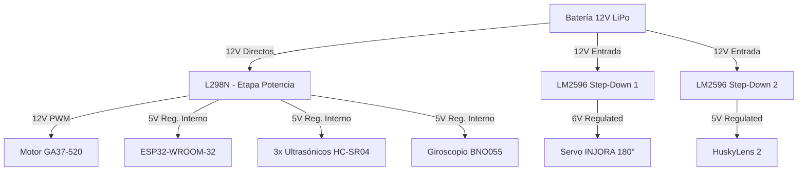
```mermaid
graph TD
    %% Fuente Principal
    BAT[Batería 12V LiPo] -->|12V Directos| L298N_PWR[L298N - Etapa Potencia]
    BAT -->|12V Entrada| LM_6V[LM2596 Step-Down 1]
    BAT -->|12V Entrada| LM_5V[LM2596 Step-Down 2]

    %% Riel 12V
    L298N_PWR -->|12V PWM| MOT[Motor GA37-520]

    %% Riel 6V
    LM_6V -->|6V Regulated| SERVO[Servo INJORA 180°]

    %% Riel 5V Buck
    LM_5V -->|5V Regulated| HUSKY[HuskyLens 2]

    %% Riel 5V L298N
    L298N_PWR -->|5V Reg. Interno| ESP32[ESP32-WROOM-32]
    L298N_PWR -->|5V Reg. Interno| HC[3x Ultrasónicos HC-SR04]
    L298N_PWR -->|5V Reg. Interno| BNO[Giroscopio BNO055]
```

<ul>
  <li>
    <b>Riel Principal de Potencia (12V Directos):</b> La batería alimenta directamente la etapa de potencia del controlador L298N y el motor de tracción (GA37-520). Este riel absorbe transitorios y picos mecánicos de hasta <b>2.1A</b> sin afectar la electrónica sensible.
  </li>
  <li>
    <b>Alimentación Dedicada para Dirección (LM2596 Step-Down a 6V):</b> El servomotor INJORA se alimenta mediante un regulador buck independiente ajustado a 6V. Contar con su propia línea evita que los picos de hasta <b>1.5A</b> generados por el torque del servo causen caídas de tensión en los componentes lógicos.
  </li>
  <li>
    <b>Alimentación Exclusiva para Visión (LM2596 Step-Down a 5V):</b> Se utiliza un segundo convertidor buck ajustado a 5V para alimentar únicamente la HuskyLens 2. Esto provee un flujo de corriente continuo y limpio (350mA - 600mA) indispensable para el procesamiento en tiempo real.
  </li>
  <li>
    <b>Línea de Control e Inercial (5V Salida L298N):</b> El regulador lineal interno de 5V del driver L298N se aprovecha para energizar la ESP32, el giroscopio BNO055 y los tres sensores ultrasónicos HC-SR04. Con un consumo nominal combinado de solo <b>172.5 mA</b>, se mantiene muy por debajo del límite operativo del regulador del puente H.
  </li>
  <li>
    <b>Masa Común (GND):</b> Todas las líneas de masa del sistema se encuentran unificadas para garantizar una referencia fija en los buses de comunicación I2C, UART y las señales de control PWM.
  </li>
</ul>

<p><b>Resumen de Consumo de Corriente por Componente:</b></p>

<table style="border: 1px solid #444; border-collapse: collapse; width: 100%;">
  <thead>
    <tr style="background-color: rgba(255, 255, 255, 0.08); border-bottom: 2px solid #444;">
      <th style="padding: 12px; border: 1px solid #444; text-align: left;">Componente</th>
      <th style="padding: 12px; border: 1px solid #444; text-align: center;">Cantidad</th>
      <th style="padding: 12px; border: 1px solid #444; text-align: center;">Voltaje</th>
      <th style="padding: 12px; border: 1px solid #444; text-align: center;">Corriente sin Carga</th>
      <th style="padding: 12px; border: 1px solid #444; text-align: center;">Corriente Nominal</th>
      <th style="padding: 12px; border: 1px solid #444; text-align: center;">Corriente Pico</th>
    </tr>
  </thead>
  <tbody>
    <tr>
      <td style="padding: 10px; border: 1px solid #444;"><b>ESP32-WROOM-32</b></td>
      <td style="padding: 10px; border: 1px solid #444; text-align: center;">1</td>
      <td style="padding: 10px; border: 1px solid #444; text-align: center;">5V</td>
      <td style="padding: 10px; border: 1px solid #444; text-align: center;">20 mA</td>
      <td style="padding: 10px; border: 1px solid #444; text-align: center;">100 mA</td>
      <td style="padding: 10px; border: 1px solid #444; text-align: center;">260 mA</td>
    </tr>
    <tr style="background-color: rgba(255, 255, 255, 0.02);">
      <td style="padding: 10px; border: 1px solid #444;"><b>Motor Hytech GA37-520</b></td>
      <td style="padding: 10px; border: 1px solid #444; text-align: center;">1</td>
      <td style="padding: 10px; border: 1px solid #444; text-align: center;">12V</td>
      <td style="padding: 10px; border: 1px solid #444; text-align: center;">10 mA</td>
      <td style="padding: 10px; border: 1px solid #444; text-align: center;">1 A</td>
      <td style="padding: 10px; border: 1px solid #444; text-align: center;">2 A</td>
    </tr>
    <tr>
      <td style="padding: 10px; border: 1px solid #444;"><b>Servo INJORA 180°</b></td>
      <td style="padding: 10px; border: 1px solid #444; text-align: center;">1</td>
      <td style="padding: 10px; border: 1px solid #444; text-align: center;">6V</td>
      <td style="padding: 10px; border: 1px solid #444; text-align: center;">150 mA</td>
      <td style="padding: 10px; border: 1px solid #444; text-align: center;">500 mA</td>
      <td style="padding: 10px; border: 1px solid #444; text-align: center;">1.5 A</td>
    </tr>
    <tr style="background-color: rgba(255, 255, 255, 0.02);">
      <td style="padding: 10px; border: 1px solid #444;"><b>Huskylens2 Cam</b></td>
      <td style="padding: 10px; border: 1px solid #444; text-align: center;">1</td>
      <td style="padding: 10px; border: 1px solid #444; text-align: center;">5V</td>
      <td style="padding: 10px; border: 1px solid #444; text-align: center;">350 mA</td>
      <td style="padding: 10px; border: 1px solid #444; text-align: center;">500 mA</td>
      <td style="padding: 10px; border: 1px solid #444; text-align: center;">600 mA</td>
    </tr>
    <tr>
      <td style="padding: 10px; border: 1px solid #444;"><b>Driver L298N (Lógica)</b></td>
      <td style="padding: 10px; border: 1px solid #444; text-align: center;">1</td>
      <td style="padding: 10px; border: 1px solid #444; text-align: center;">12V</td>
      <td style="padding: 10px; border: 1px solid #444; text-align: center;">30 mA</td>
      <td style="padding: 10px; border: 1px solid #444; text-align: center;">70 mA</td>
      <td style="padding: 10px; border: 1px solid #444; text-align: center;">100 mA</td>
    </tr>
    <tr style="background-color: rgba(255, 255, 255, 0.02);">
      <td style="padding: 10px; border: 1px solid #444;"><b>Ultrasonicos HC-SR04</b></td>
      <td style="padding: 10px; border: 1px solid #444; text-align: center;">3</td>
      <td style="padding: 10px; border: 1px solid #444; text-align: center;">5V</td>
      <td style="padding: 10px; border: 1px solid #444; text-align: center;">5 mA</td>
      <td style="padding: 10px; border: 1px solid #444; text-align: center;">20 mA</td>
      <td style="padding: 10px; border: 1px solid #444; text-align: center;">40 mA</td>
    </tr>
    <tr>
      <td style="padding: 10px; border: 1px solid #444;"><b>Giroscopio BNO055</b></td>
      <td style="padding: 10px; border: 1px solid #444; text-align: center;">1</td>
      <td style="padding: 10px; border: 1px solid #444; text-align: center;">3.3V</td>
      <td style="padding: 10px; border: 1px solid #444; text-align: center;">40 μA</td>
      <td style="padding: 10px; border: 1px solid #444; text-align: center;">12.5 mA</td>
      <td style="padding: 10px; border: 1px solid #444; text-align: center;">15 mA</td>
    </tr>
  </tbody>
</table>

<p><b>Balance de Carga por Línea de Alimentación:</b></p>

<table style="border: 1px solid #444; border-collapse: collapse; width: 100%;">
  <thead>
    <tr style="background-color: rgba(255, 255, 255, 0.08); border-bottom: 2px solid #444;">
      <th style="padding: 10px; border: 1px solid #444; text-align: left;">Línea de Alimentación</th>
      <th style="padding: 10px; border: 1px solid #444; text-align: left;">Cargas Conectadas</th>
      <th style="padding: 10px; border: 1px solid #444; text-align: center;">Consumo Nominal</th>
      <th style="padding: 10px; border: 1px solid #444; text-align: center;">Consumo Pico Max.</th>
    </tr>
  </thead>
  <tbody>
    <tr>
      <td style="padding: 10px; border: 1px solid #444;"><b>12V Directo</b></td>
      <td style="padding: 10px; border: 1px solid #444;">Motor GA37-520 + L298N (Lógica)</td>
      <td style="padding: 10px; border: 1px solid #444; text-align: center;">1.07 A</td>
      <td style="padding: 10px; border: 1px solid #444; text-align: center;">2 A</td>
    </tr>
    <tr style="background-color: rgba(255, 255, 255, 0.02);">
      <td style="padding: 10px; border: 1px solid #444;"><b>6V Buck (LM2596 #1)</b></td>
      <td style="padding: 10px; border: 1px solid #444;">Servomotor INJORA 180°</td>
      <td style="padding: 10px; border: 1px solid #444; text-align: center;">0.50 A</td>
      <td style="padding: 10px; border: 1px solid #444; text-align: center;">1.50 A</td>
    </tr>
    <tr>
      <td style="padding: 10px; border: 1px solid #444;"><b>5V Buck (LM2596 #2)</b></td>
      <td style="padding: 10px; border: 1px solid #444;">HuskyLens 2</td>
      <td style="padding: 10px; border: 1px solid #444; text-align: center;">0.50 A</td>
      <td style="padding: 10px; border: 1px solid #444; text-align: center;">0.60 A</td>
    </tr>
    <tr style="background-color: rgba(255, 255, 255, 0.02);">
      <td style="padding: 10px; border: 1px solid #444;"><b>5V Salida L298N</b></td>
      <td style="padding: 10px; border: 1px solid #444;">ESP32 + 3x HC-SR04 + BNO055</td>
      <td style="padding: 10px; border: 1px solid #444; text-align: center;">0.17 A</td>
      <td style="padding: 10px; border: 1px solid #444; text-align: center;">0.40 A</td>
    </tr>
  </tbody>
</table>

<p align="right">
  <a href="#inicio">Volver Al Inicio</a>
</p>

---

## 3.3.3 Sistema de Alimentacion

El diseño del sistema de alimentación de Heimdall se concibió bajo los principios de **eficiencia energética, estabilidad de voltaje e inmunidad al ruido electromagnético**. Debido a que el robot combina componentes con requerimientos eléctricos muy divergentes (actuadores inductivos de alto consumo junto a sensores inerciales y de visión de alta precisión), la arquitectura resuelve tres desafíos críticos:

* **Topología de Regulación Conmutada vs. Lineal:**
  * Se seleccionaron convertidores conmutados (*Buck Converters* LM2596) para los rieles de 6V y 5V principales debido a su alta eficiencia (hasta 92%), reduciendo la disipación de calor y optimizando la autonomía de la batería.
  * Se reservó la regulación lineal integrada del L298N exclusivamente para la ESP32 y sensores (BNO055, HC-SR04), garantizando un rizado de voltaje (*ripple*) mínimo para la estabilidad del procesamiento.
* **Desacoplamiento y Protección Transitoria:**
  * **Aislamiento inductivo:** La separación de líneas previene los reinicios imprevistos (*brownouts*) en la ESP32 cuando el motor principal exige picos de arranque (*stall current*) de hasta 2A.
  * **Interruptor General (Master Switch):** Colocado en el polo positivo de los 12V para permitir un corte de energía rápido y seguro en pista.

#### Diagrama de Flujo del Diseño de Alimentación

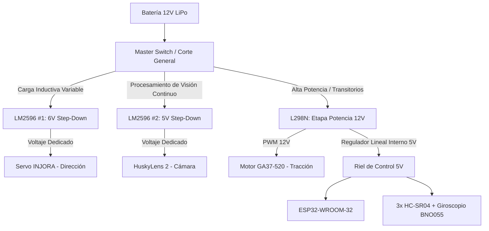
```mermaid
graph TD
    %% Entradas y Criterios
    BAT[Batería 12V LiPo] --> SW[Master Switch / Corte General]
    
    %% Ramificación por Criterio de Carga
    SW -->|Carga Inductiva Variable| BUCK1[LM2596 #1: 6V Step-Down]
    SW -->|Procesamiento de Visión Continuo| BUCK2[LM2596 #2: 5V Step-Down]
    SW -->|Alta Potencia / Transitorios| L298N_PWR[L298N: Etapa Potencia 12V]
    
    %% Salidas a Componentes
    BUCK1 -->|Voltaje Dedicado| SERVO[Servo INJORA - Dirección]
    BUCK2 -->|Voltaje Dedicado| HUSKY[HuskyLens 2 - Cámara]
    L298N_PWR -->|PWM 12V| MOT[Motor GA37-520 - Tracción]
    
    %% Regulador Secundario Lineal
    L298N_PWR -->|Regulador Lineal Interno 5V| REG_5V[Riel de Control 5V]
    REG_5V --> MCU[ESP32-WROOM-32]
    REG_5V --> SENS[3x HC-SR04 + Giroscopio BNO055]
```

<p><b>Esquema Técnico de Aislamiento Eléctrico:</b></p>

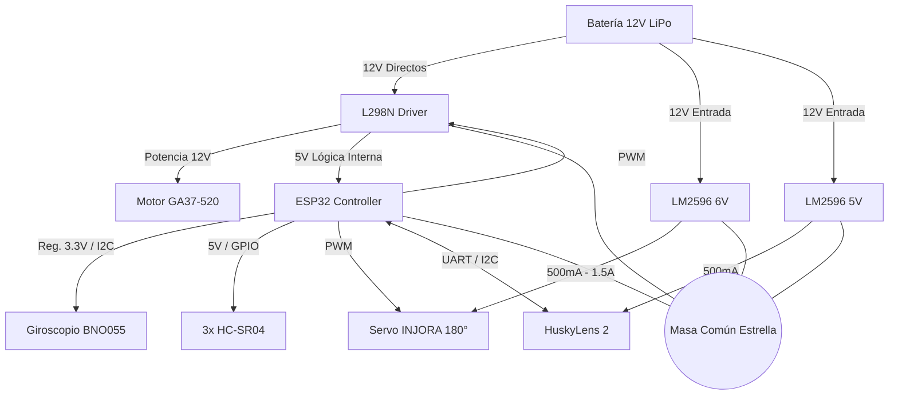
```mermaid
graph TD
    %% Nivel 1: Fuente principal
    BAT[Batería 12V LiPo]

    %% Nivel 2: Reguladores y Potencia
    L298N[L298N Driver]
    BUCK_6V[LM2596 6V]
    BUCK_5V[LM2596 5V]

    BAT -->|12V Directos| L298N
    BAT -->|12V Entrada| BUCK_6V
    BAT -->|12V Entrada| BUCK_5V

    %% Nivel 3: Distribución a Actuadores y Control
    MOT[Motor GA37-520]
    SERVO[Servo INJORA 180°]
    HUSKY[HuskyLens 2]
    ESP[ESP32 Controller]

    L298N -->|Potencia 12V| MOT
    BUCK_6V -->|500mA - 1.5A| SERVO
    BUCK_5V -->|500mA| HUSKY
    L298N -->|5V Lógica Interna| ESP

    %% Nivel 4: Sensórica e Interconexión de Control
    IMU[Giroscopio BNO055]
    SONAR[3x HC-SR04]

    ESP -->|Reg. 3.3V / I2C| IMU
    ESP -->|5V / GPIO| SONAR
    ESP -->|PWM| L298N
    ESP -->|PWM| SERVO
    ESP <-->|UART / I2C| HUSKY

    %% Referencia GND
    GND((Masa Común Estrella))
    L298N --- GND
    BUCK_6V --- GND
    BUCK_5V --- GND
    ESP --- GND
```

> [!TIP]
> **Criterio de Aislamiento y Punto Común de Masa (Star Grounding):**
> Aunque las etapas de potencia (12V/6V) y lógica (5V/3.3V) operan en rieles de voltaje independientes, todas comparten una referencia de masa unificada. Para prevenir bucles de tierra (*ground loops*) y evitar que el ruido del motor altere las lecturas del giroscopio BNO055 o la cámara HuskyLens 2, la conexión a GND se realiza en una **topología en estrella (Star Ground)** conectada directamente al terminal negativo de la batería LiPo.

<p align="right">
  <a href="#inicio">Volver Al Inicio</a>
</p>

---

## 4. Apartado de Programacion

<p>El firmware de <em>Heimdall</em> está estructurado bajo un enfoque modular orientado a tiempo real sobre el microcontrolador ESP32. Para lograr un comportamiento autónomo predecible y altamente reactivo, el software se divide en dos pilares fundamentales: una <strong>Máquina de Estados Finitos (FSM)</strong> para la toma de decisiones lógicas y un <b>Controlador PID (Proporcional-Integral-Derivativo)</b> para la corrección continua del avance y la dirección.</p>

<hr style="border-color: #30363d; margin: 25px 0;">

## Máquina de Estados Finitos (FSM) Coordinada

<p>En lugar de una arquitectura secuencial rígida basada en retardos (<code>delay()</code>), la lógica de control emplea una FSM no bloqueante impulsada por eventos y lecturas de sensores (cámara HuskyLens 2, IMU BNO055 y encoders). Esto garantiza que el robot pueda interrumpir o transicionar de estado en microsegundos ante cualquier imprevisto en la pista.</p>

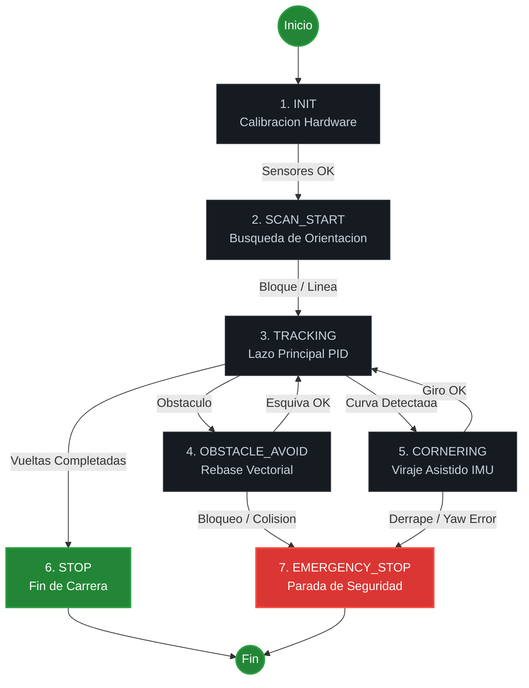
```mermaid
graph TD
    START((Inicio))
    INIT["1. INIT<br/>Calibracion Hardware"]
    SCAN["2. SCAN_START<br/>Busqueda de Orientacion"]
    TRACK["3. TRACKING<br/>Lazo Principal PID"]
    AVOID["4. OBSTACLE_AVOID<br/>Rebase Vectorial"]
    CORNER["5. CORNERING<br/>Viraje Asistido IMU"]
    STOP["6. STOP<br/>Fin de Carrera"]
    EMERGENCY["7. EMERGENCY_STOP<br/>Parada de Seguridad"]
    END_NODE((Fin))

    START --> INIT
    INIT -->|Sensores OK| SCAN
    SCAN -->|Bloque / Linea| TRACK
    
    TRACK -->|Obstaculo| AVOID
    AVOID -->|Esquiva OK| TRACK
    
    TRACK -->|Curva Detectada| CORNER
    CORNER -->|Giro OK| TRACK
    
    TRACK -->|Vueltas Completadas| STOP
    STOP --> END_NODE
    
    AVOID -->|Bloqueo / Colision| EMERGENCY
    CORNER -->|Derrape / Yaw Error| EMERGENCY
    EMERGENCY --> END_NODE

    classDef default fill:#161b22,stroke:#30363d,stroke-width:1px,color:#c9d1d9;
    classDef startEnd fill:#238636,stroke:#2ea043,stroke-width:2px,color:#fff;
    classDef alert fill:#da3633,stroke:#f85149,stroke-width:2px,color:#fff;

    class START,STOP,END_NODE startEnd;
    class EMERGENCY alert;
```

<h3>Lazo Cerrado de Control PID de Dirección</h3>

<p>Para corregir las desviaciones dinámicas respecto al centro del carril o mantener el rumbo deseado durante los tramos rectos, el firmware procesa la ecuación discreta del algoritmo PID en cada ciclo de ejecución de $10\text{ ms}$:</p>

<div style="display: flex; gap: 15px; margin: 15px 0; flex-wrap: wrap;">
  <div style="flex: 1; min-width: 220px; background-color: #161b22; border: 1px solid #30363d; border-radius: 6px; padding: 15px;">
    <h4 style="margin-top: 0; color: #58a6ff;">Término Proporcional ($K_p$)</h4>
    <p style="font-size: 0.88em; color: #c9d1d9; margin-bottom: 0;">Responde de forma inmediata y directa al error de alineación actual ($e(t)$). Genera el par primario de giro sobre el servo en función del descentramiento detectado por la HuskyLens 2.</p>
  </div>
  <div style="flex: 1; min-width: 220px; background-color: #161b22; border: 1px solid #30363d; border-radius: 6px; padding: 15px;">
    <h4 style="margin-top: 0; color: #58a6ff;">Término Integral ($K_i$)</h4>
    <p style="font-size: 0.88em; color: #c9d1d9; margin-bottom: 0;">Acumula los errores pasados en el tiempo. Permite corregir desviaciones sistemáticas permanentes provocadas por holguras mecánicas o imperfecciones en la superficie de la pista.</p>
  </div>
  <div style="flex: 1; min-width: 220px; background-color: #161b22; border: 1px solid #30363d; border-radius: 6px; padding: 15px;">
    <h4 style="margin-top: 0; color: #58a6ff;">Término Derivativo ($K_d$)</h4>
    <p style="font-size: 0.88em; color: #c9d1d9; margin-bottom: 0;">Evalúa la tasa de variación instantánea del error. Actúa como un freno amortiguador que anticipa el sobrepaso (<i>overshoot</i>) para estabilizar el chasis antes de volver al centro.</p>
  </div>
</div>

<div style="background-color: #161b22; border: 1px solid #30363d; border-radius: 8px; padding: 15px; margin: 20px 0; text-align: center;">
  <h4 style="margin-top: 0; color: #f0f6fc;">Diagrama de Bloques del Lazo Cerrado de Control</h4>


```mermaid
graph LR
    SP["Setpoint r(t)<br/>Centro del Carril / Yaw = 0 deg"]
    SUM(("Σ"))
    CONTROLLER["<b>Algoritmo PID Discreto</b><br/>u[n] = Kp·e + Ki·Σe·Δt + Kd·Δe/Δt"]
    SERVO["<b>Servo de Dirección</b><br/>Ángulo θ (Ackermann)"]
    ROBOT["<b>Dinámica de Heimdall</b><br/>Trayectoria en Pista"]
    FEEDBACK["<b>HuskyLens 2 / IMU BNO055</b><br/>Posición y Yaw Medido y(t)"]

    SP -->|"+" Setpoint| SUM
    SUM -->|"- Error e(t)"| CONTROLLER
    CONTROLLER -->|"u[n]"| SERVO
    SERVO --> ROBOT
    ROBOT --> FEEDBACK
    FEEDBACK -->|"- Realimentación"| SUM

    classDef default fill:#161b22,stroke:#30363d,stroke-width:1px,color:#c9d1d9;
    classDef esp fill:#238636,stroke:#2ea043,stroke-width:1px,color:#fff;
    classDef plant fill:#8957e5,stroke:#a371f7,stroke-width:1px,color:#fff;
    
    class CONTROLLER esp;
    class SERVO,ROBOT plant;
```

  <p style="margin-bottom: 0; font-size: 0.85em; color: #8b949e;">
    <em>Estructura de realimentación continua entre la HuskyLens 2 / BNO055, el ESP32 y el servo de dirección Ackermann.</em>
  </p>
</div>

<h3>Comparativa y Análisis Matemático del Sistema PID</h3>

<p>
  El control <strong>PID (Proporcional-Integral-Derivativo)</strong> es el núcleo algorítmico que permite a <em>Heimdall</em> mantener una trayectoria precisa y corregir las desviaciones del chasis en tiempo real. A continuación, se detallan sus bases matemáticas, su modo de aplicación directa en la dirección/tracción y sus ventajas frente a otros métodos de control.
</p>

<!-- Cuadro Comparativo de Sistemas de Control -->
<h4>Matriz Comparativa de Métodos de Control</h4>

<table width="100%" style="border-collapse: collapse; margin: 15px 0; border: 1px solid #30363d; font-size: 14px;">
  <thead style="background-color: #161b22; color: #f0f6fc;">
    <tr>
      <th style="padding: 10px; border: 1px solid #30363d; text-align: left;">Sistema de Control</th>
      <th style="padding: 10px; border: 1px solid #30363d; text-align: left;">Principio de Funcionamiento</th>
      <th style="padding: 10px; border: 1px solid #30363d; text-align: left;">Respuesta Dinámica</th>
      <th style="padding: 10px; border: 1px solid #30363d; text-align: left;">Impacto Mecánico / Térmico</th>
    </tr>
  </thead>
  <tbody>
    <tr>
      <td style="padding: 10px; border: 1px solid #30363d;"><b>Control On-Off (Todo / Nada)</b></td>
      <td style="padding: 10px; border: 1px solid #30363d;">Aplica corrección máxima o nula según el signo del error.</td>
      <td style="padding: 10px; border: 1px solid #30363d; color: #f85149;">Inestable; produce oscilación constante (<i>hunting</i>) alrededor del centro.</td>
      <td style="padding: 10px; border: 1px solid #30363d;">Sobrecarga el servo de dirección y aumenta la fatiga en los nudillos de PETG-CF.</td>
    </tr>
    <tr>
      <td style="padding: 10px; border: 1px solid #30363d;"><b>Control Proporcional Puro (P)</b></td>
      <td style="padding: 10px; border: 1px solid #30363d;">Ajusta el giro de forma proporcional al error actual ($u(t) = K_p \cdot e(t)$).</td>
      <td style="padding: 10px; border: 1px solid #30363d; color: #d29922;">Aceptable, pero deja un error en estado estacionario sin corregir.</td>
      <td style="padding: 10px; border: 1px solid #30363d;">Respuesta brusca en giros cerrados si $K_p$ es muy elevado.</td>
    </tr>
    <tr>
      <td style="padding: 10px; border: 1px solid #30363d;"><b>Control PID Continuo (Implementado)</b></td>
      <td style="padding: 10px; border: 1px solid #30363d;">Combina la acción del error presente ($P$), la historia del error ($I$) y la velocidad de cambio ($D$).</td>
      <td style="padding: 10px; border: 1px solid #30363d; color: #3fb950;"><b>Excelente;</b> trazo suave, sin sobrepaso y corrección de deriva instantánea.</td>
      <td style="padding: 10px; border: 1px solid #30363d;">Movimientos fluidos en el servo, menor consumo energético y conservación de componentes.</td>
    </tr>
  </tbody>
</table>

<hr style="border-color: #30363d; margin: 25px 0;">

<!-- Ecuaciones e Implementación Discreta -->
<h4>Formulación Matemática y Discretización en Código</h4>

<p>
  En la teoría de control continuo, la señal de salida $u(t)$ se define mediante la ecuación diferencial fundamental:
</p>

<p align="center" style="font-size: 1.15em; color: #f0f6fc;">
  $$u(t) = K_p \cdot e(t) + K_i \int_{0}^{t} e(\tau) \, d\tau + K_d \frac{de(t)}{dt}$$
</p>

<p>
  Dado que el microcontrolador (ESP32) procesa datos a intervalos discretos de tiempo ($\Delta t$), la ecuación se aproxima numéricamente en el firmware de la siguiente manera:
</p>

<div style="display: flex; gap: 15px; margin: 15px 0; flex-wrap: wrap;">
  <div style="flex: 1; min-width: 280px; background-color: #161b22; border: 1px solid #30363d; border-radius: 6px; padding: 15px;">
    <h5 style="margin-top: 0; color: #58a6ff;">Ecuación Discreta Implementada</h5>
    <p align="center" style="font-size: 1.05em; color: #f0f6fc;">
      $$u[n] = K_p \cdot e[n] + K_i \sum_{k=0}^{n} (e[k] \cdot \Delta t) + K_d \left( \frac{e[n] - e[n-1]}{\Delta t} \right)$$
    </p>
  </div>

<div style="flex: 1; min-width: 280px; background-color: #161b22; border: 1px solid #30363d; border-radius: 6px; padding: 15px;">
  <h5 style="margin-top: 0; color: #58a6ff;">Variables del Lazo</h5>
  <ul style="margin-bottom: 0; padding-left: 20px; font-size: 0.88em; color: #c9d1d9;">
    <li><b><i>e[n]</i>:</b> Error actual (<i>Target − Actual</i>).</li>
    <li><b><i>e[n-1]</i>:</b> Error en la iteración anterior.</li>
    <li><b>Δt:</b> Tiempo transcurrido entre lecturas (fijado en 10 ms).</li>
    <li><b><i>u[n]</i>:</b> Salida de ángulo para el servo o comando PWM para tracción.</li>
  </ul>
</div>

<hr style="border-color: #30363d; margin: 25px 0;">

<!-- Modo de Uso en Heimdall -->
<h4>¿De qué manera lo utilizamos en <em>Heimdall</em>?</h4>

<div style="display: flex; gap: 15px; margin: 15px 0; flex-wrap: wrap;">
  <div style="flex: 1; min-width: 250px; background-color: #161b22; border: 1px solid #30363d; border-radius: 6px; padding: 15px;">
    <h5 style="margin-top: 0; color: #3fb950;">1. PID de Dirección (Servo Ackermann)</h5>
    <p style="font-size: 0.88em; color: #c9d1d9;">
      El error $e[n]$ representa el desplazamiento del centro del carril detectado por la visión computacional (HuskyLens 2). La salida $u[n]$ ajusta el ángulo del servo respetando la geometría de dirección para evitar derrapes.
    </p>
  </div>

  <div style="flex: 1; min-width: 250px; background-color: #161b22; border: 1px solid #30363d; border-radius: 6px; padding: 15px;">
    <h5 style="margin-top: 0; color: #3fb950;">2. PID de Orientación Giroscópica (IMU BNO055)</h5>
    <p style="font-size: 0.88em; color: #c9d1d9;">
      Durante las rectas prolongadas o maniobras de evasión, el error $e[n]$ es la diferencia entre el ángulo Yaw objetivo y el medido por la IMU. Garantiza un avance rectilíneo perfecto eliminando desviaciones por asimetría mecánica.
    </p>
  </div>
</div>

> [!WARNING]
> ### Advertencias Técnicas y Fenómenos a Prevenir en el PID
>
> 1. **Integral Windup (Saturación Integral):**
>    * **Riesgo:** Si el robot se queda atascado físicamente contra un obstáculo, la acumulación del término *K<sub>i</sub>* crecerá descontroladamente. Al liberarse, el robot girará bruscamente fuera de control.
>    * **Solución en Código:** Implementar un límite máximo o *Clamping* en la suma acumulada de la integral (*I<sub>max</sub>*).
>
> 2. **Ruido Derivativo:**
>    * **Riesgo:** Pequeños saltos bruscos en las lecturas de la cámara o la IMU generan picos gigantescos en la derivada (*K<sub>d</sub>*), provocando vibraciones fuertes en el servo de dirección.
>    * **Solución en Código:** Aplicar un filtro de media móvil o un filtro paso bajo (*Low-Pass Filter*) a la lectura del error antes de calcular la derivada.
>
> 3. **Frecuencia de Muestreo Variable (Δt Inestable):**
>    * **Riesgo:** Si el tiempo entre iteraciones del PID no es estrictamente constante, la integral y la derivada calculan valores erróneos.
>    * **Solución en Código:** Calcular el lazo dentro de una tarea de FreeRTOS con tiempo fijo o asegurando la diferencia exacta con `micros()`.
>
> 4. **Saturación del Actuador (Límite del Servo):**
>    * **Riesgo:** Un cálculo desmedido de *u(t)* puede requerir un ángulo superior al rango físico del sistema Ackermann, forzando mecánicamente las articulaciones impresas en PETG-CF.
>    * **Solución en Código:** Acotar electrónicamente la salida *u(t)* entre [θ<sub>min</sub>, θ<sub>max</sub>] para no sobrepasar el límite físico de los nudillos.

---

> [!TIP]
> ### Procedimiento Práctico de Sintonización en Pista (Tuning)
>
> * **Paso 1 (Proporcional Puro):** Fijar *K<sub>i</sub>* = 0 y *K<sub>d</sub>* = 0. Incrementar *K<sub>p</sub>* progresivamente hasta que el robot siga la línea o carril pero comience a oscilar suavemente de un lado a otro.
> * **Paso 2 (Amortiguamiento Derivativo):** Aumentar *K<sub>d</sub>* paulatinamente para amortiguar el bamboleo introducido por *K<sub>p</sub>*. Ajustar hasta que la entrada al tramo recto sea limpia y sin rebotes.
> * **Paso 3 (Ajuste Integral Fino):** Introducir valores muy pequeños de *K<sub>i</sub>* únicamente si se detecta un sesgo constante hacia un lado de la pista producido por la asimetría del peso o desgaste desigual en los cauchos.

<hr style="border-color: #30363d; margin: 25px 0;">

<h3>Resumen de Beneficios del Firmware Optimizado</h3>

| Característica | Implementación Convencional | Arquitectura de *Heimdall* | Beneficio Directo |
| :--- | :--- | :--- | :--- |
| **Estructura** | Bloqueante con <code>delay()</code> | FSM no bloqueante en FreeRTOS | Respuestas instantáneas ante imprevistos en pista. |
| **Control de Giro** | Proporcional básico o On/Off | **PID Discreto con Anti-Windup** | Trazo fluido sin oscilaciones en la dirección Ackermann. |
| **Filtrado** | Datos crudos de sensores | Filtro Paso Bajo + BNO055 Fusion | Señales estables libres de ruido térmico y vibración. |
| **Consumo Térmico** | Servo forzado por correcciones bruscas | Transiciones continuas $K_p/K_d$ | Menor consumo de batería y mayor vida útil de servos. |
| **Gobernanza** | Bucle único secuencial | Asignación Dual-Core en ESP32 | Procesamiento paralelo de algoritmos sin cuello de botella. |

---

## 4.1 Desafio Abierto

* **Objetivo:** El robot autónomo debe completar con éxito **3 vueltas consecutivas** al circuito en el menor tiempo posible, manteniendo un control absoluto de su trayectoria y deteniéndose de forma controlada al finalizar el recorrido.
* **Restricciónes:** Está estrictamente prohibido que el chasis o cualquier componente del robot toque las paredes o los muros internos de la pista. Cualquier impacto o roce continuo puede penalizar la puntuación de la ronda o invalidar el intento.
* **Factores Aleatorios:** Para garantizar que el vehículo no dependa de una ruta preprogramada o fija, se introducen dos variables aleatorias justo antes de iniciar la competencia:
  * **Sentido de la Marcha:** La dirección en la que el carro debe circular (sentido horario o antihorario) se determina al azar.
  * **Dimensiones de la Pista:** Las dimensiones y la geometría de las paredes del circuito se modifican de forma aleatoria, obligando a los sensores (como ultrasonidos, LiDAR o cámaras) a recalcular las distancias y ajustar el centro del carril en tiempo real.

<p align="right">
  <a href="#inicio">Volver Al Inicio</a>
</p>

## 4.1.1 Flowchart Abierta

En este diagrama de flujo se halla una representación gráfica del funcionamiento lógico de nuestra programación, así como de lo que se espera sea el desempeño del robot al inicializar el programa.


<p align="right">
  <a href="#inicio">Volver Al Inicio</a>
</p>

## 4.1.2 Explicacion del Codigo

<p>Nuestro código implementa una <b>Máquina de Estados Finitos (FSM)</b> que opera en tiempo real de forma asíncrona. La toma de decisiones está diseñada para ejecutarse de manera lineal y estrecha, eliminando los <code>delay()</code> bloqueantes durante el recorrido mediante el uso de <code>millis()</code> y <code>micros()</code> para garantizar una respuesta ultrarrápida del IMU (<b>BNO055</b>) y de los sensores ultrasónicos.</p>

<p>A continuación, se explica detalladamente cómo funciona cada bloque del código, abarcando las variables de control, los estados de navegación, las lecturas sensoriales y las rutinas de evasión del robot:</p>

<hr/>

<details style="border: 1px solid #ddd; padding: 15px; border-radius: 6px; margin-bottom: 15px; background-color: #fafafa;">
  <summary style="font-weight: bold; cursor: pointer; font-size: 1.1em;">1. Librerías, Definición de Pines y Parámetros</summary>
  <div style="margin-top: 10px;">
    <p>Se declaran las librerías necesarias, la asignación física de pines en el ESP32, las instancias para los sensores ultrasónicos y la IMU, así como las constantes de calibración de dirección y banderas de estado.</p>

```cpp
#include <Wire.h>
#include <NewPing.h>
#include <ESP32Servo.h>
#include <Adafruit_Sensor.h>
#include <Adafruit_BNO055.h>
#include <utility/imumaths.h>

// Pins sensores ultrasónicos
#define USTFRONT 13
#define USEFRONT 12
#define USTLEFT 14
#define USELEFT 27
#define USTRIGHT 26
#define USERIGHT 25
#define MAX_DISTANCE 357

// Pins motor, servo y botón
#define IN2 19
#define IN1 18
#define PIN_SERVO 2
#define PIN_BOTON 15

// Objetos
NewPing USFRONT(USTFRONT, USEFRONT, MAX_DISTANCE);
NewPing USLEFT(USTLEFT, USELEFT, MAX_DISTANCE);
NewPing USRIGHT(USTRIGHT, USERIGHT, MAX_DISTANCE);

Servo myservo;
Adafruit_BNO055 bno = Adafruit_BNO055(55, 0x28, &Wire);

// Variables de medición BNO055
float anguloZ = 0;
float anguloFiltrado = 0;
float anguloMagnetometro = 0;
float anguloGiroscopio = 0;
unsigned long lastTimeBNO = 0;
bool bnoListo = false;

// Variables de giro acumulado
float anguloAcumulado = 0;
float anguloObjetivoRelativo = 0;
float anguloInicioGiroRelativo = 0;

// Configuración de ángulos de giro asimétricos
const float ANGULO_GIRO_IZQUIERDA = 86.0;
const float ANGULO_GIRO_DERECHA = 71.3;

// Constantes de distancia y tiempos
const int DISTANCIA_OBSTACULO_FRONTAL = 40;
const int DISTANCIA_OBSTACULO_LATERAL = 120;
const unsigned long TIEMPO_ESPERA_GIRO = 700;
const int MAX_GIROS = 12;
const float AJUSTE_GIRO_RETROCESO = 0.2;
const int GRADOS_MAX_RETROCESO = 80;

// Compensación y ángulos de servo
const int COMPENSACION_CENTRO_IZQUIERDA = 0;
const int CENTRO_BASE = 94;
const int ANGULO_SERVO_IZQ = 120;
const int ANGULO_SERVO_DER = 60;
int centroServoActual = CENTRO_BASE;

// Variables de estado (FSM)
bool programaIniciado = false;
bool finalizado = false;
bool girando = false;
bool enAvanceFinal = false;
bool giroIzquierda = false;
bool retrocediendo = false;
bool retrocesoRealizado = false;
bool recalculandoGiro = false;
bool obstaculoFrontalConfirmado = false;

unsigned long tiempoUltimoGiro = 0;
unsigned long tiempoInicioFinal = 0;
unsigned long tiempoInicioRetroceso = 0;
unsigned long tiempoInicioFrontal = 0;
int contadorGiros = 0;
int lecturasFrontales = 0;

float anguloObjetivo = 0;
float gyro = 0;
float anguloInicioGiro = 0;
float anguloOriginal = 0;
float anguloNecesario = 0;
float errorAcumulado = 0;
```

  <p><b>Explicación:</b> Asigna los recursos de hardware e inicializa los parámetros clave. Se configuran ángulos de viraje asimétricos (86.0° a la izquierda y 71.3° a la derecha) para absorber desviaciones o holguras mecánicas de la dirección, junto con los límites de distancia ultrasónica (40 cm frontal, 120 cm lateral).</p>
  </div>
</details>

<details style="border: 1px solid #ddd; padding: 15px; border-radius: 6px; margin-bottom: 15px; background-color: #fafafa;">
  <summary style="font-weight: bold; cursor: pointer; font-size: 1.1em;">2. Control e Integración del Sensor BNO055</summary>
  <div style="margin-top: 10px;">
   <p>Funciones encargadas del arranque, lectura vectorial, filtrado complementario e integración del ángulo acumulado a partir de la velocidad angular del giroscopio.</p>

```cpp
bool iniciarBNO055() {
  Serial.println("Inicializando BNO055...");
  
  Wire.begin(21, 22);
  Wire.setClock(400000);
  
  delay(2000);
  
  for (int intento = 0; intento < 10; intento++) {
    Serial.print("Intento ");
    Serial.print(intento + 1);
    Serial.print("/10... ");
    
    if (bno.begin()) {
      Serial.println("OK");
      bno.setExtCrystalUse(true);
      bno.setMode(OPERATION_MODE_COMPASS);
      
      uint8_t system, gyro, accel, mag;
      bno.getCalibration(&system, &gyro, &accel, &mag);
      Serial.print("Estado: S:");
      Serial.print(system);
      Serial.print(" G:");
      Serial.print(gyro);
      Serial.print(" A:");
      Serial.print(accel);
      Serial.print(" M:");
      Serial.println(mag);
      
      sensors_event_t event;
      bno.getEvent(&event);
      anguloMagnetometro = event.orientation.x;
      if (anguloMagnetometro > 180) anguloMagnetometro -= 360;
      
      anguloZ = -anguloMagnetometro;
      anguloFiltrado = anguloZ;
      anguloGiroscopio = anguloZ;
      lastTimeBNO = micros();
      
      anguloAcumulado = 0;
      
      return true;
    }
    
    Serial.println("FALLÓ");
    delay(500);
  }
  
  return false;
}

void actualizarBNO() {
  if (!bnoListo) return;
  
  imu::Vector<3> gyro = bno.getVector(Adafruit_BNO055::VECTOR_GYROSCOPE);
  
  sensors_event_t event;
  bno.getEvent(&event);
  anguloMagnetometro = event.orientation.x;
  if (anguloMagnetometro > 180) anguloMagnetometro -= 360;
  
  unsigned long ahora = micros();
  float dt = (ahora - lastTimeBNO) / 1000000.0;
  lastTimeBNO = ahora;
  
  if (dt > 0 && dt < 0.1) {
    anguloGiroscopio += gyro.z() * dt;
    
    anguloFiltrado = 0.95 * (anguloFiltrado + gyro.z() * dt) + 0.05 * (-anguloMagnetometro);
    if (anguloFiltrado > 180) anguloFiltrado -= 360;
    if (anguloFiltrado < -180) anguloFiltrado += 360;
    
    anguloZ = anguloFiltrado;
  }
}

float getGyro() {
  actualizarBNO();
  return anguloZ;
}

float getAnguloRelativo() {
  imu::Vector<3> gyro = bno.getVector(Adafruit_BNO055::VECTOR_GYROSCOPE);
  
  unsigned long ahora = micros();
  float dt = (ahora - lastTimeBNO) / 1000000.0;
  lastTimeBNO = ahora;
  
  if (dt > 0 && dt < 0.1) {
    anguloAcumulado += gyro.z() * dt;
  }
  
  return anguloAcumulado;
}

void resetearAnguloAcumulado() {
  anguloAcumulado = 0;
  Serial.println("Ángulo acumulado resetado a 0");
}

float normalizarError(float error) {
  if (error > 180) error -= 360;
  if (error < -180) error += 360;
  return error;
}
```

 <p><b>Explicación:</b> El IMU se configura en <code>OPERATION_MODE_COMPASS</code> sobre I2C a 400 kHz. Para evitar discontinuidades al cruzar los 180° o 360° durante los giros, <code>getAnguloRelativo()</code> realiza la integración continua diferencial del eje Z mediante lecturas precisas en microsegundos (<code>micros()</code>).</p>
  </div>
</details>

<details style="border: 1px solid #ddd; padding: 15px; border-radius: 6px; margin-bottom: 15px; background-color: #fafafa;">
  <summary style="font-weight: bold; cursor: pointer; font-size: 1.1em;">3. Drivers de Tracción, Dirección y Ultrasonidos</summary>
  <div style="margin-top: 10px;">
    <p>Funciones básicas que abstraen el control físico del motor DC (mediante puente H), posición del servomotor de dirección y lecturas procesadas por la librería NewPing.</p>

```cpp
void motorAdelante() {
  digitalWrite(IN1, HIGH);
  digitalWrite(IN2, LOW);
}

void motorRetroceder() {
  digitalWrite(IN1, LOW);
  digitalWrite(IN2, HIGH);
}

void motorParar() {
  digitalWrite(IN1, LOW);
  digitalWrite(IN2, LOW);
}

void servoCentro() {
  if (girando || retrocediendo || enAvanceFinal) {
    myservo.write(CENTRO_BASE);
  } else {
    myservo.write(centroServoActual);
  }
}

void actualizarCentroServo(bool giroFueIzquierda) {
  if (giroFueIzquierda) {
    centroServoActual = CENTRO_BASE + COMPENSACION_CENTRO_IZQUIERDA;
    Serial.printf("Centro para RECTA ajustado a %d\n", centroServoActual);
  } else {
    centroServoActual = CENTRO_BASE;
    Serial.printf("Centro para RECTA restaurado a %d\n", centroServoActual);
  }
}

int leerUltrasonico(NewPing &sensor) {
  int d = sensor.ping_cm();
  if (d == 0) return -1;
  return d;
}

int correccionServo(float error) {
  float ae = abs(error);
  
  if (ae > 35) return 25;
  if (ae > 20) return 15;
  if (ae > 10) return 8;
  return 4;
}

void Adelante() {
  motorAdelante();
  servoCentro();
}

void Parar() {
  motorParar();
}
```

  <p><b>Explicación:</b> La función <code>correccionServo()</code> aplica un algoritmo de escalonamiento proporcional por tramos según la magnitud del error angular acumulado. Permite correcciones suaves cuando el robot está cerca del ángulo meta y giros pronunciados ante desvíos grandes.</p>
  </div>
</details>

<details style="border: 1px solid #ddd; padding: 15px; border-radius: 6px; margin-bottom: 15px; background-color: #fafafa;">
  <summary style="font-weight: bold; cursor: pointer; font-size: 1.1em;">4. Inicialización de Giros (iniciarGiroIzquierda / Derecha)</summary>
  <div style="margin-top: 10px;">
    <p>Rutinas que capturan la referencia angular inicial antes de entrar al estado de rotación y asignan el servomotor a su valor límite máximo.</p>
    
```cpp
void iniciarGiroIzquierda() {
  float anguloActual = getAnguloRelativo();
  anguloInicioGiroRelativo = anguloActual;
  anguloOriginal = ANGULO_GIRO_IZQUIERDA;
  anguloObjetivoRelativo = anguloActual + ANGULO_GIRO_IZQUIERDA;
  
  giroIzquierda = true;
  girando = true;
  retrocediendo = false;
  retrocesoRealizado = false;
  recalculandoGiro = false;
  obstaculoFrontalConfirmado = false;
  lecturasFrontales = 0;
  
  myservo.write(ANGULO_SERVO_IZQ);
  motorAdelante();
  
  Serial.printf("Inicio giro IZQUIERDA: Actual: %.1f° | Objetivo: %.1f°\n", 
                anguloActual, anguloObjetivoRelativo);
}

void iniciarGiroDerecha() {
  float anguloActual = getAnguloRelativo();
  anguloInicioGiroRelativo = anguloActual;
  anguloOriginal = ANGULO_GIRO_DERECHA;
  anguloObjetivoRelativo = anguloActual - ANGULO_GIRO_DERECHA;
  
  giroIzquierda = false;
  girando = true;
  retrocediendo = false;
  retrocesoRealizado = false;
  recalculandoGiro = false;
  obstaculoFrontalConfirmado = false;
  lecturasFrontales = 0;
  
  myservo.write(ANGULO_SERVO_DER);
  motorAdelante();
  
  Serial.printf("Inicio giro DERECHA: Actual: %.1f° | Objetivo: %.1f°\n", 
                anguloActual, anguloObjetivoRelativo);
}
```

  <p><b>Explicación:</b> Guarda el <code>anguloInicioGiroRelativo</code>, resetea banderas de obstáculo e inmediatamente inclina la dirección (120° izquierda o 60° derecha) para iniciar la curva en la FSM sin pausar los motores de tracción.</p>
  </div>
</details>

<details style="border: 1px solid #ddd; padding: 15px; border-radius: 6px; margin-bottom: 15px; background-color: #fafafa;">
  <summary style="font-weight: bold; cursor: pointer; font-size: 1.1em;">5. Control Angular y Retroceso Defensivo (actualizarGiro)</summary>
  <div style="margin-top: 10px;">
    <p>Controlador no bloqueante de rotación que supervisa el ángulo alcanzado, realiza filtros de confirmación frontal y ejecuta retrocesos defensivos si hay colisión inminente.</p>

```cpp
void actualizarGiro() {
  float anguloActual = getAnguloRelativo();

  float error = anguloObjetivoRelativo - anguloActual;
  int corr = correccionServo(error);
  
  float gradosGirados = abs(anguloActual - anguloInicioGiroRelativo);

  int frontal = leerUltrasonico(USFRONT);
  
  if (frontal != -1 && frontal <= DISTANCIA_OBSTACULO_FRONTAL) {
    lecturasFrontales++;
    
    if (lecturasFrontales >= 3 || (millis() - tiempoInicioFrontal > 200 && lecturasFrontales > 0)) {
      obstaculoFrontalConfirmado = true;
    }
    
    if (lecturasFrontales == 1) {
      tiempoInicioFrontal = millis();
    }
  } else {
    if (lecturasFrontales > 0) {
      lecturasFrontales--;
    }
    if (lecturasFrontales == 0) {
      obstaculoFrontalConfirmado = false;
      tiempoInicioFrontal = 0;
    }
  }

  static unsigned long lastPrint = 0;
  if (millis() - lastPrint > 200) {
    Serial.printf("Angulo: %.1f° | Objetivo: %.1f° | Error: %.1f° | Girados: %.1f° | Servo: %d°\n",
                  anguloActual, anguloObjetivoRelativo, error, gradosGirados, myservo.read());
    lastPrint = millis();
  }

  // ========== LÓGICA DE RETROCESO ==========
  if (!retrocesoRealizado && !recalculandoGiro && 
      obstaculoFrontalConfirmado && 
      gradosGirados < GRADOS_MAX_RETROCESO && 
      !retrocediendo) {
    
    Serial.printf("OBSTACULO FRONTAL A %dcm - Retrocediendo\n", frontal);
    
    float anguloFaltante = anguloOriginal - gradosGirados;
    float anguloConAjuste = anguloFaltante - AJUSTE_GIRO_RETROCESO;
    
    if (giroIzquierda) {
      anguloNecesario = anguloActual + anguloConAjuste;
    } else {
      anguloNecesario = anguloActual - anguloConAjuste;
    }
    
    retrocediendo = true;
    retrocesoRealizado = true;
    recalculandoGiro = true;
    tiempoInicioRetroceso = millis();
    motorParar();
    myservo.write(CENTRO_BASE);
    delay(50);
    motorRetroceder();
    
    Serial.printf("Ángulo faltante: %.1f° | Nuevo objetivo: %.1f°\n", anguloFaltante, anguloNecesario);
    return;
  }
  
  if (retrocediendo) {
    myservo.write(CENTRO_BASE);
    
    if (millis() - tiempoInicioRetroceso < 800) {
      motorRetroceder();
      return;
    } else {
      retrocediendo = false;
      Serial.println("Retroceso completado");
      
      anguloObjetivoRelativo = anguloNecesario;
      
      Serial.printf("Reanudando giro con nuevo objetivo: %.1f°\n", anguloObjetivoRelativo);
      
      if (giroIzquierda) {
        myservo.write(ANGULO_SERVO_IZQ);
      } else {
        myservo.write(ANGULO_SERVO_DER);
      }
      motorAdelante();
      return;
    }
  }

  // ========== DURANTE EL GIRO ==========
  if (abs(error) <= 4) {
    motorParar();
    myservo.write(CENTRO_BASE);
    girando = false;
    retrocesoRealizado = false;
    recalculandoGiro = false;
    obstaculoFrontalConfirmado = false;
    lecturasFrontales = 0;
    contadorGiros++;
    tiempoUltimoGiro = millis();

    actualizarCentroServo(giroIzquierda);

    Serial.printf("Giro completado. Conteo: %d/%d\n", contadorGiros, MAX_GIROS);

    if (contadorGiros >= MAX_GIROS) {
      enAvanceFinal = true;
      tiempoInicioFinal = millis();
    }
    return;
  }

  if (error > 0) {
    myservo.write(CENTRO_BASE + corr);
  } else {
    myservo.write(CENTRO_BASE - corr);
  }

  motorAdelante();
}
```

  <p><b>Explicación:</b> Si durante una curva el sensor frontal detecta una pared antes de superar los 80° de giro, confirma la presencia (3 lecturas o 200 ms) y conmuta a la maniobra defensiva: centra la dirección, marcha atrás durante 800 ms, recalcula el ángulo restante descontando <code>AJUSTE_GIRO_RETROCESO</code> y reanuda el giro dinámicamente hasta alcanzar una tolerancia final de $|Error| \le 4^\circ$.</p>
  </div>
</details>

<details style="border: 1px solid #ddd; padding: 15px; border-radius: 6px; margin-bottom: 15px; background-color: #fafafa;">
  <summary style="font-weight: bold; cursor: pointer; font-size: 1.1em;">6. Setup, Loop Principal y Estacionamiento (setup / loop / actualizarFinal)</summary>
  <div style="margin-top: 10px;">
    <p>Punto de entrada del sistema, bucle asíncrono FSM y secuencia de finalización tras completar el recorrido del circuito.</p>

```cpp
void actualizarFinal() {
  motorAdelante();
  if (millis() - tiempoInicioFinal >= 100) {
    Parar();
    myservo.write(CENTRO_BASE);
    enAvanceFinal = false;
    finalizado = true;
    Serial.println("Giros completados - Robot detenido");
  }
}

// ===== SETUP =====
void setup() {
  Serial.begin(115200);
  Serial.println("\n");
  Serial.println("=========================================");
  Serial.println("ROBOT CON BNO055 - ÁNGULO RELATIVO");
  Serial.println("=========================================");
  Serial.printf("Giro IZQUIERDA: %.1f°\n", ANGULO_GIRO_IZQUIERDA);
  Serial.printf("Giro DERECHA: %.1f°\n", ANGULO_GIRO_DERECHA);
  Serial.println("=========================================");
  Serial.println();

  pinMode(PIN_BOTON, INPUT_PULLUP);
  pinMode(IN1, OUTPUT);
  pinMode(IN2, OUTPUT);

  myservo.attach(PIN_SERVO);
  centroServoActual = CENTRO_BASE;
  myservo.write(CENTRO_BASE);

  bnoListo = iniciarBNO055();
  if (!bnoListo) {
    Serial.println("ERROR: BNO055 no detectado");
    while (1) delay(10);
  }
  Serial.println("BNO055 listo");

  resetearAnguloAcumulado();

  Parar();
  delay(3000);
  Serial.println("Esperando pulsar boton para iniciar...");
}

// ===== LOOP =====
void loop() {
  if (!programaIniciado) {
    if (digitalRead(PIN_BOTON) == LOW) {
      programaIniciado = true;
      Serial.println("Boton presionado, iniciando programa...");
      delay(300);
    }
    return;
  }

  if (finalizado) {
    Parar();
    return;
  }

  if (enAvanceFinal) {
    actualizarFinal();
    return;
  }

  if (girando) {
    actualizarGiro();
    return;
  }

  int frontal = leerUltrasonico(USFRONT);
  int izquierda = leerUltrasonico(USLEFT);
  int derecha = leerUltrasonico(USRIGHT);

  static unsigned long lastPrint = 0;
  if (millis() - lastPrint > 500) {
    Serial.printf("Frontal: %d | Izquierda: %d | Derecha: %d\n", frontal, izquierda, derecha);
    lastPrint = millis();
  }

  if (frontal != -1 && frontal <= DISTANCIA_OBSTACULO_FRONTAL) {
    Parar();
    return;
  }

  Adelante();

  if (millis() - tiempoUltimoGiro < TIEMPO_ESPERA_GIRO) {
    return;
  }

  if (izquierda != -1 && izquierda > DISTANCIA_OBSTACULO_LATERAL) {
    Serial.println("Girando a la izquierda por espacio libre");
    iniciarGiroIzquierda();
    return;
  }

  if (derecha != -1 && derecha > DISTANCIA_OBSTACULO_LATERAL) {
    Serial.println("Girando a la derecha por espacio libre");
    iniciarGiroDerecha();
    return;
  }
}
```

  <p><b>Explicación:</b> El <code>loop()</code> actúa como orquestador de prioridades. Una vez iniciado por el botón, evalúa de mayor a menor jerarquía: finalización del programa, parqueo final, estado de giro inercial, frenado de emergencia por pared frontal y, por último, detección de huecos libres laterales (>120 cm) para desencadenar giros tras superar el tiempo de inmunidad posterior al viraje (700 ms).</p>
  </div>
</details>

<p align="right">
  <a href="#inicio">Volver Al Inicio</a>
</p>

---

## 4.1.3 Pruebas en Pista

 <p>
    En la fase de desafío abierto, el objetivo principal del sistema es completar las vueltas reglamentarias en la pista en el menor tiempo posible, manteniendo la estabilidad direccional sin la presencia de obstáculos de color. En esta etapa se evaluó la respuesta del control de tracción y dirección al incrementar la velocidad PWM del motor, así como la repetibilidad del conteo de vueltas mediante odometría.
  </p>

  <h3>Parámetros de Calibración y Rendimiento</h3>

  <p>
    Las pruebas se ejecutaron progresivamente aumentando la consigna de potencia en los motores de propulsión. Se evaluó la estabilidad del vehículo, la desviación respecto al centro del carril y el tiempo transcurrido en completar el circuito.
  </p>

  <h4 style="color: #1a7a60; border-bottom: 2px solid #1a7a60; padding-bottom: 4px; margin-top: 20px;">Pruebas en pista 1: Velocidad Base (170 PWM)</h4>

  <table style="width: 100%; border-collapse: collapse; margin-bottom: 12px; font-size: 13px; text-align: center;">
    <thead>
      <tr style="background-color: #1a7a60; color: #ffffff;">
        <th style="padding: 8px; text-align: left;">Parámetro / Variable</th>
        <th style="padding: 8px;">P1</th>
        <th style="padding: 8px;">P2</th>
        <th style="padding: 8px;">P3</th>
        <th style="padding: 8px;">P4</th>
        <th style="padding: 8px;">P5</th>
        <th style="padding: 8px;">P6</th>
        <th style="padding: 8px;">P7</th>
      </tr>
    </thead>
    <tbody>
      <tr style="background-color: #ffffff;">
        <td style="text-align: left; padding: 6px; font-weight: 600;">Velocidad Motor (PWM)</td>
        <td>170</td><td>170</td><td>170</td><td>170</td><td>170</td><td>170</td><td>170</td>
      </tr>
      <tr style="background-color: #f8f9fa;">
        <td style="text-align: left; padding: 6px; font-weight: 600;">Tiempo Transcurrido (s)</td>
        <td>57s</td><td>1:07m</td><td>56,02s</td><td>59,8s</td><td>1:15m</td><td>1:08m</td><td>1:26m</td>
      </tr>
      <tr style="background-color: #e8f5e9; font-weight: bold;">
        <td style="text-align: left; padding: 6px;">¿Lo logró?</td>
        <td style="color: #2e7d32;">Sí</td>
        <td style="color: #2e7d32;">Sí</td>
        <td style="color: #2e7d32;">Sí</td>
        <td style="color: #2e7d32;">Sí</td>
        <td style="color: #2e7d32;">Sí</td>
        <td style="color: #2e7d32;">Sí</td>
        <td style="color: #2e7d32;">Sí</td>
      </tr>
    </tbody>
  </table>

  <ul style="font-size: 13px; margin-top: 5px; padding-left: 20px; color: #333333;">
    <li><b>Pruebas 1 a 7 (Éxito Total):</b> Hizo la pista con completo éxito con un tiempo aceptable. Se demostró una fiabilidad del 100% en la navegación y el trazado de curvas, garantizando que el vehículo complete el circuito sin colisiones ni fallos de lectura.</li>
  </ul>

  <br>

  <h4 style="color: #1a7a60; border-bottom: 2px solid #1a7a60; padding-bottom: 4px; margin-top: 10px;">Pruebas en pista 2: Velocidad Máxima (255 PWM)</h4>

  <table style="width: 100%; border-collapse: collapse; margin-bottom: 12px; font-size: 13px; text-align: center;">
    <thead>
      <tr style="background-color: #1a7a60; color: #ffffff;">
        <th style="padding: 8px; text-align: left;">Parámetro / Variable</th>
        <th style="padding: 8px;">P1</th>
        <th style="padding: 8px;">P2</th>
        <th style="padding: 8px;">P3</th>
        <th style="padding: 8px;">P4</th>
        <th style="padding: 8px;">P5</th>
        <th style="padding: 8px;">P6</th>
        <th style="padding: 8px;">P7</th>
      </tr>
    </thead>
    <tbody>
      <tr style="background-color: #ffffff;">
        <td style="text-align: left; padding: 6px; font-weight: 600;">Velocidad Motor (PWM)</td>
        <td>255</td><td>255</td><td>255</td><td>255</td><td>255</td><td>255</td><td>255</td>
      </tr>
      <tr style="background-color: #f8f9fa;">
        <td style="text-align: left; padding: 6px; font-weight: 600;">Tiempo Transcurrido (s)</td>
        <td>7s</td><td>26,9s</td><td>25,3s</td><td>14,8s</td><td>20,7s</td><td>21,8s</td><td>23,1s</td>
      </tr>
      <tr style="background-color: #e8f5e9; font-weight: bold;">
        <td style="text-align: left; padding: 6px;">¿Lo logró?</td>
        <td style="color: #c62828;">No</td>
        <td style="color: #2e7d32;">Sí</td>
        <td style="color: #2e7d32;">Sí</td>
        <td style="color: #c62828;">No</td>
        <td style="color: #2e7d32;">Sí</td>
        <td style="color: #2e7d32;">Sí</td>
        <td style="color: #2e7d32;">Sí</td>
      </tr>
    </tbody>
  </table>

  <ul style="font-size: 13px; margin-top: 5px; padding-left: 20px; color: #333333;">
    <li><b>Prueba 1:</b> Fallo en el ultrasónico frontal; el vehículo falló e impactó la pared a los 7 segundos.</li>
    <li><b>Pruebas 2 y 3:</b> Hizo la pista con completo éxito con un buen tiempo (26,9s y 25,3s respectivamente).</li>
    <li><b>Prueba 4:</b> El vehículo falló e impactó la pared interna a los 14,8 segundos debido a la inercia del viraje.</li>
    <li><b>Pruebas 5, 6 y 7:</b> Hizo la pista con completo éxito con un buen tiempo, manteniendo regularidad alrededor de los 20-23 segundos.</li>
  </ul>

  <br>

  <h3>Análisis de Resultados</h3>

  <ul>
    <li><b>Rendimiento y Potencia:</b> El incremento de potencia a 255 PWM redujo el tiempo por vuelta en aproximadamente un 31% en comparación con el perfil conservador de 170 PWM, pasando de un promedio de 1 minuto a 20,5 segundos en las ejecuciones exitosas.</li>
    <li><b>Conclusión de la Prueba:</b> A una velocidad menor (170 PWM) aseguramos que haga la pista el 100% de las veces aunque en un tiempo mayor, mientras que a una velocidad más aumentada (255 PWM) se logra realizar la pista en un tiempo considerablemente menor pero con un margen de fallo de aproximadamente el 20%.</li>
  </ul>

</div>

> [!TIP]
> * **Escalado Dinámico de PWM:** Implementa una lectura analógica del voltaje de la batería para escalar la potencia de los motores, garantizando que el control PID mantenga la misma respuesta angular sin importar la descarga.
> * **Desaceleración Previa a Virajes:** Utiliza la odometría para reducir la velocidad objetivo en un 20% justo antes de tomar las curvas de $90^\circ$ para evitar el deslizamiento del eje trasero.

> [!WARNING]
> * **Calibración In Situ del BNO055:** Nunca inicies la rutina sin calibrar o fijar el punto cero ($0^\circ$) directamente en la pista de prueba. Las estructuras metálicas o motores cercanos pueden distorsionar la lectura inercial inicial.

<p align="right">
  <a href="#inicio">Volver Al Inicio</a>
</p>

---

## 4.2 Desafio Cerrado

* **Objetivo:** El robot autónomo debe completar **3 vueltas al circuito** esquivando señales de tráfico representadas por pilares de colores. El robot debe procesar la información visual e interactuar con los obstáculos bajo las siguientes reglas de tránsito:
  * **Pilares Rojos:** Indican una restricción de paso por la izquierda. El robot debe esquivarlos obligatoriamente manteniéndose por el **lado derecho** del carril.
  * **Pilares Verdes:** Indican una restricción de paso por la derecha. El robot debe esquivarlos obligatoriamente manteniéndose por el **lado izquierdo** del carril.
* **Maniobra de Estacionamiento Autónomo:** Una vez completada la tercera vuelta, el vehículo debe salir del bucle de carrera, localizar de manera autónoma la zona de aparcamiento (parking area) asignada y ejecutar una maniobra para estacionarse por completo. 
* **Restricciones de Parqueo:** El carro debe quedar estático dentro del espacio delimitado sin tocar ninguna de las barreras o líneas que rodean el área de estacionamiento.
* **Factores Aleatorios:** Al igual que en el reto abierto, tanto la dirección de la marcha como la ubicación exacta y el orden de los pilares de colores en la pista se configuran de manera completamente aleatoria antes de cada intento, poniendo a prueba la robustez del algoritmo de detección.

## 4.2.1 Flowchart Cerrada

En este diagrama de flujo se halla una representación gráfica del funcionamiento lógico de nuestra programación, así como de lo que se espera sea el desempeño del robot al inicializar el programa.

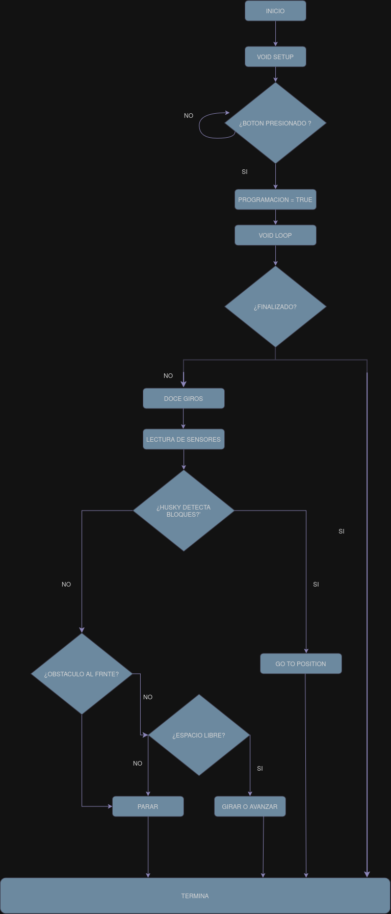

<p align="right">
  <a href="#inicio">Volver Al Inicio</a>
</p>

## 4.2.2 Explicacion del Codigo

<p>Nuestro código implementa una <b>Máquina de Estados Finitos (FSM)</b> que opera en tiempo real de forma asíncrona. La toma de decisiones está diseñada para ejecutarse de manera lineal y continua, eliminando los <code>delay()</code> bloqueantes durante el recorrido mediante el uso de <code>millis()</code> y <code>micros()</code> para garantizar una respuesta ultrarrápida del IMU (<b>BNO055</b>), la visión artificial (<b>HuskyLens 2</b>) y el conteo de ticks por <b>encoders magnéticos</b>.</p>

<p>A continuación, se explica detalladamente cómo funciona cada bloque del código, abarcando las variables de control, los estados de navegación, la clasificación de bloques por color y las rutinas de evasión del robot:</p>

<hr/>

<details style="border: 1px solid #30363d; padding: 15px; border-radius: 8px; margin-bottom: 15px; background-color: #0d1117;">
  <summary style="font-weight: bold; cursor: pointer; font-size: 1.1em; color: #58a6ff;">1. Librerías, Definición de Pines y Constantes de Control</summary>
  <div style="margin-top: 10px;">
    <p>Se declaran e incluyen los controladores de periféricos para la comunicación I2C/UART, sensórica inercial, lectura de ultrasonidos, manejo del servomotor de dirección y visión artificial mediante la HuskyLens 2. Se fijan las constantes de velocidad, ángulos de servomotor, umbrales de ticks por encoder y asignación física de pines en el ESP32.</p>

```cpp
#include <Wire.h>
#include <NewPing.h>
#include <ESP32Servo.h>
#include <DFRobot_HuskylensV2.h>
#include <Adafruit_Sensor.h>
#include <Adafruit_BNO055.h>
#include <utility/imumaths.h>

// ----- VELOCIDADES -----
#define VELOCIDAD_NORMAL   210
#define VELOCIDAD_REVERSA   160
#define VELOCIDAD_RETROCESO_EVASIVO  50   // Velocidad para retroceso por obstáculo frontal

// ----- ÁNGULOS DEL SERVO -----
#define ANGULO_CENTRO       97
#define ANGULO_IZQUIERDA    54
#define ANGULO_DERECHA      140
#define ANGULO_ESQUIVA_IZQ  54
#define ANGULO_ESQUIVA_DER  140

// ----- TICKS DE ESQUIVA (VERDE) -----
#define TIdCKS_VERDE_PRIMER     510
#define TICKS_VERDE_SEGUNDO    610
#define TICKS_VERDE_GIRO_CONTRARIO   600
#define TICKS_VERDE_GIRO_VUELTA      600
#define TICKS_VERDE_RETROCESO_VERIF  290

// ----- TICKS DE ESQUIVA (ROJO) -----
#define TICKS_ROJO_PRIMER      440
#define TICKS_ROJO_SEGUNDO     530
#define TICKS_ROJO_GIRO_CONTRARIO   400
#define TICKS_ROJO_GIRO_VUELTA      490
#define TICKS_ROJO_RETROCESO_VERIF  230

// ----- TICKS POST-ESQUIVA COMUNES -----
#define TICKS_AVANCE_POST_ESQUIVA  0

// ----- TICKS PARA RETROCESO EVASIVO (obstáculo frontal) -----
#define TICKS_RETROCESO_EVASIVO 830

// ----- DISTANCIA FRONTAL PARA ACTIVAR RETROCESO EVASIVO (cm) -----
#define DISTANCIA_FRONTAL_UMBRAL  30

// ----- PID -----
const float KP = 1.8, KI = 0.1, KD = 0.25;
const int LIMITE_CORRECCION = 30, DEAD_BAND = 2;

// ----- HUSKYLENS -----
const int ID_ROJO = 1;
const int ID_VERDE = 2;
const int MITAD_PANTALLA = 320;
const int UMBRAL_CENTRO = 40;
const int UMBRAL_ALTURA = 230;

// ----- DISTANCIAS LATERALES -----
const int DISTANCIA_LATERAL_GIRO = 120;   // cm para considerar espacio libre

#define IN1 18
#define IN2 19
#define PIN_SERVO 2
#define MOTOR_PWM_CHANNEL 6
#define MOTOR_PWM_PIN IN1

#define ENCODER_PIN_A  34
#define ENCODER_PIN_B  35
#define RX_PIN 16
#define TX_PIN 17
#define PIN_BOTON 15

#define TRIG_FRONTAL   13
#define ECHO_FRONTAL   12
#define TRIG_IZQUIERDO  14
#define ECHO_IZQUIERDO  27
#define TRIG_DERECHO    26
#define ECHO_DERECHO    25
#define MAX_DISTANCIA   300
```
 <p><b>Explicación:</b> Mapea de forma precisa la arquitectura del chasis. Se diferencian los ticks de encoder para la evasión según el color del bloque detectado (Verde o Rojo) debido al comportamiento diferencial de esquiva. Igualmente establece la zona muerta (`DEAD_BAND = 2`) y los límites mecánicos del servomotor INJORA (54° a 140°).</p>
  </div>
</details>

<details style="border: 1px solid #30363d; padding: 15px; border-radius: 8px; margin-bottom: 15px; background-color: #0d1117;">
  <summary style="font-weight: bold; cursor: pointer; font-size: 1.1em; color: #58a6ff;">2. Instancias, Variables Globales y Máquina de Estados</summary>
  <div style="margin-top: 10px;">
    <p>Se inicializan las estructuras de datos y objetos que mantienen el estado activo del robot, incluyendo contadores de interrupción de encoder, banderas de visión de la HuskyLens, cálculo inercial del BNO055 y el enumerador de la Máquina de Estados Finitos (FSM).</p>

```cpp
NewPing USFRONT(TRIG_FRONTAL, ECHO_FRONTAL, MAX_DISTANCIA);
NewPing USLEFT(TRIG_IZQUIERDO, ECHO_IZQUIERDO, MAX_DISTANCIA);
NewPing USRIGHT(TRIG_DERECHO, ECHO_DERECHO, MAX_DISTANCIA);
Servo myservo;
Adafruit_BNO055 bno = Adafruit_BNO055(55, 0x28, &Wire);
HuskylensV2 huskylens;

// BNO055
float anguloRelativo = 0, anguloReferencia = 0;
bool bnoListo = false;
unsigned long lastTimeBNO = 0;

// Encoder
volatile long encoderTicks = 0;
long ticksAlInicio = 0;

// HuskyLens
bool sensorConectado = false;
unsigned long lastHuskyRead = 0;
const unsigned long READ_INTERVAL = 50;

// Ultrasonidos
int distanciaIzquierda = 0, distanciaDerecha = 0;

// Estado del robot
bool bloqueDetectado = false;
int ID_detectado = 0;
int alturaBloque = 0;
int centroX = 0;
int posicionBloque = 0;   // -1: izquierda, 0: centro, 1: derecha

// PID
float errorAcumulado = 0, errorAnterior = 0;
unsigned long tiempoAnteriorPID = 0;

// Máquina de estados
enum Estado {
  BUSCANDO,
  ESQUIVANDO,
  AJUSTE_POST_ESQUIVA,
  RETROCESO_EVASIVO,
  DETENIDO_PERMANENTE
};
Estado estado = BUSCANDO;
int faseEsquiva = 0;
int ticksPrimer, ticksSegundo;
int ticksGiroContrario, ticksGiroVuelta, ticksRetrocesoVerif;
int direccionPrimer;      // 1 = derecha, -1 = izquierda
int direccionContraria;   // Lado contrario al de la esquiva
unsigned long tiempoInicioFase = 0;

bool programaIniciado = false;
```
<p><b>Explicación:</b> Mantiene el control del flujo general de ejecución. La variable `estado` controla en cuál fase de navegación se encuentra el robot, mientras que `encoderTicks` almacena los pulsos leídos por la rutina de interrupción (ISR) para efectuar maniobras por odometría exacta.</p>
  </div>
</details>

<details style="border: 1px solid #30363d; padding: 15px; border-radius: 8px; margin-bottom: 15px; background-color: #0d1117;">
  <summary style="font-weight: bold; cursor: pointer; font-size: 1.1em; color: #58a6ff;">3. Control Inercial, Odometría y Actuadores</summary>
  <div style="margin-top: 10px;">
    <p>Funciones encargadas del filtrado de orientación mediante fusión complementaria para el BNO055, la gestión de interrupciones para el encoder magnético y los métodos de bajo nivel para accionar el puente H del motor y el servomotor de dirección.</p>
    
```cpp
bool iniciarBNO055() {
  Wire.begin(21, 22);
  Wire.setClock(400000);
  delay(2000);
  for (int i = 0; i < 10; i++) {
    if (bno.begin()) {
      bno.setExtCrystalUse(true);
      bno.setMode(OPERATION_MODE_COMPASS);
      sensors_event_t event;
      bno.getEvent(&event);
      float ang = event.orientation.x;
      if (ang > 180) ang -= 360;
      anguloRelativo = -ang;
      lastTimeBNO = micros();
      return true;
    }
    delay(500);
  }
  return false;
}

float getAnguloRelativo() {
  if (!bnoListo) return 0;
  imu::Vector<3> gyro = bno.getVector(Adafruit_BNO055::VECTOR_GYROSCOPE);
  sensors_event_t event;
  bno.getEvent(&event);
  float ang = event.orientation.x;
  if (ang > 180) ang -= 360;
  unsigned long ahora = micros();
  float dt = (ahora - lastTimeBNO) / 1000000.0;
  lastTimeBNO = ahora;
  if (dt > 0 && dt < 0.1) {
    anguloRelativo = 0.98 * (anguloRelativo + gyro.z() * dt) + 0.02 * (-ang);
    if (anguloRelativo > 180) anguloRelativo -= 360;
    if (anguloRelativo < -180) anguloRelativo += 360;
  }
  return anguloRelativo;
}

void IRAM_ATTR encoderISR() { encoderTicks++; }
void iniciarEncoder() {
  pinMode(ENCODER_PIN_A, INPUT_PULLUP);
  pinMode(ENCODER_PIN_B, INPUT_PULLUP);
  attachInterrupt(digitalPinToInterrupt(ENCODER_PIN_A), encoderISR, RISING);
  encoderTicks = 0;
}
void resetearTicks() { encoderTicks = 0; }
void guardarTicksInicio() { ticksAlInicio = encoderTicks; }
long obtenerTicksRecorridos() { return abs(encoderTicks - ticksAlInicio); }
bool alcanzoTicks(int objetivo) { return obtenerTicksRecorridos() >= objetivo; }

void avanzarMotor() {
  digitalWrite(IN1, HIGH);
  digitalWrite(IN2, LOW);
  ledcWrite(MOTOR_PWM_CHANNEL, VELOCIDAD_NORMAL);
}

// Retroceso normal para esquivas (usa VELOCIDAD_REVERSA)
void retroceder() {
  digitalWrite(IN1, LOW);
  digitalWrite(IN2, HIGH);
  ledcWrite(MOTOR_PWM_CHANNEL, VELOCIDAD_REVERSA);
}

// Retroceso específico para obstáculo frontal (usa VELOCIDAD_RETROCESO_EVASIVO)
void retrocederEvasivo() {
  digitalWrite(IN1, LOW);
  digitalWrite(IN2, HIGH);
  ledcWrite(MOTOR_PWM_CHANNEL, VELOCIDAD_RETROCESO_EVASIVO);
}

void detenerMotor() {
  digitalWrite(IN1, LOW);
  digitalWrite(IN2, LOW);
  ledcWrite(MOTOR_PWM_CHANNEL, 0);
}
```
<p><b>Explicación:</b> `getAnguloRelativo()` aplica un filtro complementario (98% giroscopio, 2% orientación magnética) para eliminar ruido en las lecturas inerciales. La ISR `encoderISR()` captura los pulsos del encoder alojada en la IRAM del ESP32 para garantizar latencia cero en el conteo.</p>
  </div>
</details>

<details style="border: 1px solid #30363d; padding: 15px; border-radius: 8px; margin-bottom: 15px; background-color: #0d1117;">
  <summary style="font-weight: bold; cursor: pointer; font-size: 1.1em; color: #58a6ff;">4. Algoritmo de Control PID y Discriminación de Visión (HuskyLens)</summary>
  <div style="margin-top: 10px;">
    <p>Contiene el bucle de control en lazo cerrado para la rectificación de dirección y el procesamiento del flujo de datos serie proveniente de la cámara HuskyLens 2.</p>

```cpp
void aplicarPID() {
  if (!bnoListo) { myservo.write(ANGULO_CENTRO); avanzarMotor(); return; }
  float anguloActual = getAnguloRelativo();
  float error = anguloReferencia - anguloActual;
  if (error > 180) error -= 360;
  if (error < -180) error += 360;
  if (abs(error) < DEAD_BAND) {
    errorAcumulado = 0; errorAnterior = 0;
    myservo.write(ANGULO_CENTRO);
    avanzarMotor();
    return;
  }
  unsigned long ahora = millis();
  float dt = (ahora - tiempoAnteriorPID) / 1000.0;
  if (dt <= 0) dt = 0.01;
  float P = KP * error;
  errorAcumulado += error * dt;
  errorAcumulado = constrain(errorAcumulado, -50, 50);
  float I = KI * errorAcumulado;
  float D = KD * (error - errorAnterior) / dt;
  float correccion = constrain(P + I + D, -LIMITE_CORRECCION, LIMITE_CORRECCION);
  int anguloServo = constrain(ANGULO_CENTRO + (int)correccion, ANGULO_IZQUIERDA, ANGULO_DERECHA);
  myservo.write(anguloServo);
  avanzarMotor();
  errorAnterior = error;
  tiempoAnteriorPID = ahora;
}

void resetearPID() {
  errorAcumulado = 0;
  errorAnterior = 0;
  tiempoAnteriorPID = millis();
}

void leerHusky() {
  if (millis() - lastHuskyRead < READ_INTERVAL) return;
  lastHuskyRead = millis();

  if (!sensorConectado) {
    sensorConectado = huskylens.begin(Serial2);
    if (sensorConectado) {
      huskylens.switchAlgorithm(ALGORITHM_COLOR_RECOGNITION);
      Serial.println("HuskyLens reconectado");
    }
    return;
  }

  int resultCount = huskylens.getResult(ALGORITHM_COLOR_RECOGNITION);
  bloqueDetectado = false;
  ID_detectado = 0;
  alturaBloque = 0;
  centroX = 0;
  posicionBloque = 0;

  if (resultCount > 0) {
    while (huskylens.available(ALGORITHM_COLOR_RECOGNITION)) {
      Result* result = huskylens.popCachedResult(ALGORITHM_COLOR_RECOGNITION);
      if (result == NULL) continue;

      int id = result->ID;
      int x = result->xCenter;
      int h = result->height;

      if (id == 0) continue;

      if ((id == ID_ROJO || id == ID_VERDE) && h > UMBRAL_ALTURA) {
        int pos = 0;
        if (x < MITAD_PANTALLA - UMBRAL_CENTRO) pos = -1;
        else if (x > MITAD_PANTALLA + UMBRAL_CENTRO) pos = 1;
        else pos = 0;

        bool posicionCorrecta = (id == ID_VERDE && pos == 1) || (id == ID_ROJO && pos == -1);
        if (posicionCorrecta) {
          Serial.printf("Bloque ID=%d | centroX=%3d | altura=%3d | POSICION: %s (CORRECTA, no se esquiva)\n",
                        id, x, h, (pos == -1) ? "IZQUIERDA" : (pos == 1) ? "DERECHA" : "CENTRO");
          continue;
        }

        if (!bloqueDetectado) {
          bloqueDetectado = true;
          ID_detectado = id;
          centroX = x;
          alturaBloque = h;
          posicionBloque = pos;

          String posStr = (posicionBloque == -1) ? "IZQUIERDA" :
                          (posicionBloque == 1) ? "DERECHA" : "CENTRO";
          Serial.printf("Bloque ID=%d | centroX=%3d | altura=%3d | POSICION: %s (INCORRECTA, esquiva)\n",
                        id, centroX, alturaBloque, posStr.c_str());
          Serial.println("   Bloque valido. Activando esquiva...");
        }
      }
    }
  } else if (resultCount < 0) {
    sensorConectado = false;
  }
}

void decidirDireccionEsquiva() {
  if (posicionBloque == -1) {
    direccionPrimer = 1;
    direccionContraria = -1;
    Serial.println("   Bloque a IZQUIERDA -> esquivando a DERECHA");
  } else if (posicionBloque == 1) {
    direccionPrimer = -1;
    direccionContraria = 1;
    Serial.println("   Bloque a DERECHA -> esquivando a IZQUIERDA");
  } else {
    if (ID_detectado == ID_VERDE) {
      direccionPrimer = 1;
      direccionContraria = -1;
      Serial.println("   Bloque en CENTRO (VERDE) -> esquivando a DERECHA (por defecto)");
    } else {
      direccionPrimer = -1;
      direccionContraria = 1;
      Serial.println("   Bloque en CENTRO (ROJO) -> esquivando a IZQUIERDA (por defecto)");
    }
  }

  if (ID_detectado == ID_VERDE) {
    ticksPrimer = TICKS_VERDE_PRIMER;
    ticksSegundo = TICKS_VERDE_SEGUNDO;
    ticksGiroContrario = TICKS_VERDE_GIRO_CONTRARIO;
    ticksGiroVuelta = TICKS_VERDE_GIRO_VUELTA;
    ticksRetrocesoVerif = TICKS_VERDE_RETROCESO_VERIF;
    Serial.println("   (VERDE) Ticks post-esquiva asignados");
  } else { // ROJO
    ticksPrimer = TICKS_ROJO_PRIMER;
    ticksSegundo = TICKS_ROJO_SEGUNDO;
    ticksGiroContrario = TICKS_ROJO_GIRO_CONTRARIO;
    ticksGiroVuelta = TICKS_ROJO_GIRO_VUELTA;
    ticksRetrocesoVerif = TICKS_ROJO_RETROCESO_VERIF;
    Serial.println("   (ROJO) Ticks post-esquiva asignados");
  }
}

void leerSensores() {
  distanciaIzquierda = USLEFT.ping_cm();
  distanciaDerecha = USRIGHT.ping_cm();
  if (distanciaIzquierda == 0) distanciaIzquierda = MAX_DISTANCIA;
  if (distanciaDerecha == 0) distanciaDerecha = MAX_DISTANCIA;
}
```
<p><b>Explicación:</b> `aplicarPID()` calcula el error angular limitando la acumulación integral (*anti-windup*) entre -50 y 50. Por su parte, `leerHusky()` filtra los bloques por altura (`UMBRAL_ALTURA = 230`) para garantizar que el robot solo reaccione a bloques cercanos e ignora aquellos que ya están colocados en el carril correcto según el reglamento.</p>
  </div>
</details>

<details style="border: 1px solid #30363d; padding: 15px; border-radius: 8px; margin-bottom: 15px; background-color: #0d1117;">
  <summary style="font-weight: bold; cursor: pointer; font-size: 1.1em; color: #58a6ff;">5. Inicialización (Setup) y Bucle de Ejecución FSM (Loop)</summary>
  <div style="margin-top: 10px;">
    <p>Sincronización de periféricos en el arranque y la lógica principal estructurada bajo la máquina de estados finitos que gobierna las maniobras del robot.</p>

```cpp
void setup() {
  Serial.begin(115200);
  Serial.println("\n=== ROBOT - ESQUIVA DE BLOQUES + RETROCESO EVASIVO ===");
  Serial.printf("Velocidad avance: %d | Retroceso normal: %d | Retroceso evasivo: %d\n",
                VELOCIDAD_NORMAL, VELOCIDAD_REVERSA, VELOCIDAD_RETROCESO_EVASIVO);
  Serial.printf("Distancia frontal umbral: %d cm\n", DISTANCIA_FRONTAL_UMBRAL);

  pinMode(IN1, OUTPUT); pinMode(IN2, OUTPUT);
  pinMode(PIN_BOTON, INPUT_PULLUP);
  ledcSetup(MOTOR_PWM_CHANNEL, 5000, 8);
  ledcAttachPin(MOTOR_PWM_PIN, MOTOR_PWM_CHANNEL);
  myservo.attach(PIN_SERVO);
  myservo.write(ANGULO_CENTRO);
  detenerMotor();
  iniciarEncoder();

  bnoListo = iniciarBNO055();
  if (!bnoListo) { Serial.println("BNO055 no detectado"); while(1); }
  anguloReferencia = getAnguloRelativo();
  Serial.printf("Referencia inicial: %.1f\n", anguloReferencia);

  Serial2.begin(115200, SERIAL_8N1, RX_PIN, TX_PIN);
  sensorConectado = huskylens.begin(Serial2);
  if (sensorConectado) {
    huskylens.switchAlgorithm(ALGORITHM_COLOR_RECOGNITION);
    Serial.println("HuskyLens conectado - Modo Color Recognition");
  } else {
    Serial.println("HuskyLens no detectado");
  }

  tiempoAnteriorPID = millis();
  Serial.println("Presione el boton para iniciar...");
}

void loop() {
  if (!programaIniciado) {
    if (digitalRead(PIN_BOTON) == LOW) {
      programaIniciado = true;
      estado = BUSCANDO;
      faseEsquiva = 0;
      Serial.println("Iniciando!");
      delay(300);
    }
    return;
  }

  leerHusky();
  leerSensores();

  switch (estado) {

    case BUSCANDO: {
      aplicarPID();

      // 1. Prioridad: bloque en posición incorrecta y cerca
      if (bloqueDetectado) {
        Serial.printf("Esquivando bloque ID=%d\n", ID_detectado);
        decidirDireccionEsquiva();
        estado = ESQUIVANDO;
        faseEsquiva = 0;
        guardarTicksInicio();
        tiempoInicioFase = millis();
        if (direccionPrimer == 1) myservo.write(ANGULO_ESQUIVA_DER);
        else myservo.write(ANGULO_ESQUIVA_IZQ);
        break;
      }

      // 2. Obstáculo frontal + espacio lateral → retroceso evasivo
      int frontal = USFRONT.ping_cm();
      if (frontal == 0) frontal = MAX_DISTANCIA;

      if (frontal <= DISTANCIA_FRONTAL_UMBRAL) {
        bool izquierdaLibre = (distanciaIzquierda > DISTANCIA_LATERAL_GIRO);
        bool derechaLibre = (distanciaDerecha > DISTANCIA_LATERAL_GIRO);

        if (izquierdaLibre || derechaLibre) {
          int anguloGiro;
          if (derechaLibre) {
            anguloGiro = ANGULO_ESQUIVA_IZQ;   // girar a izquierda
            Serial.printf("Obstáculo frontal (%d cm) y espacio a DERECHA -> girando servo a IZQUIERDA y retrocediendo %d ticks (vel %d)\n",
                          frontal, TICKS_RETROCESO_EVASIVO, VELOCIDAD_RETROCESO_EVASIVO);
          } else {
            anguloGiro = ANGULO_ESQUIVA_DER;   // girar a derecha
            Serial.printf("Obstáculo frontal (%d cm) y espacio a IZQUIERDA -> girando servo a DERECHA y retrocediendo %d ticks (vel %d)\n",
                          frontal, TICKS_RETROCESO_EVASIVO, VELOCIDAD_RETROCESO_EVASIVO);
          }

          estado = RETROCESO_EVASIVO;
          faseEsquiva = 0;
          guardarTicksInicio();
          tiempoInicioFase = millis();
          myservo.write(anguloGiro);
          delay(50);
          retrocederEvasivo();   // Usa velocidad específica
          break;
        }
      }

      // Si no hay bloque ni obstáculo frontal, sigue avanzando (PID ya activo)
      break;
    }

    case RETROCESO_EVASIVO:
      if (alcanzoTicks(TICKS_RETROCESO_EVASIVO) || (millis() - tiempoInicioFase > 1500)) {
        detenerMotor();
        delay(50);
        myservo.write(ANGULO_CENTRO);
        // Reiniciar PID y actualizar referencia al ángulo actual
        resetearPID();
        anguloReferencia = getAnguloRelativo();
        estado = BUSCANDO;
        faseEsquiva = 0;
        Serial.println("Retroceso evasivo completado. Volviendo a BUSCANDO.\n");
        delay(200);
      }
      break;

    case ESQUIVANDO:
      // Fase 0: primer giro
      if (faseEsquiva == 0) {
        if (alcanzoTicks(ticksPrimer) || (millis() - tiempoInicioFase > 2000)) {
          Serial.printf("  Primer giro (%d ticks)\n", ticksPrimer);
          faseEsquiva = 1;
          guardarTicksInicio();
          tiempoInicioFase = millis();
          if (direccionPrimer == 1) myservo.write(ANGULO_ESQUIVA_IZQ);
          else myservo.write(ANGULO_ESQUIVA_DER);
        }
      }
      // Fase 1: segundo giro
      else if (faseEsquiva == 1) {
        if (alcanzoTicks(ticksSegundo) || (millis() - tiempoInicioFase > 2000)) {
          Serial.printf("  Segundo giro (%d ticks)\n", ticksSegundo);
          faseEsquiva = 2;
          myservo.write(ANGULO_CENTRO);
          detenerMotor();
          delay(100);
          guardarTicksInicio();
          tiempoInicioFase = millis();
          retroceder();   // Usa VELOCIDAD_REVERSA
          Serial.printf("  Retroceso de verificación (%d ticks)\n", ticksRetrocesoVerif);
        }
      }
      // Fase 2: retroceso de verificación
      else if (faseEsquiva == 2) {
        if (alcanzoTicks(ticksRetrocesoVerif) || (millis() - tiempoInicioFase > 1500)) {
          detenerMotor();
          delay(100);
          estado = AJUSTE_POST_ESQUIVA;
          faseEsquiva = 0;
          guardarTicksInicio();
          tiempoInicioFase = millis();
          myservo.write(ANGULO_CENTRO);
          avanzarMotor();
          Serial.printf("Iniciando avance recto de %d ticks (post-esquiva)\n", TICKS_AVANCE_POST_ESQUIVA);
        }
      }
      break;

    case AJUSTE_POST_ESQUIVA:
      // FASE 0: Avance recto (post-esquiva)
      if (faseEsquiva == 0) {
        if (alcanzoTicks(TICKS_AVANCE_POST_ESQUIVA) || (millis() - tiempoInicioFase > 1500)) {
          Serial.printf("  Avance recto completado (%d ticks)\n", TICKS_AVANCE_POST_ESQUIVA);
          faseEsquiva = 1;
          guardarTicksInicio();
          tiempoInicioFase = millis();
          if (direccionContraria == 1) myservo.write(ANGULO_ESQUIVA_DER);
          else myservo.write(ANGULO_ESQUIVA_IZQ);
          avanzarMotor();
          Serial.println("  Iniciando giro contrario (post-esquiva)");
        }
      }
      // FASE 1: Giro contrario
      else if (faseEsquiva == 1) {
        if (alcanzoTicks(ticksGiroContrario) || (millis() - tiempoInicioFase > 1500)) {
          Serial.printf("  Giro contrario completado (%d ticks)\n", ticksGiroContrario);
          faseEsquiva = 2;
          guardarTicksInicio();
          tiempoInicioFase = millis();
          if (direccionPrimer == 1) myservo.write(ANGULO_ESQUIVA_DER);
          else myservo.write(ANGULO_ESQUIVA_IZQ);
          avanzarMotor();
          Serial.println("  Iniciando giro de vuelta al centro");
        }
      }
      // FASE 2: Giro de vuelta
      else if (faseEsquiva == 2) {
        if (alcanzoTicks(ticksGiroVuelta) || (millis() - tiempoInicioFase > 1500)) {
          Serial.printf("  Giro de vuelta completado (%d ticks)\n", ticksGiroVuelta);
          myservo.write(ANGULO_CENTRO);
          detenerMotor();

          // Reiniciar PID y actualizar referencia al ángulo actual
          resetearPID();
          anguloReferencia = getAnguloRelativo();
          estado = BUSCANDO;
          faseEsquiva = 0;
          Serial.println("Post-esquiva completada. Continuando navegación.\n");
          delay(200);
        }
      }
      break;

    case DETENIDO_PERMANENTE:
      detenerMotor();
      break;
  }

  delay(5);
}
```

 <p><b>Explicación:</b> Administra los cambios de estado según las entradas de los sensores. Evalúa la prioridad entre la esquiva por visión y el retroceso evasivo de emergencia ante muros frontales ($< 10 \text{ cm}$). Cada fase de esquiva y reajuste cuenta con un tiempo límite (*timeout*) de seguridad para evitar bloqueos si el encoder pierde lecturas.</p>
  </div>
</details>

---

## 4.2.3 Pruebas de Esquivamiento

 <p>
  Durante la ronda cerrada, el sistema de navegación autónoma requiere una respuesta dinámica rápida y precisa para detectar, clasificar y esquivar los obstáculos de color (verde y rojo) fijados en la pista. En esta fase se evaluó la integración entre la detección de color mediante la cámara HuskyLens, el algoritmo de control por odometría/encoders y la secuencia de maniobras de esquiva, verificando los desplazamientos mediante conteo de impulsos (<i>ticks</i>).
</p>

<h3>Parámetros de Calibración</h3>

<p>
  Las pruebas se ejecutaron ajustando experimentalmente la tolerancia del sensor HuskyLens y los valores del conteo de impulsos (<i>ticks</i>) para cada tramo de la maniobra de esquiva (primer giro, segundo giro, giro contrario, giro de vuelta y retroceso de verificación), buscando el equilibrio óptimo entre el despeje del bloque y una reincorporación limpia al carril.
</p>

  <h4 style="color: #1a7a60; border-bottom: 2px solid #1a7a60; padding-bottom: 4px; margin-top: 20px;">Pruebas de Trayectoria: Bloque Verde</h4>

  <table style="width: 100%; border-collapse: collapse; margin-bottom: 12px; font-size: 13px; text-align: center;">
    <thead>
      <tr style="background-color: #1a7a60; color: #ffffff;">
        <th style="padding: 8px; text-align: left;">Parámetro / Variable</th>
        <th style="padding: 8px;">P1</th>
        <th style="padding: 8px;">P2</th>
        <th style="padding: 8px;">P3</th>
        <th style="padding: 8px;">P4</th>
        <th style="padding: 8px;">P5</th>
        <th style="padding: 8px; background-color: #135d49;">P6</th>
        <th style="padding: 8px; background-color: #135d49;">P7</th>
      </tr>
    </thead>
    <tbody>
      <tr style="background-color: #ffffff;">
        <td style="text-align: left; padding: 6px; font-weight: 600;">Tolerancia Color (HuskyLens)</td>
        <td>34</td><td>34</td><td>34</td><td>34</td><td>34</td><td>34</td><td>34</td>
      </tr>
      <tr style="background-color: #f8f9fa;">
        <td style="text-align: left; padding: 6px; font-weight: 600;">TICKS_VERDE_PRIMER</td>
        <td>410</td><td>510</td><td>510</td><td>510</td><td>510</td><td>480</td><td>480</td>
      </tr>
      <tr style="background-color: #ffffff;">
        <td style="text-align: left; padding: 6px; font-weight: 600;">TICKS_VERDE_SEGUNDO</td>
        <td>470</td><td>570</td><td>550</td><td>550</td><td>550</td><td>500</td><td>500</td>
      </tr>
      <tr style="background-color: #f8f9fa;">
        <td style="text-align: left; padding: 6px; font-weight: 600;">TICKS_VERDE_GIRO_CONTRARIO</td>
        <td>400</td><td>500</td><td>300</td><td>450</td><td>370</td><td>370</td><td>370</td>
      </tr>
      <tr style="background-color: #ffffff;">
        <td style="text-align: left; padding: 6px; font-weight: 600;">TICKS_VERDE_GIRO_VUELTA</td>
        <td>500</td><td>550</td><td>400</td><td>450</td><td>480</td><td>570</td><td>570</td>
      </tr>
      <tr style="background-color: #f8f9fa;">
        <td style="text-align: left; padding: 6px; font-weight: 600;">TICKS_VERDE_RETROCESO_VERIF</td>
        <td>250</td><td>220</td><td>250</td><td>250</td><td>230</td><td>190</td><td>190</td>
      </tr>
      <tr style="background-color: #e8f5e9; font-weight: bold;">
        <td style="text-align: left; padding: 6px;">¿Lo logró?</td>
        <td style="color: #c62828;">No</td>
        <td style="color: #ef6c00;">Parcial</td>
        <td style="color: #ef6c00;">Parcial</td>
        <td style="color: #ef6c00;">Parcial</td>
        <td style="color: #ef6c00;">Parcial</td>
        <td style="color: #2e7d32;">Sí</td>
        <td style="color: #2e7d32;">Sí</td>
      </tr>
    </tbody>
  </table>

  <ul style="font-size: 13px; margin-top: 5px; padding-left: 20px; color: #333333;">
    <li><b>Prueba 1:</b> Primeros dos giros suficientes (aunque muy pegado al bloque), mucho retroceso (colisión con el bloque).</li>
    <li><b>Prueba 2:</b> Esquivó el obstáculo, pero giró de más al reincorporarse al centro.</li>
    <li><b>Prueba 3:</b> Esquivó el obstáculo, pero le falta más giro al reincorporarse al centro.</li>
    <li><b>Prueba 4:</b> Esquivó el obstáculo, aunque retrocedió mucho y chocó con la esquina del bloque; se reincorporó a medias.</li>
    <li><b>Prueba 5:</b> Esquivó el obstáculo; sin embargo, falla al reincorporarse al centro por falta de cruce al final.</li>
    <li><b>Pruebas 6 y 7 (Óptimo):</b> Trayectoria fluida, esquivó el bloque y logró reincorporación rápida al carril. Repetibilidad confirmada sin pérdida de tracción ni falsos positivos.</li>
  </ul>

  <br>

  <h4 style="color: #1a7a60; border-bottom: 2px solid #1a7a60; padding-bottom: 4px; margin-top: 10px;">Pruebas de Trayectoria: Bloque Rojo</h4>

  <table style="width: 100%; border-collapse: collapse; margin-bottom: 12px; font-size: 13px; text-align: center;">
    <thead>
      <tr style="background-color: #1a7a60; color: #ffffff;">
        <th style="padding: 8px; text-align: left;">Parámetro / Variable</th>
        <th style="padding: 8px;">P1</th>
        <th style="padding: 8px;">P2</th>
        <th style="padding: 8px;">P3</th>
        <th style="padding: 8px;">P4</th>
        <th style="padding: 8px;">P5</th>
        <th style="padding: 8px; background-color: #135d49;">P6</th>
        <th style="padding: 8px; background-color: #135d49;">P7</th>
      </tr>
    </thead>
    <tbody>
      <tr style="background-color: #ffffff;">
        <td style="text-align: left; padding: 6px; font-weight: 600;">Tolerancia Color (HuskyLens)</td>
        <td>34</td><td>34</td><td>34</td><td>34</td><td>34</td><td>34</td><td>34</td>
      </tr>
      <tr style="background-color: #f8f9fa;">
        <td style="text-align: left; padding: 6px; font-weight: 600;">TICKS_ROJO_PRIMER</td>
        <td>440</td><td>530</td><td>530</td><td>530</td><td>530</td><td>500</td><td>500</td>
      </tr>
      <tr style="background-color: #ffffff;">
        <td style="text-align: left; padding: 6px; font-weight: 600;">TICKS_ROJO_SEGUNDO</td>
        <td>500</td><td>600</td><td>580</td><td>580</td><td>580</td><td>530</td><td>530</td>
      </tr>
      <tr style="background-color: #f8f9fa;">
        <td style="text-align: left; padding: 6px; font-weight: 600;">TICKS_ROJO_GIRO_CONTRARIO</td>
        <td>380</td><td>480</td><td>280</td><td>420</td><td>350</td><td>350</td><td>350</td>
      </tr>
      <tr style="background-color: #ffffff;">
        <td style="text-align: left; padding: 6px; font-weight: 600;">TICKS_ROJO_GIRO_VUELTA</td>
        <td>480</td><td>530</td><td>380</td><td>430</td><td>460</td><td>540</td><td>540</td>
      </tr>
      <tr style="background-color: #f8f9fa;">
        <td style="text-align: left; padding: 6px; font-weight: 600;">TICKS_ROJO_RETROCESO_VERIF</td>
        <td>240</td><td>210</td><td>240</td><td>240</td><td>220</td><td>220</td><td>220</td>
      </tr>
      <tr style="background-color: #e8f5e9; font-weight: bold;">
        <td style="text-align: left; padding: 6px;">¿Lo logró?</td>
        <td style="color: #c62828;">No</td>
        <td style="color: #ef6c00;">Parcial</td>
        <td style="color: #ef6c00;">Parcial</td>
        <td style="color: #ef6c00;">Parcial</td>
        <td style="color: #ef6c00;">Parcial</td>
        <td style="color: #2e7d32;">Sí</td>
        <td style="color: #2e7d32;">Sí</td>
      </tr>
    </tbody>
  </table>

  <ul style="font-size: 13px; margin-top: 5px; padding-left: 20px; color: #333333;">
    <li><b>Prueba 1:</b> Cruzó demasiado por lo tanto tardó y rozó la esquina del bloque rojo.</li>
    <li><b>Prueba 2:</b> Exceso de avance en el segundo tramo, se salió ligeramente de la línea de carril al retornar al centro.</li>
    <li><b>Prueba 3:</b> Falta de aumentar <code>TICKS_ROJO_GIRO_CONTRARIO</code>, no logró reincorporarse al centro.</li>
    <li><b>Prueba 4:</b> Ajuste cerca del óptimo, pero el retroceso de verificación desalineó la dirección.</li>
    <li><b>Prueba 5:</b> Retorno casi perfecto; faltó leve corrección en la recta final.</li>
    <li><b>Pruebas 6 y 7 (Óptimo):</b> Trayectoria fluida, esquivó el bloque y logró reincorporación rápida al carril. Repetibilidad confirmada sin pérdida de tracción ni falsos positivos.</li>
  </ul>

  <br>

  <h3>Análisis de Resultados</h3>

  <ul>
    <li><b>Respuesta Dinámica:</b> Al encontrar los valores exactos de calibración se garantizó el despeje suficiente respecto al obstáculo, evitando el derrape de las ruedas traseras y permitiendo que el algoritmo de alineación recuperase el centro de la pista inmediatamente después de rebasar el elemento.</li>
    <li><b>Conclusión de la Prueba:</b> La configuración validada en las iteraciones 6 y 7 demostró un comportamiento robusto y repetible, quedando establecida como la calibración predeterminada para el despliegue en la ronda cerrada.</li>
  </ul>

</div>

> [!TIP]
> * **Filtrado por Área de Bounding Box:** Configura un umbral mínimo de superficie (`width * height > 1200 px`) a los bloques detectados por la HuskyLens 2 para ignorar obstáculos lejanos ubicados en otros tramos del circuito.
> * **Bloqueo Temporal de Visión Post-Evasión:** Tras completar la esquiva, deshabilita la toma de decisiones por cámara durante 300 ms y fuerza la reorientación con el BNO055 para evitar falsos positivos con el mismo bloque al retornar al carril.

> [!WARNING]
> * **Prioridad de Red de Seguridad (Ultrasónicos):** La lógica de evasión por visión NUNCA debe ignorar los sensores HC-SR04. Configúralos con prioridad alta: si la distancia cae por debajo de los $12\text{ cm}$, el robot debe priorizar la maniobra de emergencia sobre cualquier instrucción de la cámara para evitar impactos severos.

<p align="right">
  <a href="#inicio">Volver Al Inicio</a>
</p>

---
   
## 5. Randomizador

Para optimizar nuestro rendimiento en la pista y asegurar la adaptabilidad del robot, el Team Valgrind ha desarrollado un randomizador de la pista de la categoria Futuros Ingenieros de la WRO 2026. En el Desafío Abierto, genera de forma totalmente aleatoria el cuadrado central y el sentido de orientacion y en el Desafío Cerrado genera los bloques de tráfico y el estacionamiento de una forma aleatoria, permitiendo un mejor desempeño en la pista al darnos diferentes ejemplos para poder practicar. Puedes encontrar mas informacion del Randomizador aca:

- [Randomizador](https://github.com/yosoycrix/Valrepo-WRO-2026/blob/main/others/randomizador/README.md)

<p align="right">
  <a href="#inicio">Volver Al Inicio</a>
</p>

---

## 6. Recursos para Hacer el Robot

| Componente | Cantidad | Link |
|------------|-----------|----------------|
| ESP32 WROOM 32 Microcontroller | 1 | [Amazon](https://www.amazon.com/-/es/DIYables-ESP-WROOM-32-desarrollo-microcontrolador-compatible/dp/B0DRBKM49W?th=1) |
| Huskylens2 (Huskylens2) | 1 | [DFROBOT](https://www.dfrobot.com/product-2995.html) |
| Servomotor INJORA 180° (Injora 2065) | 1 | [Amazon](https://www.amazon.com/-/es/INJORA-digital-impermeable-voltaje-Sub-Micro/dp/B0BLBMVYCW?th=1) |
| Motor Hytech GA37-520 12V con Encoder | 1 | [Amazon](https://www.amazon.com.mx/velocidad-inteligente-GA37-520-3V6V12V24V-engranado/dp/B0CWTW8NGN) |
| Tenergy 12V 2000mAh NiMH Battery Pack | 1 | [Amazon](https://www.amazon.com/-/es/Tenergy-bater%C3%ADas-capacidad-recargable-bricolaje/dp/B077Y9HNTF?th=1) |
| Sensor de Ultrasonido | 3 | [Amazon](https://www.amazon.com/-/es/HC-SR04-ultras%C3%B3nico-distancia-transmisor-compatible/dp/B07PFCVM9D) |
| Giroscopio (BNO055 / IMU) | 1 | [Adafruit](https://www.adafruit.com/product/2472) |
| Step Down Voltage Regulator | 2 | [Amazon](https://www.amazon.com/-/es/Seloky-convertidores-estabilizador-electr%C3%B3nico-alimentaci%C3%B3n/dp/B0DBVYP91F?th=1) |
| Motor Driver Module | 1 | [Amazon](https://www.amazon.com/-/es/BOJACK-H-puente-controlador-Inteligente-Potencia/dp/B0C5JCF5RS) |
| Tornillos, Tuercas de Seguridad y Arandelas M2 | Various | [Amazon](https://www.amazon.com/-/es/Fgruh-tornillos-hexagonal-arandelas-niquelado/dp/B0FGV5K8BT?th=1) |
| Tornillos, Tuercas de Seguridad y Arandelas M3 | Various | [Amazon](https://www.amazon.com/-/es/Fgruh-tornillos-M3-hexagonal-arandelas/dp/B0FGX859K8?th=1) |
| Filamento para Impresión 3D (Chasis/Diferencial) | 1–3 | [Amazon](https://www.amazon.com/-/es/SUNLU-PLA-filamento-3D-dimensional/dp/B07XG3RM58?th=1) |

**Impresora Usada:**

- [Qidi Tech Q2](https://www.amazon.com/QIDI-Enclosed-Filtration-Leveling-270x270x256mm/dp/B0G399G3WB?th=1)

<p align="right">
  <a href="#inicio">Volver Al Inicio</a>
</p>

---

> _¿Quieres contribuir o seguir nuestro avance? Síguenos en nuestras redes oficiales y revisa este repositorio para novedades y recursos_
