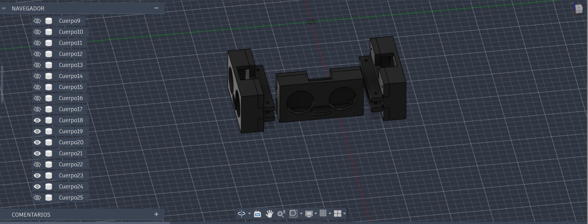
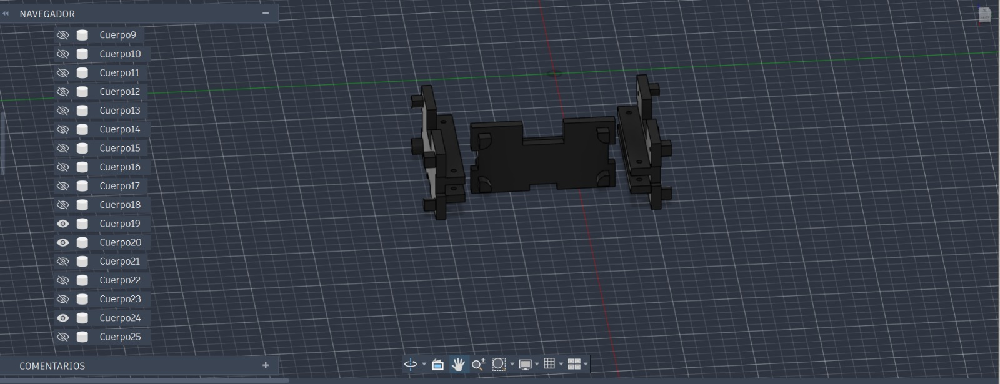

### Base de Sensores y Soporte de Cámara

En este apartado se detalla el conjunto modular de soportes y estructuras encargadas de albergar los componentes de percepción sensorial del robot. Dado que la toma de decisiones en tiempo real depende directamente de la precisión y estabilidad de los datos recolectados, estas piezas fueron diseñadas con una rigidez estructural absoluta, mitigando cualquier tipo de vibración mecánica derivada de la tracción y garantizando que el campo de visión y los haces de ultrasonido se mantengan perfectamente alineados durante todo el recorrido en pista.

La estructura completa se compone de tres módulos biomecánicos optimizados, impresos en 3D y estructurados para ofrecer ligereza, resistencia e intervención rápida en situaciones críticas de boxes:

* **Base Principal de Ultrasónicos:**  
  Constituye la plataforma central de la arquitectura sensorial. Diseñada para posarse y atornillarse directamente sobre la parte superior del chasis, esta base asegura un centro de gravedad bajo y una fijación inamovible al chasis principal. Dispone de tres bahías de acople orientadas espacialmente hacia el frente, flanco izquierdo y flanco derecho, cubriendo el perímetro de navegación sin generar zonas ciegas. Su geometría incluye rutas internas para la canalización organizada del cableado y de alimentación, evitando interferencias con las partes móviles de la dirección.

  

     
  

---

* **Acoples Modulares para Sensores Ultrasónicos:**  
  Diseñados como carcasas de protección y fijación para los transductores de distancia. Estas piezas se acoplan mecánicamente a las bahías de la base principal mediante un ajuste de tolerancia preciso que permite montar y desmontar los sensores ultrasónicos de manera sencilla y rápida. Esta modularidad resulta vital en entornos de competencia, ya que permite reemplazar una unidad dañada o ajustar su orientación en cuestión de segundos sin necesidad de desarmar la estructura del chasis.

  

     
  

---

* **Soporte Elevado de Cámara (HuskyLens 2):**  
  Estructura vertical reforzada que se erige desde el centro de la base principal para otorgar la elevación y el ángulo de inclinación óptimos al módulo de visión artificial. Su diseño en torre eleva la lente por encima del tren delantero, asegurando un campo de visión despejado para el reconocimiento de colores, bloques y marcas de pista. Adicionalmente, cuenta con una arquitectura de perfil abierto que favorece la convección natural del aire, garantizando una refrigeración pasiva constante para el procesador de la cámara durante secuencias largas de procesamiento de imagen.

  

     
  
