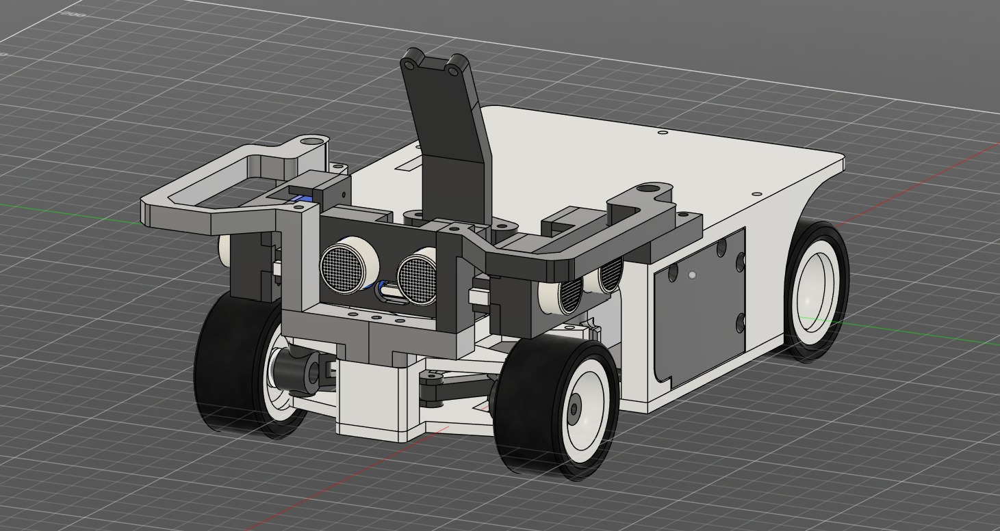
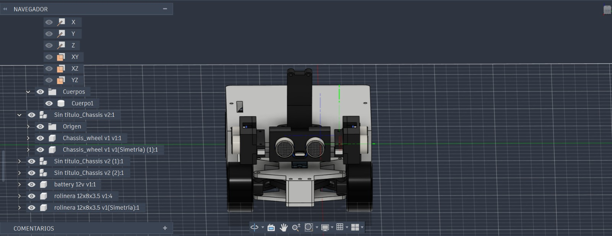

### Ensamblaje Completo – Modelo 3D Definitivo (`.STL`)

En este directorio se aloja el modelo CAD tridimensional consolidado del robot. Este archivo representa la integración final de todos los subsistemas mecánicos, electrónicos y de soporte en un único volumen digital, garantizando la verificación geométrica de tolerancias, la detección de interferencias y la correcta distribución de masas antes de la fase de manufactura e impresión 3D.

---

### Características del Modelo CAD Consolidado

* **Integración Mecánica Total:**  
  Consolida en un solo entorno virtual el chasis inferior de tracción, el sistema de dirección articulada, el tren de transmisión posterior con diferencial y la superestructura superior de soporte para sensores y cámara.

* **Verificación de Tolerancias y Acoples:**  
  Diseñado respetando las holguras necesarias para rodamientos, pernos métricos, Servomotor INJORA, motor de tracción y cableado interno, reduciendo la necesidad de post-procesado manual en las piezas impresas.

* **Acceso e Inspección:**  
  Sirve como archivo maestro de consulta para laminación directa en formato `.STL` de cada componente individual o para modificación paramétrica integral a través del modelo sólido en entorno CAD.

---

### Vistas Técnicas del Ensamble Definitivo

   

   

