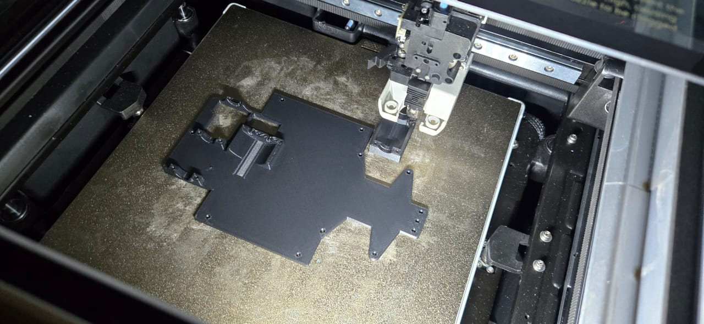

### Fabricación e Impresión 3D

Una vez concluida la etapa de diseño, el proceso de fabricación se centró en la impresión 3D. La totalidad de los componentes fue fabricada en filamento **PETG-CF de la marca Sunlu**, utilizando una impresora **Qidi Q2**.

---

### Selección de Materiales y Recomendaciones

Se desaconseja categóricamente el uso de **PLA** para este proyecto debido a las elevadas temperaturas operativas y al severo estrés mecánico al que están sujetas diversas secciones del robot. 

Se seleccionó **PETG-CF** por su elevada estabilidad estructural, resistencia al impacto y alta fiabilidad en mecanismos bajo carga. Como alternativas viables, se recomienda el uso de polímeros como **PA12-CF, PETG, ABS, ASA, PC** u otros polímeros reforzados con fibra de carbono (CF).

---

### Configuración del Laminador (Slicer)

Los parámetros de impresión empleados (configurados en **QidiStudio** son los siguientes:

* **Parámetros Térmicos:** Temperatura de boquilla a 250 °C y temperatura de cama a 80 °C.
* **Resolución y Dinámica:** Altura de capa de 0,2 mm, velocidad de perímetro de 150 mm/s, velocidad de rellenado de 250 mm/s y aceleración general de 8000 mm/s².
* **Relleno y Soportes:** Patrón de rellenado triangular, con una densidad del 15 %–20 % para piezas estructurales secundarias y del 25 %–40 % para componentes bajo alto estrés mecánico. Se aplicaron soportes de tipo estándar en voladizos con pendientes superiores a 40°.

  

     
  

---

## Consideraciones Técnicas Generales

Estos parámetros pueden variar según el equipo y la marca del filamento utilizado. Para componentes mecánicos críticos tales como engranajes y ejes de transmisión, los cuales soportan cargas continuas y el par rotacional del motor, es indispensable emplear filamentos reforzados. 

Asimismo, se recomienda no exceder una altura de capa de 0,2 mm, ya que la precisión dimensional y la tolerancia en los acoples garantizan el ajuste milimétrico requerido durante el ensamblaje.