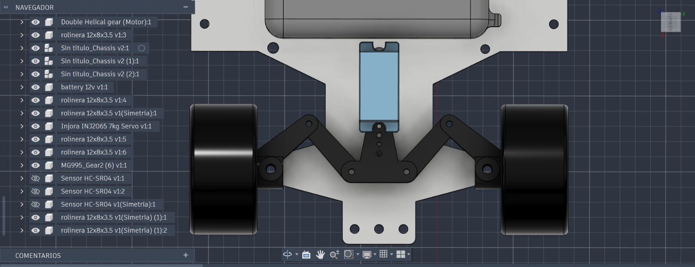
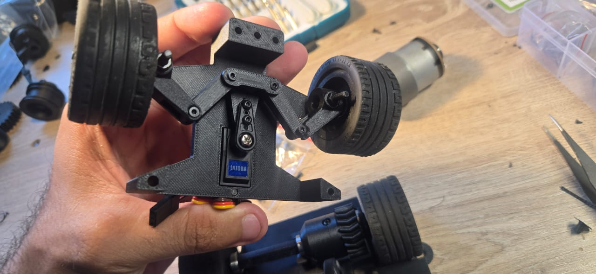

Este sistema cuenta con libertad total de las ruedas delanteras para girar e inclinarse sin la presencia de ejes de transmisión conectados, lo cual elimina por completo el arrastre mecánico y aporta una fluidez absoluta al desplazamiento del robot. Esta configuración otorga la máxima libertad posible al afrontar las curvas más cerradas de la pista, trabajando en conjunto con una geometría de dirección articulada donde los brazos de dirección se acoplan directamente a los nudillos de dirección y al servomotor central.

---

### Componentes Mecánicos del Tren Delantero

* **Brazo de Dirección:**  
  Eslabones mecánicos de alta rigidez encargados de vincular el acople de la boquilla del servo con los nudillos de dirección de cada rueda. Su función principal es transmitir el movimiento angular generado por el servomotor de forma simétrica e instantánea a ambas ruedas delanteras. Este diseño de bieletas garantiza virajes estables y permite alcanzar ángulos de cruce de hasta 55° (±5°) con un juego mecánico prácticamente inexistente, permitiendo correcciones de trayectoria finas a alta velocidad.

* **Acople de Bocina de Servomotor:**  
  Componente maestro de distribución de par montado de forma directa sobre la boquilla metálica del servomotor INJORA. Diseñado con puntos de articulación optimizados, actúa como el puente mecánico central que divide la fuerza de rotación del servo y la convierte en un movimiento de empuje y tracción lineal hacia los brazos de dirección. Su tolerancia de encaje elimina la histeresis en el centrado de la dirección, asegurando que el robot mantenga una línea recta perfecta tras salir de una curva.

* **Nudillo de Dirección:**  
  Pieza pivotante de alta precisión encargada de albergar los rodamientos de la rueda y permitir su rotación angular respecto al eje vertical del chasis. Se encuentra fijado en sus extremos superior e inferior mediante pernos de pivote que actúan como manguetas de dirección, permitiéndole girar con total libertad para cambiar la orientación de los neumáticos según el empuje dinámico recibido desde los brazos de dirección.

  

     
  

---

## Anexos del Sistema Montado

El ensamble físico demuestra la integración real de la articulación de dirección, el servomotor central y las ruedas montadas sobre la estructura impresa en 3D:

   

