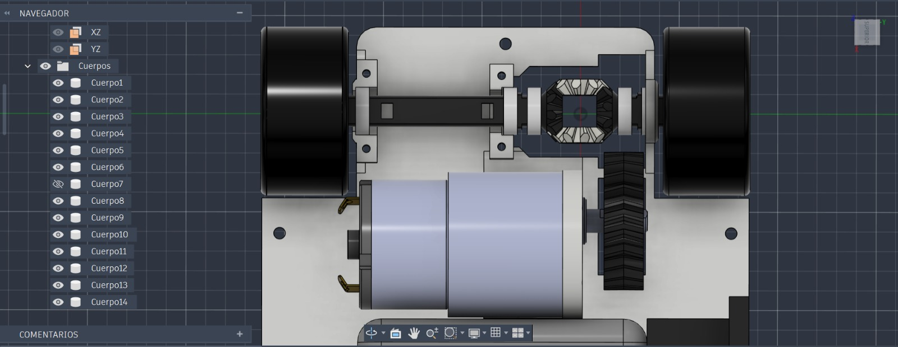
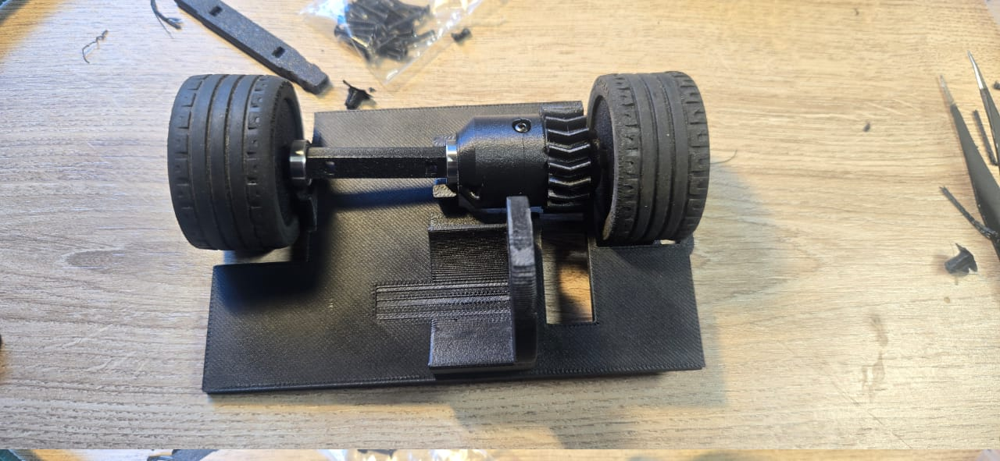

### Sistema de Transmisión y Tracción Trasera

El tren motriz del robot integra un sistema de transmisión por engranajes diferenciales interconectados directamente mediante sus ejes de transmisión a las ruedas posteriores. Esta configuración optimiza la transferencia de par y asegura una tracción eficiente sin pérdida de potencia en línea recta ni resistencia residual durante los giros.

---

### Cinemática y Mecanismos de Transmisión

* **Piñón y Corona Doble Helicoidal (Herringbone):**  
  La potencia rotacional generada por el motor de tracción se transmite hacia la caja del diferencial mediante un par de engranajes con dentado doble helicoidal. Este perfil en "V" elimina por completo el empuje axial que sufren los engranajes helicoidales convencionales, ofreciendo un acoplamiento suave, un nivel de ruido mecánico mínimo y una distribución uniforme de la fuerza sobre la corona.

* **Núcleo del Diferencial (Satélites y Planetarios):**  
  Internamente, el núcleo del diferencial aloja un arreglo dinámico de engranajes satélite y planetarios. Los satélites giran libremente sobre su eje dentro de la caja de transmisión para permitir que los engranajes planetarios, acoplados a los palieres izquierdo y derecho, giren a velocidades independientes cuando el robot describe una curva.

* **Dinámica de Curvatura:**  
  Gracias a la compensación diferencial de velocidades, la rueda exterior en una curva puede girar más rápido que la rueda interior sin derrapar ni forzar la estructura. Este comportamiento mecánico es fundamental para ejecutar virajes fluidos y estables durante ángulos de cruce extremos, previniendo la pérdida de adherencia en el tren trasero.

  

     
  

---

## Ensamble Físico del Tren Motriz

El ensamble mecánico muestra la integración real de la caja del diferencial, la corona helicoidal exterior y los soportes de rodamientos fijados sobre la base del chasis:

   

